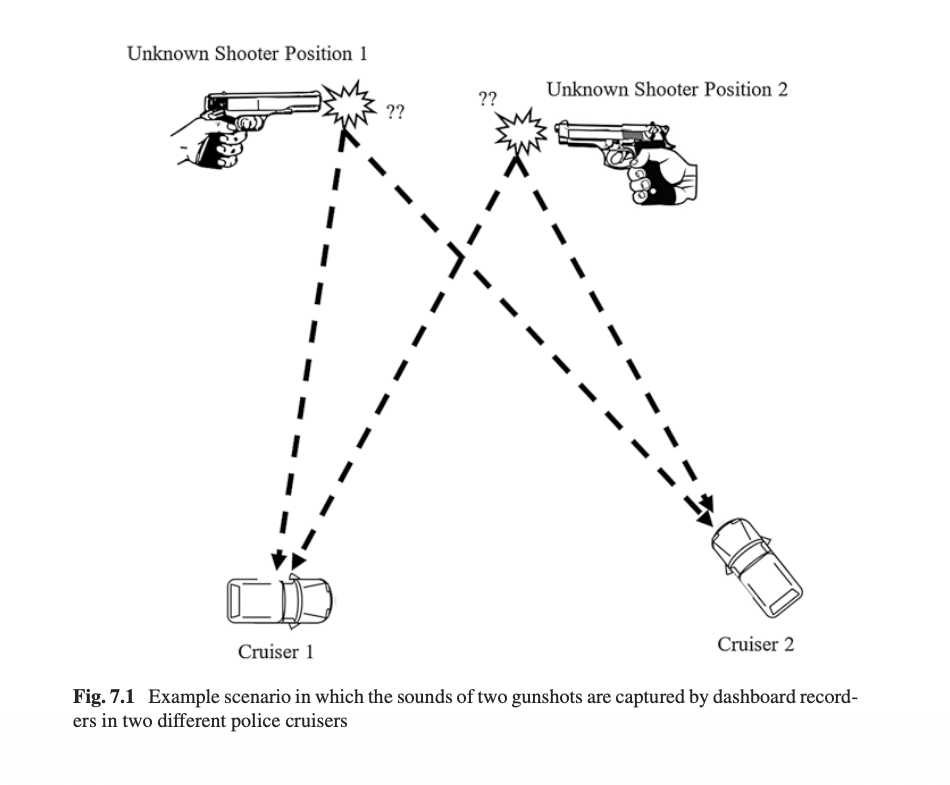
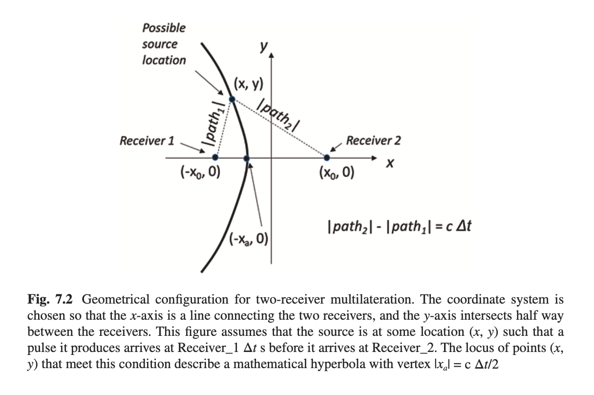
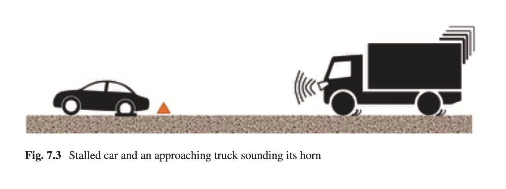
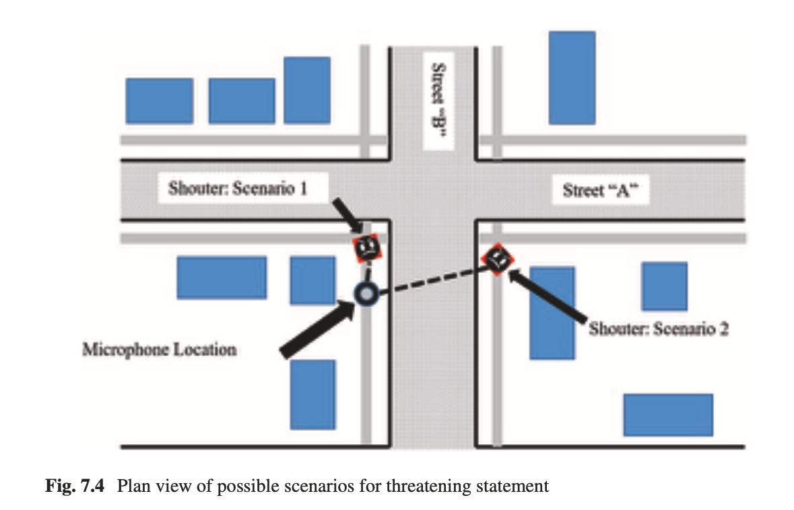

+++
title = "Forensic Interpretation"
outputs = ["Reveal"]
[reveal_hugo]
theme = "solarized"
margin = 0.2
separator = "##"
plugins = ["reveal-js/plugin/math/math.js"]
[reveal_hugo.math]
mathjax = "https://cdnjs.cloudflare.com/ajax/libs/mathjax/2.7.0/MathJax.js"
config = "TeX-AMS_HTML-full"
+++

## Forensic Interpretation

Forensic Audio Analysis — Week 11

{}
Welcome back from spring break. We've spent the last few weeks on enhancement, so now we're moving into the third pillar of forensic audio: interpretation. This is where you take your measurements and actually answer legal questions with them. The catch is that interpretation requires judgment, and judgment is subjective. Your findings can put someone in prison or keep them out.

- Citation: Maher, R.C. *Principles of Forensic Audio Analysis*. Springer, 2018.
{}

---

## Today's Topics

- Overview of forensic interpretation
- Scientific integrity and the NAS Report
- Case study: Gunshot localization (TDOA)
- Case study: Doppler effect and speed estimation
- Case study: Distance estimation from sound level
- Likelihood ratios in forensic audio

{}
This is Chapter 7 of Maher's text. We'll start with what interpretation actually means and why scientific integrity matters. Then three case studies, each showing a different way physics gets applied to legal questions. We'll wrap up with likelihood ratios, which are changing how forensic evidence gets evaluated across the board.

- Each case study has a different type of uncertainty and a different analytical technique.
{}

---

{}

## I. What Is Forensic Interpretation?

{}
Let's start by defining what we mean by "interpretation" and how it fits alongside the other two pillars of forensic audio.
{}

---

## Three Pillars of Audio Forensics

- **Authentication** — objective measurement
- **Enhancement** — partly subjective processing
- **Interpretation** — objective + subjective judgment

{}
Maher breaks forensic audio into these three components. Authentication is about objective observations: is this recording a fair representation of what happened? Enhancement is more subjective: you're filtering noise to improve intelligibility. Interpretation sits on top of both. You use objective measurements but you also have to make judgment calls about what those measurements mean.

- We've already covered authentication (ENF, metadata, edit detection) and enhancement (filtering, spectral subtraction, deep learning). Now we put it all together.
- Citation: Maher, R.C. *Principles of Forensic Audio Analysis*. Springer, 2018.
{}

---

## The Interpretation Challenge

- Strives for objectivity
- Relies on examiner experience
- Requires induction and contextual reasoning
- Findings may influence legal outcomes

{}
The goal is objectivity, but getting there requires subjective assessment, induction, and experience. You're running FFTs and measuring time delays, but you're also deciding what those numbers mean in context. That's the tension.

- Your conclusions may determine whether someone goes free or gets convicted. That's why transparency and reproducibility matter so much.
{}

---

## Discussion

- Where is the line between objective measurement and subjective interpretation?
- Can forensic audio ever be fully objective? Should it try to be?
- How should an expert communicate uncertainty to a jury?

{}
- The line is blurry. Frequency and time measurements are objective, but deciding what they mean requires judgment. The key is documenting every step so someone else can follow your reasoning.
- Full objectivity probably isn't achievable. The goal is to minimize the subjective parts and make whatever remains transparent.
- Experts should state what they measured, what they assumed, and what range of conclusions the data actually supports. Not a single definitive answer.
{}

{}

---

{}

## II. Scientific Integrity

{}
Before the case studies, we need to talk about the standards that govern this work. This section is about accountability.
{}

---

## Transparency and Reproducibility

- Methods must be explainable
- Results must be verifiable by others
- No "black box" or proprietary claims

{}
The rule is simple: your methods and results have to be explainable. Another expert should be able to read your report, understand what you did, and reproduce it. No "secrecy of techniques." No "undisclosed methodology." If your method can't be explained to another qualified examiner, it doesn't belong in court.

- Citation: Maher, R.C. *Principles of Forensic Audio Analysis*. Springer, 2018.
{}

---

## Ethical Concerns

- Reject claims of "golden ears"
- No secret analytical techniques
- Lack of transparency undermines the field

{}
"Golden ears" is the idea that an expert can hear things nobody else can. Some practitioners have actually built careers on this kind of mystique. If someone tells you they have a unique auditory ability that can't be verified, that's a red flag. Same goes for proprietary methods that can't be examined by other experts.

- The fix is always the same: show your work, explain your reasoning, let others check it.
{}

---

## The NAS Report (2009)

*Strengthening Forensic Science in the United States: A Path Forward*

https://www.ojp.gov/pdffiles1/nij/grants/228091.pdf

{}
This 2009 report shook up all of forensic science, not just audio. It basically said: the forensic science community has not done enough to prove its methods are scientifically valid. For audio specifically, it criticized the heavy reliance on subjective, experience-based assessments.

- Citation: National Research Council. *Strengthening Forensic Science in the United States: A Path Forward*. National Academies Press, 2009.
{}

---

## NAS: Two Key Questions

- Is the method scientifically valid and reliable?
- How much depends on subjective judgment?

{}
The report boiled it down to two questions. First: is the method actually scientifically valid? Second: how much of the conclusion depends on the examiner's subjective judgment?

- Bias risk: if an examiner knows the "expected" answer, they may unconsciously confirm it.
- Standardization: different labs can reach different conclusions from the same evidence.
- Repeatability: if another examiner can't get the same result, what does the conclusion even mean?
- Since 2009, the field has been moving toward data driven frameworks, more DSP, more statistics, less "trust me, I've been doing this for 20 years."
{}

---

## Discussion

- Have you encountered "black box" claims in other forensic fields?
- How does cognitive bias affect forensic analysis?
- What safeguards could reduce bias in audio forensics?

{}
- Black box claims show up everywhere in forensics. Bite mark analysis, hair comparison, even some fingerprint work has faced scrutiny for the same reasons.
- Cognitive bias is the big one. If an examiner knows the suspect is "guilty," they may unconsciously read ambiguous evidence as confirmation. This is confirmation bias, or contextual bias.
- Safeguards: blind testing where the examiner doesn't know the expected outcome, standardized protocols, peer review, and quantitative frameworks like likelihood ratios instead of subjective "match" calls.
{}

{}

---

{}

## III. Measurement Fundamentals

{}
Quick review of the measurement concepts behind everything we're about to look at.
{}

---

## Four Measurement Domains

- **Time** — when events occur
- **Frequency** — pitch and spectral content
- **Amplitude** — loudness and signal level
- **Spectrum** — frequency distribution over time

{}
Four types of measurements come up repeatedly in interpretation. Time: when events happen and the intervals between them, which is the basis for TDOA. Frequency: pitch characteristics, which drives Doppler analysis. Amplitude: loudness and signal level, used in distance estimation. Spectrum: frequency and amplitude together over time.

- Each has its own tools and its own sources of error.
- Any measurement you report should include an estimate of uncertainty.
{}

---

## Precision vs. Accuracy

- **Precision** — repeatability and resolution
- **Accuracy** — correctness relative to a standard

{}
These get confused all the time. Precision means repeatability: if you measure the same thing ten times, do you get the same number? Accuracy means correctness: is that number actually right?

- A clock that's always exactly 5 minutes fast is precise but not accurate.
- A clock that scatters around the right time but averages out is accurate but not precise.
- In court you need both, and you need to communicate which one you're talking about. Juries trust numbers that look exact, which is exactly why precise-but-inaccurate measurements are dangerous.
{}

---

## Discussion

- Why is it important to distinguish precision from accuracy in court testimony?
- What happens if you report a precise measurement that isn't accurate?
- How would you explain measurement uncertainty to a non-technical jury?

{}
- A precise but inaccurate measurement looks authoritative because it's consistent. That's what makes it misleading. Measuring a time delay to the microsecond means nothing if your clock reference is off by milliseconds.
- For a jury: "Think of a bathroom scale. Step on it three times, get 150, 150, 150. That's precise. But if you actually weigh 160, the scale isn't accurate. We need both."
{}

{}

---

{}

## IV. Case Study: Gunshot Localization

{}
First case study. We're using TDOA, Time Difference of Arrival, to figure out where a gunshot came from using recordings from multiple sources.
{}

---

## The Scenario

- Two police cruisers record gunshots
- Key questions:
  - Where did the shots originate?
  - Same or different firearm(s)?

{}
Two police dashboard cameras captured audio of gunfire. Investigators want to know: where was the shooter, and were all the shots from the same weapon or multiple weapons? The time differences between what each camera recorded give us a way to reconstruct the geometry of the scene. This type of case comes up regularly.

- Citation: Maher, R.C. *Principles of Forensic Audio Analysis*. Springer, 2018.
{}

---

---

## TDOA: The Core Idea

- Sound travels at a known speed
- Different distances = different arrival times
- Time difference → distance difference

{}
TDOA estimates where a sound came from by measuring when it arrives at different recording devices. A gunshot propagates spherically at the speed of sound. That speed is roughly constant, so a difference in arrival time between two receivers translates directly to a difference in distance from the source.

- Important distinction: this is multilateration, not triangulation. Triangulation uses angles. TDOA uses time delays converted to distance differences.
- Citation: Maher, R.C. *Principles of Forensic Audio Analysis*. Springer, 2018.
{}

---

## Speed of Sound

$$c = 331.45\\sqrt{1 + \\frac{T}{273}}$$

- *c* = speed of sound (m/s)
- *T* = temperature in Celsius
- ~343 m/s at 20°C
  
https://www.omnicalculator.com/physics/speed-of-sound

{}
The speed of sound changes with temperature. It increases with the square root of absolute temperature. At 0°C it's about 331 m/s, at 20°C roughly 343 m/s. You have to adjust for the air temperature at the time of the incident.

- Get the temperature wrong and you get the distances wrong. A few degrees of error can shift your calculated source location enough to matter.
{}

---

## The Hyperbolic Locus

- Two receivers → one TDOA measurement
- Defines a **hyperbola** of possible locations
- Source lies somewhere on that curve

{}
Here's where the geometry comes in. Two receivers with a measured TDOA give you a hyperbola of possible source locations. The source is somewhere on that curve where the distance to the far receiver minus the distance to the near receiver equals the speed of sound times the time delay.

- Example: sound arrives at Receiver A 10 milliseconds before Receiver B. At 343 m/s, the source must be about 3.4 meters closer to A than to B. Every point satisfying that distance difference sits on a hyperbola.
- One pair of receivers gives you a curve. You need more receivers to get a point.
{}

---

## Multilateration

- Third receiver → second hyperbola
- Intersection = source location
- More receivers → more confidence

{}
Two receivers give you one hyperbola. A third receiver gives you a second hyperbola. Where those two curves intersect is your source location. More receivers means more intersections, which helps you spot outliers and build confidence.

- Military and law enforcement systems use distributed sensor networks for this. The hard part with consumer equipment like dashcams or body cameras is time synchronization. These devices weren't designed to stay in sync with each other.
{}

---

{}
This diagram would show two receiver positions with the hyperbolic curve representing all possible source locations consistent with the measured TDOA. Adding a third receiver creates a second hyperbola, and the intersection gives the estimated source position.
{}

---

## Sources of Uncertainty

- Unsynchronized recordings
- Vehicle position estimation errors
- Speed of sound variability
- Event alignment ambiguity

{}
Lots of things can go wrong. The recordings probably aren't time-synced, so you need a common reference event to align them. You may not know exactly where the vehicles were parked. Temperature affects the speed of sound. And picking out the exact onset of a gunshot in a noisy recording takes judgment.

- Urban environments make it worse. Reflections off buildings create "ghost sources" that confuse TDOA algorithms.
- AGC in consumer devices normalizes amplitude, so you can't trust volume for distance. You have to rely on timing.
{}

---

## Gunshot Acoustic Components

- **Muzzle blast** — spherical propagation
- **Ballistic shockwave** — conical "N-wave"
- Mach angle: $\theta = \arcsin\left(\frac{c}{v}\right)$

{}
What makes gunshots tricky is that a single discharge produces two separate signals. The muzzle blast is the "bang," and it propagates spherically from the barrel. The ballistic shockwave only happens with supersonic projectiles. It creates a conical N-wave, and the angle of that cone, the Mach angle, depends on the ratio of the speed of sound to the bullet's velocity.

- You can actually measure the time difference between the shockwave and the muzzle blast at a single sensor to estimate distance to the shooter.
- If you confuse one signal for the other, your localization will be off.
{}

---

## Discussion

- Why is multilateration preferred over triangulation for gunshot localization?
- What real-world factors would make TDOA unreliable in an urban setting?
- How would you explain a hyperbolic locus to a jury?

{}
- Triangulation needs angles, which means directional microphones or arrays. TDOA only needs timing, which you can pull from any recording device. Much more practical.
- Urban environments are a mess for this: reflections off buildings create ghost sources, temperature gradients between sun and shade change the sound speed across the scene, traffic noise masks gunshot onsets.
- Jury explanation: "Imagine dropping a stone in a pond. Two people standing at different spots around the pond. The one closer to the splash sees the ripple first. Measure that time difference and you can figure out where the stone landed. But with only two observers you get a curve, not a point. A third observer pins it down."
{}

{}

---

{}

## V. Case Study: Doppler Effect

{}
Second case study. This one uses the Doppler effect to estimate how fast a vehicle was going, based on a 911 recording. Straightforward physics applied to a legal question.
{}

---

## The Scenario

- 911 call captures a truck horn before a crash
- Can we determine the truck's speed?

{}
Someone called 911, and while they were on the line a truck horn was captured in the recording just before a crash. The question: how fast was that truck going? The Doppler effect lets us answer that from the audio.

- Citation: Maher, R.C. *Principles of Forensic Audio Analysis*. Springer, 2018.
{}

---

---

## Doppler Effect

- Approaching source → higher frequency
- Receding source → lower frequency
- Frequency shift reveals velocity

{}
You've all heard this. A siren sounds higher as an ambulance approaches and lower as it drives away. That's the Doppler effect: a moving source compresses the sound waves in front of it and stretches them behind. In forensic work, we measure that frequency shift and calculate the source's speed from it.
{}

---

## The Doppler Equation

$$f = f_0 \\cdot \\frac{c}{c - v}$$

- *f* = observed frequency
- *f₀* = source frequency at rest
- *c* = speed of sound
- *v* = source velocity

{}
For a source moving directly toward a stationary receiver at speed v, the received frequency f is calculated using this equation. To solve for velocity, we rearrange: v = c × (1 − f₀/f). We need to know the source frequency at rest, the observed frequency in the recording, and the local speed of sound.
{}

---

## Solving the Case

- Horn at rest: 295 Hz
- Observed in recording: 329 Hz
- Temperature: 17°C → c = 341.5 m/s
- **Result: ~35.3 m/s ≈ 79 mph**

{}
The horn measured 329 Hz in the 911 recording. After the accident, they tested the truck's horn and got 295 Hz at rest. Air temperature was 17°C, so the speed of sound was 341.5 m/s. Plug those in and you get about 35.3 m/s, roughly 79 mph.

- Nice clean result. But as we'll see, the uncertainties can be significant.
- Citation: Maher, R.C. *Principles of Forensic Audio Analysis*. Springer, 2018.
{}

---

## Sources of Uncertainty

- Frequency estimation accuracy
- Sampling rate errors
- Air temperature variation
- Non-radial motion (angle of approach)

{}
Here's where it gets messy. Small errors in frequency measurement change the calculated speed. Sampling rate is a sneaky one: if a recording says it's 8,000 Hz but was actually recorded at 8,192 Hz, a common nonstandard rate, that's a 2.4% error. In this case that could mean underestimating the truck's speed by nearly 17 mph.

- If the truck isn't heading straight at the microphone, the Doppler shift only gives you the radial velocity component. True speed could be higher.
- Air temperature affects the speed of sound, which feeds directly into the calculation.
- This keeps coming up in forensic interpretation: small measurement errors, big changes in conclusions.
{}

---

## Discussion

- How would a 2.4% sampling rate error affect a court case about speeding?
- What other scenarios could Doppler analysis help investigate?
- Why must the approach angle be considered?

{}
- 2.4% doesn't sound like much, but in this case it's nearly 17 mph. That could be the difference between "within the speed limit" and "reckless driving." You have to validate the recording's technical parameters before you do any analysis.
- Other applications: drive-by shootings, hit-and-runs, vehicle pursuits. Anywhere a moving sound source got captured on a recording.
- On the approach angle: if the truck isn't heading straight at the mic, the frequency shift only gives you the velocity component along that line. Think of wind. A 30 mph crosswind doesn't push you backward as hard as a 30 mph headwind.
{}

{}

---

{}

## VI. Case Study: Distance Estimation

{}
Third case study. This one seems like it should be simple: how far away was someone when they shouted a threat? The physics is straightforward. The practical reality is not.
{}

---

## The Scenario

- Dispute over distance of a shouted threat
- Competing claims: 1 meter vs. 8+ meters
- Recording exists from a consumer device

{}
The victim says the threat was shouted from about 1 meter away. The defendant says it was more than 8 meters, across a street. A phone recording captured it. Can we figure out the actual distance from the audio?

- Citation: Maher, R.C. *Principles of Forensic Audio Analysis*. Springer, 2018.
{}

---

---

## Spherical Spreading Law

- Sound intensity follows inverse square law
- **~6 dB loss per doubling of distance**
- 1 m to 8 m ≈ 18 dB difference

{}
In open air, sound spreads spherically and you lose about 6 dB every time you double the distance. So 1 meter to 2 meters: 6 dB. 2 to 4: another 6. 4 to 8: another 6. That's 18 dB between 1 meter and 8 meters. You'd think that would make the dispute easy to resolve.

- It doesn't. Here's why.
{}

---

## Complicating Factors

- Unknown vocal intensity
- Microphone characteristics
- Automatic Gain Control (AGC)
- Reflections and reverberation

{}
A human voice is not a calibrated source. You don't know how loud the person was actually shouting. The microphone and its placement affect the recorded level. And the big one: AGC, Automatic Gain Control. Your phone is constantly adjusting its mic gain to make everything sound "normal." A whisper from 1 foot and a shout from 20 feet can end up at similar recorded levels.

- Reflections in urban settings also add energy to the signal, making the source sound closer than it was.
{}

---

## Recommended Approach

- Controlled reconstruction experiment
- Same device, same location
- Documented procedure (video)
- Compare reconstruction to original

{}
Maher's recommendation: go back to the actual location with the original recording device, have someone shout at measured distances, and compare those recordings to the original. Document the whole thing on video.

- Even with a good reconstruction, you're establishing what's consistent with the evidence. You're not proving an exact distance.
{}

---

## Discussion

- Why can't we simply measure the recorded volume to determine distance?
- When might a reconstruction experiment not be feasible?
- How should an expert present inconclusive distance findings?

{}
- AGC wrecks the relationship between recorded level and actual distance. The phone's electronics are actively working against you. And even without AGC, you'd need to know how hard the person was shouting, which you can't figure out after the fact.
- Reconstruction isn't always possible. The location may have changed, the device may be lost or updated, ambient conditions may be different.
- Sometimes the honest answer is: "The evidence is consistent with both claimed distances and I can't distinguish between them from the audio alone." That's a valid forensic conclusion. Don't be afraid of it.
{}

{}

---

{}

## VII. Likelihood Ratios

{}
Last topic. Likelihood ratios are a statistical framework for evaluating forensic evidence. They're gaining traction across all forensic disciplines, including audio.
{}

---

## The Concept

$$LR = \\frac{P(\\text{evidence} \\mid H_p)}{P(\\text{evidence} \\mid H_d)}$$

- *H_p* = prosecution hypothesis
- *H_d* = defense hypothesis

{}
The LR compares two probabilities. Numerator: how likely is this evidence if the prosecution is right? For example, "the suspect produced this voice recording." Denominator: how likely is this evidence if the defense is right? "Someone else in the relevant population produced it."

- LR greater than 1 supports the prosecution.
- LR less than 1 supports the defense.
- Bigger LR means stronger evidence for the prosecution's claim.
- The whole point is to move away from yes/no "match" conclusions and toward something that actually quantifies how strong the evidence is.
{}

---

## DNA as the Benchmark

- Highly discriminative patterns
- Quantifiable probabilities
- LRs in the quadrillions

{}
DNA is the gold standard here. DNA analysts can report things like "9 quadrillion times more likely under the prosecution hypothesis." Numbers that big are basically definitive.

- DNA works because the markers don't change, the science is well understood, and there are massive population databases. Audio forensics wants that level of rigor but has a much harder problem.
{}

---

## Application to Audio

- Possible but difficult
- Speech signals are inherently variable
- Dependent on recording conditions
- Limited statistical models

{}
The problem with audio is that voices aren't like DNA. You say the same phrase twice and the acoustic signal is different both times. Recording conditions matter enormously: background noise, phone vs. microphone, distance. And computing a reliable LR requires population data that tells you how common the observed voice characteristics are.

- Modern systems use GMM-UBMs, i-vectors, and deep neural networks with x-vector embeddings to pull out speaker features.
- Even the best systems need a "relevant population" matched on age, gender, accent. That data often doesn't exist.
{}

---

## Challenges

- Estimating probability of a match
- Building relevant population databases
- Variability in recording conditions
- Limited adoption in practice

{}
You need two probabilities: how likely is this voice sample if the suspect produced it, and how likely if someone else with a similar voice produced it. That second number requires population data, controlled comparative datasets. For DNA that data exists at scale. For audio it mostly doesn't.

- The NAS report and organizations like ENFSI and OSAC are pushing hard for LR adoption.
- The field is moving in this direction, but the methods are still developing. We're nowhere near DNA-level confidence.
{}

---

## Discussion

- Why are likelihood ratios preferable to "match/no match" conclusions?
- What makes audio LRs harder than DNA LRs?
- How might an expert explain a likelihood ratio to a jury?

{}
- "Match/no match" is binary. It tells the jury nothing about how strong the evidence is. An LR says "the evidence is X times more likely under one hypothesis than the other." That gives the jury something to work with without the expert overstepping into guilt or innocence.
- Audio is harder than DNA because voices change with mood, health, aging, intoxication. Recordings vary wildly in quality. And there's nothing like CODIS for voices. DNA is a molecule. Speech is a behavior.
- Jury explanation: "If I found a red shoe at the crime scene and the suspect owns red shoes, how meaningful is that? Depends how many people in this city own red shoes. The likelihood ratio answers that question for voice evidence."
{}

{}

---

## Key Takeaways

- Interpretation = objective measurement + subjective reasoning
- Transparency and reproducibility are non-negotiable
- Uncertainty must be explicitly identified and reported
- Contextual integration with other evidence is essential

{}
Four things from today. Interpretation is always going to mix objective measurement with subjective reasoning. You can't eliminate the subjective part, but you can minimize it and be upfront about it. Your methods and conclusions have to be explainable and reproducible. Uncertainty is fine; not reporting it isn't. And audio evidence almost never stands on its own. It needs to be integrated with other evidence.

- The NAS report forced the field to deal with these issues. Likelihood ratios are a direct response.
{}

---

## Summary

- Forensic interpretation combines physics with judgment
- TDOA, Doppler, and spreading laws are key tools
- Every measurement carries uncertainty
- Likelihood ratios are the future of evidence evaluation

{}
We went from the philosophical side of interpretation, through three case studies that each used different physics and had different sources of error, and ended with likelihood ratios as a framework for the future. The common thread: every measurement has uncertainty, and you have to be honest about it.

- Reading: Maher, Chapter 7.
{}
