+++
title = "Physics of Firearm Sound Signatures"
outputs = ["Reveal"]
[reveal_hugo]
theme = "moon"
+++

# Physics of Firearm Sound Signatures

DAD 498: Audio Forensics — Week 12

{}
Today we begin a two-week unit on gunshot acoustics. This first lecture focuses on the physics — what actually produces the sounds we hear when a firearm discharges, and why those sounds look the way they do in a waveform. Next week we will apply these principles to complex shooting incidents and real forensic casework.

- Source: Maher, R.C. *Principles of Forensic Audio Analysis*, Chapter 9: "Application Example 1: Gunshot Acoustics."
{}

---

## Today's Topics

- Firearms and ammunition basics
- The muzzle blast
- Ballistic shock waves
- Other acoustic components
- Environmental acoustics
- Laboratory vs. forensic recordings

{}
We will move from the mechanical origins of gunshot sound to its propagation and recording. By the end of this lecture you should be able to identify the major acoustic components of a gunshot, explain why supersonic bullets create shock waves, and understand why real-world recordings look so different from laboratory measurements.
{}

---

{}

# I. Firearms and Ammunition Basics

Understanding the source before the sound

{}
Before we can analyze a gunshot recording, we need to understand what is happening mechanically and chemically inside the firearm. Each component of the cartridge and each firearm type contributes differently to the acoustic signature.
{}

---

## The Cartridge

- **Casing** — brass cylinder, holds propellant
- **Primer** — impact-sensitive ignition cap
- **Propellant** — gunpowder, becomes hot gas
- **Bullet** — the projectile itself

{}
A cartridge, or "round," is the self-contained unit of ammunition. The primer sits at the base of the casing. When the firing pin strikes it, a small chemical explosion ignites the propellant inside the casing. That propellant burns rapidly, producing high-pressure gas that pushes the bullet out of the barrel. Imagine a tiny, controlled explosion inside a sealed tube — the bullet is the cork that gets launched.

- Citation: Maher, R.C. *Principles of Forensic Audio Analysis*, Ch. 9.
{}

---

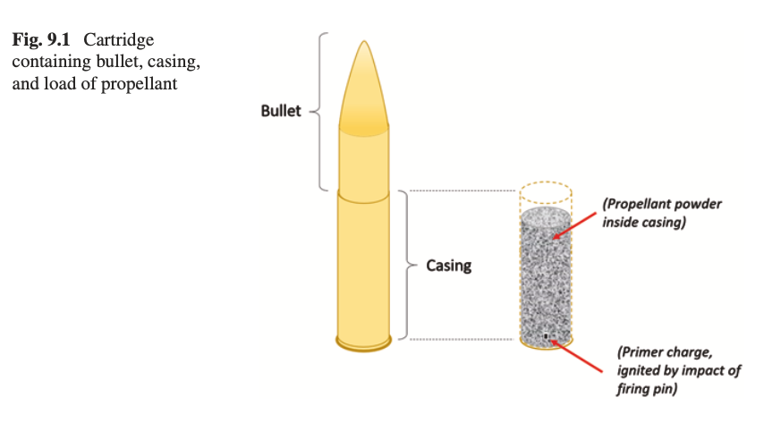

{}
Fig. 9.1 — A typical centerfire cartridge with labeled components: the bullet (projectile) at the top, the brass casing forming the body, propellant filling the interior, and the primer cap at the base. When the firing pin strikes the primer, it ignites the propellant, generating the high-pressure gas that drives the bullet and ultimately produces the muzzle blast.

- Citation: Maher, R.C. *Principles of Forensic Audio Analysis*, Fig. 9.1.
{}

---

## Shotgun Ammunition

- Plastic shell with metal base
- Contains primer and propellant
- Wadding seals gas behind the load
- Fires pellets (shot) or a single slug

{}
Shotgun shells differ from rifle and pistol cartridges. Instead of a single bullet, they typically contain many small spherical pellets held in a shotcup or wadding. The wadding acts as a gas seal — it prevents the expanding gas from blowing past the pellets. This means the acoustic signature of a shotgun differs from a rifle: the gas release pattern at the muzzle is shaped by the wadding and the smooth bore of the barrel.
{}

---

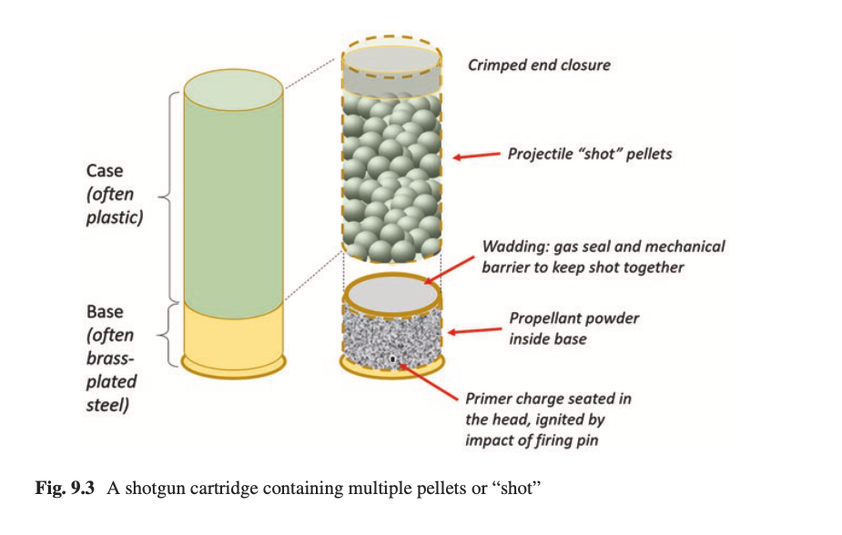

{}
Fig. 9.3 — Internal structure of a shotgun shell. Notice the key differences from a rifle cartridge: the plastic hull, the wadding that acts as a gas seal, and the load of spherical pellets instead of a single bullet. The wadding shapes how gas is released at the muzzle, affecting the acoustic signature.

- Citation: Maher, R.C. *Principles of Forensic Audio Analysis*, Fig. 9.3.
{}

---

## Firearm Types

- **Pistol** — closed chamber, single barrel
- **Revolver** — rotating cylinder, multiple chambers
- **Rifle** — long barrel with rifling grooves
- **Shotgun** — smooth bore, large diameter

{}
Each type produces a different acoustic signature. Pistols have a sealed chamber, so all gas exits through the muzzle. Revolvers have a gap between the cylinder and barrel — gas leaks from that gap, creating an extra acoustic event. Rifles have long barrels, which means the bullet accelerates longer and may reach higher velocities. Shotguns have wide, smooth bores that shape the gas release differently.
{}

---

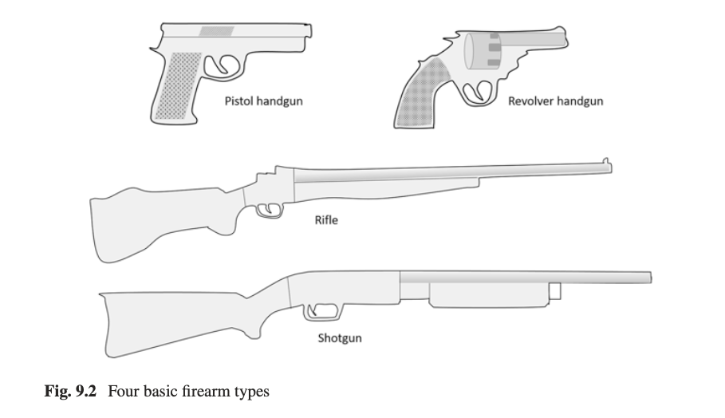

{}
Fig. 9.2 — The four main firearm types: pistol, revolver, rifle, and shotgun. Note the structural differences that affect acoustics: the revolver's exposed cylinder gap, the rifle's long barrel, and the shotgun's wide bore. Each configuration produces a distinct sound signature.

- Citation: Maher, R.C. *Principles of Forensic Audio Analysis*, Fig. 9.2.
{}

---

## What Is Caliber?

- Bullet diameter in inches or millimeters
- Same diameter, different cartridges
- More powder = more acoustic energy

{}
Caliber refers to the diameter of the bullet. Two cartridges can share the same bullet diameter but use different casing sizes. For example, the .30-06 Springfield and 7.62 NATO both fire a 0.308-inch bullet, but the .30-06 has a larger casing with more propellant. More propellant means a larger gas volume at higher pressure — and that translates directly into a louder, more energetic muzzle blast. So caliber alone does not tell you how loud a gunshot will be; the full cartridge specification matters.

- Citation: Maher, R.C. *Principles of Forensic Audio Analysis*, Ch. 9.
{}

---

## Mechanical Actions

{}**Semiautomatic** — gas/recoil cycles the action{}

{}**Bolt-action** — manual bolt handle{}

{}**Lever-action** — lever near trigger{}

{}**Pump-action** — sliding fore-end{}

{}**Break-action** — hinged barrel opens{}

{}
The "action" is the mechanism that loads, fires, and ejects. Each of these creates mechanical sounds — the metallic click of a firing pin, the clang of a spent casing being ejected, the rack of a pump shotgun. These sounds are subtle compared to the muzzle blast, but if a microphone is close to the shooter, they can be captured and may help identify the type of firearm. A semiautomatic cycles automatically using recoil energy; everything else requires some manual operation by the shooter.
{}

---

## Acoustic Clues from Mechanics

- Firing pin strike
- Slide or bolt cycling
- Spent casing ejection
- Quiet, but detectable at close range

{}
These mechanical sounds are sometimes called "telltale" sounds. In a controlled or close-range recording, you might hear the click of the firing pin just before the blast, or the metallic sound of the slide racking afterward. In most forensic recordings, these sounds are buried under the muzzle blast and environmental noise. But when they are present, they provide valuable clues about the weapon type and firing sequence.
{}

---

## The Revolver Cylinder Gap

- Small gap between cylinder and barrel
- Hot gas leaks from this gap
- Creates a distinct pre-blast impulse
- Visible in off-axis recordings

{}
In a revolver, the cylinder does not form a perfect seal against the barrel. When the gun fires, some high-pressure gas escapes through that gap before the bullet even exits the muzzle. In recordings made off to the side — say at about 98 degrees — you can see two distinct pressure peaks: one from the cylinder gap gas and a second from the muzzle blast. The timing between these peaks depends on the barrel length and bullet acceleration. This means you can potentially distinguish a revolver from a pistol just by looking at the waveform.

- Citation: Maher, R.C. *Principles of Forensic Audio Analysis*, Ch. 9.
{}

---

## Discussion

- Why might caliber alone be misleading?
- How could mechanical sounds help an examiner?
- What makes the revolver acoustically unique?

{}
Discussion guidance:

1. Caliber is just bullet diameter — two cartridges with the same caliber can have very different powder loads, meaning different acoustic energy. The .30-06 and 7.62 NATO example illustrates this well.
2. Mechanical sounds like firing pin strikes and slide cycling can help identify the weapon type, confirm the number of shots, and establish timing. They are most useful in close-range recordings.
3. The revolver cylinder gap produces a unique dual-impulse signature that pistols do not have, because pistols have a sealed chamber. This is detectable in off-axis recordings.
{}

{}

---

{}

# II. The Muzzle Blast

The primary "bang"

{}
Now we get to the main acoustic event. The muzzle blast is what most people think of as the "sound of a gunshot." It is caused by the rapid expansion of high-pressure gas as it exits the barrel behind the bullet.
{}

---

## What Causes the Blast?

- Propellant ignites inside the casing
- Hot gas builds extreme pressure
- Gas exits the muzzle behind the bullet
- Rapid expansion creates a pressure wave

{}
When the propellant burns, it produces a large volume of hot gas at very high pressure — confined inside the barrel behind the bullet. The moment the bullet leaves the muzzle, that pressurized gas is free to expand into the atmosphere. This sudden release creates an intense pressure disturbance that propagates outward as a sound wave. It is essentially a small explosion venting through a tube.
{}

---

## How Loud Is It?

- Peak levels exceed **150 dB SPL**
- For reference: jet engine at 30m is ~140 dB
- Instant hearing damage without protection
- Overwhelms most consumer microphones

{}
To put 150 dB in perspective, the threshold of pain is around 120-130 dB, and a jet engine at 30 meters is about 140 dB. A gunshot exceeds all of these. This is why forensic recordings from body cameras and phones are almost always clipped and distorted — the microphone and preamplifier simply cannot handle that level. The sound pressure is so intense that it causes non-linear behavior in both the air and the recording equipment.

- Citation: Maher, R.C. *Principles of Forensic Audio Analysis*, Ch. 9.
{}

---

## Duration: Surprisingly Brief

- True muzzle blast lasts only **1-3 ms**
- That is 0.001 to 0.003 seconds
- Hollywood gunshots are heavily processed
- Echoes make it seem much longer

{}
In movies, gunshots echo and reverberate dramatically. The actual muzzle blast — the initial pressure event — is over in one to three milliseconds. Everything you hear after that is environmental: reflections off walls, the ground, buildings. We will discuss this more in the environmental acoustics section, but keep this number in mind: the source event lasts just 1-3 milliseconds.
{}

---

<h2 style="font-size: 1.45em; margin-bottom: 0.35em;">Directivity: Not a Point Source</h2>

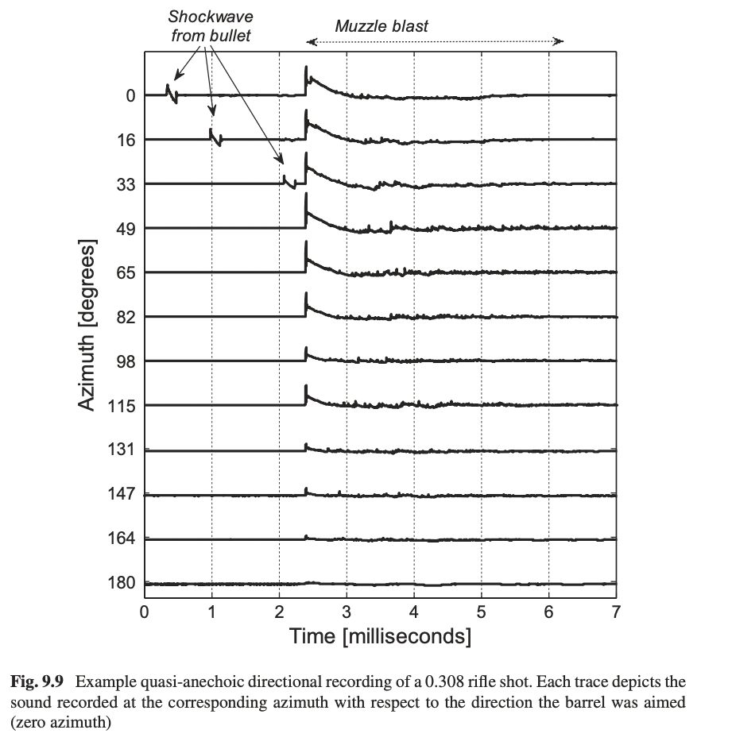

{}
Fig. 9.9 — An azimuthal plot of gunshot energy over time, showing how the muzzle blast radiates unevenly. Most energy travels forward in the barrel direction. A common misconception is that a gunshot radiates sound equally in all directions, like a point source. A garden hose is a good analogy — the water goes where the nozzle points, not equally in all directions.

- Citation: Maher, R.C. *Principles of Forensic Audio Analysis*, Fig. 9.9.
{}

---

## The 20 dB Difference

- Most energy goes forward (barrel direction)
- Rear levels are **~20 dB lower**
- Measured for a .308 rifle
- Critical for shooter location estimates

{}
For a .308 rifle, the sound measured behind the shooter can be roughly 20 dB lower than in front of the muzzle. Remember that 20 dB represents a factor of 10 in sound pressure, or roughly a factor of 4 in perceived loudness. This directivity pattern is critical for forensic work because if you know where a microphone was relative to the shooter, you can use the recorded level to help estimate the shooter's orientation. Conversely, if the directivity is ignored, distance and location estimates will be wrong.

- Citation: Maher, R.C. *Principles of Forensic Audio Analysis*, Ch. 9.
{}

---

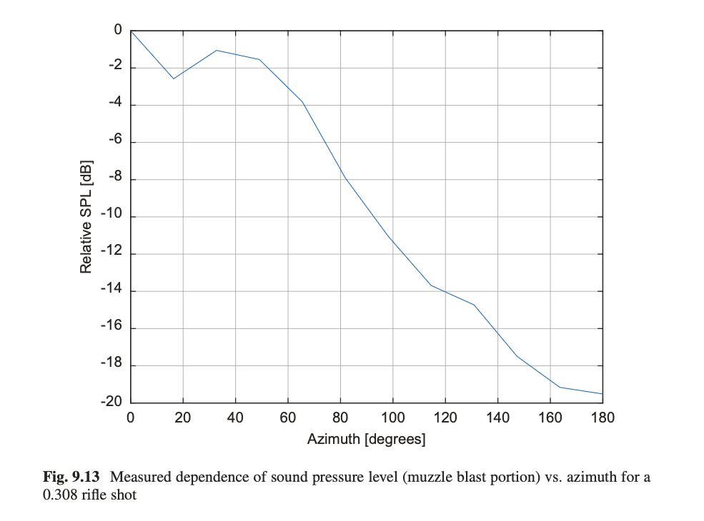

{}
Fig. 9.13 — Sound pressure level plotted as a function of angle (azimuth) around the firearm. The peak is at 0 degrees (directly in front of the muzzle) and drops off toward the rear. This confirms the ~20 dB front-to-rear difference for a rifle and shows why microphone position matters so much in forensic analysis.

- Citation: Maher, R.C. *Principles of Forensic Audio Analysis*, Fig. 9.13.
{}

---

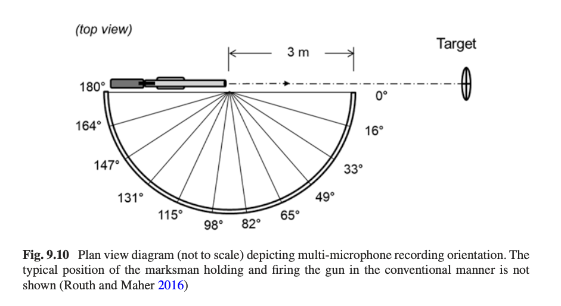

{}
Fig. 9.10 — Top-view diagram of a semicircular microphone array placed around the firearm. This is the experimental setup used to measure the directivity patterns we just discussed. Multiple microphones at known angles capture the same shot simultaneously, allowing researchers to map how energy varies with direction.

- Citation: Maher, R.C. *Principles of Forensic Audio Analysis*, Fig. 9.10.
{}

---

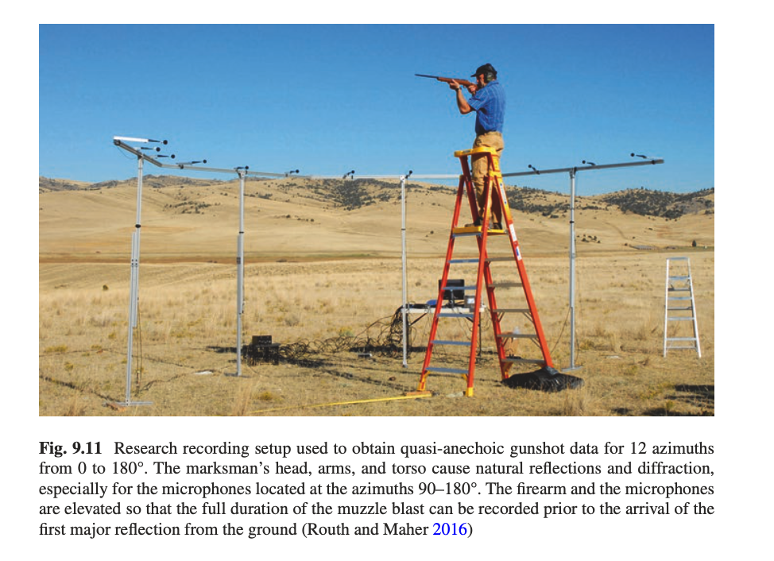

{}
Fig. 9.11 — Photograph of a field recording setup with elevated microphones and a shooter position. This shows how quasi-anechoic laboratory data are captured: outdoors, away from reflective surfaces, with the microphones raised to minimize ground reflections. Compare this controlled environment to the chaotic conditions of a real forensic recording.

- Citation: Maher, R.C. *Principles of Forensic Audio Analysis*, Fig. 9.11.
{}

---

## Discussion

- Why does the blast last only 1-3 ms?
- How does directivity affect witness accounts?
- What happens to a microphone at 150+ dB?

{}
Discussion guidance:

1. The blast is brief because it is a single, rapid gas release event — once the pressure equalizes with the atmosphere, the source event is over. Everything after that is propagation and reflection.
2. Witnesses at different positions relative to the shooter will perceive very different loudness levels. Someone behind the shooter may report a much quieter shot than someone in front. This can lead to conflicting witness statements about the same event.
3. At 150+ dB, consumer microphones clip severely. The preamplifier saturates, and the resulting recording shows flat-topped waveforms rather than the true pressure shape. This distortion makes forensic analysis much harder.
{}

{}

---

{}

# III. Ballistic Shock Waves

When bullets break the sound barrier

{}
Now we move to the second major acoustic component of a gunshot. If the bullet travels faster than the speed of sound, it creates a shock wave — a completely separate acoustic event from the muzzle blast. Not all bullets produce this, so understanding when and why it occurs is essential.
{}

---

## Supersonic vs. Subsonic

- **Supersonic**: bullet faster than sound (~343 m/s)
- **Subsonic**: bullet slower than sound
- Supersonic rounds produce a shock wave
- Subsonic rounds produce only muzzle blast

{}
The speed of sound in air is approximately 343 meters per second at 20 degrees Celsius. Many rifle bullets travel well above this — sometimes two or three times the speed of sound. These supersonic projectiles create a ballistic shock wave in addition to the muzzle blast. Subsonic ammunition, often used with suppressors, does not generate this shock wave. This means a subsonic shot has a different acoustic signature — it is missing an entire component.
{}

---

## The Mach Number

- **M = V / c** (velocity / speed of sound)
- M > 1 means supersonic
- Higher M = narrower shock cone
- M = 1.8 → cone angle of 34 degrees

{}
The Mach number is simply the bullet's speed divided by the speed of sound. A bullet at Mach 1.8 travels 1.8 times faster than sound. The Mach number determines the geometry of the shock wave — specifically, the angle of the cone it creates. At Mach 1.8, the cone's half-angle is about 34 degrees. At Mach 3.5, it narrows to about 16.6 degrees. The faster the bullet, the narrower the cone, and the more focused the shock wave energy becomes.

- Citation: Maher, R.C. *Principles of Forensic Audio Analysis*, Ch. 9.
{}

---

## The Shock Wave Cone

- Cone trails behind the bullet
- Angle: **theta = arcsin(1/M)**
- M = 1.8 → 34 degree cone
- M = 3.5 → 16.6 degree cone

{}
Imagine the bullet as the tip of an expanding cone of pressure. The formula theta equals the arcsine of one over M gives you the half-angle of that cone. The analogy is a boat wake — the faster the boat, the narrower the V-shaped wake. This cone geometry matters because a microphone will only detect the shock wave if it falls within the cone. Behind the bullet or far to its side, the shock wave never arrives.
{}

---

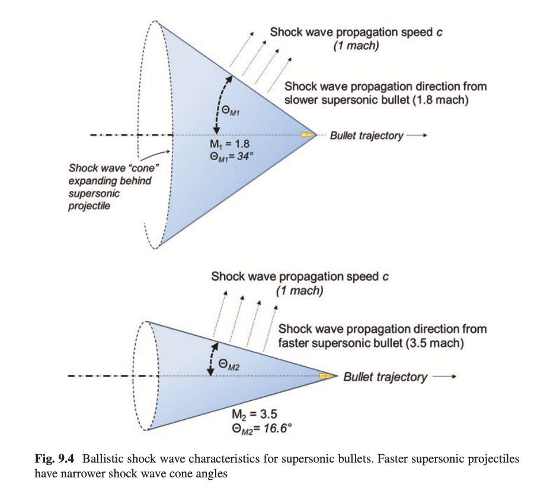

{}
Fig. 9.4 — Comparison of shock wave cones at different Mach numbers. The left diagram shows a wider cone for a slower supersonic bullet; the right shows a narrower cone for a faster one. This directly illustrates the theta = arcsin(1/M) relationship. Higher velocity means a tighter cone and a more focused zone where the shock wave can be detected.

- Citation: Maher, R.C. *Principles of Forensic Audio Analysis*, Fig. 9.4.
{}

---

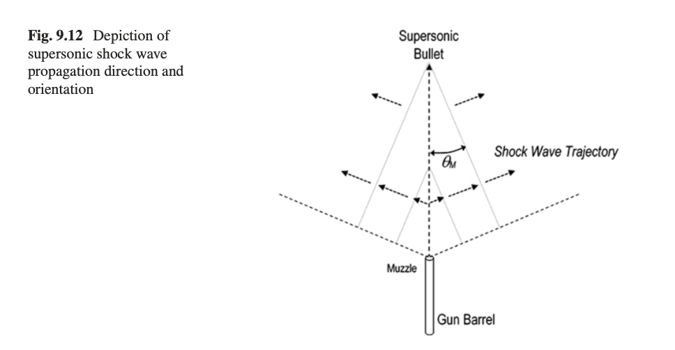

{}
Fig. 9.12 — Diagram of supersonic shock wave propagation relative to the bullet trajectory. This shows the angular limits of shock wave detection — a microphone must be within the cone to detect it. Points outside the cone only receive the muzzle blast. This geometry is central to forensic analysis of supersonic gunfire.

- Citation: Maher, R.C. *Principles of Forensic Audio Analysis*, Fig. 9.12.
{}

---

## The "N" Wave

- Distinctive pressure signature
- Abrupt onset, then abrupt offset
- Looks like the letter "N" in waveform
- Caused by nonlinear air propagation

{}
The shock wave has a very characteristic shape when plotted as pressure over time: a sharp positive spike followed by a sharp negative spike, forming the letter "N." This happens because at these extreme pressure levels, the air behaves nonlinearly — the high-pressure portions of the wave travel faster than the low-pressure portions. Over distance, the wave front steepens until it forms this abrupt, discontinuous N shape. This is a signature that forensic examiners look for in recordings to confirm the presence of a supersonic projectile.

- Citation: Maher, R.C. *Principles of Forensic Audio Analysis*, Ch. 9.
{}

---

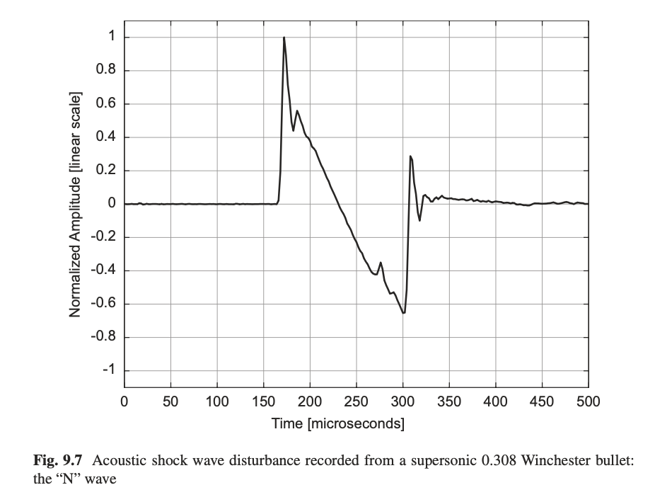

{}
Fig. 9.7 — A high-resolution recording of a ballistic shock wave showing the characteristic N-shape. Notice the abrupt positive pressure spike followed immediately by an abrupt negative spike. This waveform results from nonlinear propagation in air — the high-pressure peak outruns the rest of the wave and steepens into a discontinuity.

- Citation: Maher, R.C. *Principles of Forensic Audio Analysis*, Fig. 9.7.
{}

---

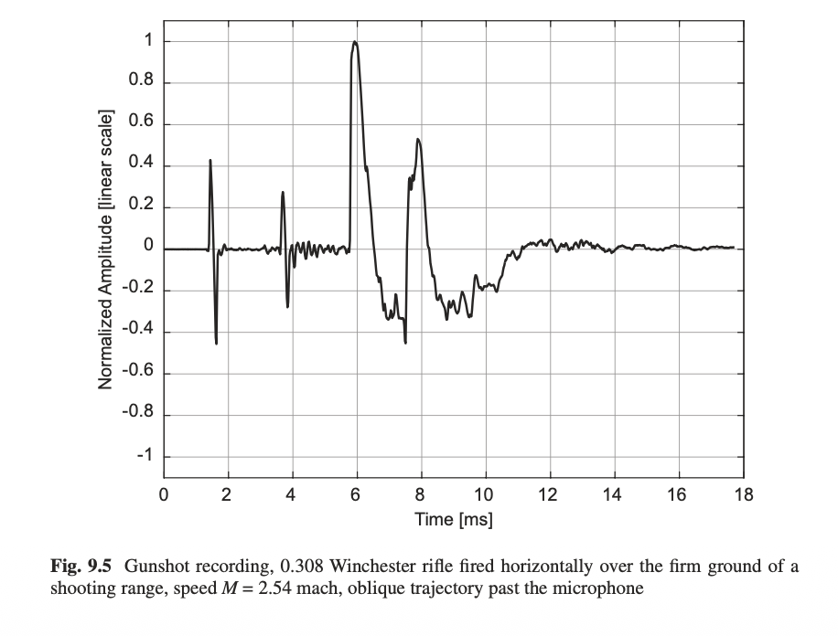

{}
Fig. 9.5 — Time-domain waveform of a supersonic rifle shot. This is not a simple impulse — you can see multiple acoustic components: the ballistic shock wave arriving first, followed by the muzzle blast, then reflections. A single gunshot produces a complex, multi-part waveform.

- Citation: Maher, R.C. *Principles of Forensic Audio Analysis*, Fig. 9.5.
{}

---

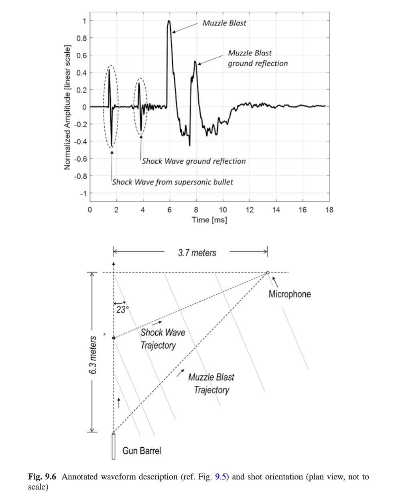

{}
Fig. 9.6 — An annotated waveform with a spatial diagram linking each waveform feature to its physical origin. The shock wave, muzzle blast, and ground reflection are each labeled and connected to the geometry of the gun, bullet trajectory, and microphone position. This is the bridge between physics and waveform interpretation.

- Citation: Maher, R.C. *Principles of Forensic Audio Analysis*, Fig. 9.6.
{}

---

## What a Microphone Hears

{}**Downrange mic**: shock wave arrives first{}

{}Then the muzzle blast arrives later{}

{}**Behind the shooter**: only muzzle blast{}

{}
This is a key concept. If you are downrange — in front of the shooter — the supersonic bullet outruns its own sound. The shock wave reaches you before the muzzle blast. You hear a sharp crack (the N wave) followed by the boom (the blast). But if you are behind the shooter, you are outside the shock cone entirely, so you only hear the muzzle blast. The time delay between the shock wave and the muzzle blast at a given location can be used to estimate the distance to the shooter.
{}

---

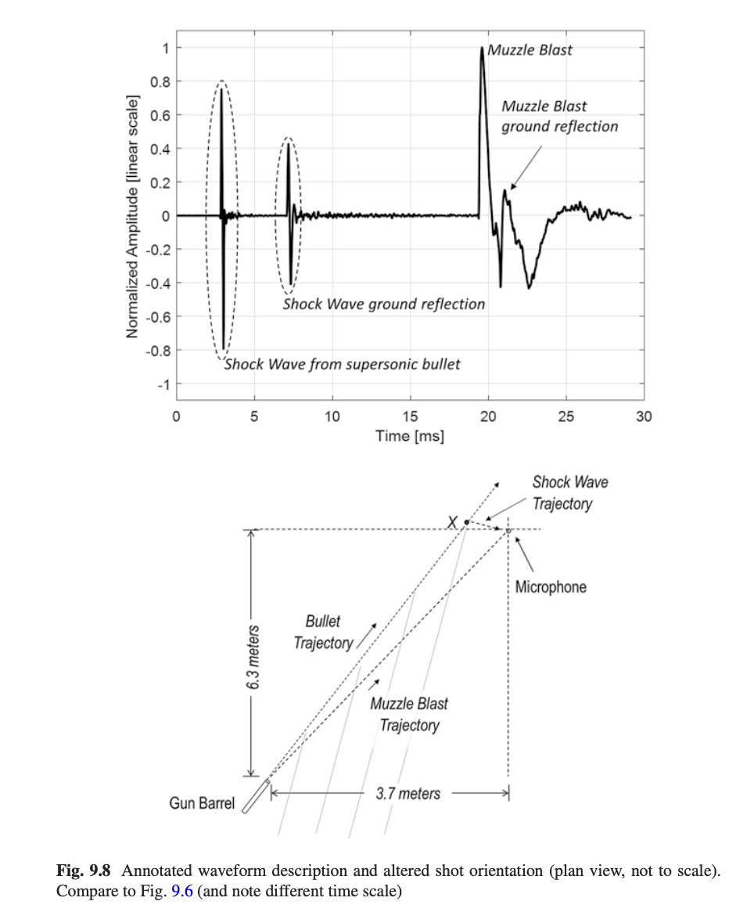

{}
Fig. 9.8 — The same firearm recorded with a different source-receiver geometry. Compare this to Fig. 9.5 — the timing and relative amplitudes of the shock wave and muzzle blast have shifted because the microphone is at a different angle and distance. This demonstrates why recording position is a critical variable in forensic analysis.

- Citation: Maher, R.C. *Principles of Forensic Audio Analysis*, Fig. 9.8.
{}

---

## Speed of Sound and Temperature

- **c = 331 * sqrt(1 + T/273)** m/s
- T = temperature in Celsius
- At 20C: c is approximately 343 m/s
- Must account for this in forensic timing

{}
The speed of sound is not a constant — it depends on air temperature. The formula c equals 331 times the square root of one plus T over 273 gives the speed in meters per second, where T is the temperature in Celsius. At zero degrees Celsius, c is 331 m/s. At 20 degrees, it rises to about 343 m/s. In forensic work, accurate timing calculations — such as the delay between shock wave and muzzle blast — require knowing the temperature at the scene. A few degrees can change the calculated distance by several meters.

- Citation: Maher, R.C. *Principles of Forensic Audio Analysis*, Ch. 9.
{}

---

## Discussion

- Why does a downrange mic hear two events?
- How could temperature affect a forensic analysis?
- Why might subsonic ammo be forensically harder?

{}
Discussion guidance:

1. The bullet outruns the sound of its own firing. The shock wave, traveling with the bullet, reaches a downrange microphone before the slower muzzle blast catches up. The time gap between these two arrivals is proportional to distance.
2. Temperature changes the speed of sound. If an examiner assumes 20 degrees but the actual temperature was 35 degrees, all distance and timing calculations based on speed of sound will be off. Even a 10-degree error could shift distance estimates by several percent.
3. Subsonic ammunition produces only a muzzle blast with no shock wave. This removes one of the key analytical tools — the shock wave arrival timing — making it harder to estimate distance and direction.
{}

{}

---

{}

# IV. Other Acoustic Components

Beyond the blast and the shock wave

{}
The muzzle blast and ballistic shock wave are the dominant sounds, but a complete gunshot signature includes several quieter components. These subtle signals can provide valuable forensic information when they are captured.
{}

---

## Mechanical Action Sounds

- Trigger mechanism click
- Firing pin striking the primer
- Slide or bolt cycling
- Spent casing hitting the ground

{}
Every mechanical part of the firearm makes some sound. The trigger click, the firing pin impact, the slide racking back and chambering a new round, the spent brass casing bouncing off a surface — all of these are acoustic events. They are much quieter than the muzzle blast, typically by 40 dB or more. But in a recording where the microphone is close to the shooter, they can sometimes be identified. They can help confirm the weapon type and the sequence of events.
{}

---

## Cylinder Gap: Timing Analysis

- Time between the two peaks varies
- Depends on barrel length and bullet speed
- Longer barrel = greater separation
- Can narrow down revolver model

{}
We introduced the cylinder gap in Section I. Here the forensic application becomes concrete: the time separation between the gas-leak impulse and the muzzle blast depends on how long the bullet takes to traverse the barrel. A snub-nose revolver with a short barrel produces a smaller gap than a long-barreled revolver. If you can measure that delay precisely, you can estimate barrel length and potentially narrow down the weapon model. This is one of the few acoustic measurements that links directly to a physical dimension of the firearm.

- Citation: Maher, R.C. *Principles of Forensic Audio Analysis*, Ch. 9.
{}

---

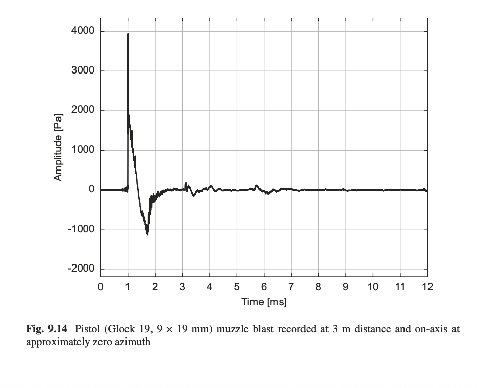

{}
Fig. 9.14 — Waveform of a subsonic pistol shot recorded on-axis (in front of the barrel). Notice the short-duration muzzle blast of about 1 ms with no preceding shock wave. This is what a gunshot looks like when the bullet does not break the sound barrier.

- Citation: Maher, R.C. *Principles of Forensic Audio Analysis*, Fig. 9.14.
{}

---

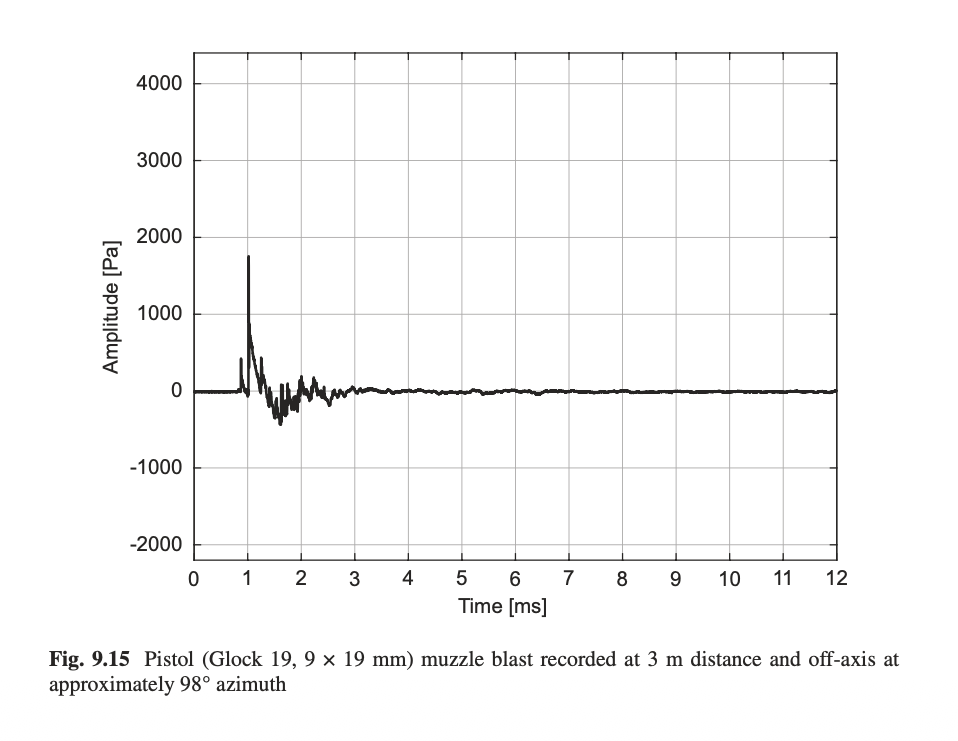

{}
Fig. 9.15 — The same pistol shot recorded off-axis. The waveform structure changes because the microphone is no longer in front of the barrel. The muzzle blast amplitude is reduced due to directivity, and the overall shape differs from the on-axis recording. Same gun, same shot, different perspective.

- Citation: Maher, R.C. *Principles of Forensic Audio Analysis*, Fig. 9.15.
{}

---

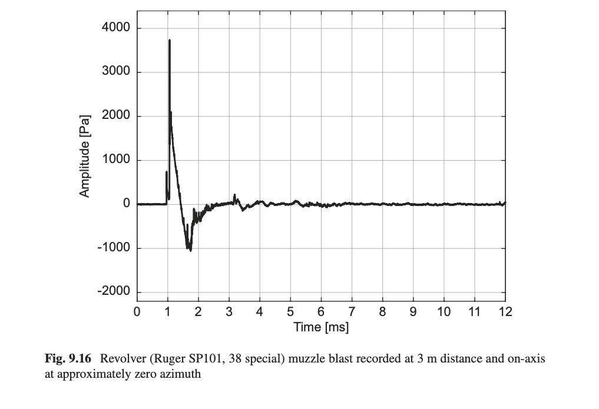

{}
Fig. 9.16 — Waveform of a revolver shot recorded on-axis. When viewed from directly in front, the revolver waveform looks similar to the pistol — a single, brief muzzle blast. The cylinder gap signature is not visible from this angle because the gap faces sideways, not forward.

- Citation: Maher, R.C. *Principles of Forensic Audio Analysis*, Fig. 9.16.
{}

---

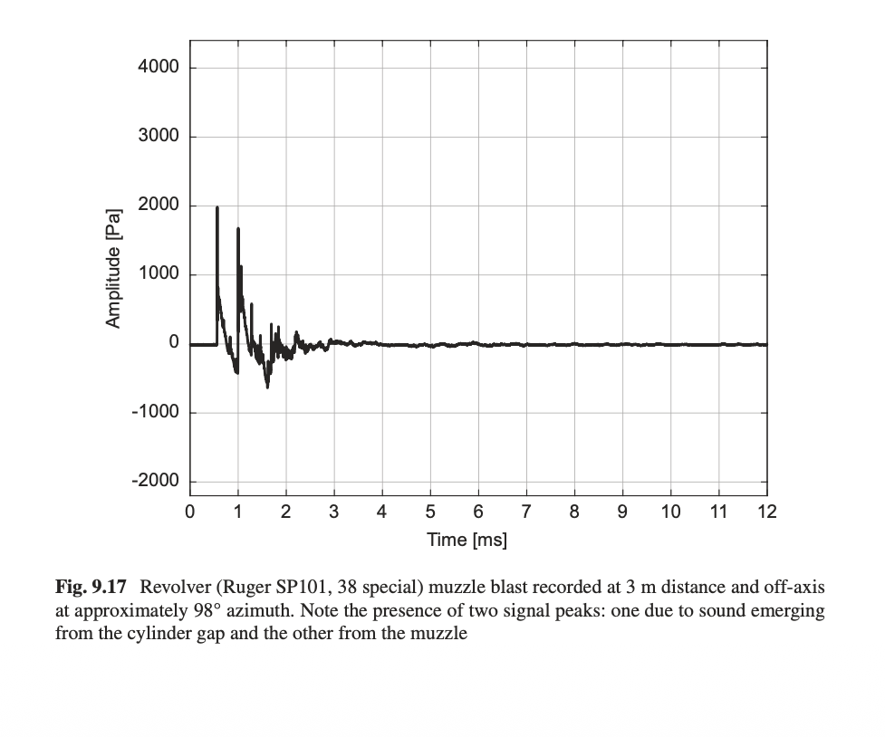

{}
Fig. 9.17 — Revolver shot recorded off-axis. Now two distinct peaks appear: the first from gas escaping the cylinder gap, the second from the muzzle blast. This dual-impulse pattern is the key distinguishing feature of revolvers and is only visible in off-axis recordings. Compare this to Fig. 9.15 — the pistol shows no such double peak.

- Citation: Maher, R.C. *Principles of Forensic Audio Analysis*, Fig. 9.17.
{}

---

## Surface Vibration

- Gunshot shakes the ground and surfaces
- Vibration travels through solids
- At least **5x faster** than airborne sound
- Can help resolve location ambiguities

{}
The intense pressure pulse from a gunshot does not just travel through air. It can vibrate the ground, walls, vehicles, and other solid surfaces. These vibrations propagate through solid materials at least five times faster than sound travels through air. If a recording device is resting on a surface — a dashcam on a car hood, a phone on a table — it may capture the surface vibration before the airborne sound arrives. By comparing these two arrival times, investigators can gain additional information about the shooter's location.

- Citation: Maher, R.C. *Principles of Forensic Audio Analysis*, Ch. 9.
{}

---

## The Complete Acoustic Signature

{}1. Cylinder gap gas (revolvers only){}

{}2. Muzzle blast (all firearms){}

{}3. Ballistic shock wave (supersonic only){}

{}4. Mechanical action sounds{}

{}5. Surface vibrations{}

{}
These events occur in roughly this order. Not all gunshots produce every component — subsonic rounds have no shock wave, pistols have no cylinder gap signature. But a complete analysis considers all possible components. Each one provides a different piece of information: the blast tells you about the weapon's power and orientation, the shock wave tells you about bullet speed and direction, the mechanical sounds tell you about the weapon type, and surface vibrations can help with location.
{}

---

## What Determines the Signature?

- Firearm type (pistol, revolver, rifle)
- Caliber and cartridge
- Barrel length
- Supersonic vs. subsonic ammunition
- Recording position relative to shooter

{}
The acoustic signature is not fixed for a given weapon — it depends on all of these factors together. The same rifle loaded with supersonic and subsonic ammunition will produce very different recordings. The same pistol recorded from the front and from behind will look different because of directivity. And the same shot recorded at two different distances will have different shock wave timing. Forensic analysis must account for all of these variables.
{}

---

## Discussion

- How could surface vibration help in casework?
- Why does position matter so much?
- What combination of clues identifies a revolver?

{}
Discussion guidance:

1. If a dashcam or phone was resting on a solid surface, the surface vibration arrives faster than the airborne sound. The time difference can help narrow down the distance and direction to the source. It is an independent measurement that can corroborate or challenge other evidence.
2. Recording position determines which components are captured (shock wave only appears within the cone), how loud the blast is (directivity), and the timing relationships between components. Two microphones at different positions may produce recordings that look entirely different despite capturing the same shot.
3. The cylinder gap signature — a dual-impulse pattern with a pre-blast gas release — is unique to revolvers. Combined with the absence of semiautomatic cycling sounds, this combination strongly points to a revolver.
{}

{}

---

{}

# V. Environmental Acoustics

How the world reshapes the gunshot

{}
We have described the source signals — now let us talk about what happens after those signals leave the firearm. The environment has a profound effect on what actually gets recorded. Understanding this is essential because forensic examiners almost never have clean, direct recordings.
{}

---

## Reflections and Echoes

- Sound bounces off buildings, ground, cars
- Each reflection is a delayed copy
- Multiple reflections overlap in time
- Creates a complex, extended waveform

{}
Sound reflects off any hard surface. In an outdoor environment, the ground alone creates a reflection. In an urban environment, every building, car, wall, and pavement surface generates its own reflection. Each of these arrives at the microphone at a slightly different time, because each traveled a different path length. The result is a rapid succession of overlapping copies of the original blast, stacked on top of each other.
{}

---

## From 3 ms to 700+ ms

- Source blast: 1-3 ms
- Urban recording: 700+ ms
- Overlapping reflections fill the gap
- A "pop" becomes a sustained "boom"

{}
The actual muzzle blast is over in about three milliseconds. But a recording of a 9mm pistol in an urban setting might show acoustic energy lasting over 700 milliseconds — more than 200 times longer than the source event. All of that extra duration comes from environmental reflections arriving one after another. This is why gunshots in cities sound like extended booms rather than sharp pops. The environment is essentially smearing the signal in time.

- Citation: Maher, R.C. *Principles of Forensic Audio Analysis*, Ch. 9.
{}

---

## Reverberation

- Dense overlap of many reflections
- Characteristic decay pattern
- Depends on the space geometry
- Indoor vs. outdoor: very different

{}
When reflections arrive so densely that you cannot distinguish individual echoes, we call it reverberation. The reverberant tail of a gunshot decays over time as each successive reflection loses energy through absorption and distance. The shape and duration of this reverberation depends on the physical environment — a narrow street between tall buildings creates different reverberation than an open park. Indoor environments add walls, ceilings, and floors as additional reflectors, creating even denser reverberation.
{}

---

## Absorption

- Surfaces absorb some sound energy
- Soft materials absorb more (grass, fabric)
- Hard materials reflect more (concrete, glass)
- Changes the spectral content over distance

{}
Not all sound energy reflects — surfaces absorb a portion of it. Concrete and glass are highly reflective, especially at low frequencies. Grass, soil, and fabric absorb more energy, particularly at higher frequencies. This means that the spectral content of a gunshot changes as it propagates and reflects. High frequencies are absorbed faster than low frequencies, so distant recordings tend to have less high-frequency content. An examiner must consider these effects when analyzing spectral features.
{}

---

## Estimating Reflector Distance

- Time delay between direct and reflected sound
- Distance = (delay x speed of sound) / 2
- Divide by 2 because sound travels there and back
- Can identify nearby surfaces

{}
If you can identify a distinct reflection in a recording — a secondary pulse arriving after the direct blast — you can estimate the distance to the reflecting surface. Multiply the time delay by the speed of sound, then divide by two because the sound traveled to the surface and back. For example, a reflection arriving 0.45 seconds after the blast suggests a surface about 77 meters away, assuming standard conditions. Forensic examiners have used this technique to identify reflecting buildings in casework.

- Citation: Maher, R.C. *Principles of Forensic Audio Analysis*, Ch. 9.
{}

---

## Forensic Implications

- Environment is part of every recording
- Same gun sounds different in every location
- Reflections can obscure shot timing
- But reflections also carry information

{}
The environment is not just noise — it is information. While reflections make it harder to see the clean source signal, they also encode the geometry of the scene. The pattern and timing of reflections can help determine where the shot was fired, what surfaces were nearby, and whether the recording location is consistent with the claimed scenario. A forensic examiner works with the environment, not against it.
{}

---

## Discussion

- Why is a 3 ms blast recorded as 700 ms?
- How might reflections help, not just hinder?
- Why does the same gun sound different indoors?

{}
Discussion guidance:

1. The 700 ms duration comes entirely from environmental reflections overlapping in time. The source event is brief, but each reflection adds its own delayed copy. In a reflective urban environment, dozens or hundreds of reflections stack up.
2. Reflections encode scene geometry. By measuring reflection delays, you can estimate distances to surrounding surfaces. The pattern of reflections can help verify whether a recording is consistent with a claimed location.
3. Indoor environments add floor, ceiling, and wall reflections at short delays, creating dense, rapid reverberation. The enclosed space traps sound energy, and the spectral character changes due to different absorption properties of indoor materials versus outdoor surfaces.
{}

{}

---

{}

# VI. Laboratory vs. Forensic Recordings

Pristine data meets messy reality

{}
Now that we understand the physics and the environment, let us compare what a gunshot looks like under ideal conditions versus what forensic examiners actually receive. This gap between laboratory measurements and real-world evidence is one of the central challenges of the field.
{}

---

## Laboratory Recordings

- Specialized mics (up to 500 kHz sample rate)
- Carefully leveled to avoid clipping
- Quasi-anechoic (echo-free) environments
- Capture true waveform shapes

{}
In a research setting, gunshot recordings are made with measurement-grade microphones that can handle extreme pressure levels without distorting. Sample rates of 500 kHz or higher capture the full bandwidth of the event. The recording environment is carefully controlled — often outdoors on a large, flat surface to minimize reflections — creating what is called a quasi-anechoic condition. Under these conditions, you can see the true N wave of a supersonic shock, the clean impulse of the muzzle blast, and even the subtle cylinder gap signature.

- Citation: Maher, R.C. *Principles of Forensic Audio Analysis*, Ch. 9.
{}

---

## Forensic Recordings

- Body cameras, surveillance, phones
- Clipped and distorted waveforms
- Heavy background noise
- Dense reverberation

{}
Forensic recordings are almost the opposite. They come from devices never designed to record gunshots — body-worn cameras, parking lot surveillance systems, cell phones, dashcams. At 150+ dB, the microphone and preamplifier overload, producing clipped, flat-topped waveforms. The true peak shape is lost. Background noise from traffic, voices, wind, and equipment is mixed in. And the recording environment adds dense reverberation that stretches the signal far beyond its original duration.
{}

---

## The Clipping Problem

- Gunshot pressure overloads the microphone
- Waveform peaks are chopped flat
- True amplitude information is lost
- Non-linear distortion adds false frequencies

{}
When the sound pressure exceeds what the microphone and analog-to-digital converter can represent, the waveform is simply chopped off at the maximum value. This means you lose the true peak amplitude — you cannot measure how loud the shot actually was. Worse, clipping introduces harmonic distortion: frequencies that were not in the original signal appear in the recording because of the non-linear truncation. This can confuse spectral analysis.
{}

---

## Bridging the Gap

- Lab data provides reference signatures
- Forensic recordings require interpretation
- Pattern matching, not exact comparison
- Experience and methodology matter

{}
The practical approach is to use laboratory data as a reference library — these are the "clean" signatures you compare against. But you cannot expect a forensic recording to exactly match a lab recording. Instead, examiners look for characteristic patterns: the timing between shock wave and blast, the relative levels from different directions, the shape of the reverberation tail. It is pattern matching under adverse conditions, and it requires both scientific methodology and practical experience.

- Citation: Maher, R.C. *Principles of Forensic Audio Analysis*, Ch. 9.
{}

---

## Discussion

- Why can't we just use better mics at crime scenes?
- What information survives clipping?
- How do lab recordings help forensic work?

{}
Discussion guidance:

1. Crime scenes are unpredictable — the recordings come from whatever devices happened to be running. You cannot go back and re-record with better equipment. Some agencies do deploy acoustic sensor arrays (like ShotSpotter), but most forensic evidence comes from incidental recordings.
2. Even clipped recordings preserve timing information: when shots occurred, the intervals between them, and the relative arrival times of shock waves and blasts. Spectral patterns below the clipping threshold may also survive. The temporal structure is often more useful than the amplitude.
3. Lab recordings provide known reference signatures for specific firearms and ammunition. Examiners can compare timing patterns, directivity effects, and spectral characteristics against these references to identify or narrow down the weapon type.
{}

{}

---

{}

# VII. Forensic Recording Example 1

Taser, gunshots, and speech on one recording

{}
This case study shows the complexity of real forensic evidence. A single recording from a Taser audio attachment captured six gunshots, electrical pulses, and shouted speech — all overlapping. The analysis demonstrates shot counting, timing measurement, and speaker identification from a single poor-quality source.

- Citation: Maher, R.C. *Principles of Forensic Audio Analysis*, Ch. 9.
{}

---

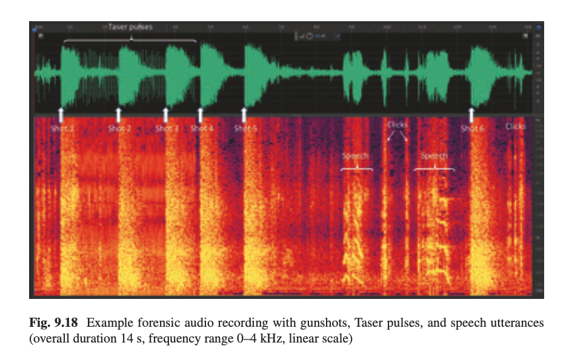

{}
Fig. 9.18 — A 14-second forensic recording showing gunshots, Taser pulses, and speech in both waveform and spectrogram views. This is what real forensic evidence looks like: multiple overlapping sound sources, background noise, and reverberation all captured on a single device. The examiner must untangle each component.

- Citation: Maher, R.C. *Principles of Forensic Audio Analysis*, Fig. 9.18.
{}

---

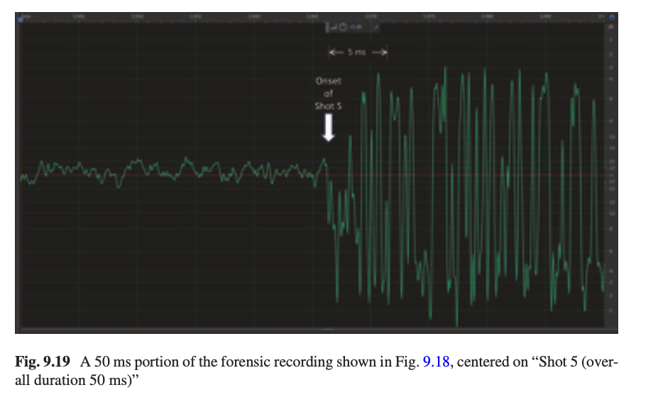

{}
Fig. 9.19 — A zoomed excerpt centered on one gunshot, showing the reverberant structure. The initial blast is brief, but reflections from the surrounding environment stretch the acoustic energy over hundreds of milliseconds. This is the 3 ms to 700+ ms transformation we discussed earlier, visible in actual forensic evidence.

- Citation: Maher, R.C. *Principles of Forensic Audio Analysis*, Fig. 9.19.
{}

---

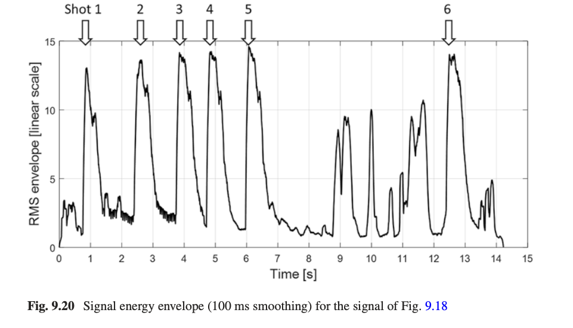

{}
Fig. 9.20 — Smoothed RMS energy envelopes of multiple gunshots from the recording. Examiners calculated these by squaring the waveform, smoothing with a 100 ms window, and taking the square root. The envelopes allow comparison of shot timing and relative energy levels across the sequence.

- Citation: Maher, R.C. *Principles of Forensic Audio Analysis*, Fig. 9.20.
{}

---

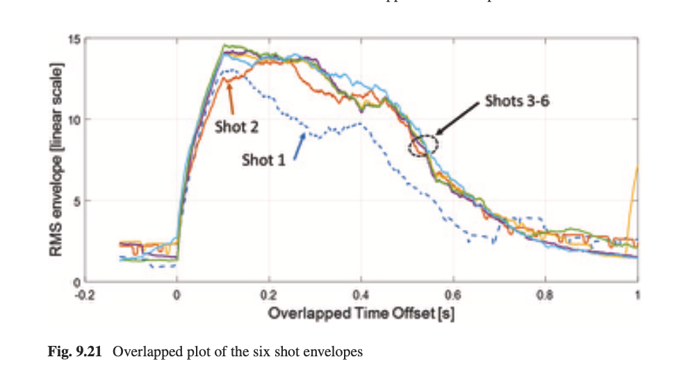

{}
Fig. 9.21 — The shot envelopes aligned and overlaid. When the six shots are time-aligned at their onsets, their shapes are strikingly similar — consistent with a single firearm. Subtle variations in the tails reflect slightly different environmental reflection patterns as the shooter or scene changed between shots.

- Citation: Maher, R.C. *Principles of Forensic Audio Analysis*, Fig. 9.21.
{}

---

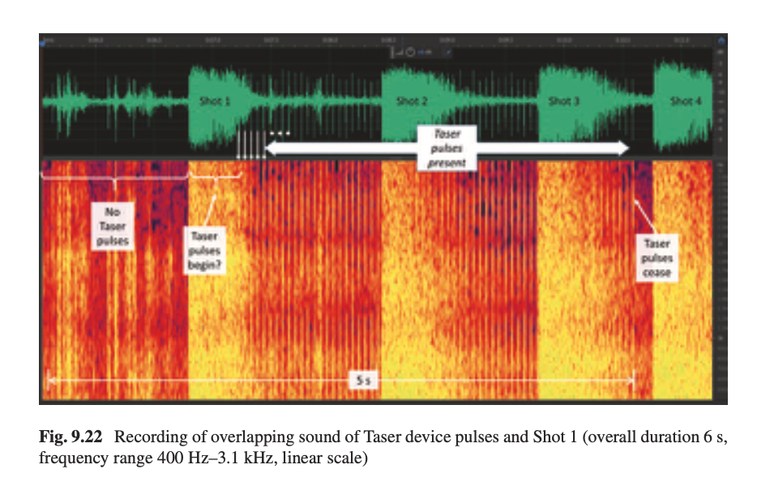

{}
Fig. 9.22 — Combined waveform and spectrogram showing where Taser electrical pulses overlap with gunfire. The Taser emits pulses with a 50 ms period for a 5-second cycle, but only 3.4 seconds of pulses were detected. The first gunshot likely occurred at the same moment as Taser deployment, with the blast overwhelming the start of the pulse sequence.

- Citation: Maher, R.C. *Principles of Forensic Audio Analysis*, Fig. 9.22.
{}

---

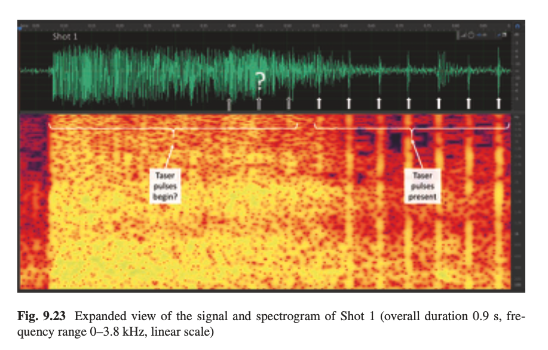

{}
Fig. 9.23 — Expanded view of Shot 1 with Taser pulse timing extrapolated. By extending the regular 50 ms pulse pattern backward, examiners inferred the precise moment the Taser was deployed relative to the first gunshot. This kind of timing reconstruction is central to establishing the sequence of events.

- Citation: Maher, R.C. *Principles of Forensic Audio Analysis*, Fig. 9.23.
{}

---

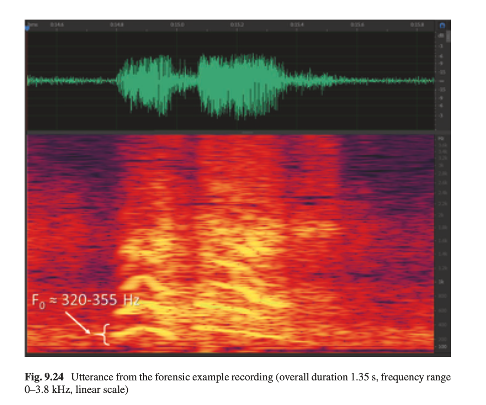

{}
Fig. 9.24 — Spectrogram of a shouted speech utterance captured in the forensic recording. The fundamental frequency measured 340-355 Hz — far above the normal male range of 85-180 Hz. Despite the high pitch, critical listening confirmed the speaker was male. Emotional stress and shouting significantly raise fundamental frequency.

- Citation: Maher, R.C. *Principles of Forensic Audio Analysis*, Fig. 9.24.
{}

---

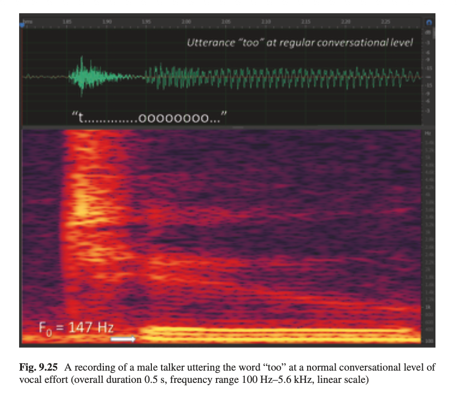

{}
Fig. 9.25 — Baseline example of normal conversational male speech with a fundamental frequency around 147 Hz. Compare this to the shouted speech in the forensic recording. The difference is dramatic — stress and vocal effort can more than double the fundamental frequency, which has implications for speaker identification.

- Citation: Maher, R.C. *Principles of Forensic Audio Analysis*, Fig. 9.25.
{}

---

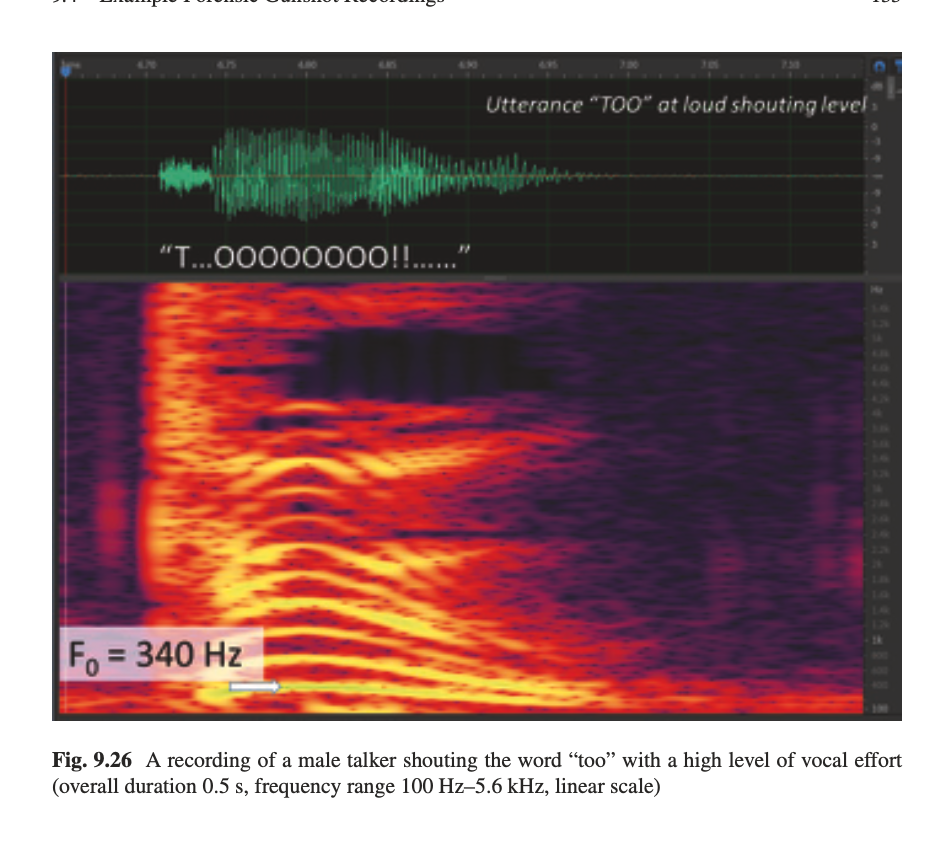

{}
Fig. 9.26 — Shouted male speech with a fundamental frequency around 340 Hz. Side by side with Fig. 9.25, you can see how dramatically vocal effort shifts the pitch. An examiner who relied only on pitch to determine gender would misidentify this speaker. Critical listening and contextual analysis are essential complements to acoustic measurement.

- Citation: Maher, R.C. *Principles of Forensic Audio Analysis*, Fig. 9.26.
{}

---

## Discussion

- How do overlaid envelopes help identify a weapon?
- Why might Taser timing matter legally?
- What are the risks of pitch-based speaker ID?

{}
Discussion guidance:

1. If the overlaid shot envelopes are consistent in shape and energy, it supports the conclusion that a single firearm was used. Variations would suggest multiple weapons or significant changes in shooter position.
2. The precise timing of Taser deployment relative to gunshots can determine whether force was escalated appropriately. If the Taser was deployed after the shooting began, the legal narrative changes. Acoustic timing provides objective evidence for the sequence.
3. Shouting can raise fundamental frequency well beyond normal ranges, making a male voice measure in the female pitch range. Relying solely on pitch for speaker identification can lead to errors. Examiners combine pitch measurement with critical listening and spectral analysis.
{}

{}

---

{}

# VIII. Forensic Recording Example 2

Synchronizing multiple devices

{}
This second case study shows how to overcome a poor-quality recording by combining it with other recordings of the same event. When the closest microphone is too overloaded to resolve the shots, more distant recordings from other devices can fill in the gaps.

- Citation: Maher, R.C. *Principles of Forensic Audio Analysis*, Ch. 9.
{}

---

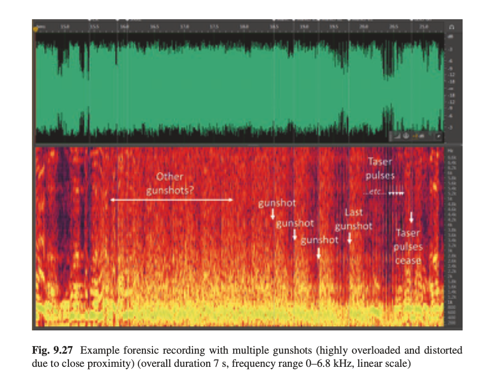

{}
Fig. 9.27 — A highly clipped and distorted waveform from an officer's vest camera positioned close to the gunfire. The microphone and preamplifier were so overloaded that the first several shots are unresolvable — they merge into a solid block of clipping. This is the limitation of forensic recordings at close range: the evidence you most need is the evidence most likely to be destroyed by the recording conditions.

- Citation: Maher, R.C. *Principles of Forensic Audio Analysis*, Fig. 9.27.
{}

---

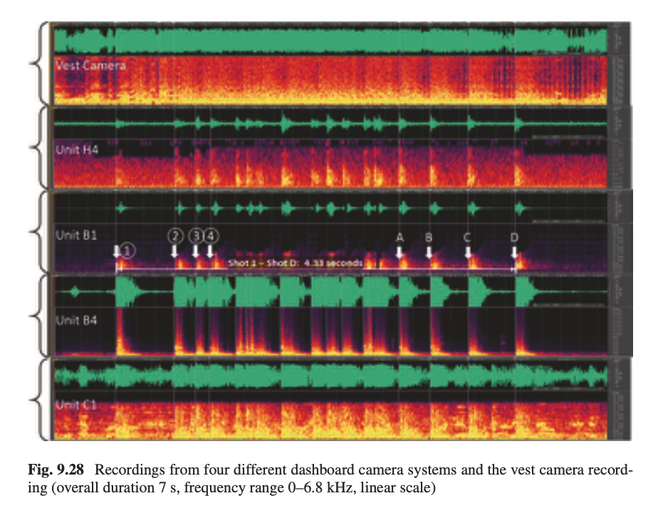

{}
Fig. 9.28 — Multiple recordings from different devices aligned using a common reference shot. Four dashcam recordings and the vest camera were synchronized by shifting their time bases to align the last clearly audible shot. The more distant dashcam recordings, though quieter, were not clipped — and they resolved four early shots that were buried in the vest camera's distortion. The final synchronized timeline showed Shot 1 occurred 4.329 seconds before the last shot.

- Citation: Maher, R.C. *Principles of Forensic Audio Analysis*, Fig. 9.28.
{}

---

## Discussion

- Why are distant recordings sometimes more useful?
- What makes a good synchronization reference?
- How does multi-device analysis strengthen a case?

{}
Discussion guidance:

1. Distant recordings receive less sound pressure, so they are less likely to clip. The trade-off is lower signal-to-noise ratio and more reverberation, but the waveform shape is preserved. A distant, clean recording can reveal details that a close, clipped recording cannot.
2. A good reference point must be clearly identifiable in all recordings — typically a distinct, isolated shot. It should be unambiguous in timing. The last shot was used here because it was clearly separated from the others in all five recordings.
3. Multiple independent recordings of the same event provide corroborating evidence. If three dashcams all show the same shot timing, that timing is reliable. Multi-device analysis also provides spatial information: different distances and angles can help triangulate the shooter's position.
{}

{}

---

## Key Takeaways

- Gunshots have multiple acoustic components
- Muzzle blast is brief (1-3 ms) and directional
- Supersonic bullets create N-wave shock waves
- Environment transforms the recorded signal

{}
Four essential points from today's lecture. First, a gunshot is not a single sound — it is a combination of muzzle blast, possible shock wave, mechanical sounds, cylinder gap effects, and surface vibrations. Second, the muzzle blast lasts just 1-3 ms and is strongly directional. Third, supersonic ammunition adds a second major acoustic event with its own geometry. And fourth, the recording environment reshapes everything, turning a 3 ms event into a 700 ms recording. Forensic analysis requires understanding all of these layers.
{}

---

## Summary

- Next week: complex shooting incidents
- Taser analysis and case studies
- Applying these physics to real casework
- Read: Maher, Ch. 9 (continued)

{}
Next Tuesday we continue with Gunshot Acoustics II, where we apply these physical principles to complex, multi-shot scenarios. We will look at how to count shots, measure inter-shot timing, and synchronize multiple unsynchronized recordings. We will also examine a case involving Taser pulse analysis overlaid with gunshots. The physics we covered today are the foundation for all of that applied work.
{}
