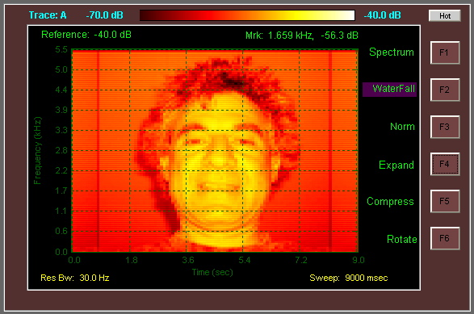
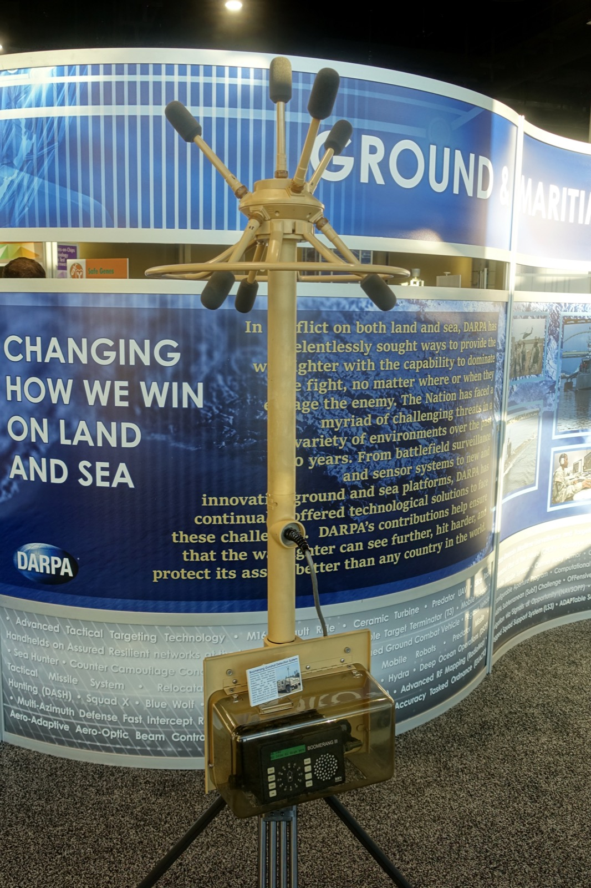

+++
title = "Ethics and False Convictions"
outputs = ["Reveal"]
[reveal_hugo]
theme = "solarized"
+++

# Wrongful Convictions & Forensic Audio

How flawed audio evidence destroys lives, and how to prevent it

{}
* Today we examine one of the most consequential failures in forensic science: wrongful convictions caused by flawed audio evidence.
* We'll look at real cases where people lost decades of their lives, the psychological mechanisms that cause these errors, and concrete methods to prevent them.
* This isn't abstract—these are documented failures that continue to happen.
{}

---

## The Stakes

- Audio evidence appears in **thousands** of criminal cases annually
- Transcripts are treated as "objective" records
- Jurors believe they hear confessions "with their own ears"
- **Result:** Innocent people in prison for decades

{}
* Audio recordings appear deceptively objective compared to eyewitness testimony.
* Courts and juries place enormous weight on what they believe they hear.
* But as we'll see, what people "hear" is heavily constructed by their brains and influenced by external suggestions.
* The consequences are severe: wrongful imprisonment, destroyed families, and the actual perpetrators remaining free.
* **Source:** Fraser, H. (2025). Submission to House of Lords Police Transcription Inquiry (Written Evidence POL0005).
{}

---

## Roadmap

1. Psychology of false perception
2. Case studies of wrongful convictions
3. Voice identification problems
4. Prevention methods and protocols
5. Recommendations for practitioners

{}
* We'll start with the psychology—understanding why these errors occur at a fundamental level.
* Then we'll examine seven documented case studies where audio evidence contributed to wrongful convictions.
* We'll look at the science of voice identification and why it's far less reliable than people assume.
* Finally, we'll cover concrete protocols and methods that can prevent these tragedies.
{}

---

{}

# I. Psychology of False Perception

Why we hear things that aren't there

---

## Top-Down Processing

The brain doesn't just **listen**—it **constructs** perception

- When audio is unclear, the brain fills in gaps
- External suggestions become "heard" speech
- This process is **subconscious** and **involuntary**
- Even experts cannot resist it through willpower

{}
* Human perception relies heavily on "top-down processing"—using prior knowledge and expectations to interpret ambiguous sensory input.
* When the acoustic signal is weak or noisy, the brain doesn't simply report "unclear."
* Instead, it actively constructs a perception based on what it expects to hear.
* This happens automatically and is immune to conscious effort to resist it.
* You cannot simply "try harder" to hear objectively.
* **Source:** Fraser, H. (2021). Forensic Transcription: Legal and scientific perspectives. In *Speaker individuality in phonetics and speech sciences*.
{}

---

## Textual Priming

A transcript doesn't assist perception—it **creates** perception

> Once a listener sees a word on a page while listening to indistinct audio, they often hear that word "with their own ears"—even if the transcript is demonstrably wrong.

{}
* Textual priming is one of the most dangerous phenomena in forensic audio.
* When you read a transcript while listening to unclear audio, your brain uses those words to construct what you hear.
* Research shows that once primed, listeners will insist they heard specific words even when acoustic analysis proves those words were never spoken.
* The transcript becomes the perception.
* **Source:** Fraser, H. & Stevenson, B. (2014). The power and persistence of contextual priming. *International Journal of Evidence and Proof*, 18(3), 205–229.
{}

---

## The "Crisis Call" Study

| Condition | Heard "I shot the prick" |
|-----------|--------------------------|
| No transcript provided | **0%** |
| After seeing transcript | **33%** |
| Refused to change mind after being told transcript was wrong | **Many** |

{}
* This study used an actual crisis call recording admitted in a murder trial with 190 participants.
* Without any transcript, zero participants heard the phrase "I shot the prick."
* After being shown a transcript containing that phrase, one-third of participants heard it exactly.
* Most disturbing: many refused to change their minds even after being told the transcript was fabricated.
* This demonstrates how powerfully transcripts shape perception.
* **Source:** Fraser, H., Stevenson, B., & Marks, T. (2011). Interpretation of a crisis call: Persistence of a primed perception of a disputed utterance. *International Journal of Speech Language and the Law*, 18(2), 261–292.
{}

---

## Contextual Priming

Background knowledge about a case biases what we hear

- Knowing someone has a criminal history
- Believing a confession exists
- Having a theory of guilt

→ Listeners hear **incriminating words** in innocuous sounds

{}
* Context matters as much as transcripts.
* Research shows that when participants are told they're listening to "criminal suspects," they make significantly more incriminating misinterpretations.
* If an investigator believes a suspect is guilty, they will literally hear different words than an unbiased listener.
* This is not dishonesty—it's how human perception works.
* **Source:** Giroux, M. E. (2022). Confirmation Bias for Degraded Forensic Audio Evidence. PhD Thesis, Simon Fraser University.
{}

---

## Confirmation Bias

People interpret ambiguous audio to **support existing hypotheses**

- Evidence against the theory is discounted
- Contradictory acoustic evidence is ignored
- Initial interpretations become entrenched
- "Corroboration inflation" spreads bias to other evidence

{}
* Confirmation bias causes investigators to hear what they expect to hear.
* If you expect a specific suspect to answer a wiretapped phone, you're significantly more likely to misidentify a different voice as that suspect.
* When a jury believes a recording contains a confession, this "confession" colors their interpretation of all other evidence.
* One piece of biased evidence contaminates the entire case.
* **Source:** Giroux, M. E. (2022). Confirmation Bias for Degraded Forensic Audio Evidence. PhD Thesis, Simon Fraser University.
{}

---

## Fluency Misattribution

The ease of processing is mistaken for proof of accuracy

1. Transcript makes unclear words easy to "hear"
2. Brain experiences processing fluency
3. Fluency feels like recognition
4. Listener concludes: "That must be correct"

{}
* Fluency misattribution explains why transcripts feel so convincing.
* When a transcript makes it easy to "make out" words in noisy audio, the brain experiences conceptual fluency.
* This ease of processing creates a subjective sense of certainty.
* Listeners mistake the feeling of "getting it" for evidence that their interpretation is correct.
* Research shows reaction times directly mediate incriminating misinterpretations.
* **Sources:**
  * Giroux, M. E. (2022). Confirmation Bias for Degraded Forensic Audio Evidence. PhD Thesis, Simon Fraser University.
  * Higham, P. A., Neil, G. J., & Bernstein, D. M. (2017). Auditory hindsight bias: Fluency misattribution versus memory reconstruction. *Journal of Experimental Psychology: Human Perception and Performance*, 43, 1143–1159.
{}

---

## The "Ad Hoc Expert" Problem

Courts allow police to provide transcripts because they've listened "many times"

**The assumption:** Repetitive listening confers expertise

**The reality:**
- Repetition **entrains** initial (often wrong) perceptions
- Investigators' case knowledge **primes** their hearing
- Their "ability" to hear more is actually **bias**

{}
* Courts routinely treat police investigators as audio experts based solely on repeated listening.
* But research shows repetitive listening to poor audio does not improve accuracy.
* It does the opposite: it entrains and strengthens initial perceptions, right or wrong.
* The investigator's familiarity with the case primes them to hear words that align with their theory.
* What appears to be expertise is actually contextual bias.
* **Source:** French, P. & Fraser, H. (2018). Why "Ad Hoc Experts" Should Not Provide Transcripts of Indistinct Forensic Audio. *Criminal Law Journal*, 42(5), 298–302.
{}

{}

---

{}

# II. Case Studies

Real lives destroyed by flawed audio evidence

---

## David Eastman (Australia)

  

    
  

  

    <ul>
      <li><strong>Convicted:</strong> 1995 for the 1989 murder of a police commissioner</li>
      <li><strong>Audio evidence:</strong> Thousands of hours of covert recordings from hidden devices in his home—whispered self-talk</li>
      <li><strong>The transcript:</strong> Police claimed he said &quot;I killed Winchester&quot;</li>
    </ul>
  

  

{}
* David Eastman was convicted for the 1989 murder of Australian Federal Police Assistant Commissioner Colin Winchester.
* Police placed hidden listening devices in his flat and recorded thousands of hours of extremely poor-quality audio.
* Much of it was Eastman whispering and talking to himself in his bedroom.
* Investigators produced transcripts claiming the recordings contained a direct confession: "I killed Winchester."
* **Source:** Fraser, H. (2023). The Eastman transcripts: A case study calling Australian linguists to action. *Australian Journal of Linguistics*, 43(4), 314–341.
* Image: Nick Pitsas (CSIRO), “CSIRO ScienceImage 11533 Parliament House Canberra”, CC BY 3.0 (Wikimedia Commons).
{}

---

## David Eastman: What Went Wrong

- Police acted as "ad hoc experts" on their own recordings
- Audio was extremely poor quality, whispered
- A phonetic expert later found the audio was consistent with: **"I kept watching her"**
- Trial judge endorsed police transcripts after "checking them personally"

{}
* Police investigators transcribed their own surveillance recordings with no independent verification.
* The audio was so poor that words were essentially indistinct.
* When a genuine phonetic expert analyzed the recordings, they found the acoustic patterns were actually consistent with "I kept watching her"—not a confession at all.
* But the trial judge endorsed the police transcripts after personally listening, demonstrating how priming affects even judges.
* **Sources:**
  * Fraser, H. (2023). The Eastman transcripts. *Australian Journal of Linguistics*, 43(4), 314–341.
  * Martin, B. (2014). Inquiry into the Conviction of David Harold Eastman. Board of Inquiry Report.
{}

---

## David Eastman: Outcome

- **19 years** in prison
- Conviction quashed in 2014
- Found **not guilty** at 2018 retrial (misleading transcripts excluded)
- Awarded **$7+ million** in compensation

{}
* Eastman spent 19 years in prison for a crime the courts ultimately determined he did not commit.
* His conviction was quashed in 2014 after an inquiry revealed multiple forensic failures.
* At his 2018 retrial, the misleading police transcripts were excluded from evidence.
* He was found not guilty and later awarded more than $7 million in compensation.
* But no amount of money can restore 19 years of life.
* **Source:** Fraser, H. (2023). The Eastman transcripts. *Australian Journal of Linguistics*, 43(4), 314–341.
{}

---

### Man wrongfully jailed for 20 years wins $7 million compensation | ABC News

<iframe width="560" height="315" src="https://www.youtube.com/embed/S_kHL4rPs5M?si=0akfpuVuyW_2gZUM" title="YouTube video player" frameborder="0" allow="accelerometer; autoplay; clipboard-write; encrypted-media; gyroscope; picture-in-picture; web-share" referrerpolicy="strict-origin-when-cross-origin" allowfullscreen></iframe>

{}

* This video from ABC Australia summarizes the Eastman case and the role of flawed audio evidence.

{}

---

## The "Pact" Case (R v. Clark)

  

    
  

  

    <ul>
      <li><strong>Convicted:</strong> Father as &quot;accessory before the fact&quot; for murder committed by his son</li>
      <li><strong>Audio evidence:</strong> Whispered covert recording from a hidden device in the family home</li>
      <li><strong>The transcript:</strong> &quot;At the start we made a pact&quot;</li>
    </ul>
  

  

{}
* In this case, a father was convicted as an accessory to murder allegedly committed by his son.
* The key question was whether the father helped plan the murder beforehand or only helped conceal it afterward.
* Police placed a hidden device in the family home and captured a whispered utterance.
* They transcribed it as "at the start we made a pact"—implying premeditated agreement to kill.
* **Source:** Fraser, H. (2017). How Interpretation of Indistinct Covert Recordings Can Lead to Wrongful Conviction. In R. Levy et al. (eds), *New Directions for Law in Australia*. ANU Press.
* Image: U.S. National Security Agency, “NSA LOUDAUTO”, public domain (Wikimedia Commons).
{}

---

## The "Pact" Case: What Went Wrong

**Phonetic analysis revealed:**
- Rhythmic structure consistent with **"it's fucking payback"**
- The word "pact" was **never spoken**
- Jury, primed by transcript, believed they heard it "with their own ears"

{}
* When phonetic experts analyzed the recording, they found the rhythmic structure was completely inconsistent with "pact."
* The audio actually matched the phrase "it's fucking payback."
* The word "pact" was acoustically impossible given the signal.
* But the jury, primed by the police transcript, was convinced they heard the confession themselves.
* The transcript created the perception.
* **Sources:**
  * Fraser, H. (2017). How Interpretation of Indistinct Covert Recordings Can Lead to Wrongful Conviction. ANU Press.
  * Fraser, H. & Stevenson, B. (2014). The power and persistence of contextual priming. *International Journal of Evidence and Proof*, 18(3), 205–229.
{}

---

## The "Pact" Case: Outcome

- Father sentenced to **30 years**—10 years longer than his son
- Conviction stood despite proven error
- Reason: All legal **procedures** had been followed correctly

{}
* The father received a 30-year sentence—10 years longer than the son who actually committed the murder.
* Even after phonetic analysis proved the transcript was wrong, the conviction stood.
* The court ruled that all legal procedures had been correctly followed during the trial.
* This case demonstrates that procedural correctness is not the same as factual accuracy.
* An innocent man remains in prison for following the rules.
* **Source:** Fraser, H. (2017). How Interpretation of Indistinct Covert Recordings Can Lead to Wrongful Conviction. ANU Press.
{}

---

## Guy Paul Morin (Canada)

  

    
  

  

    <ul>
      <li><strong>Convicted:</strong> 1992 for the 1984 murder of his 9-year-old neighbor</li>
      <li><strong>Audio evidence:</strong> &quot;Earwitness&quot; identification—victim’s mother claimed she heard Morin’s voice crying &quot;Help me, help me, oh God, help me!&quot;</li>
    </ul>
  

  

{}
* Guy Paul Morin was wrongfully convicted for the murder of his young neighbor in Canada.
* The key evidence included earwitness identification by the victim's mother.
* She claimed she heard Morin's voice crying out on the night of her daughter's funeral.
* This voice identification was used to suggest Morin was having a "fit of remorse."
* **Source:** Walker Jr., C. (2025). A Guilty Voice: Is Voice Analysis Junk Science or Reliable Evidence? *Criminal Legal News*.
* Image: Ken Lund, “Ontario Superior Court of Justice and Toronto City Hall, Toronto, Ontario”, CC BY-SA 2.0 (Wikimedia Commons).
{}

---

## Guy Paul Morin: What Went Wrong

- Mother was only a **casual acquaintance** of Morin
- Commission later deemed the identification **"patently unreliable"**
- Voice identification by non-familiars is notoriously inaccurate
- **Exonerated by DNA** in 1995

{}
* The mother was only a casual acquaintance, not someone familiar with Morin's voice.
* Research shows voice identification of unfamiliar speakers has hit rates as low as 9-24%.
* A later commission reviewing the case deemed the voice identification "patently unreliable."
* Morin was ultimately exonerated by DNA testing in 1995.
* He spent years in prison based on unreliable earwitness testimony.
* **Sources:**
  * Walker Jr., C. (2025). A Guilty Voice. *Criminal Legal News*.
  * Sherrin, C. (2015). Earwitness Evidence: The Reliability of Voice Identifications. *Osgoode Hall Law Journal*, 52(3), 819–862.
{}

---

## David Shawn Pope (Texas)

  

    
  

  

    <ul>
      <li><strong>Convicted:</strong> 1986 for aggravated sexual assault</li>
      <li><strong>Audio evidence:</strong> &quot;Voiceprint&quot; spectrogram analysis comparing phone calls from the rapist to Pope’s voice</li>
      <li><strong>The analyst:</strong> A police officer with <strong>two weeks of training</strong></li>
    </ul>
  

  

{}
* David Pope was convicted in 1986 for aggravated sexual assault in Dallas, Texas.
* The prosecution relied on voiceprint analysis—comparing spectrograms of phone calls made by the rapist to samples of Pope's voice.
* The analysis was performed by a police officer who had received only two weeks of training in the technique.
* **Source:** Walker Jr., C. (2025). A Guilty Voice: Is Voice Analysis Junk Science or Reliable Evidence? *Criminal Legal News*.
* Image: Spyrogumas, “Spectrogram”, CC BY-SA 3.0 (Wikimedia Commons).
{}

---

## David Shawn Pope: What Went Wrong

- "Voiceprint" methodology later **discredited** by National Science Foundation
- No scientific basis for spectrogram matching
- **15 years** in prison
- **Exonerated by DNA** in 2001

{}
* The entire methodology of voiceprint matching was later discredited by the National Science Foundation.
* Research determined there was no scientific basis for the claim that spectrograms are unique identifiers like fingerprints.
* Pope spent 15 years in prison based on junk science.
* He was finally exonerated by DNA evidence in 2001.
* **Sources:**
  * Walker Jr., C. (2025). A Guilty Voice. *Criminal Legal News*.
  * Edmond, G., Martire, K., & San Roque, M. (2011). Unsound Law: Issues with ('Expert') Voice Comparison Evidence. *Melbourne University Law Review*, 35, 52–112.
{}

---

## Russell Faria (Missouri)

  

    
  

  

    <ul>
      <li><strong>Convicted:</strong> 2013 for murdering his wife</li>
      <li><strong>Audio evidence:</strong> 911 call &quot;analysis&quot; claiming to identify guilt based on word choice and tone</li>
      <li><strong>The claim:</strong> Faria was too &quot;me-focused&quot; on the call</li>
    </ul>
  

  

{}
* Russell Faria was wrongfully convicted of murdering his wife Betsy in Missouri.
* Prosecutors introduced "911 call analysis"—a junk science technique claiming to identify guilt based on word choice, tone, and emotional indicators.
* They claimed Faria's 911 call showed signs of guilt because he was too "me-focused."
* This was used to override a strong alibi and lack of physical evidence.
* **Source:** Walker Jr., C. (2025). A Guilty Voice: Is Voice Analysis Junk Science or Reliable Evidence? *Criminal Legal News*.
* Image: Coldcaffeine, “911dispatchcenter”, public domain (Wikimedia Commons).
{}

---

## Russell Faria: What Went Wrong

- "911 call analysis" is **junk science** with no empirical validation
- Used to override **strong alibi** and **lack of physical evidence**
- **Acquitted** at 2015 retrial after:
  - Real killer identified
  - Hidden police photos discovered that contradicted prosecution theory

{}
* 911 call analysis has no empirical validation and is not accepted by the scientific community.
* Yet it was used to convict Faria despite his alibi and the absence of physical evidence.
* He was acquitted at a 2015 retrial after the real killer was identified.
* Hidden police photos were discovered that contradicted the original prosecution theory.
* Faria lost years of his life to pseudoscience.
* **Source:** Walker Jr., C. (2025). A Guilty Voice. *Criminal Legal News*.
{}

---

## Michael Williams (Chicago)

  

    
  

  

    <ul>
      <li><strong>Jailed:</strong> One year for murder he didn’t commit</li>
      <li><strong>Audio evidence:</strong> ShotSpotter gunshot detection alert</li>
      <li><strong>The problem:</strong> &quot;Black box&quot; algorithm with minimal human oversight</li>
    </ul>
  

  

{}
* Michael Williams spent a year in jail falsely accused of murder in Chicago.
* The case against him relied heavily on ShotSpotter, an automated gunshot detection system.
* ShotSpotter uses sensors and algorithms to detect and locate gunshots.
* But the system operates as a "black box" with minimal transparency about how decisions are made.
* **Source:** Max, B. (2023). SoundThinking's Black-Box Gunshot Detection Method: Untested and Unvetted Tech Flourishes in the Criminal Justice System. *Stanford Technology Law Review*, 26, 193.
* Image: Daderot, “Boomerang gunshot detection system… (DARPA D60 Symposium)”, CC0 (Wikimedia Commons).
{}

---

## Michael Williams: What Went Wrong

- ShotSpotter frequently mistakes **car backfires** and **fireworks** for gunfire
- System provided **two different locations** over a mile apart
- Human reviewers have **minimal training**
- Charges **dismissed** in 2021 due to insufficient evidence

{}
* Research has shown ShotSpotter frequently mistakes environmental sounds like car backfires and fireworks for gunfire.
* In Williams' case, the system provided two different location estimates that were over a mile apart.
* Human reviewers who validate alerts have minimal training.
* The charges were ultimately dismissed in 2021 due to insufficient evidence.
* But Williams lost a year of his life to unreliable technology.
* **Source:** Max, B. (2023). SoundThinking's Black-Box Gunshot Detection Method. *Stanford Technology Law Review*, 26, 193.
{}

---

## Litigating Shotspotter Evidence

<iframe width="560" height="315" src="https://www.youtube.com/embed/uwGRPw5E1d8?si=jmCLrAgol7TSJ2GK" title="YouTube video player" frameborder="0" allow="accelerometer; autoplay; clipboard-write; encrypted-media; gyroscope; picture-in-picture; web-share" referrerpolicy="strict-origin-when-cross-origin" allowfullscreen></iframe>

{}
This video from the NACDL discusses the challenges of litigating cases involving ShotSpotter evidence.
{}

---

## Chicago police no longer alerted by ShotSpotter gunshot detection technology starting at midnight

<iframe width="560" height="315" src="https://www.youtube.com/embed/WbHXJdW5Syw?si=3uap-0sU3rGe1fUp" title="YouTube video player" frameborder="0" allow="accelerometer; autoplay; clipboard-write; encrypted-media; gyroscope; picture-in-picture; web-share" referrerpolicy="strict-origin-when-cross-origin" allowfullscreen></iframe>

{}
The City of Chicago's contract with ShotSpotter ended Sunday. Police will no longer be alerted by the gunshot detection technology starting Monday.
{}

---

## Other ShotSpotter Commentary 

- [listening in on the neighborhood](https://computer.rip/2024-03-01-listening-in-on-the-neighborhood.html) - Article discussing privacy and reliability concerns with ShotSpotter
- [shotspotter-locations](https://github.com/kevee/shotspotter-locations/tree/main) - GitHub repository mapping ShotSpotter sensor locations
- [Source Localization with ShotSpotter Audio](https://github.com/ShotSpotter/research.source-location-shotspotter-audio/tree/main) - ShotSpotter's research on audio source localization

---

## Stefan Kiszko (UK)

  

    
  

  

    <ul>
      <li><strong>Convicted:</strong> 1976 for the 1975 murder of 11-year-old Lesley Molseed</li>
      <li><strong>Audio evidence:</strong> Coerced confession after three days of interrogation without legal representation</li>
      <li><strong>Key fact:</strong> Kiszko had a mental age of 12</li>
    </ul>
  

  

{}
* Stefan Kiszko was wrongfully convicted of a child's murder in Britain.
* The key evidence was a confession he signed after three days of intensive interrogation.
* Kiszko had no legal representation during the interrogation.
* Crucially, he had a mental age of approximately 12, making him highly vulnerable to coercion.
* **Source:** Thompson, M. (2025). The Stefan Kiszko Case: Britain's Most Devastating Miscarriage of Justice. *Falsely Accused Network*.
* Image: G-13114, “Rochdale town hall”, CC BY-SA 4.0 (Wikimedia Commons).
{}

---

## Stefan Kiszko: What Went Wrong

- Investigators had **tunnel vision**—focused on social awkwardness
- Ignored medical evidence: Kiszko had **hypogonadism**
- This made it **medically impossible** for him to produce the sperm found at the crime scene
- **16 years** in prison; conviction quashed 1992
- Died of heart attack **22 months** after release

{}
* Investigators fixated on Kiszko's social awkwardness and ignored contradictory evidence.
* Medical records showed he suffered from hypogonadism, which made it medically impossible for him to produce the sperm found at the crime scene.
* This exculpatory evidence was ignored in favor of the coerced confession.
* Kiszko served 16 years before his conviction was quashed in 1992.
* He died of a heart attack just 22 months after his release.
* **Source:** Thompson, M. (2025). The Stefan Kiszko Case. *Falsely Accused Network*.
{}

---

## Common Patterns

| Factor | Cases Affected |
|--------|----------------|
| Ad hoc police "experts" | Eastman, Pact |
| Junk science methods | Pope, Faria |
| Unreliable voice ID | Morin |
| Coerced confessions | Kiszko |
| Black box technology | Williams |
| Textual priming of juries | Eastman, Pact |

{}
* Looking across these cases, clear patterns emerge.
* Police acting as experts on their own recordings appears repeatedly.
* Junk science methods that lack empirical validation continue to be admitted in court.
* Voice identification by unfamiliar witnesses is treated as reliable when it demonstrably is not.
* Coerced confessions from vulnerable individuals are not properly scrutinized.
* Black box technologies are trusted without transparency.
* In every case, the conviction felt certain to those involved.
* **Sources:** Fraser (2017, 2023); Walker (2025); Max (2023); Thompson (2025).
{}

{}

---

{}

# III. Voice Identification Problems

The science says it's far less reliable than we assume

---

## Voice vs. Face Recognition

Under similar conditions, voice recognition is **consistently less accurate** than face recognition

- Voice is a weaker memory trace
- The brain prioritizes visual information
- Confidence does not correlate with accuracy

{}
* Research consistently shows voice recognition trails face recognition in accuracy.
* When experimental conditions are equalized, people perform significantly worse identifying voices than faces.
* The brain appears to prioritize visual information for identity.
* Critically, a witness's confidence in their voice identification does not predict whether they're correct.
* **Source:** Sherrin, C. (2015). Earwitness Evidence: The Reliability of Voice Identifications. *Osgoode Hall Law Journal*, 52(3), 819–862.
{}

---

## Familiar vs. Unfamiliar Voices

| Speaker Type | Accuracy |
|--------------|----------|
| Family/close friends | ~90% (but 10% error rate) |
| Acquaintances | ~65% |
| Strangers (hit rate) | 9%–24% |
| Target-absent lineup (false alarm) | 50%–100% |

{}
* Even identifying familiar voices is imperfect—studies show about a 10% error rate for family members.
* For acquaintances, accuracy drops to around 65%.
* For unfamiliar voices—strangers—hit rates can be as low as 9% to 24%.
* Most alarming: in lineups where the actual speaker is not present, false identification rates range from 50% to 100%.
* Witnesses feel compelled to choose even when the correct answer is "none of these."
* **Source:** Sherrin, C. (2015). Earwitness Evidence. *Osgoode Hall Law Journal*, 52(3), 819–862.
{}

---

## The Face Overshadowing Effect

Seeing a face **impairs** voice recognition

- Brain prioritizes visual over auditory identity cues
- Effect persists even when witnesses are told to focus on voice
- The bias is **not under conscious control**

{}
* The face overshadowing effect is a cognitive phenomenon where seeing a perpetrator's face significantly impairs later voice recognition.
* The brain appears to prioritize visual information over auditory data for identity.
* Even when witnesses are explicitly instructed to pay attention to the voice, the effect persists.
* This suggests the bias operates below conscious awareness and cannot be overcome by effort.
* **Source:** Cook, S. & Wilding, J. (2001). Earwitness Testimony: Effects of Exposure and Attention on the Face Overshadowing Effect. *British Journal of Psychology*, 92.
{}

---

## Cross-Linguistic Challenges

Unfamiliar accents and languages dramatically reduce accuracy

- **"Other-accent" effect:** ~20% accuracy drop for different accents
- **Foreign languages:** Accuracy falls to 45%–60%
- These rates are **insufficient for forensic certainty**

{}
* Voice identification becomes substantially harder when the language or accent is unfamiliar.
* The "other-accent effect" shows about a 20% drop in accuracy for voices with different accents.
* For cross-language identification, accuracy rates fall to 45-60%.
* These accuracy levels are considered insufficient for forensic certainty.
* Yet courts continue to admit such identifications.
* **Source:** Sherrin, C. (2015). Earwitness Evidence. *Osgoode Hall Law Journal*, 52(3), 819–862.
{}

---

## Implications for Courts

- Earwitness testimony should be treated with **extreme caution**
- Unfamiliar voice identification is barely better than **chance**
- Confidence is **not** an indicator of accuracy
- Juries must be warned about these limitations

{}
* The research has clear implications for how courts should treat earwitness evidence.
* Testimony about unfamiliar voices should be treated with extreme caution—it's barely better than guessing.
* A witness's confidence tells us nothing about whether they're correct.
* Juries need explicit warnings about these scientific findings.
* Without such warnings, they will overweight unreliable identifications.
* **Sources:**
  * Sherrin, C. (2015). Earwitness Evidence. *Osgoode Hall Law Journal*, 52(3), 819–862.
  * Edmond, G., Martire, K., & San Roque, M. (2011). Unsound Law. *Melbourne University Law Review*, 35, 52–112.
{}

{}

---

{}

# IV. Prevention Methods

Protocols and practices that can prevent wrongful convictions

---

## Core Principle

Treat forensic audio as **scientific discipline**, not "common knowledge"

- Formal methods, not intuition
- Independent analysis, not investigator transcripts
- Documented procedures, not ad hoc judgments
- Acknowledged uncertainty, not false confidence

{}
* The fundamental shift required is treating forensic audio as a scientific discipline.
* It should not be treated as common sense that anyone can apply.
* This means using formal validated methods, not intuition.
* Analysis must be independent from the investigation, not produced by investigators.
* Procedures must be documented and uncertainty must be acknowledged.
* **Source:** French, P. & Fraser, H. (2018). Why "Ad Hoc Experts" Should Not Provide Transcripts. *Criminal Law Journal*, 42(5), 298–302.
{}

---

## Linear Sequential Unmasking (LSU)

Analyze evidence **before** learning case context

**Protocol:**
1. Examine raw audio in **complete isolation** from case information
2. Document initial findings
3. Only then reveal context in **controlled stages**
4. Separate each stage of analysis

{}
* Linear Sequential Unmasking is a protocol designed to prevent contextual bias.
* The analyst examines raw audio evidence in total isolation from reference materials or case context.
* Initial findings are documented before any potentially contaminating information is revealed.
* Context is then revealed in controlled, iterative stages.
* This prevents case theory from shaping what the analyst "hears."
* **Sources:**
  * Dror, I. E., et al. (2015). Context Management Toolbox: A Linear Sequential Unmasking (LSU) Approach. *Journal of Forensic Sciences*, 60(4).
  * Krane, D. E., et al. (2008). Sequential unmasking: A means of minimizing observer effects. *Journal of Forensic Sciences*, 53(4).
{}

---

## LSU in Practice

| Stage | Action |
|-------|--------|
| 1 | Receive audio only—no case information |
| 2 | Document what you hear independently |
| 3 | Receive limited context (e.g., topic area) |
| 4 | Revise analysis if warranted |
| 5 | Receive full case context |
| 6 | Final analysis with all biases documented |

{}
* In practice, LSU works as a staged process.
* First, the analyst receives only the audio with no case information.
* They document what they hear independently.
* Then limited context is provided, and the analysis is revised if needed.
* Full case context comes last.
* At each stage, any changes and potential biases are documented.
* **Source:** Dror, I. E., et al. (2015). Context Management Toolbox: A Linear Sequential Unmasking (LSU) Approach. *Journal of Forensic Sciences*, 60(4).
{}

---

## Separation of Roles

Forensic analysis must be **independent** from investigation

- Analysts should not be employed by police
- Analysts should not know the "desired" outcome
- Accredited practitioners only
- Double-blind procedures for voice lineups

{}
* Forensic science should be conducted by accredited practitioners strictly separated from police investigators.
* Analysts should never know what outcome would help the prosecution.
* Voice identification lineups should be double-blind: neither the witness nor the administrator should know which recording belongs to the suspect.
* This prevents subtle cues from contaminating results.
* **Source:** French, P. & Fraser, H. (2018). Why "Ad Hoc Experts" Should Not Provide Transcripts. *Criminal Law Journal*, 42(5), 298–302.
{}

---

## Transcription Protocols

End the practice of police-produced transcripts

**Requirements:**
- Independent transcribers employed in public service
- Isolation from specific investigation
- **"[Inaudible]"** for unclear words—no guessing
- Acoustic-phonetic verification of auditory findings

{}
* Courts should end the practice of allowing police investigators to provide transcripts.
* Transcripts should be produced by teams employed in public service who are entirely independent from the investigation.
* Words that are unclear should be marked as "inaudible" rather than guessed.
* Guessing creates "phantom speech" for the jury to follow.
* All auditory findings should be verified with acoustic analysis.
* **Source:** Fraser, H. (2025). Submission to House of Lords Police Transcription Inquiry (Written Evidence POL0005).
{}

---

## Expert Requirements

**Scientific recognition:** Transcription is linguistic science, not legal precedent

**Epistemic modesty:** Acknowledge limits and potential for error

**Core competencies:**
- Track auditory acuity regularly
- Deep knowledge of EMI mitigation
- Signal path design expertise
- No statements of "absolute certainty"

{}
* Forensic transcription must be recognized as a branch of linguistic science governed by evidence-based methods.
* Experts must demonstrate epistemic modesty—acknowledging the limits of their knowledge and potential for error.
* Statements of "absolute certainty" should never be made.
* Practitioners should regularly track their own auditory acuity.
* They need deep technical knowledge of electromagnetic interference and signal design.
* **Source:** SWGDE (2025). Core Competencies for Forensic Audio (Version 3.3).
{}

---

## Jury Instructions

Current instructions often fail—timing and language matter

**Effective practices:**
- Present instructions **before** evidence is played
- Use simple, explicit language
- State clearly: **"Transcripts are not evidence"**
- Warn that confidence ≠ accuracy
- Note unfamiliar accent/language unreliability

{}
* Research shows jury instructions are more effective when presented before the evidence rather than after.
* Instructions should use simple language and explicitly state that transcripts are not evidence—they are merely aids that jurors are free to reject.
* Juries must be warned that a witness's confidence is a poor indicator of accuracy.
* They should be told that identifying speakers with unfamiliar accents or languages is notoriously unreliable.
* **Source:** Fraser, H. (2021). Forensic Transcription: Legal and scientific perspectives.
{}

---

## Technical Standards

**Audio format:** Uncompressed PCM (WAV), 16-bit minimum, ≥16 kHz sampling

**Hash verification:** MD5 or SHA to confirm data integrity

**Chain of custody:** Document every transfer and access

**Enhancement caution:** "Clearer" audio is not necessarily more intelligible—can boost false transcript credibility

{}
* Audio should be recorded and maintained as uncompressed PCM data with at least 16-bit samples and minimum 16 kHz sampling.
* Cryptographic hash functions should verify that no data has changed during transfer or storage.
* Chain of custody must be documented for every transfer and access.
* Courts should require objective evidence that enhancement actually improves intelligibility.
* "Clearer" sounding audio can paradoxically boost the credibility of an inaccurate transcript.
* **Sources:**
  * SWGDE (2022). Best Practices for Forensic Audio (Version 2.5).
  * SWGDE (2018). Best Practices for Digital Audio Authentication (Version 1.3).
{}

---

## ENF Analysis

**Electric Network Frequency:** The power grid "hum" embedded in recordings

**Uses:**
- Verify date and time of recording
- Detect butt-splices and edits
- Identify broad geographic location (different grids have different patterns)

{}
* ENF analysis examines the power line hum embedded in recordings.
* Electrical grids operate at nominal frequencies (60 Hz US, 50 Hz Europe) that fluctuate slightly over time.
* These fluctuations are identical across an entire grid at any moment.
* By matching the hum against a reference database, analysts can determine when and where a recording was made.
* Discontinuities in the ENF can reveal edits that are otherwise invisible.
* **Sources:**
  * Jenkins, C. W. (2011). An Investigative Approach to Configuring Forensic Electric Network Frequency Databases. MS Thesis, University of Colorado Denver.
  * Grigoras, C. (2005). Digital Audio Recording Analysis: The Electric Network Frequency (ENF) Criterion. *International Journal of Speech, Language, and the Law*, 12(1).
{}

---

## ENF Limitations

- Recording must have been near power grid or electromagnetic field
- Difficult with low signal-to-noise ratio
- Heavily compressed audio may not work
- Requires access to specialized reference databases
- **Not a silver bullet**—one tool among many

{}
* ENF analysis has important limitations.
* The recording must have been made while the device was plugged in or near an electromagnetic field.
* Extraction is difficult or impossible with low signal-to-noise ratios.
* Heavily compressed audio may not retain the signal.
* Analysis requires access to specialized databases that were active on the specific grid at the time.
* ENF is a valuable tool but not a complete solution.
* **Source:** Jenkins, C. W. (2011). An Investigative Approach to Configuring Forensic ENF Databases. MS Thesis, University of Colorado Denver.
{}

{}

---

{}

# V. Recommendations

What practitioners, courts, and experts should do

---

## For Forensic Practitioners

1. **Use LSU** for every analysis—context last, not first
2. **Document everything**—settings, tools, versions, steps
3. **Mark unclear segments** as inaudible—never guess
4. **Verify auditory findings** with acoustic analysis
5. **Acknowledge uncertainty** in all reports
6. **Track your own accuracy** over time

{}
* Every forensic practitioner should use Linear Sequential Unmasking.
* Documentation must be complete enough for another analyst to replicate the work.
* When words are unclear, mark them as inaudible—guessing creates phantom evidence.
* Support listening-based findings with acoustic measurements.
* Every report should acknowledge uncertainty and potential for error.
* Track your own accuracy over time to understand your limitations.
* **Sources:** Dror et al. (2015); SWGDE (2022, 2025).
{}

---

## For Courts and Attorneys

1. **Exclude** police-produced transcripts as unreliable
2. **Require** independent forensic analysis
3. **Demand** documentation of methods and uncertainty
4. **Instruct juries** before playing audio, not after
5. **Warn juries** about transcript priming effects
6. **Scrutinize** "novel" audio analysis methods

{}
* Courts should exclude transcripts produced by police investigators.
* Independent forensic analysis should be required for contested audio.
* Full documentation of methods and uncertainty should be demanded.
* Jury instructions should come before the audio is played.
* Juries need explicit warnings about how transcripts shape perception.
* Novel analysis methods like 911 call analysis should be heavily scrutinized.
* **Sources:** French & Fraser (2018); Fraser (2017, 2021, 2025).
{}

---

## For Expert Witnesses

1. **Never claim** certainty you don't have
2. **Explain limitations** clearly to juries
3. **Resist** pressure to strengthen conclusions
4. **Distinguish** observations from interpretations
5. **Be prepared** to say "I don't know"
6. **Prioritize truth** over advocacy

{}
* Expert witnesses must never claim more certainty than the evidence supports.
* Limitations should be explained clearly in terms juries can understand.
* Resist any pressure from attorneys to strengthen conclusions beyond what the evidence shows.
* Keep observations clearly separated from interpretations.
* Be prepared to say "I don't know" or "the evidence is inconclusive."
* Your duty is to truth, not to the side that retained you.
* **Source:** SWGDE (2025). Core Competencies for Forensic Audio (Version 3.3).
{}

---

## Red Flags in Audio Evidence

Be suspicious when you see:

- Transcripts produced by investigators
- Claims of "absolute certainty"
- Novel methods without peer review
- Lack of documented procedures
- No acknowledgment of alternative interpretations
- Confidence without acoustic verification

{}
* These red flags should trigger heightened scrutiny of audio evidence.
* Investigator-produced transcripts are inherently biased.
* Claims of absolute certainty are scientifically inappropriate.
* Novel methods without peer review may be junk science.
* Lack of documentation suggests unreliable procedures.
* Failure to acknowledge alternative interpretations reveals confirmation bias.
* Confidence without acoustic verification is just opinion.
* **Sources:** French & Fraser (2018); Edmond et al. (2011).
{}

{}

---

## Key Takeaways

1. **Perception is constructed**—transcripts create what we "hear"
2. **Repetitive listening entrains bias**, not expertise
3. **Voice identification** is far less reliable than assumed
4. **LSU and independence** are essential safeguards
5. **Innocent people** are in prison because of these failures
6. **You can help prevent** the next wrongful conviction

{}
* Perception is not passive recording—the brain constructs what we hear based on expectations and suggestions.
* Listening to a recording repeatedly doesn't make you more accurate; it makes you more confident in your first impression.
* Voice identification, especially of unfamiliar voices, is barely better than chance.
* Linear Sequential Unmasking and independence from the investigation are essential safeguards.
* Real people have lost decades of their lives because of these failures.
* As practitioners in this field, you have the power and responsibility to prevent future wrongful convictions.
{}

---

## Discussion Questions

1. Which case most clearly shows **bias shaping perception**?
2. How would **LSU** have changed the outcome in the Eastman case?
3. What is the most **dangerous assumption** courts make about audio evidence?
4. How can practitioners **resist pressure** to provide certain conclusions?
5. What **additional safeguards** would you propose?

{}
* Let's discuss these questions.
* First: which case most clearly demonstrates bias shaping what people heard?
* Second: walk through how LSU would have changed the Eastman investigation.
* Third: what assumption do courts make that causes the most harm?
* Fourth: how can individual practitioners resist institutional pressure?
* Finally: what safeguards beyond what we discussed would you add?
* The goal is to internalize these lessons so deeply that you apply them automatically.
{}

---

## References

**Case Studies & Legal Analysis:**
- Fraser, H. (2023). The Eastman transcripts. *Australian Journal of Linguistics*, 43(4), 314–341.
- Fraser, H. (2017). How Interpretation of Indistinct Covert Recordings Can Lead to Wrongful Conviction. ANU Press.
- Walker Jr., C. (2025). A Guilty Voice. *Criminal Legal News*.
- Max, B. (2023). SoundThinking's Black-Box Gunshot Detection. *Stanford Technology Law Review*, 26, 193.
- Thompson, M. (2025). The Stefan Kiszko Case. *Falsely Accused Network*.

{}
* These case study sources provide detailed documentation of the wrongful convictions discussed.
* Fraser's work on the Eastman and Pact cases is foundational for understanding transcription problems in Australian courts.
* Walker's Criminal Legal News article covers the Pope, Morin, and Faria cases comprehensively.
* Max's Stanford Technology Law Review article is the definitive analysis of ShotSpotter's problems.
{}

---

## References (continued)

**Psychology & Perception Research:**
- Fraser, H., Stevenson, B., & Marks, T. (2011). Interpretation of a crisis call. *International Journal of Speech Language and the Law*, 18(2), 261–292.
- Fraser, H. & Stevenson, B. (2014). The power and persistence of contextual priming. *International Journal of Evidence and Proof*, 18(3), 205–229.
- Giroux, M. E. (2022). Confirmation Bias for Degraded Forensic Audio Evidence. PhD Thesis, Simon Fraser University.
- Higham, P. A., et al. (2017). Auditory hindsight bias. *Journal of Experimental Psychology*, 43, 1143–1159.

{}
* The crisis call study (Fraser et al., 2011) is the landmark research showing 0% to 33% hearing primed words.
* Fraser & Stevenson (2014) established the persistence of priming effects.
* Giroux's PhD thesis provides the most comprehensive recent analysis of confirmation bias in forensic audio.
* Higham et al. established the fluency misattribution mechanism.
{}

---

## References (continued)

**Voice Identification & Technical Standards:**
- Sherrin, C. (2015). Earwitness Evidence. *Osgoode Hall Law Journal*, 52(3), 819–862.
- Edmond, G., Martire, K., & San Roque, M. (2011). Unsound Law. *Melbourne University Law Review*, 35, 52–112.
- Cook, S. & Wilding, J. (2001). Face Overshadowing Effect. *British Journal of Psychology*, 92.
- French, P. & Fraser, H. (2018). Why "Ad Hoc Experts" Should Not Provide Transcripts. *Criminal Law Journal*, 42(5), 298–302.
- Dror, I. E., et al. (2015). Linear Sequential Unmasking. *Journal of Forensic Sciences*, 60(4).
- Jenkins, C. W. (2011). Forensic ENF Databases. MS Thesis, University of Colorado Denver.
- SWGDE (2018–2025). Best Practices for Forensic Audio, Audio Authentication, Core Competencies.

{}
* Sherrin (2015) is the comprehensive review of earwitness reliability research.
* Edmond et al. (2011) critiques voice comparison evidence from a legal perspective.
* Dror et al. (2015) introduced the LSU protocol for bias mitigation.
* The SWGDE documents represent current professional standards for forensic audio practice.
* These references provide the scientific foundation for all the prevention methods discussed.
{}
