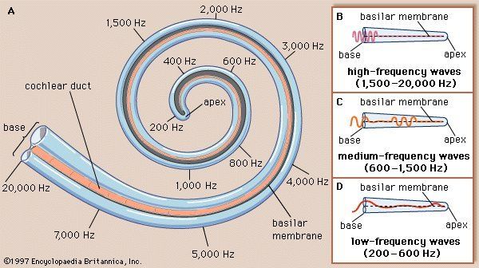
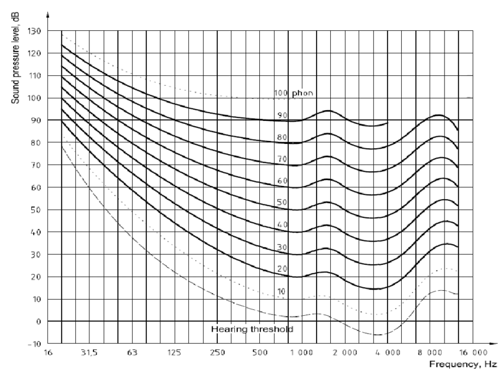

+++
title = "Psychoacoustics and Digital Audio"
outputs = ["Reveal"]
[reveal_hugo]
theme = "solarized"
+++

# Psychoacoustics & Digital Audio

How human perception and digital systems shape forensic audio analysis

{}
- Today we examine the critical intersection between human auditory perception and digital audio systems
- Both directly affect forensic audio analysis, evidence interpretation, and expert testimony
- Building on foundational work in audio forensics: authentication, tampering detection, and legal context
- Diving deeper into:
  - How the ear and brain process sound
  - How digital codecs exploit perceptual limits
  - Where forensic analysts must exercise caution
- This isn't abstract psychoacoustics—this is practical understanding of:
  - When perceptual audibility matters
  - When signal evidence dominates
  - Where misinterpretation can lead to forensic error
{}

---

## Roadmap

1. **Psychoacoustics for Forensic Listening**
   - Masking, critical bands, loudness, temporal limits, spatial cues
2. **Digital Audio Through a Perceptual Lens**
   - Sampling, codecs, artifacts, perceptual vs. signal evidence
3. **Applied Forensic Context**
   - When perception matters, courtroom implications, best practices

{}
Three major sections:
- **First: Psychoacoustics** (science of how humans perceive sound)
  - Auditory masking
  - Critical bands and perceptual frequency scales
  - Equal-loudness contours
  - Temporal resolution
  - Spatial hearing
- **Second: Digital audio systems through a perceptual lens**
  - Sampling theory
  - Lossy codecs
  - Codec artifacts
  - Dither
  - Time-frequency tradeoffs
- **Third: Applied forensic context**
  - When does perceptual audibility matter vs. when does signal evidence dominate?
  - What are the courtroom implications?
  - What protocols prevent misinterpretation?
{}

---

{}

# I. Psychoacoustics for Forensic Listening

Understanding the human auditory system's capabilities and limitations

---

## Why Psychoacoustics Matters in Forensics

- **Earwitness reliability**: Can a witness have physically heard what they claim?
- **Enhancement assessment**: Does "clearer" audio actually improve intelligibility?
- **Codec artifact identification**: Is that noise original or introduced by compression?
- **Expert testimony**: How do you explain perceptual limits to a jury?

{}
- Psychoacoustics is not just academic theory—it's foundational to forensic audio work
- **Evaluating earwitness testimony**:
  - Must determine whether a person could have physically heard a specific sound
  - Consider masking, distance, and noise conditions
- **Enhancing audio**:
  - Does processing actually improve intelligibility?
  - Or does it just make it sound "nicer" without helping comprehension?
- **Analyzing lossy-compressed evidence** (MP3, AAC):
  - Must distinguish between original acoustic information and codec artifacts
  - Artifacts introduced by psychoacoustic coding
- **Testifying in court**:
  - Must communicate perceptual limitations clearly
  - Audience: judges and juries who lack technical background
- Every one of these tasks requires deep understanding of how the human auditory system actually works

**Sources**: Forensic audio analysis framework (SWGDE Best Practices for Forensic Audio); psychoacoustic foundations for codec analysis (Brandenburg, 1999).
{}

---

## Auditory Masking: Overview

**Definition**: One sound (masker) raises the threshold of hearing for another sound (probe/maskee), potentially making it inaudible

**Three types critical for forensics:**
1. Simultaneous (spectral) masking
2. Temporal masking (pre- and post-masking)
3. Informational masking

{}
- **Auditory masking**: psychoacoustic phenomenon where one sound raises the threshold of hearing for another sound, potentially rendering it completely inaudible
- Not about volume alone—about how the cochlea and brain process overlapping acoustic information
- **Understanding masking is absolutely critical for forensic work**:
  - Determines whether "earwitnesses" could physically perceive a sound
  - Foundation of how lossy codecs (MP3, AAC) discard data
- **Three types to understand**:
  - Simultaneous masking (frequency-domain)
  - Temporal masking (time-domain)
  - Informational masking (cognitive-level interference)
- Each has distinct mechanisms and forensic implications

**Sources**: Auditory masking overview (Fraser & Stevenson, 2014); forensic masking analysis (Giroux, 2022).
{}

---

## Simultaneous (Spectral) Masking

  

    
    
Simultaneous masking curves illustrating upward spread of masking

  

  

    <ul>
      <li><strong>Mechanism</strong>: Cochlear overlap—strong sound creates peak on basilar membrane that "drowns out" weaker nearby signals</li>
      <li><strong>Upward spread of masking</strong>: Low frequencies mask high frequencies much more effectively than the reverse</li>
      <li><strong>Critical bands</strong>: Masking strongest within auditory filter bandwidths</li>
      <li><strong>Thresholds</strong>: Tonal masker needs ~14.5 dB SMR to hide noise; noise masker needs only ~5 dB to hide tone</li>
    </ul>
  

  

{}
- **Simultaneous/spectral masking**: occurs when masker and probe are presented at exact same time
- **Physiological mechanism**:
  - Cochlea acts as a mechanical Fourier transformer
  - Strong sound creates peak of vibration at specific point on basilar membrane
  - Weaker sound exciting nearly identical location is "drowned out" before it can be independently coded on auditory nerve
- **Most important characteristic: upward spread of masking**
  - Low-frequency sounds highly effective at masking high-frequency sounds
  - High-frequency sounds poor at masking low frequencies
  - This asymmetry is crucial for forensic interpretation
- Masking strongest within critical bands (bandwidths of auditory filters)
- **Quantitative thresholds**:
  - Tonal masker: requires ~14.5 dB SMR (Signal-to-Masker Ratio) to hide noise
  - Noise masker: can hide tone with only ~5 dB SMR
  - Thresholds exploited by lossy codecs
  - Must be considered when evaluating whether witness could have heard specific sound in noisy environment

**Image source suggestion**: [Auditory masking diagram from ResearchGate](https://www.researchgate.net/figure/Frequency-and-temporal-masking-effects_fig1_3333873) or [Wikipedia Auditory Masking](https://en.wikipedia.org/wiki/Auditory_masking).

**Sources**: Simultaneous masking physiology (cochlear mechanics); SMR thresholds for tonal and noise maskers; critical band interaction (psychoacoustic models for perceptual coding).
{}

---

## Temporal Masking

**Pre-masking (backward masking)**:
- Sound masked even if it occurs *before* the masker
- Brain processes louder signal faster, "catches up" to weaker signal
- Time window: **5–20 ms**

**Post-masking (forward masking)**:
- Sound masked for duration *after* masker stops
- Caused by basilar membrane "ringing" and neural recovery time
- Time window: **100–200 ms** (up to 500 ms for some effects)

{}
- **Temporal masking**: A sound is obscured by a stimulus that immediately precedes or follows it (not simultaneous; separated in time).
- **Pre-masking (backward masking)**:
  - Counterintuitive: a sound can be masked even if it occurs *before* the masker begins.
  - Why: the brain processes more energetic/louder signals faster, so the loud masker "catches up" and interferes with processing of the earlier weaker signal.
  - Time window: ~**5–20 ms**.
- **Post-masking (forward masking)**:
  - A sound can remain masked for a duration *after* the masker stops.
  - Why: basilar membrane "ringing" (continued oscillation) + auditory neuron recovery/adaptation time.
  - Typical duration: ~**100–200 ms** (some effects up to **300–500 ms**).
- **Forensic audio implications**:
  - **Gunshot analysis**: a muzzle blast (**1–3 ms**) can be temporally masked by its reverberant tail (can last **>700 ms** in reflective environments).
  - **Lossy codecs**: quantization noise from a sharp transient can spread backward within an analysis window, producing **pre-echo** (noise before the actual sound); if it exceeds the **~20 ms** pre-masking window, it becomes an audible artifact.

**Sources**: Pre-masking and post-masking mechanisms; time windows (5–20 ms and 100–200 ms); forensic implications for gunshot analysis and codec pre-echo.
{}

---

## Informational Masking

**Not energetic overlap—higher-level perceptual interference**

- Occurs in central nervous system, not cochlea
- Caused by:
  - Similarity between target and masker
  - Attention limitations
  - Auditory Scene Analysis (ASA) failures
- Example: "Cocktail party effect"—brain can't separate voices even when physically distinguishable

{}
- **Informational masking**: higher-level perceptual interference (not energetic overlap in the cochlea).
- **Where it happens**: central nervous system; interactions between separate neural inputs.
- **Key idea**: even when signals are physically distinct on the basilar membrane (not "energetically" masked), the brain may still fail to process the target due to:
  - similarity between target and masker
  - attention limitations
  - Auditory Scene Analysis (ASA) limits/failures
- **Cocktail party effect (related)**:
  - in a room full of conversations, the brain can use binaural separation (Binaural Masking Level Difference) to hear a voice that would be masked if heard monaurally
  - two ears can recover a voice that would be masked with one ear
- **Forensic relevance**:
  - earwitness evaluation: hearing loss may change forward-masking recovery rates, affecting ability to hear speech in a noise “gap”
  - testimony may be physically audible yet effectively “masked” (treated as irrelevant) if perceived as biased or if it fails admissibility standards

**Sources**: Informational masking mechanisms; Auditory Scene Analysis limitations; cocktail party effect and Binaural Masking Level Difference; forensic implications for earwitness reliability.
{}

---

## Forensic Masking: Key Questions

When analyzing audio evidence, ask:

1. Could the witness have heard this given the noise floor?
2. Is "inaudible" speech actually below the masking threshold, or just quiet?
3. Has lossy compression masked subtle background evidence?
4. Would enhancement shift the masking relationship and make inaudible sounds audible?

{}
- When working with audio evidence, keep masking in mind:
  - **Earwitness plausibility**: could the witness have heard the sound given the noise floor and simultaneous sounds? Use masking thresholds to assess physical plausibility.
  - **“Inaudible” vs. quiet**: is speech truly below the masking threshold, or just quiet and potentially audible with proper playback level? These are not the same.
  - **Lossy compression** (MP3/AAC): did masking allow the codec to discard subtle background evidence (distant voices, environmental sounds)?
  - **Enhancement effects**: does processing shift masking relationships and make previously masked sounds audible? If so, document it clearly because it changes what the evidence “says.”
- Masking underlies perceptual audio coding and is central to earwitness evaluation, enhancement assessment, and codec artifact identification.

**Sources**: Forensic audio analysis protocols; masking threshold calculations; earwitness reliability and masking (Giroux, 2022); lossy codec exploitation of masking (Brandenburg, 1999).
{}

---

## Critical Bands and Auditory Filters

  

    
  

  

    <ul>
      <li><strong>Physiological basis</strong>: Basilar membrane is narrow/stiff at base (high freq), wide/flexible at apex (low freq)</li>
      <li><strong>Tonotopic organization</strong>: Spatial frequency mapping—different locations code different frequencies</li>
      <li><strong>Critical bands</strong>: Overlapping bandpass filters; within a band, ear integrates energy as single unit</li>
      <li><strong>Bandwidth changes</strong>: ~100 Hz constant below 500 Hz; above 500 Hz, ~20% of center frequency</li>
    </ul>
  

  

{}
- The auditory system does not process sound as a linear frequency range; it uses **critical bands** (overlapping bandpass filters created by cochlear mechanics).
- **Basilar membrane mechanics**:
  - narrow/stiff at the base near the oval window → responds to high frequencies
  - wide/flexible toward the apex → responds to low frequencies
- **Tonotopic organization**:
  - high frequencies excite the stiff base
  - low frequencies travel further and excite the flexible apex
  - the brain infers frequency from the location of maximum displacement along the membrane
- **What critical bands do**:
  - define the bandwidth within which components interact perceptually
  - within a band, the ear integrates energy as a single unit → closely spaced tones are harder to separate
- **Auditory filter bandwidth varies with frequency**:
  - below **500 Hz**: ~**100 Hz** wide
  - above **500 Hz**: bandwidth increases; often approximated as ~**20%** of center frequency
- Despite bandwidth changes in Hz, each critical band spans ~**1.3 mm** on the basilar membrane and stimulates ~**1300 neurons**.
- Forensics: critical bands matter for **spectral interpretation** and for how **lossy codecs** allocate bits across the spectrum.

**Image source suggestion**: [Cochlea tonotopic mapping from ResearchGate](https://www.researchgate.net/figure/Tonotopic-maps-of-the-basilar-membrane-and-cochlear-nucleus_fig3_257775085) or [Wikipedia Tonotopy](https://en.wikipedia.org/wiki/Tonotopy).

**Sources**: Basilar membrane physiology; tonotopic organization; critical band definition and bandwidth characteristics (~100 Hz below 500 Hz, ~20% above 500 Hz); 1.3 mm physical distance per critical band.
{}

---

## Perceptual Frequency Scales

| Scale | Basis | Primary Forensic Use |
|-------|-------|---------------------|
| **Bark Scale** | 24 critical bands; 1 Bark = 1 critical band | Audio compression (MP3 standard); loudness modeling |
| **Mel Scale** | Pitch perception; 1000 mels = 1000 Hz at 40 dB SPL | Speech recognition; speaker identification (MFCCs) |
| **ERB Scale** | Equivalent Rectangular Bandwidth; smoother auditory filter refinement | Noise reduction algorithms; high-resolution psychoacoustic research |

{}
- All three scales map frequency **non-linearly** to better match human hearing, but they serve different analysis goals.
- **Bark scale**:
  - based on the first **24 critical bands**
  - **1 Bark = 1 critical band**
  - used for **audio compression** (e.g., MP3) and **loudness modeling**
- **Mel scale**:
  - based on **pitch perception**
  - defined so **1000 mels** is the pitch of a **1000 Hz** tone at **40 dB SPL**
  - used for **speech recognition** and **speaker identification** (e.g., **MFCCs**)
- **ERB scale**:
  - based on **Equivalent Rectangular Bandwidth**
  - smoother refinement for auditory filters
  - used in **noise reduction** and **high-resolution psychoacoustic research**
- **Forensic significance**:
  - critical for **spectral interpretation**
  - Bark/Mel-scaled spectrograms approximate what the **ear emphasizes** (e.g., speech ranges) and compress less-informative regions
  - Mel is effective for **phonetic identity** and **pitch contours**
  - some research suggests Bark may better identify speakers in certain dialects because its center frequencies align more closely with **F1** (first formant), reflecting language structure and speaking style
  - helps assess whether a sound would be **perceptually audible** or **hidden by masking**

**Image source suggestion**: [Bark scale diagram from ResearchGate](https://www.researchgate.net/figure/18-Critical-bandwidth-Bark-scale-and-equivalent-rectangular-bandwidth-ERB-as-a_fig12_266136545) or [Stanford CCRMA Bark scale](https://ccrma.stanford.edu/courses/120-fall-2003/lecture-5.html).

**Sources**: Bark scale definition (24 critical bands, Zwicker); Mel scale definition (pitch perception); ERB scale (Moore & Glasberg); forensic applications for spectral interpretation and speaker identification; formulas for frequency conversion.
{}

---

## Equal-Loudness Contours (ISO 226)

  

    
  

  

    <ul>
      <li><strong>Phon</strong>: Loudness level; 1 phon = 1 dB SPL at 1 kHz</li>
      <li><strong>Sone</strong>: Subjective loudness; 1 sone = 40 phons; +10 phons = ×2 sones</li>
      <li><strong>Most sensitive</strong>: 2–5 kHz (ear canal resonance)</li>
      <li><strong>Least sensitive</strong>: Below 100 Hz and above 10 kHz</li>
      <li><strong>Level dependency</strong>: Curves flatten at high volumes—response more consistent across frequencies</li>
    </ul>
  

  

{}
- **Equal-loudness contours**:
  - show the **sound pressure level (SPL)** (in dB) needed at each frequency for an average listener to perceive **equal loudness** for pure steady tones
  - originally characterized by **Fletcher & Munson (1933)**
  - modern reference standardized as **ISO 226:2003**
- **Loudness units**:
  - **Phon** (loudness level): by definition, **1 phon = 1 dB SPL at 1 kHz**; two sounds have the same phon level if they are perceived as equally loud by an average young listener without hearing impairment
  - **Sone** (subjective loudness, linear scale): **1 sone = 40 phons**; an increase of **10 phons ≈ 2×** perceived loudness (e.g., **2 sones = 50 phons**)
- **Frequency + level dependence**:
  - hearing sensitivity varies with frequency and absolute level (not a linear detector)
  - most sensitive: **2–5 kHz** (ear canal resonance + middle-ear efficiency)
  - least sensitive: **<100 Hz** and **>10 kHz**
  - as overall level increases, curves **flatten** → response becomes more consistent across frequencies at high volumes

**Image source suggestion**: [ISO 226 equal-loudness contours from Wikipedia](https://en.wikipedia.org/wiki/Equal-loudness_contour) or [iZotope Fletcher-Munson article](https://www.izotope.com/en/learn/what-is-fletcher-munson-curve-equal-loudness-curves).

**Sources**: ISO 226:2003 standard; Fletcher-Munson curves (1933); phon and sone definitions; frequency sensitivity peaks (2–5 kHz) and troughs (<100 Hz, >10 kHz); level-dependent flattening.
{}

---

### Forensic Implications: Equal-Loudness

  

    
<strong>Gain normalization &amp; playback</strong>

    <ul>
      <li>Audio sounds "thin" at low volumes—bass and treble fall below threshold before midrange</li>
      <li>AGC or compression used to normalize levels for court playback</li>
      <li><strong>Caution</strong>: excessive normalization can obscure spatial cues (distance, orientation)</li>
    </ul>
  

  

    
<strong>A-weighting</strong>

    <ul>
      <li>Standard sound level measurements use A-weighting (inverse of 40-phon curve)</li>
      <li>Reflects how environmental noise actually impacts human listeners</li>
    </ul>
  

  

    
<strong>Codec artifacts</strong>

    <ul>
      <li>Lossy formats exploit equal-loudness to hide quantization noise in less-sensitive bands</li>
      <li>"Birdie noise" or artifacts in these bands can be misinterpreted as original evidence</li>
    </ul>
  

{}
**Equal-loudness contours and audio evidence**:
- Understanding equal-loudness contours is vital for acquisition, enhancement, and presentation of audio evidence
- Audio sounds "thin" at low volumes because bass and treble components fall below threshold of audibility sooner than midrange
- Forensic examiners use Automatic Gain Control (AGC) or dynamic range compression to normalize levels for court
  - Ensures quiet utterances are audible without louder sounds becoming painful

**Cautions with normalization**:
- Examiners must be cautious when normalizing levels
- Relative loudness is a key cue for determining distance or orientation of sound source (e.g., shooter)
- Excessive processing can obscure spatial relationships
- Standard sound level measurements use A-weighting (inverse of 40-phon curve) to better reflect how environmental noise impacts human listeners

**Lossy codec artifacts**:
- Lossy formats like MP3 exploit equal-loudness contours to hide quantization noise in frequency bands where it will be masked by stronger signals
- Analysts must ensure "birdie noise" or other artifacts are not misinterpreted as original scene evidence
- Judges and laypeople lack experience to "listen through" noise
- Providing appropriately enhanced version alongside original is often necessary for clarity

**Forensic best practices**:
- Periodic hearing screening (auditory acuity tracking)
- Iterative critical listening in quiet environments with high-quality, spectrally flat headphones
- Moderate monitoring levels to prevent acoustic reflex (involuntary muscle contraction reducing sensitivity by up to 20 dB)
- Playback context awareness when presenting to juries

**Sources**: Forensic gain normalization practices; AGC and spatial cue preservation; A-weighting standards; lossy codec exploitation of equal-loudness; best practices for hearing screening and playback (SWGDE Core Competencies for Forensic Audio).
{}

---

## Temporal Resolution and Transients

  

    
<strong>Loudness integration window</strong>: ~200 ms

    <ul>
      <li>Ear integrates sound energy over ~200 ms</li>
      <li>Brief sounds shorter than this may seem quieter than actual SPL</li>
    </ul>
  

  

    
<strong>Temporal fusion and pitch</strong>: ~30 ms

    <ul>
      <li>Integration window for pitch perception and timbral fusion</li>
      <li>Sounds separated by &lt;30 ms may fuse into single event</li>
    </ul>
  

  

    
<strong>Transient detection thresholds</strong>

    <ul>
      <li>Muzzle blast: 1–3 ms</li>
      <li>Ballistic shock wave: hundreds of μs</li>
      <li>Minimum detectable discontinuity: ~2 ms cross-fade can conceal clicks from listeners (but not spectral analysis)</li>
    </ul>
  

{}
**Temporal resolution in forensic audio**:
- Refers to auditory system's ability to detect changes in sound over time (gaps, transients, abrupt signal discontinuities)
- Understanding temporal limits is essential for forensic authentication
- Defines thresholds at which edits (deletions or insertions) become audible or detectable through specialized software

**Human hearing integration windows**:
- Human hearing does not process sound instantaneously; integrates acoustic information over specific time windows
- Loudness integration window: approximately 200 ms
  - Ear integrates sound energy over this interval
  - Brief sounds shorter than this window may be perceived as quieter than their actual sound pressure level
- Temporal fusion and pitch integration window: approximately 30 ms
  - Sounds separated by less than this interval may be perceived as single fused event rather than discrete sounds

**Transients in forensic audio**:
- Transients are brief, high-energy sounds (clicks, pops, gunshot onset) serving as critical markers in analysis
- Handgun's muzzle blast: extremely brief impulsive event lasting only 1–3 milliseconds
- Supersonic projectiles produce "N-wave" shock wave with duration of only a few hundred microseconds
- Clicks or pops occur when signal behaves discontinuously with large differences between adjacent samples
- 2-ms cross-fades can often conceal discontinuities from a listener, but remain detectable through spectral analysis

**Sources**: Loudness integration window (~200 ms); temporal fusion window (~30 ms); muzzle blast duration (1–3 ms); ballistic shock wave duration (μs); cross-fade concealment thresholds.
{}

---

## Micro-Edit Detection

  

    
<strong>Butt splice</strong>

    <ul>
      <li>Abrupt deletion or insertion</li>
      <li>Creates vertical line across spectrogram (broadband energy)</li>
      <li>Audible click if during loud passage; visual if during silence</li>
    </ul>
  

  

    
<strong>Cross-fade</strong>

    <ul>
      <li>~2 ms blend smooths samples and eliminates click</li>
      <li>Background-consistency analysis can still reveal edits</li>
    </ul>
  

  

    
<strong>Background forensics</strong>

    <ul>
      <li>Reverb gaps: inserting “dry” speech into a reverberant recording leaves an unnatural gap in the reverberant tail</li>
      <li>Background shifts: abrupt changes in noise texture or disappearance of continuous tones (e.g., 60 Hz hum)</li>
    </ul>
  

{}
**Detecting tampering using transient signatures**:
- Forensic analysts use visual and spectral signatures of transients to identify if recording has been tampered with
- Butt splice: unsophisticated edit where section is abruptly deleted or inserted
  - Spectrally creates "vertical line" across spectrogram (broadband energy released at discontinuity point)
  - If splice occurs during loud passage: produces audible click
  - If splice occurs in silent passage: may be inaudible but still detectable visually

**Cross-fades and background analysis**:
- Skilled forgers use cross-fades (typically around 2 ms) to smoothly blend samples and eliminate click
- Most reliable way to detect micro-edits: analyze "aleatoric" or background sounds nearly impossible to maintain during edit
- Inserting "dry" speech into reverberant recording leaves unnatural gap in reverberant tail of preceding sound
- Edits often revealed by abrupt changes in background noise texture or sudden disappearance of continuous tones (e.g., 60 Hz hum)

**Temporal masking considerations**:
- Pre-masking window (5–20 ms): loud masker can hide sound that occurs up to 20 ms before masker begins
- Post-masking window (100–200 ms): masking persists after loud sound ceases
- In lossy formats like MP3, quantization noise from sharp transient can spread backward in time, appearing before actual sound (pre-echo)
- If pre-echo falls outside 20 ms pre-masking window, it becomes audible artifact that can be misinterpreted as edit

**Sources**: Butt splice vs. cross-fade detection; background consistency analysis; reverb gap identification; temporal masking and pre-echo artifacts in lossy codecs.
{}

---

## Spatial Hearing and Localization

  

    
<strong>Interaural Time Difference (ITD)</strong>

    <ul>
      <li>Difference in arrival time between ears</li>
      <li>Max ITD: ~0.6 ms (sufficient for full lateral displacement)</li>
      <li>Most effective below 1.5 kHz (fine-structure phase sensitivity)</li>
    </ul>
  

  

    
<strong>Interaural Level Difference (ILD/IAD)</strong>

    <ul>
      <li>Head shadowing reduces intensity at the far ear</li>
      <li>ILD of 10–20 dB moves auditory image to one side</li>
      <li>Dominant above 1 kHz (wavelength small relative to head)</li>
    </ul>
  

  

    
<strong>Cone of confusion</strong>

    <ul>
      <li>Locations with identical ITD and ILD → ambiguous (front/back, above/below)</li>
      <li>Resolved by spectral cues from pinna (directional bands, notches 5–10 kHz)</li>
    </ul>
  

{}
**Spatial hearing in forensic audio**:
- Spatial hearing: human auditory system's ability to analyze spatial attributes of sound (localization of sources, perception of environmental acoustics)
- In forensic audio analysis, spatial cues are vital for reconstructing events
- Provide objective record of source positions and potential evidence of tampering

**Interaural Time Difference (ITD)**:
- Human sound localization in horizontal (azimuthal) plane depends on comparison of signals arriving at two ears
- ITD: difference in arrival time caused by different distances sound must travel to reach each ear
- Maximum ITD: approximately 0.6 ms (sufficient to displace auditory image completely to one side)
- Most effective for low-frequency signals (typically below 1.5 kHz)
  - Ear is highly sensitive to fine-structure phase of waveform in this range

**Interaural Level Difference (ILD)**:
- ILD (also known as Interaural Amplitude Difference): caused by head shadowing effect
  - Head and pinnae diffraction partially reduce sound intensity reaching far ear
- ILD of 10–20 dB generally sufficient to move auditory image entirely to one side
- Dominant for high-frequency sounds (above 1 kHz) where wavelength is small relative to head's dimensions

**Cone of confusion**:
- Set of spatial locations that produce identical ITD and ILD cues, making them ambiguous to listener
- Locations typically form cone centered on interaural axis
- Leads to difficulties distinguishing between sounds from front vs. back or directly above vs. below
- Brain resolves using directional bands: spectral colorations (notches and peaks) created by physical folds of pinna (outer ear)
- Moving spectral notch in 5–10 kHz range helps identify source's elevation

**Image source suggestion**: [ITD and ILD diagram from ResearchGate](https://www.researchgate.net/figure/nteraural-Time-Difference-ITD-and-Interaural-Level-Difference-ILD_fig1_276473132) or [Frontiers in Psychology localization article](https://www.frontiersin.org/journals/psychology/articles/10.3389/fpsyg.2024.1408073/full).

**Sources**: ITD and ILD mechanisms; maximum ITD (~0.6 ms) and ILD (10–20 dB) thresholds; frequency-dependent effectiveness; cone of confusion and pinna spectral cues (5–10 kHz).
{}

---

## Precedence Effect (Haas Effect)

  

    
<strong>Law of the first wavefront</strong>

    <ul>
      <li>First sound to reach the ear dominates localization perception</li>
    </ul>
  

  

    
<strong>Time windows</strong>: 1–30 ms

    <ul>
      <li>If reflection arrives within this window, brain fuses it with direct sound</li>
      <li>Localization set by first arrival, even if reflection is up to 10 dB louder</li>
    </ul>
  

  

    
<strong>Forensic implication</strong>

    <ul>
      <li>Shooter location determined by direct path, even if wall reflections are energetic</li>
      <li>Multilateration uses measured TDOA (time difference of arrival), not perceived location</li>
    </ul>
  

{}
**Precedence effect (law of the first wavefront)**:
- First sound to reach ear dominates listener's perception of localization
- If direct sound is followed by reflection within specific time window, brain fuses them into single auditory event localized at position of first arrival
- Effect occurs for delays between 1 ms and 30 ms
- Within this range, reflected sound can be up to 10 dB louder than direct sound before being perceived as discrete echo

**Forensic implications**:
- Shooter's location is determined by direct path, even if reflections from nearby walls are energetic
- When performing geometric reconstruction via multilateration, analysts use measurable time differences of arrival (TDOA) for sound reflections, not perceived fused location
- Even though perceptually reflections are fused with direct sound, measurable TDOA data can determine geometry of crime scene
  - Distance to reflecting surface
  - Location of shooter

**Key principle**:
- Measurable signal evidence (TDOA) matters more than perceptual audibility (fused localization)
- Analyst must understand both perceptual phenomenon (precedence effect) and signal processing approach (multilateration) to correctly interpret evidence

**Sources**: Precedence effect mechanism; time window (1–30 ms); level threshold (up to 10 dB louder reflection); forensic implications for shooter localization and multilateration.
{}

---

## Stereo Artifacts from Tampering

  

    
<strong>Talker discontinuity</strong>

    <ul>
      <li>Abrupt changes in perceived level or orientation without logical movement</li>
    </ul>
  

  

    
<strong>Reverberant mismatches</strong>

    <ul>
      <li>"Dry" recording inserted into reverberant original lacks reverberant tail</li>
      <li>Visually obvious on spectrogram, aurally detectable</li>
    </ul>
  

  

    
<strong>Binaural unmasking artifacts</strong>

    <ul>
      <li>Uncorrelated quantization noise masked in mono becomes audible in stereo (BMLD)</li>
      <li>Creates "fizzing" in fade-outs or quiet passages</li>
    </ul>
  

  

    
<strong>AGC pumping</strong>

    <ul>
      <li>Background noise audibly "pumps" as AGC tries to keep speech constant</li>
    </ul>
  

{}
**Digital signal processing and compression artifacts**:
- Digital signal processing and lossy compression introduce unique artifacts that can be misinterpreted as original evidence
- Analysts examine spatial "logic" of recording to detect alterations

**Spatial discontinuity indicators**:
- Abrupt changes in talker's perceived level or orientation without corresponding visual or logical movement can indicate edit
- "Dry" recording (low reverb) inserted into reverberant original: lack of reverberant tail in inserted segment becomes visually obvious on spectrogram and aurally detectable
- Edits often revealed by discontinuities in aleatoric background sounds (e.g., sudden disappearance of continuous 60 Hz electrical hum)

**Binaural Masking Level Difference (BMLD)**:
- Uncorrelated quantization noise that is masked in monaural channel can become audible when presented in stereo (unmasking effect)
- Potentially creates "fizzing" sound in fade-outs

**AGC pumping**:
- Automatic Gain Control can cause background noise level to audibly "pump" or fluctuate as system tries to keep speech volume constant
- These artifacts are introduced during recording or processing and must not be confused with original acoustic events

**Sources**: Spatial discontinuity detection; reverberant mismatch identification; Binaural Masking Level Difference unmasking effect; AGC pumping artifacts.
{}

---

### Exercise 1: Critical Listening for Masking (Optional)

**Task**: Listen to provided audio example with simultaneous masker and probe tones

**Questions**:
1. At what Signal-to-Mask Ratio (SMR) does the probe become audible?
2. Is the masking symmetric or does it show upward spread?
3. If you were an expert witness, how would you explain this to a jury?

{}
**Exercise details for speaker notes:**

**Overview**:
- Exercise provides hands-on experience with auditory masking principles
- Students listen to audio file containing:
  - Masker tone (e.g., 500 Hz at 70 dB SPL)
  - Probe tone at nearby frequency (e.g., 1000 Hz) with varying levels

**Part 1: Determine SMR threshold**:
- Start with probe inaudible and gradually increase level until it becomes audible
- Note level difference between masker and probe at threshold of audibility
- Compare measured threshold to theoretical values discussed in lecture:
  - Tonal masker: ~14.5 dB SMR
  - Noise masker: ~5 dB SMR

**Part 2: Test upward vs. downward masking**:
- Repeat experiment with probe below masker frequency (e.g., 250 Hz probe with 500 Hz masker) and compare
- Expected finding: low frequencies mask high frequencies much more effectively than high frequencies mask low frequencies (upward spread of masking)

**Part 3: Courtroom communication**:
- Write 2-3 sentence explanation of findings suitable for jury with no technical background
- Avoid jargon; use analogies
- This skill is essential for expert testimony

**Suggested audio files**:
- Generate synthetic tones using Audacity, MATLAB, or Python
- Masker: 500 Hz sine wave at 70 dB SPL
- Probe: 1000 Hz sine wave starting at 50 dB SPL, increasing in 2 dB steps
{}

{}

---

{}

# II. Digital Audio Through a Perceptual Lens

How sampling, quantization, and perceptual coding affect forensic evidence

---

## Sampling and the Nyquist Theorem

  

    
<strong>Nyquist-Shannon Sampling Theorem</strong>

    <ul>
      <li>To avoid loss of information: Fs &ge; 2Fmax</li>
      <li>Nyquist frequency: Fs / 2 (all meaningful components must be below this)</li>
    </ul>
  

  

    
<strong>Standard rates</strong>

    <ul>
      <li>44.1 kHz (CD): captures up to ~22 kHz (covers hearing to ~20 kHz)</li>
      <li>48 kHz (professional video): standard for forensic work</li>
      <li>96 kHz (high-resolution): used for specialized analysis</li>
    </ul>
  

  

    
<strong>Aliasing</strong>

    <ul>
      <li>If signal contains frequencies &gt; Nyquist, they’re misinterpreted as lower “ghost” signals</li>
      <li>Prevented by anti-aliasing filters before sampling</li>
    </ul>
  

{}
**Digital audio fundamentals**:
- Digital audio forensics relies on accurate transformation of continuous analog sound into discrete digital data
- Process defined by two primary dimensions:
  - Sampling (resolution in time)
  - Quantization (resolution in amplitude)

**Nyquist-Shannon Sampling Theorem**:
- Establishes fundamental requirement for accurately reconstructing analog signal from digital samples
- To avoid loss of information: signal must be sampled at rate (F_s) that is at least twice the highest frequency component (F_max) present within signal
- F_s / 2 is known as Nyquist frequency
- All meaningful frequency components must exist below this threshold to be properly represented

**Sample rates and human hearing**:
- Human hearing range extends to approximately 20 kHz
- Sample rate of at least 40 kHz required to capture all audible sounds
- Standard rates like 44.1 kHz (CD) and 48 kHz (professional video) provide slight buffer to facilitate effective filtering
- Higher rates like 96 kHz used for specialized forensic analysis where ultrasonic content or extreme precision is required

**Aliasing**:
- Occurs when signal is "undersampled" (contains frequencies higher than Nyquist frequency)
- High-frequency components misinterpreted by digital system as lower-frequency "ghost" signals
- Manifests as audible distortion not present in original acoustic scene
- Visual analogy: "wagon-wheel effect" in films (fast-moving wheel appears to spin backward because frame rate is insufficient)
- Prevention: engineers use low-pass anti-aliasing filters before sampling process to remove any energy above Nyquist frequency

**Sources**: Nyquist-Shannon Sampling Theorem (F_s ≥ 2F_max); Nyquist frequency definition; standard sample rates (44.1 kHz, 48 kHz, 96 kHz); aliasing mechanism and prevention via anti-aliasing filters.
{}

---

## Quantization and Dynamic Range

 
  

    
<strong>6 dB per bit rule</strong>

    <ul>
      <li>Each bit increases dynamic range by ~6 dB</li>
      <li>16-bit: 65,536 levels, ~96 dB (CD quality)</li>
      <li>24-bit: 16.7 million levels, ~144 dB (professional standard)</li>
      <li>32-bit float: &gt;1500 dB effective DR (internal processing, prevents clipping)</li>
    </ul>
  

  

    
<strong>Low bit-depth consequences</strong>

    <ul>
      <li>Quantization noise: error between actual analog value and rounded digital step</li>
      <li>Low bit depth → “fizzing”/“grainy” quiet passages</li>
      <li>Extremely low resolution → correlated error causes harmonic distortion</li>
    </ul>
  

{}
**Quantization fundamentals**:
- While sampling discretizes time axis, quantization discretizes amplitude (loudness) axis
- Bit depth determines precision of amplitude measurements
- Dynamic range: difference between quietest and loudest sounds a system can represent
- 6 dB rule: each additional bit in bit depth increases theoretical dynamic range by approximately 6 dB

**Bit depth performance levels**:
- 16-bit audio:
  - 65,536 discrete amplitude levels
  - Dynamic range of roughly 96 dB
  - CD quality, covers full audible range for most applications
- 24-bit:
  - Over 16.7 million levels
  - Dynamic range of 144 dB
  - Standard for professional studio recording and forensic work
- 32-bit float:
  - Effectively infinite dynamic range (over 1500 dB)
  - Used for internal digital signal processing to prevent clipping during intermediate calculations

**Quantization noise**:
- Low bit depths result in fewer amplitude levels, leading to quantization noise (error between actual analog value and rounded digital step)
- In quiet passages or fade-outs, low bit depths create "fizzing" or "grainy" quality
- If resolution is extremely low, rounding error becomes correlated with signal, producing unpleasant harmonic distortion
- Forensic audio analysis requires sufficient bit depth to ensure noise floor is below level of evidence sounds
- Otherwise, critical quiet evidence may be obscured by quantization noise

**Forensically acceptable standards**:
- Consumer/general evidence: 16-bit / 44.1 kHz (CD quality, covers full audible range)
- Professional/studio work: 24-bit / 48 kHz or 96 kHz (lower noise floor, greater headroom for enhancement)
- Gunshot analysis (lab): 500 kHz sample rate required to capture extremely brief transients like muzzle blasts (1–3 ms) and shock waves
- Speech intelligibility minimum: 8-bit / 8 kHz (recognizable speech, but generally insufficient for high-end forensics)

**Sources**: 6 dB per bit rule; bit depth performance (16-bit: 96 dB, 24-bit: 144 dB, 32-bit float: >1500 dB); quantization noise mechanisms; forensically acceptable standards (SWGDE Best Practices for Forensic Audio).
{}

---

## Dither and Noise Shaping

- Dither: low-level noise added before quantization to randomize rounding error
- Prevents correlated distortion by decorrelating error from signal
- Types:
  - Rectangular PDF: basic, effective
  - Triangular PDF: better, eliminates DC offset
  - Noise-shaped dither: shapes noise spectrum to minimize audibility (pushes noise to less sensitive frequencies)
- Noise shaping: redistributes quantization noise to frequency bands where ear is less sensitive (e.g., very low and very high frequencies)

---

## Lossy Codecs: Psychoacoustic Models

**How MP3, AAC, and Opus work**:
1. Split signal into filter bank (MDCT)
2. Psychoacoustic model determines masking threshold
3. Allocate bits: Keep signal above threshold, discard below
4. Use noise shaping to prioritize critical frequencies (2–5 kHz)

{}
- **Goal of lossy codecs (MP3, AAC, Opus)**:
  - achieve high compression by exploiting physiological/psychological limits of hearing
  - unlike lossless coding (removes statistical redundancy), lossy coding removes **perceptual irrelevancy** (discards what listeners are unlikely to hear)
- **Psychoacoustic model + masking threshold**:
  - estimate the **masking threshold**: level below which sounds become inaudible in the presence of louder sounds
  - identify loud **maskers** and allow more **quantization noise** in nearby bands as long as it stays below the threshold
  - enables fewer bits in those bands without audible noise
  - exploits both **simultaneous (spectral)** masking and **temporal** masking
  - when bitrate is too low, use **noise shaping** to prioritize critical frequencies (typically **2–5 kHz**) while sacrificing less sensitive regions
- **MDCT (Modified Discrete Cosine Transform)**:
  - standard filter bank to convert time-domain audio into spectral coefficients
  - uses a **lapped** block transform: each **2M-sample** window overlaps the next by **M samples** (**50% overlap**)
  - overlap enables **Time-Domain Aliasing Cancellation (TDAC)** to eliminate blocking artifacts (frame-boundary clicks/pops)
  - still **critically sampled**: produces exactly **M** spectral coefficients for **M** new input samples (efficient)

**Image source suggestion**: [MDCT diagram from Aalto University](https://speechprocessingbook.aalto.fi/Transmission/Modified_discrete_cosine_transform_MDCT.html) or [Wikipedia MDCT](https://en.wikipedia.org/wiki/Modified_discrete_cosine_transform). [Psychoacoustic model block diagram from Columbia University (Brandenburg)](https://www.ee.columbia.edu/~dpwe/papers/Brand99-mp3.pdf).

**Sources**: Psychoacoustic model operation (masking threshold, bit allocation, noise shaping); MDCT mechanism (50% overlap, TDAC, critical sampling); lossy codec architecture (MP3, AAC, Opus).
{}

---

## Advanced Codec Techniques

| Technique | Function | Forensic Impact |
|-----------|----------|-----------------|
| **Spectral Band Replication (SBR)** | Removes high frequencies during encoding, reconstructs by transposing low frequencies | Gunshots or high-pitched speech may sound "natural" even if HF data was never recorded |
| **Perceptual Noise Substitution (PNS)** | Replaces noise-like bands with random noise parameters | Loss of subtle background "fingerprints" used to identify recording location |
| **Joint Stereo (M/S)** | Converts L/R to Sum (M) and Difference (S) to save bits | Can create stereo artifacts; intensity stereo replaces correlated HF with envelope + directional cues |

{}
**Advanced Codec Techniques Overview**:
- Modern codecs use specialized techniques beyond basic psychoacoustic masking
- Achieve extreme compression ratios

**Spectral Band Replication (SBR)**:
- Hybrid technique removing high-frequency range during encoding
- Reconstructs in decoder by transposing low-frequency content
- **Forensic implications**:
  - Can make gunshots or high-pitched speech sound "natural" even if actual HF data never recorded
  - Critical for authentication—if sound "sounds right" but high-frequency data doesn't match expectations, SBR may be explanation

**Perceptual Noise Substitution (PNS)**:
- Identifies noise-like frequency bands
- Replaces them with random noise parameters rather than actual samples
- **Forensic implications**:
  - Loss of subtle background "fingerprints" used to identify recording location
  - Specific room tone or environmental noise signature may be replaced by generic noise
  - Makes location identification difficult

**Joint Stereo Coding**:
- **Mid/Side (M/S) coding**:
  - Converts Left/Right channels into Sum (M) and Difference (S) to save bits
  - Efficient because correlated content (most music and speech) concentrated in M channel
- **Intensity Stereo**:
  - Replaces correlated high-frequency signals with single envelope and directional cues
  - Perceptually effective but can create stereo artifacts
- **Forensic consideration**: Must distinguish stereo artifacts from original spatial information

**Standard Bitrates for Forensic Quality Assessment**:
- **MP3**:
  - Good quality: 128–192 kbps
  - Transparent (indistinguishable from original): 256 kbps
- **AAC**:
  - Near CD quality: 128 kbps
  - 5.1 surround sound: 320 kbps
  - More efficient than MP3
- **Opus**:
  - Extremely versatile
  - YouTube uses ~130 kbps VBR for stereo
  - Supports 8 kbps (speech) to 510 kbps (archival quality)

**Sources**: SBR, PNS, and Joint Stereo mechanisms and forensic implications; standard bitrates for MP3, AAC, and Opus codecs.
{}

---

## Codec Artifacts: What to Watch For

  

    
<strong>Pre-echo</strong>

    <ul>
      <li>Quantization noise from sharp transient spreads backward within analysis window</li>
      <li>Appears as noise <em>before</em> the actual sound</li>
      <li>Modern codecs use Temporal Noise Shaping (TNS) or shorter windows to minimize</li>
      <li>Tell-tale sign of lossy processing</li>
    </ul>
  

  

    
<strong>Spectral holes (“birdies”)</strong>

    <ul>
      <li>At low bitrates, encoder “runs out of bits”</li>
      <li>Fails to encode certain spectral lines</li>
      <li>Tonal whistling/tinkling artifacts that move across spectrum</li>
    </ul>
  

  

    
<strong>Aliasing</strong>

    <ul>
      <li>Sample rate too low or filter bank poorly implemented</li>
      <li>High-frequency components misinterpreted as lower-frequency “ghosts”</li>
    </ul>
  

  

    
<strong>Re-encoding buildup</strong>

    <ul>
      <li>Every lossy re-save (e.g., MP3 → edit → MP3) accumulates distortion</li>
      <li>Can obscure subtle background speech or timestamps</li>
    </ul>
  

{}
**Critical Distinction**: Analysts must distinguish between original acoustic evidence and "bugs" introduced by compression

**Pre-echo**:
- One of most distinctive artifacts
- Quantization noise from sharp transient (e.g., snare drum or gunshot) spreads backward within analysis window
- Appears as noise before actual sound
- **Mitigation**: Modern codecs use Temporal Noise Shaping (TNS) or shorter windows to minimize
- Remains tell-tale sign of lossy processing
- **Detection**: If you see noise preceding sharp transient on spectrogram, suspect pre-echo from lossy coding

**Spectral Holes ("Birdie Noise")**:
- Occur at low bitrates when encoders "run out of bits"
- Fail to encode certain spectral lines
- Causes tonal whistling or tinkling artifacts that move across spectrum
- Clear indicator of aggressive lossy compression
- Can be mistaken for original acoustic content if analysts aren't careful

**Aliasing**:
- Occurs if sample rate too low or codec's filter bank poorly implemented
- High-frequency components misinterpreted as lower-frequency "ghost" signals
- Manifests as distortion that wasn't in original scene

**Re-encoding Buildup**:
- Serious concern: every time lossy file edited and re-saved (e.g., as another MP3), audible artifacts and distortion accumulate
- **Consequences**:
  - Obscures subtle background speech
  - Obscures environmental sounds
  - Obscures timestamps
- **Best practice**:
  - Always request earliest-generation recording available
  - Avoid re-encoding whenever possible

**Sources**: Pre-echo mechanism and TNS mitigation; spectral hole ("birdie noise") artifacts; aliasing in poor filter banks; re-encoding artifact accumulation.
{}

---

## Time-Frequency Tradeoff

  
<strong>Uncertainty Principle</strong>: Impossible to achieve arbitrarily high resolution in both time and frequency simultaneously

  <ul>
    <li><strong>Long window</strong>: Good frequency resolution (distinguish close frequencies), poor time resolution (blurred edges)</li>
    <li><strong>Short window</strong>: Good time resolution (sharp edges, transients), poor frequency resolution (can't distinguish close frequencies)</li>
  </ul>

  

    
<strong>STFT (uniform)</strong>

    <ul>
      <li>Continuous tones</li>
      <li>ENF analysis</li>
      <li>Steady voices</li>
    </ul>
  

  

    
<strong>Wavelets (multi-resolution)</strong>

    <ul>
      <li>Gunshot classification</li>
      <li>Transient onset detection</li>
    </ul>
  

  

    
<strong>Auditory filterbanks (non-uniform)</strong>

    <ul>
      <li>Assessing audibility</li>
      <li>Masking analysis</li>
      <li>Earwitness evaluation</li>
    </ul>
  

{}
**Time-Frequency Tradeoff Overview**:
- Fundamental constraint in audio analysis governed by uncertainty principle
- Mathematically impossible to achieve arbitrarily high resolution in both time and frequency domains simultaneously
- For forensic analysts: choosing right tool depends on whether investigation requires identifying when event happened (temporal resolution) or exactly what frequencies involved (spectral resolution)

**Spectral (Frequency) Resolution**:
- To distinguish between two closely spaced frequencies, long analysis window required
- Allows system to observe more cycles of waveform
- Essential for capturing harmonic details and steady-state tones
- **Tradeoff**: "Blurs" time domain, making it difficult to pinpoint exact start or end of sound

**Temporal (Time) Resolution**:
- To identify precise timing of brief event (gunshot or click), short analysis window required
- Provides sharp "edges" in analysis
- **Tradeoff**: Results in poor frequency resolution—not enough data within window to define specific frequency lines accurately

**Short-Time Fourier Transform (STFT)**:
- Uses fixed window size for all frequencies in single analysis
- Results in constant tradeoff across spectrum
- **Best for**:
  - Analyzing stationary signals
  - Continuous electrical hums (ENF analysis)
  - Identifying harmonics of sustained voice
- **Limitations**: Struggles with transients
  - If window too large, sharp attack causes "pre-echo" distortion
  - Quantization noise spread throughout block and appears to precede actual sound

**Wavelets**:
- Provide signal-adaptive tiling of time-frequency plane
- Use varying window sizes: shorter windows for high frequencies, longer windows for low frequencies
- Have "compact impulse response" at high frequencies
- Naturally localize transients in time without sacrificing low-frequency detail
- **Ideally suited for**:
  - Gunshot classification
  - Identifying onset of percussive "attacks" (muzzle blasts or mechanical actions)
- Avoid "pre-echo" artifacts that plague STFT-based methods when processing non-stationary signals

**Auditory Filterbanks (e.g., Gammatone)**:
- Designed based on tonotopic organization of cochlea
- Typically use series of bandpass filters spaced according to ERB or Bark scale
- Mimic human ear's "critical bands": narrow at low frequencies, wide at high frequencies
- **Critical for**:
  - Assessing audibility and masking
  - Determining if specific sound (distant shout or alarm) was physically capable of being heard by human witness in noisy environment

**Image source suggestion**: [Time-frequency tradeoff diagram from ResearchGate](https://www.researchgate.net/figure/An-intuitive-explanation-of-the-trade-off-between-time-and-frequency-resolution-in-STFT_fig5_346510613).

**Sources**: Uncertainty principle in time-frequency analysis; window size effects on spectral and temporal resolution; STFT, wavelet, and auditory filterbank characteristics and forensic applications.
{}

---

### Perceptually Informed vs. Visually Driven Analysis

  

    
<strong>The pitfall</strong>

    <ul>
      <li>Over-reliance on spectrograms without auditory verification</li>
    </ul>
  

  

    
<strong>Visual-only risks</strong>

    <ul>
      <li>Mistaking codec pre-echo for physical event</li>
      <li>Isolating sound from context (missing perceptual cues)</li>
      <li>Misinterpreting “birdie noise” as original evidence</li>
      <li>Assuming “clearer” always means more intelligible</li>
    </ul>
  

  

    
<strong>Best practice</strong>

    <ul>
      <li>Oscillate between visual (spectrogram) and aural (critical listening)</li>
      <li>Use visual analysis to guide listening, not replace it</li>
      <li>Quality &ne; intelligibility</li>
    </ul>
  

{}
**The Problem of Over-Reliance on Visual Analysis**:
- Modern software allows analysts to "read" sound via spectrograms
- Can lead to over-reliance on visual patterns without corresponding auditory verification
- Spectrograms suffer from time-frequency resolution tradeoff:
  - Short analysis windows: better temporal resolution (sharp edges of gunshot) but blur frequency detail
  - Long windows: spectral resolution (harmonic partials) but blur beginning and end of sounds

**Visual-Only Analysis Risks**:
- **Mistaking codec artifacts for physical events**:
  - Might mistake codec's pre-echo (quantization noise appearing before transient) for physical event in room
- **Isolating sound from context**:
  - Relying purely on visual peaks can isolate sound from context
  - Example: "gold pixel" in video of soldier firing rifle can corroborate acoustic "pop" heard on microphone to prove live ammunition was used
  - Conclusion requires oscillation between sight and sound
- **Quality vs. intelligibility confusion**:
  - Listeners often judge quality (how nice it sounds) differently than intelligibility (understandability)
  - Processed or filtered audio may sound "cleaner" (higher quality) but actually result in lower speech intelligibility

**Best Practice for Forensic Audio Analysis**:
- Oscillate between visual (spectrogram) and aural (critical listening) analysis
- Use visual analysis to guide listening:
  - Identify regions of interest
  - Detect discontinuities
  - Measure specific parameters
- Never replace listening entirely
- **Verification protocol**:
  - Always verify visual findings with auditory checks
  - Always verify auditory impressions with visual and quantitative measurements
- FBI's historic 12-step protocol remains benchmark:
  - Includes both overall aural review and FFT/spectral review as distinct, complementary steps

**Sources**: Pitfalls of visual-only analysis; time-frequency resolution tradeoffs in spectrograms; quality vs. intelligibility distinction; FBI 12-step forensic audio processing protocol.
{}

---

## Exercise 2: Codec Artifact Identification (Optional)

**Task**: Compare original uncompressed audio with MP3 versions at different bitrates

**Analysis**:
1. Identify pre-echo artifacts before sharp transients (use short STFT window)
2. Locate spectral holes ("birdies") at low bitrates
3. Measure noise floor changes across different encodings

**Forensic question**: If this were evidence, how would you explain these artifacts to a jury? Would you recommend enhancement or caution against it?

{}
**Exercise Details for Speaker Notes:**

**Overview**:
- Provides hands-on experience identifying codec artifacts that could be misinterpreted as original acoustic content
- **Materials needed**:
  - Uncompressed audio file (24-bit WAV) containing sharp transient (hand clap, gunshot recording, or synthetic impulse)
  - Several MP3 encodings at different bitrates (64 kbps, 128 kbps, 256 kbps)

**Part 1: Pre-echo Detection**:
- Open each file in spectrogram view with short analysis window (e.g., 256 samples at 44.1 kHz ≈ 5.8 ms)
- Look for quantization noise appearing before sharp transient in lossy versions but not in original
- Measure temporal extent of pre-echo
- **Analysis question**: Does it fall within 20 ms pre-masking window, or is it audible?

**Part 2: Spectral Hole Identification**:
- Use longer analysis window for better frequency resolution (e.g., 2048 samples ≈ 46 ms)
- Compare spectrograms of original and 64 kbps version
- Identify frequency bands where energy present in original but missing or replaced by tonal artifacts ("birdies") in lossy version
- **Listening test**: Do artifacts sound like whistling or tinkling?

**Part 3: Noise Floor Analysis**:
- Measure noise floor in silent region before and after transient for each encoding
- Use FFT analysis to compare spectral distribution of noise
- **Expected results**:
  - Original should have flat or TPDF-dithered noise floor
  - Lossy versions may have shaped noise floors or spectral holes

**Forensic Question**:
- Write brief expert statement (3-4 sentences) explaining how you would communicate these findings to jury
- Would you recommend enhancement of lossy file, or caution against it due to artifact accumulation?
- Consider whether enhancement would help intelligibility or simply amplify codec artifacts

**Suggested Software**: Audacity (free, cross-platform), Adobe Audition, iZotope RX, or MATLAB/Python with librosa for programmatic analysis.
{}

{}

---

{}

# III. Applied Forensic Context

When does perception matter? When does signal evidence dominate?

---

### Perceptual Audibility vs. Signal Evidence

| Feature | Perceptual Audibility | Signal Evidence |
|---------|----------------------|-----------------|
| **Primary utility** | Evaluating earwitness testimony; detecting codec artifacts | Geometric reconstruction (multilateration); calculating speed (Doppler effect) |
| **Limitations** | Ear integrates over ~200 ms; very brief sounds seem quieter than they are | High-amplitude sounds can be clipped or distorted by recorders |
| **Forensic conflict** | "Quality" (how nice it sounds) ≠ "intelligibility" (understandability) | Processed audio may sound "cleaner" but have lower speech intelligibility |

**Key principle**: Use perceptual analysis for testimony evaluation and enhancement assessment; use signal analysis for geometric and physical reconstruction

{}
**Core challenge**:
- Balancing what is perceptually audible to human against objective signal evidence detected by machines

**Perceptual audibility**:
- **Primary uses**:
  - Evaluating earwitness testimony
  - Detecting codec artifacts
- **When assessing if witness could have heard specific sound**:
  - Must account for masking
  - Must account for distance
  - Must account for ear's integration window (~200 ms for loudness)
  - Very brief sounds (1 ms muzzle blast) may seem quieter than actually are due to integration
- **Enhancement assessment**:
  - Does processed audio actually improve intelligibility?
  - Or does it just sound "nicer" while potentially reducing comprehension?

**Signal evidence**:
- **Primary uses**:
  - Geometric reconstruction via multilateration (using time differences of arrival)
  - Calculating speed via Doppler effect
- **Basis**:
  - Rely on measurable signal properties (arrival times, frequency shifts)
  - Independent of human perception
- **Limitations**:
  - High-amplitude sounds can be clipped or distorted by common recorders
  - Obscures true acoustic signature
  - Processed or filtered audio may sound "cleaner" (higher perceived quality) but result in lower speech intelligibility

**Key principle for forensic analysts**:
- **Use perceptual analysis when**:
  - Evaluating testimony
  - Assessing audibility
  - Determining whether enhancement actually helps comprehension
- **Use signal analysis when**:
  - Reconstructing geometry
  - Identifying sources via physical signatures (ENF or ballistic shock waves)
  - Performing authentication
- **Often both approaches needed in tandem**:
  - Example: Determining whether witness could have heard sound (perceptual) and then using TDOA to confirm source location (signal)

**Sources**: Perceptual vs. signal evidence distinction; loudness integration window (~200 ms); quality vs. intelligibility; forensic applications for each approach.
{}

---

### Inaudible but Measurable: When It Matters

  

    
<strong>ENF (Electrical Network Frequency)</strong>

    <ul>
      <li>60 Hz (US) or 50 Hz (Europe) power grid hum</li>
      <li>Often inaudible/masked, but fluctuations serve as a timestamp</li>
    </ul>
  

  

    
<strong>Multilateration (TDOA)</strong>

    <ul>
      <li>Reflections perceptually fused with direct sound (precedence effect)</li>
      <li>Measured TDOA reveals geometry</li>
    </ul>
  

  

    
<strong>Ballistic shock waves</strong>

    <ul>
      <li>Supersonic projectile N-wave (hundreds of μs duration)</li>
      <li>Can be temporally masked but measurable via wavelet analysis</li>
    </ul>
  

  

    
<strong>Spectral signatures</strong>

    <ul>
      <li>Revolver cylinder gap impulsive sound</li>
      <li>May be missed in casual listening but detectable in waveform</li>
    </ul>
  

{}
- Forensic conclusions often rely on signal data that the human ear cannot detect or that it ignores due to psychoacoustic masking
- These phenomena are critical for reconstruction and authentication

**Electrical Network Frequency (ENF)**:
- Residual "hum" from power grid (60 Hz in U.S., 50 Hz in Europe)
- Often undesirable or inaudible in noisy recordings
- Unpredictable fluctuations serve as digital timestamp to verify when and where recording was made
- **Capabilities**:
  - Verify date and time
  - Detect butt-splices and edits
  - Identify broad geographic location (different grids have different patterns)
- **Limitations**:
  - Recording must have been near power grid or electromagnetic field
  - Extraction difficult with low SNR
  - Heavily compressed audio may not retain signal
  - Analysis requires access to specialized reference databases

**Multilateration (TDOA)**:
- Uses measurable time differences of arrival for sound reflections
- Determines geometry of crime scene (distance to reflecting surface, shooter location)
- Reflections perceptually fused with direct sound by precedence effect (listener hears single event at first arrival)
- Measurable TDOA data provides objective geometric information independent of perception

**Ballistic shock waves**:
- Supersonic projectiles produce "N-wave" with duration of only few hundred microseconds
- Can be temporally masked by louder muzzle blast or reverberations
- Wavelet analysis with high temporal resolution can isolate and measure them
- Provides information about projectile speed and trajectory

**Spectral signatures**:
- Off-axis impulsive sound from revolver's cylinder gap distinguishes revolvers from pistols
- Detail might be missed in casual listening but measurable in waveform and spectrogram
- "Gold pixels" in synchronized video reveal ballistic details
  - Whether firearm fired live ammunition or rubber bullet
  - Initially inaudible but visible as distinct frequency energy distributions

**Sources**: ENF analysis for timestamp verification (Jenkins, 2011; Grigoras, 2005); multilateration and TDOA despite precedence effect; ballistic shock wave detection via wavelets; spectral signature identification (revolver cylinder gap, ballistic analysis).
{}

---

## Courtroom Implications

  

    
<strong>“CSI Effect”</strong>

    <ul>
      <li>Juries expect “magical” clarity from poor recordings</li>
    </ul>
    
<strong>Standards</strong>

    <ul>
      <li>Seven Tenets of Authenticity (U.S. v. McKeever, 1958)</li>
      <li>FBI 12-Step Procedure</li>
      <li>Watergate Procedure</li>
    </ul>
  

  

    
<strong>Expert responsibilities</strong>

    <ul>
      <li><strong>Manage expectations</strong>: explain material limitations</li>
      <li><strong>Use lay language</strong>: make acoustics understandable</li>
      <li><strong>State limitations</strong>: what cannot be determined scientifically</li>
      <li><strong>Avoid “golden ear”</strong>: findings must be verifiable/reproducible</li>
      <li><strong>Neutrality</strong>: testify to facts and interpretation only</li>
    </ul>
  

{}
**Core challenge**:
- Courtroom implications centered on scientific reliability of evidence
- Expert must navigate gap between physical signal data and human perception
- "CSI Effect": juries expect low-quality recordings to be "magically" transformed into perfect audio
- Experts must act as educators, explaining material limitations of forensic science

**Expert responsibilities**:
1. **Managing expectations**: Explain what can and cannot be achieved with enhancement
2. **Using layman's language**: Make complicated acoustical principles understandable to triers of fact (judge or jury)
3. **Clearly stating limitations**: What cannot be determined scientifically from evidence
   - National Academy of Sciences recommends thorough explanation of method limitations (e.g., aural-visual voice identification)
4. **Avoiding "golden ear" fallacy**:
   - Eschew claims of superior hearing that allows perception others cannot achieve
   - All findings must be verifiable and reproducible by other experts
5. **Maintaining neutrality**:
   - Expert is not advocate for particular side
   - Testifies solely regarding facts and interpretation of audio evidence

**Standards for admissibility**:
- **Seven Tenets of Authenticity** (U.S. v. McKeever, 1958):
  - Proof of device capability, operator competence, lack of alterations, speaker identification
- **FBI 12-Step Procedure**:
  - Standardized model for processing evidence
  - Ranges from physical inspection to FFT review and reporting
- **Watergate Procedure**:
  - Model for judging authenticity
  - Includes physical observation, verification of continuity, critical listening

**Handling perceptual ambiguity**:
- When no evidence of tampering found, examiner must ethically state this does not guarantee authenticity
- Skilled forgeries may defy detection
- "Reasonable degree of scientific certainty" often required in reports but lacks precise scientific definition
- Experts should provide meaningful scientific justification rather than relying on this phrase as implicit "trust me"

**Sources**: CSI Effect and jury expectations; expert witness responsibilities; Seven Tenets of Authenticity (U.S. v. McKeever); FBI 12-Step Procedure; Watergate Procedure; NAS recommendations for limitations disclosure; "reasonable degree of scientific certainty" critique.
{}

---

## Forensic Listening Protocols

  

    
<strong>Laboratory setup</strong>

    <ul>
      <li>Acoustically isolated, quiet environment (ambient noise &lt; 25 dBA SPL)</li>
      <li>High-quality, spectrally flat headphones</li>
      <li>Moderate playback levels (avoid acoustic reflex; can reduce sensitivity by up to 20 dB)</li>
    </ul>
  

  

    
<strong>Iterative audition</strong>

    <ol>
      <li>Listen to entire recording for context</li>
      <li>Replay specific segments multiple times</li>
      <li>Focus on foreground sounds (speech)</li>
      <li>Shift to background sounds (room tone, distant sounds)—harder to forge consistently</li>
    </ol>
  

  

    
<strong>Cognitive bias mitigation</strong>

    <ul>
      <li>Expectation bias: case knowledge can pre-condition perception</li>
      <li>Use Linear Sequential Unmasking (LSU) when possible—analyze audio before learning case context</li>
    </ul>
  

{}
**Definition**:
- Disciplined application of psychoacoustic knowledge and controlled auditory protocols
- Interprets audio evidence for legal proceedings
- Moves beyond casual hearing to evaluate material qualities of sound (reverberation, distortion, noise)
- Used to reconstruct events or identify talkers

**Laboratory setup**:
- Acoustically isolated and quiet environment with ambient noise below 25 dBA SPL
- High-quality, spectrally flat headphones and amplifiers to minimize room interference
- Moderate playback levels to avoid acoustic reflex
  - High volumes trigger acoustic reflex (involuntary muscle contraction in middle ear)
  - Temporarily reduces hearing sensitivity by as much as 20 dB

**Iterative audition best practices**:
1. Listen to entire recording first to gain context
2. Multiple replays of specific segments
3. Focus on foreground sounds (speech)
4. Deliberately shift attention to "aleatoric" background sounds:
   - Room tone, distant sirens, mechanical rattles
   - Harder for forger to manipulate consistently

**Cognitive bias mitigation**:
- Extraneous case information (suspect's arrest history) can pre-condition analyst's perception
- Leads to "hearing" what you expect rather than what is present
- Modern forensics rejects "trust me, I'm an expert" approach
- Claims of superior perception must be replaced by verifiable, testable scientific statements
- **Linear Sequential Unmasking (LSU)**:
  - Analyst examines raw audio in complete isolation from case information
  - Documents initial findings
  - Only then reveals context in controlled stages
  - Prevents case theory from shaping what analyst "hears"

**Sources**: Forensic listening protocols (SWGDE); laboratory setup standards (ambient noise < 25 dBA SPL, moderate playback levels); acoustic reflex effects (up to 20 dB sensitivity reduction); cognitive bias and LSU protocol (Dror et al., 2015).
{}

---

### Best Practices for Evidence Presentation

  

    
<strong>Playback calibration</strong>

    <ul>
      <li>Verify listening environment is appropriate</li>
      <li>Use calibrated monitoring (not laptop speakers)</li>
      <li>Provide both original and enhanced versions</li>
      <li>Document all processing steps</li>
    </ul>
  

  

    
<strong>Enhancement caution</strong>

    <ul>
      <li>“Clearer” audio is not necessarily more intelligible</li>
      <li>Can boost false transcript credibility if transcript is wrong</li>
      <li>Require objective evidence that enhancement improves intelligibility</li>
    </ul>
  

  

    
<strong>Hash verification</strong>

    <ul>
      <li>MD5 or SHA to confirm data integrity</li>
      <li>Chain of custody documentation for every transfer and access</li>
    </ul>
  

  

    
<strong>Format standards</strong>

    <ul>
      <li>Uncompressed PCM (WAV), 16-bit minimum, &ge;16 kHz sampling</li>
      <li>Avoid lossy re-encoding during processing</li>
    </ul>
  

{}
**Playback calibration**:
- Verify listening environment is appropriate (quiet, no echo)
- Use calibrated monitoring equipment (not laptop speakers)
- Provide both original and enhanced versions for jury comparison
- Document all processing steps in detail:
  - Software used, version numbers, parameter settings
  - Enable another analyst to replicate work

**Enhancement caution**:
- Courts should require objective evidence that enhancement improves intelligibility, not just "clarity"
- "Clearer" sounding audio can paradoxically boost credibility of inaccurate transcript
- **Transcript priming phenomenon**:
  - When transcript and audio mismatched, listeners primed by transcript insist they heard transcript words
  - Transcript becomes the perception
  - Enhancement making audio sound more confident reinforces this false perception
- Analysts must distinguish between:
  - Making audio sound better (increasing quality)
  - Actually improving comprehension (increasing intelligibility)

**Hash verification**:
- Uses cryptographic hash functions (MD5 or SHA)
- Confirms no data changed during transfer or storage
- Chain of custody documented for every transfer and access
- Prevents challenges to admissibility

**Format standards**:
- Audio recorded and maintained as uncompressed PCM data (WAV format)
- At least 16-bit samples and minimum 16 kHz sampling
- Avoid lossy re-encoding during processing at all costs
- Every lossy re-save accumulates artifacts and distortion

**Sources**: Playback calibration and enhancement caution (SWGDE Best Practices for Forensic Audio); hash verification and chain of custody (SWGDE Best Practices for Digital Audio Authentication); format standards (16-bit minimum, ≥16 kHz sampling, uncompressed PCM).
{}

---

## Exercise 3: Forensic Decision-Making (Optional)

  
<strong>Scenario</strong>: You receive a <strong>128 kbps MP3</strong> recording of an alleged confession.

  
<strong>Defense</strong>: “I kept watching her,” &nbsp;&nbsp; <strong>Prosecution transcript</strong>: “I killed Winchester.”

  
<strong>Your tasks</strong>

  <ol>
    <li>What perceptual and signal analyses would you perform?</li>
    <li>How would you assess the reliability of the transcript?</li>
    <li>What would you tell the court about the limitations of the evidence?</li>
    <li>If asked to enhance, would you recommend it? Why or why not?</li>
  </ol>

{}
**Exercise context**:
- Based on David Eastman case (Ethics and False Convictions lecture)
- Police transcripts of whispered self-talk found inconsistent with phonetic analysis
- Students apply psychoacoustic and digital audio principles to make forensic decisions

**Part 1: Perceptual and signal analyses**
Students should propose:
1. Spectral analysis to identify formant structure and phonetic consistency with claimed words
2. Temporal analysis to measure rhythmic structure and syllable count
3. Critical listening in controlled conditions:
   - Isolated, quiet lab
   - Spectrally flat headphones
   - No transcript priming
4. Lossy codec artifact assessment:
   - Identify pre-echo, spectral holes, noise floor characteristics
   - Assess impact on intelligibility
5. Comparison with reference samples of speaker saying both phrases to assess phonetic plausibility

**Part 2: Transcript reliability assessment**
Students should consider:
1. Who produced transcript?
   - If investigators with case knowledge, subject to contextual priming and confirmation bias
2. Was transcription done independently or with case context?
   - LSU would require isolation from case information
3. Audio quality assessment:
   - 128 kbps MP3 introduces codec artifacts
   - Is phrase in region affected by pre-echo or spectral holes?
4. Does transcript match acoustic evidence?
   - Phonetic analysis reveals whether claimed words are acoustically consistent with signal

**Part 3: Limitations statement**
Students should draft statement explaining:
1. Recording is lossy-compressed:
   - Discarded data via psychoacoustic masking
   - Subtle speech details may be lost
2. Acoustic signal is ambiguous; multiple interpretations phonetically plausible
3. Transcript priming is documented psychological phenomenon:
   - Once you read transcript, perception is shaped by it
4. Objective phonetic analysis shows signal consistent with "[alternative phrase]" but not necessarily exclusive of "[prosecution phrase]"

**Part 4: Enhancement recommendation**
Students should argue whether enhancement would help or harm.

**Arguments against**:
1. Enhancement may amplify codec artifacts, making them sound like original speech
2. Enhancement may increase perceived confidence in inaccurate transcript
3. Issue is not volume or audibility—it's linguistic ambiguity

**Arguments for (with caveats)**:
1. Enhancement might improve intelligibility if problem is noise masking rather than ambiguity
2. Must be done by independent analyst using LSU protocol
3. Must provide original and enhanced versions for comparison, with full documentation of processing

**Integration objective**:
- Forces students to integrate psychoacoustic knowledge (masking, temporal limits)
- Digital audio understanding (codec artifacts, lossy compression)
- Forensic protocols (LSU, transcript priming, expert testimony limitations)

**Discussion**: Compare responses as class. What assumptions did different students make? How did decisions change based on what they prioritized—perceptual audibility vs. signal evidence, transcript credibility vs. acoustic analysis?
{}

{}

---

## Key Takeaways

  <ol>
    <li><strong>Auditory masking</strong> determines what is perceptually audible (earwitness evaluation, codec analysis)</li>
    <li><strong>Critical bands &amp; perceptual scales</strong> shape frequency perception (spectral interpretation)</li>
    <li><strong>Equal-loudness contours</strong> explain “thin” low-volume audio (gain normalization)</li>
    <li><strong>Sampling &amp; quantization</strong> define digital precision (forensically adequate bit depth/sample rate)</li>
    <li><strong>Lossy codecs</strong> exploit psychoacoustics (separate artifacts from evidence)</li>
    <li><strong>Time–frequency tradeoffs</strong> drive tool choice (STFT, wavelets, auditory filterbanks)</li>
    <li><strong>Perceptual audibility &ne; signal evidence</strong> (use each appropriately)</li>
    <li><strong>Experts communicate limits clearly</strong> (avoid “golden ear”, manage expectations)</li>
  </ol>

{}
**Auditory masking**:
- Simultaneous, temporal, and informational masking determines what is perceptually audible
- Critical for:
  - Evaluating earwitness testimony
  - Understanding lossy codec operation
  - Assessing whether enhancement can make masked sounds audible

**Critical bands and perceptual frequency scales**:
- Bark, Mel, ERB scales shape how we hear spectrum
- Allow analysts to see recordings as ear hears them
- Emphasize informative ranges and compress less relevant high frequencies

**Equal-loudness contours**:
- Explain why audio sounds "thin" at low playback volumes
- Bass and treble fall below threshold of audibility before midrange
- Affects forensic gain normalization
- Explains why A-weighting used in sound level measurements

**Sampling and quantization**:
- Define digital precision
- Forensically adequate standards:
  - 16-bit / 44.1 kHz minimum
  - 24-bit / 48 kHz or higher for professional work
  - Gunshot analysis requires extremely high sample rates (500 kHz) to capture brief transients

**Lossy codecs**:
- Exploit psychoacoustics to achieve high compression ratios
- Discard data below masking threshold
- Use MDCT with 50% overlap and TDAC
- Employ advanced techniques: SBR, PNS, Joint Stereo
- Analysts must distinguish codec artifacts from original evidence:
  - Pre-echo, spectral holes, aliasing, re-encoding buildup

**Time-frequency tradeoffs**:
- Require choosing right analytical tool:
  - STFT for stationary signals and ENF analysis
  - Wavelets for transient detection and gunshot classification
  - Auditory filterbanks for assessing audibility and masking

**Perceptual audibility vs. signal evidence**:
- Serve different forensic purposes
- **Use perceptual analysis for**:
  - Earwitness evaluation
  - Enhancement assessment
- **Use signal analysis for**:
  - Geometric reconstruction (multilateration)
  - Physical measurements (ENF, Doppler)

**Expert responsibilities**:
- Communicate limitations clearly to juries
- Avoid "golden ear" fallacy by ensuring all findings verifiable and reproducible
- Manage expectations shaped by "CSI Effect"

**Sources**: Summary of psychoacoustic principles for forensic audio; SWGDE standards and best practices; expert witness responsibilities and limitations communication.
{}

---

## Discussion Questions

  <ol>
    <li>When to prioritize perceptual audibility vs. signal evidence?</li>
    <li>How to explain temporal masking to a non-technical jury?</li>
    <li>Given a 64 kbps MP3, what analyses assess reliability?</li>
    <li>Ethical duties when tampering can’t be ruled in/out?</li>
    <li>How can psychoacoustics help prevent wrongful convictions?</li>
  </ol>

{}
- Discuss these questions to solidify understanding and prepare for real-world forensic scenarios

**Question 1: Prioritizing perceptual audibility vs. signal evidence**
- When should you prioritize one over the other?
- Consider specific case types:
  - Earwitness testimony
  - Enhancement decisions
  - Geometric reconstruction
  - Tampering detection
- What determines which approach is more appropriate?

**Question 2: Explaining temporal masking to jury**
- How to explain without technical jargon?
- Cannot use terms like "pre-masking" or "basilar membrane ringing"
- Practice using everyday analogies or examples layperson would understand

**Question 3: Analyzing 64 kbps MP3 evidence**
- What specific analyses to perform?
- Consider:
  - Codec artifact identification
  - Spectral analysis for "birdie noise"
  - Temporal analysis for pre-echo
  - Comparison with higher-bitrate versions if available
  - Assessment of whether critical evidence might have been discarded by psychoacoustic model

**Question 4: Ethical responsibilities with uncertain tampering determination**
- What are responsibilities when cannot definitively determine tampering?
- Consider difference between "no evidence of tampering found" vs. "proven authentic"
- How to communicate uncertainty without undermining credibility?
- What standards guide your statement?

**Question 5: Psychoacoustics preventing wrongful convictions**
- How can understanding psychoacoustics prevent wrongful convictions?
- Reflect on Ethics and False Convictions lecture
- Consider how these factors led to cases like David Eastman and "Pact" case:
  - Transcript priming
  - Contextual bias
  - Misunderstanding of perceptual limits
- How do today's principles provide prevention tools?
  - Masking
  - Temporal limits
  - Codec artifacts
  - Perceptual vs. signal evidence

**Goal**: Internalize these principles so deeply that you apply them automatically in forensic work. Psychoacoustics isn't abstract theory—it's the foundation of reliable, ethical, scientifically sound forensic audio analysis.
{}

---

## Further Resources

  

    
<strong>Psychoacoustics &amp; Perception</strong>

    <ul>
      <li>Zwicker &amp; Fastl (1999). <em>Psychoacoustics: Facts and Models</em></li>
      <li>Moore (2012). <em>An Introduction to the Psychology of Hearing</em></li>
    </ul>
  

  

    
<strong>Digital Audio &amp; Codecs</strong>

    <ul>
      <li>Brandenburg (1999). <em>MP3 and AAC Explained</em></li>
      <li>Bosi &amp; Goldberg (2003). <em>Introduction to Digital Audio Coding and Standards</em></li>
    </ul>
  

  

    
<strong>Forensic Audio</strong>

    <ul>
      <li>SWGDE Best Practices for Forensic Audio (2022)</li>
      <li>SWGDE Core Competencies for Forensic Audio (2025)</li>
      <li>Fraser &amp; Stevenson (2014). <em>The power and persistence of contextual priming</em></li>
    </ul>
  

  

    
<strong>Standards</strong>

    <ul>
      <li>ISO 226:2003 (Equal-loudness contours)</li>
      <li>ITU-R BS.1770 (Loudness measurement)</li>
    </ul>
  

{}
**Psychoacoustics & Perception**:
- **Zwicker & Fastl (1999). "Psychoacoustics: Facts and Models"**:
  - Definitive reference
  - Covers critical bands, masking, loudness, and perceptual scales in detail
- **Moore (2012). "An Introduction to the Psychology of Hearing"**:
  - Provides physiological and perceptual foundations

**Digital Audio & Codecs**:
- **Brandenburg (1999). "MP3 and AAC Explained"**:
  - One of clearest explanations of psychoacoustic coding principles
- **Bosi & Goldberg (2003). "Introduction to Digital Audio Coding and Standards"**:
  - Covers MDCT, psychoacoustic models, and advanced coding techniques comprehensively

**Forensic Audio Practice**:
- **Scientific Working Group on Digital Evidence (SWGDE)**:
  - Publishes authoritative best practices documents
- **"Best Practices for Forensic Audio" (2022)**:
  - Covers evidence handling, processing, and documentation
- **"Core Competencies for Forensic Audio" (2025)**:
  - Defines required knowledge, skills, and ethical standards for practitioners
- **Fraser & Stevenson (2014). "The power and persistence of contextual priming"**:
  - Essential reading for understanding how transcripts and case knowledge bias perception
  - Directly relevant to preventing wrongful convictions

**Standards**:
- **ISO 226:2003**:
  - Defines equal-loudness contours
  - Modern reference for human auditory sensitivity
- **ITU-R BS.1770**:
  - Standardizes loudness measurement for broadcast and forensic applications

**Image Sources**:
- [Equal-loudness contours](https://en.wikipedia.org/wiki/Equal-loudness_contour)
- [Auditory masking curves](https://www.researchgate.net/figure/Frequency-and-temporal-masking-effects_fig1_3333873)
- [Critical bands and Bark scale](https://www.researchgate.net/figure/18-Critical-bandwidth-Bark-scale-and-equivalent-rectangular-bandwidth-ERB-as-a_fig12_266136545)
- [Cochlea tonotopic mapping](https://www.researchgate.net/figure/Tonotopic-maps-of-the-basilar-membrane-and-cochlear-nucleus_fig3_257775085)
- [MDCT diagram](https://speechprocessingbook.aalto.fi/Transmission/Modified_discrete_cosine_transform_MDCT.html)
- [ITD and ILD](https://www.researchgate.net/figure/nteraural-Time-Difference-ITD-and-Interaural-Level-Difference-ILD_fig1_276473132)
- [Time-frequency tradeoff](https://www.researchgate.net/figure/An-intuitive-explanation-of-the-trade-off-between-time-and-frequency-resolution-in-STFT_fig5_346510613)
- [Psychoacoustic model (MP3/AAC)](https://www.ee.columbia.edu/~dpwe/papers/Brand99-mp3.pdf)
{}
