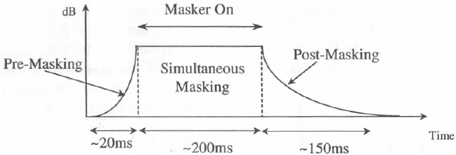

+++
title = "Psychoacoustics and Digital Audio"
outputs = ["Reveal"]
[reveal_hugo]
theme = "solarized"
+++

# Psychoacoustics & Digital Audio

How human perception and digital systems shape forensic audio analysis

{}
Today we examine the critical intersection between human auditory perception and digital audio systems—and how both directly affect forensic audio analysis, evidence interpretation, and expert testimony. You've already completed foundational work in audio forensics covering authentication, tampering detection, and legal context. Now we dive deeper into how the ear and brain process sound, how digital codecs exploit these perceptual limits, and where forensic analysts must exercise caution. This isn't abstract psychoacoustics—this is about understanding when perceptual audibility matters, when signal evidence dominates, and where misinterpretation can lead to forensic error.
{}

---

## Roadmap

1. **Psychoacoustics for Forensic Listening**
   - Masking, critical bands, loudness, temporal limits, spatial cues
2. **Digital Audio Through a Perceptual Lens**
   - Sampling, codecs, artifacts, perceptual vs. signal evidence
3. **Applied Forensic Context**
   - When perception matters, courtroom implications, best practices

{}
We'll move through three major sections. First, psychoacoustics—the science of how humans perceive sound. We'll cover auditory masking, critical bands and perceptual frequency scales, equal-loudness contours, temporal resolution, and spatial hearing. Second, digital audio systems viewed through a perceptual lens: sampling theory, lossy codecs, codec artifacts, dither, and time-frequency tradeoffs. Finally, applied forensic context: when does perceptual audibility matter versus when does signal evidence dominate? What are the courtroom implications? What protocols prevent misinterpretation?
{}

---

{}

# I. Psychoacoustics for Forensic Listening

Understanding the human auditory system's capabilities and limitations

---

## Why Psychoacoustics Matters in Forensics

- **Earwitness reliability**: Can a witness have physically heard what they claim?
- **Enhancement assessment**: Does "clearer" audio actually improve intelligibility?
- **Codec artifact identification**: Is that noise original or introduced by compression?
- **Expert testimony**: How do you explain perceptual limits to a jury?

{}
Psychoacoustics is not just academic theory—it's foundational to forensic audio work. When evaluating earwitness testimony, you must determine whether a person could have physically heard a specific sound given masking, distance, and noise conditions. When enhancing audio, you need to know whether your processing actually improves intelligibility or just makes it sound "nicer" without helping comprehension. When analyzing lossy-compressed evidence like MP3 or AAC files, you must distinguish between original acoustic information and artifacts introduced by psychoacoustic coding. And when testifying, you must communicate these perceptual limitations clearly to judges and juries who lack this technical background. Every one of these tasks requires deep understanding of how the human auditory system actually works.

**Sources**: Forensic audio analysis framework (SWGDE Best Practices for Forensic Audio); psychoacoustic foundations for codec analysis (Brandenburg, 1999).
{}

---

## Auditory Masking: Overview

**Definition**: One sound (masker) raises the threshold of hearing for another sound (probe/maskee), potentially making it inaudible

**Three types critical for forensics:**
1. Simultaneous (spectral) masking
2. Temporal masking (pre- and post-masking)
3. Informational masking

{}
Auditory masking is a psychoacoustic phenomenon where the presence of one sound raises the threshold of hearing for another sound, potentially rendering it completely inaudible. This is not about volume alone—it's about how the cochlea and brain process overlapping acoustic information. Understanding masking is absolutely critical for forensic work. It determines whether "earwitnesses" could physically perceive a sound, and it's the foundation of how lossy codecs like MP3 and AAC discard data. There are three types we need to understand: simultaneous masking (frequency-domain), temporal masking (time-domain), and informational masking (cognitive-level interference). Each has distinct mechanisms and forensic implications.

**Sources**: Auditory masking overview (Fraser & Stevenson, 2014); forensic masking analysis (Giroux, 2022).
{}

---

## Simultaneous (Spectral) Masking

  

    
    
Simultaneous masking curves illustrating upward spread of masking

  

  

    <ul>
      <li><strong>Mechanism</strong>: Cochlear overlap—strong sound creates peak on basilar membrane that "drowns out" weaker nearby signals</li>
      <li><strong>Upward spread of masking</strong>: Low frequencies mask high frequencies much more effectively than the reverse</li>
      <li><strong>Critical bands</strong>: Masking strongest within auditory filter bandwidths</li>
      <li><strong>Thresholds</strong>: Tonal masker needs ~14.5 dB SMR to hide noise; noise masker needs only ~5 dB to hide tone</li>
    </ul>
  

  

{}
Simultaneous or spectral masking occurs when the masker and probe are presented at the exact same time. Physiologically, this happens because the cochlea acts as a mechanical Fourier transformer. A strong sound creates a peak of vibration at a specific point on the basilar membrane. If a weaker sound excites the membrane in a nearly identical location, its signal is "drowned out" before it can be independently coded on the auditory nerve.

The most important characteristic is the upward spread of masking: low-frequency sounds are highly effective at masking high-frequency sounds, whereas high-frequency sounds are poor at masking low frequencies. This asymmetry is crucial for forensic interpretation. Masking is strongest within critical bands—the bandwidths of the auditory filters we'll discuss shortly.

Quantitatively, a tonal masker typically requires a Signal-to-Mask Ratio (SMR) of about 14.5 dB to hide noise, while a noise masker can hide a tone with an SMR of only 5 dB. These thresholds are exploited by lossy codecs and must be considered when evaluating whether a witness could have heard a specific sound in a noisy environment.

**Image source suggestion**: [Auditory masking diagram from ResearchGate](https://www.researchgate.net/figure/Frequency-and-temporal-masking-effects_fig1_3333873) or [Wikipedia Auditory Masking](https://en.wikipedia.org/wiki/Auditory_masking).

**Sources**: Simultaneous masking physiology (cochlear mechanics); SMR thresholds for tonal and noise maskers; critical band interaction (psychoacoustic models for perceptual coding).
{}

---

## Temporal Masking

**Pre-masking (backward masking)**:
- Sound masked even if it occurs *before* the masker
- Brain processes louder signal faster, "catches up" to weaker signal
- Time window: **5–20 ms**

**Post-masking (forward masking)**:
- Sound masked for duration *after* masker stops
- Caused by basilar membrane "ringing" and neural recovery time
- Time window: **100–200 ms** (up to 500 ms for some effects)

{}
Temporal masking occurs when a sound is obscured by a stimulus that immediately precedes or follows it—not simultaneous, but separated in time. Pre-masking or backward masking is counterintuitive: a sound is masked even if it occurs before the masker begins. This happens because the brain processes more energetic and louder signals faster; the loud masker "catches up" to and interferes with the neural processing of the preceding weaker signal. The time window for pre-masking is only about 5 to 20 milliseconds.

Post-masking or forward masking is more intuitive: a sound is masked for a duration after the masker stops. This is caused by the physical "ringing" or continued oscillation of the basilar membrane and the physiological recovery time needed for auditory neurons to adapt. Post-masking typically persists for 100 to 200 milliseconds, though some effects are seen up to 300 to 500 milliseconds.

For forensic audio, temporal masking is critical for gunshot analysis—a muzzle blast (1–3 ms) can be temporally masked by its own reverberant tail, which can last over 700 ms in reflective environments. It's also exploited by lossy codecs: quantization noise from a sharp transient can spread backward in time within an analysis window, appearing as noise before the actual sound (pre-echo). If this pre-echo falls outside the 20 ms pre-masking window, it becomes an audible artifact.

**Sources**: Pre-masking and post-masking mechanisms; time windows (5–20 ms and 100–200 ms); forensic implications for gunshot analysis and codec pre-echo.
{}

---

## Informational Masking

**Not energetic overlap—higher-level perceptual interference**

- Occurs in central nervous system, not cochlea
- Caused by:
  - Similarity between target and masker
  - Attention limitations
  - Auditory Scene Analysis (ASA) failures
- Example: "Cocktail party effect"—brain can't separate voices even when physically distinguishable

{}
Informational masking is a higher-level perceptual interference that is not caused by energetic overlap in the cochlea. This occurs within the central nervous system and relates to interactions between separate neural inputs. Even if a sound is not "energetically" masked—the signals are physically distinct on the basilar membrane—the brain may fail to process it due to similarity between the target and masker, attention factors, or limitations in Auditory Scene Analysis.

The "cocktail party effect" is related: in a room full of conversations, the brain uses binaural separation (the Binaural Masking Level Difference) to hear a voice that would be masked if heard monaurally. This allows a person to use two ears to hear a voice that would be masked with one ear. Forensically, this matters when evaluating earwitness testimony: a witness with hearing loss may have different forward-masking recovery rates, affecting their ability to hear speech in a "gap" of noise. A listener's testimony may be physically audible to everyone in the room but "legally masked"—rendered irrelevant—if the judge perceives political bias or if it fails to meet admissible standards.

**Sources**: Informational masking mechanisms; Auditory Scene Analysis limitations; cocktail party effect and Binaural Masking Level Difference; forensic implications for earwitness reliability.
{}

---

## Forensic Masking: Key Questions

When analyzing audio evidence, ask:

1. Could the witness have heard this given the noise floor?
2. Is "inaudible" speech actually below the masking threshold, or just quiet?
3. Has lossy compression masked subtle background evidence?
4. Would enhancement shift the masking relationship and make inaudible sounds audible?

{}
When you're working with audio evidence, masking should always be on your mind. First: could the witness have heard this sound given the noise floor and simultaneous sounds? Use masking thresholds to determine whether their claim is physically plausible. Second: if speech is described as "inaudible," is it actually below the masking threshold, or is it just quiet and would be audible with proper playback levels? These are not the same thing. Third: has lossy compression (MP3, AAC) exploited masking to discard data that might have been subtle background evidence—distant voices, environmental sounds? Fourth: if you enhance the audio to improve intelligibility, are you shifting the masking relationship in a way that makes previously inaudible sounds audible? If so, you need to document this clearly, because it changes what the evidence "says."

Masking is the foundation of perceptual audio coding and a critical consideration for earwitness evaluation, enhancement assessment, and codec artifact identification.

**Sources**: Forensic audio analysis protocols; masking threshold calculations; earwitness reliability and masking (Giroux, 2022); lossy codec exploitation of masking (Brandenburg, 1999).
{}

---

## Critical Bands and Auditory Filters

  

    
  

  

    <ul>
      <li><strong>Physiological basis</strong>: Basilar membrane is narrow/stiff at base (high freq), wide/flexible at apex (low freq)</li>
      <li><strong>Tonotopic organization</strong>: Spatial frequency mapping—different locations code different frequencies</li>
      <li><strong>Critical bands</strong>: Overlapping bandpass filters; within a band, ear integrates energy as single unit</li>
      <li><strong>Bandwidth changes</strong>: ~100 Hz constant below 500 Hz; above 500 Hz, ~20% of center frequency</li>
    </ul>
  

  

{}
The human auditory system doesn't process sound as a linear frequency range—it uses a series of "critical bands," overlapping bandpass filters implemented by the mechanical structure of the cochlea. Within the fluid-filled cochlea, the basilar membrane is narrow and stiff at its base (near the oval window) and wider and more flexible at its apex. This physical structure creates tonotopic organization: high-frequency sounds excite the stiff base, while low-frequency sounds travel further to excite the flexible apex. This spatial frequency mapping allows the brain to distinguish frequencies based on the location of maximum displacement along the membrane.

Critical bands define the bandwidth within which signal components interact perceptually. Within a critical band, the ear integrates sound energy as a single unit, making it difficult to distinguish individual tones that are closely spaced. The width of auditory filters is not uniform across the hearing range. Below 500 Hz, critical bands remain relatively constant at approximately 100 Hz in width. Above 500 Hz, the bandwidth increases significantly—often reaching several thousand Hz—and is generally approximated as 20% of the center frequency. Despite the change in frequency bandwidth, each critical band covers roughly the same physical distance (1.3 mm) along the basilar membrane and stimulates about 1300 neurons.

Understanding critical bands is essential for forensic spectral interpretation and for understanding how lossy codecs allocate bits across the spectrum.

**Image source suggestion**: [Cochlea tonotopic mapping from ResearchGate](https://www.researchgate.net/figure/Tonotopic-maps-of-the-basilar-membrane-and-cochlear-nucleus_fig3_257775085) or [Wikipedia Tonotopy](https://en.wikipedia.org/wiki/Tonotopy).

**Sources**: Basilar membrane physiology; tonotopic organization; critical band definition and bandwidth characteristics (~100 Hz below 500 Hz, ~20% above 500 Hz); 1.3 mm physical distance per critical band.
{}

---

## Perceptual Frequency Scales

| Scale | Basis | Primary Forensic Use |
|-------|-------|---------------------|
| **Bark Scale** | 24 critical bands; 1 Bark = 1 critical band | Audio compression (MP3 standard); loudness modeling |
| **Mel Scale** | Pitch perception; 1000 mels = 1000 Hz at 40 dB SPL | Speech recognition; speaker identification (MFCCs) |
| **ERB Scale** | Equivalent Rectangular Bandwidth; smoother auditory filter refinement | Noise reduction algorithms; high-resolution psychoacoustic research |

**Formulas**:
- Bark: z = 13 arctan(0.00076f) + 3.5 arctan((f/7500)²)
- Mel: m = 1127.01048 ln(1 + f/700)
- ERB: ERB = 21.4 log₁₀(0.00437f + 1)

{}
While all three scales map frequencies non-linearly to match the human auditory system, they serve different specialized roles in audio analysis. The Bark scale is based on the first 24 critical bands of hearing, where 1 Bark equals 1 critical band. It's fundamental for audio compression—the MP3 standard uses it—and for modeling loudness. The Mel scale is based on the perception of pitch and is defined so that 1000 mels is the pitch of a 1000 Hz tone at 40 dB SPL. It's standard for speech recognition and speaker identification, particularly in Mel-Frequency Cepstral Coefficients (MFCCs). The ERB scale provides a smoother refinement for auditory filters using the concept of Equivalent Rectangular Bandwidth. It's used in noise reduction algorithms and high-resolution psychoacoustic research.

Forensically, these scales are critical for spectral interpretation. By viewing a spectrogram on a Bark or Mel scale, an analyst sees the recording as the human ear hears it, emphasizing informative ranges like speech and compressing less relevant high frequencies. The Mel scale is highly effective at capturing phonetic identity and pitch contours in human speech. However, recent research indicates the Bark scale may be more effective for identifying speakers in certain dialects because its center frequencies map more closely to the first formant (F1), which reveals language structure and individual speaking style. Analysts also use these models to determine if a specific sound would be perceptually audible or if it was hidden by auditory masking.

**Image source suggestion**: [Bark scale diagram from ResearchGate](https://www.researchgate.net/figure/18-Critical-bandwidth-Bark-scale-and-equivalent-rectangular-bandwidth-ERB-as-a_fig12_266136545) or [Stanford CCRMA Bark scale](https://ccrma.stanford.edu/courses/120-fall-2003/lecture-5.html).

**Sources**: Bark scale definition (24 critical bands, Zwicker); Mel scale definition (pitch perception); ERB scale (Moore & Glasberg); forensic applications for spectral interpretation and speaker identification; formulas for frequency conversion.
{}

---

## Equal-Loudness Contours (ISO 226)

  

    
  

  

    <ul>
      <li><strong>Phon</strong>: Loudness level; 1 phon = 1 dB SPL at 1 kHz</li>
      <li><strong>Sone</strong>: Subjective loudness; 1 sone = 40 phons; +10 phons = ×2 sones</li>
      <li><strong>Most sensitive</strong>: 2–5 kHz (ear canal resonance)</li>
      <li><strong>Least sensitive</strong>: Below 100 Hz and above 10 kHz</li>
      <li><strong>Level dependency</strong>: Curves flatten at high volumes—response more consistent across frequencies</li>
    </ul>
  

  

{}
Equal-loudness contours are graphical representations of the sound pressure level (SPL), measured in decibels, required across the frequency spectrum for an average listener to perceive a constant level of loudness when presented with pure steady tones. Originally characterized by Fletcher and Munson in 1933, these curves have been refined and standardized as ISO 226:2003, which serves as the modern reference for human auditory sensitivity.

To quantify subjective loudness, psychoacousticians use two distinct units. Phon is loudness level: by definition, 1 phon is equal to 1 dB SPL at a frequency of 1 kHz. Two sounds of different frequencies have the same phon level if an average young person without hearing impairment perceives them as equally loud. Sone is subjective loudness: this is a linear scale where 1 sone is defined as the loudness of a 40-phon tone. Subjectively, an increase of 10 phons corresponds to a doubling of perceived loudness (e.g., 2 sones = 50 phons).

The human auditory system is not a linear detector; its sensitivity varies drastically depending on frequency and absolute volume. Humans are most acute in the 2 kHz to 5 kHz range due to the physical resonance of the ear canal and the mechanical efficiency of the middle ear's ossicles. Sensitivity drops sharply at very low frequencies (below 100 Hz) and very high frequencies (above 10 kHz). As the overall sound level increases, the equal-loudness curves become flatter, meaning the ear's response becomes more consistent across frequencies at high volumes.

**Image source suggestion**: [ISO 226 equal-loudness contours from Wikipedia](https://en.wikipedia.org/wiki/Equal-loudness_contour) or [iZotope Fletcher-Munson article](https://www.izotope.com/en/learn/what-is-fletcher-munson-curve-equal-loudness-curves).

**Sources**: ISO 226:2003 standard; Fletcher-Munson curves (1933); phon and sone definitions; frequency sensitivity peaks (2–5 kHz) and troughs (<100 Hz, >10 kHz); level-dependent flattening.
{}

---

## Forensic Implications: Equal-Loudness

**Gain normalization and playback**:
- Audio sounds "thin" at low volumes—bass and treble fall below threshold before midrange
- AGC or compression used to normalize levels for court playback
- **Caution**: Excessive normalization can obscure spatial cues (distance, orientation)

**A-weighting**:
- Standard sound level measurements use A-weighting (inverse of 40-phon curve)
- Reflects how environmental noise actually impacts human listeners

**Codec artifacts**:
- Lossy formats exploit equal-loudness to hide quantization noise in less-sensitive bands
- "Birdie noise" or artifacts in these bands can be misinterpreted as original evidence

{}
Understanding equal-loudness contours is vital for the acquisition, enhancement, and presentation of audio evidence. Audio often sounds "thin" at low volumes because the bass and treble components fall below the threshold of audibility sooner than the midrange. Forensic examiners use Automatic Gain Control (AGC) or dynamic range compression to normalize levels for court, ensuring quiet utterances are audible without louder sounds becoming painful.

However, examiners must be cautious when normalizing levels, as relative loudness is a key cue for determining the distance or orientation of a sound source—such as a shooter. Excessive processing can obscure these spatial relationships. Standard sound level measurements in investigations often use A-weighting, which is the inverse of the 40-phon curve, to better reflect how environmental noise actually impacts human listeners.

Lossy formats like MP3 exploit equal-loudness contours to hide quantization noise in frequency bands where it will be masked by stronger signals. Analysts must ensure that "birdie noise" or other artifacts introduced by this process are not misinterpreted as original scene evidence. When presenting evidence to a jury, be aware that judges and laypeople lack the experience to "listen through" noise; therefore, providing an appropriately enhanced version alongside the original is often necessary for clarity.

**Forensic best practices**: Periodic hearing screening (auditory acuity tracking); iterative critical listening in quiet environments with high-quality, spectrally flat headphones; moderate monitoring levels to prevent acoustic reflex (involuntary muscle contraction that reduces sensitivity by up to 20 dB); playback context awareness when presenting to juries.

**Sources**: Forensic gain normalization practices; AGC and spatial cue preservation; A-weighting standards; lossy codec exploitation of equal-loudness; best practices for hearing screening and playback (SWGDE Core Competencies for Forensic Audio).
{}

---

## Temporal Resolution and Transients

**Loudness integration window**: ~200 ms
- Ear integrates sound energy over ~200 ms
- Brief sounds shorter than this may seem quieter than actual SPL

**Temporal fusion and pitch**: ~30 ms
- Integration window for pitch perception and timbral fusion
- Sounds separated by <30 ms may fuse into single event

**Transient detection thresholds**:
- Muzzle blast: 1–3 ms
- Ballistic shock wave: hundreds of μs
- Minimum detectable discontinuity: ~2 ms cross-fade can conceal clicks from listeners (but not spectral analysis)

{}
Temporal resolution in forensic audio refers to the auditory system's ability to detect changes in sound over time, such as gaps, transients, or abrupt signal discontinuities. Understanding these temporal limits is essential for forensic authentication, as it defines the thresholds at which edits—such as deletions or insertions—become audible to a listener or detectable through specialized software.

Human hearing does not process sound instantaneously; instead, it integrates acoustic information over specific time windows. The loudness integration window is approximately 200 ms. The ear integrates sound energy over this interval. Brief sounds shorter than this window may be perceived as quieter than their actual sound pressure level suggests. The temporal fusion and pitch integration window is approximately 30 ms. If two sounds are separated by less than this interval, the brain may perceive them as a single fused event rather than discrete sounds.

For forensic audio, transients are brief, high-energy sounds such as clicks, pops, or the onset of a gunshot, which serve as critical markers in analysis. A handgun's muzzle blast is an extremely brief impulsive event lasting only 1 to 3 milliseconds. Supersonic projectiles produce an "N-wave" shock wave with a duration of only a few hundred microseconds. Clicks or pops occur when a signal behaves discontinuously with large differences between adjacent samples. While 2-ms cross-fades can often conceal these discontinuities from a listener, they remain detectable through spectral analysis.

**Sources**: Loudness integration window (~200 ms); temporal fusion window (~30 ms); muzzle blast duration (1–3 ms); ballistic shock wave duration (μs); cross-fade concealment thresholds.
{}

---

## Micro-Edit Detection

**Butt splice**:
- Abrupt deletion or insertion
- Creates vertical line across spectrogram (broadband energy)
- Audible click if during loud passage; visual if during silence

**Cross-fade**:
- ~2 ms blend smooths samples and eliminates click
- But analysis of background consistency can still reveal edits

**Background forensics**:
- Reverb gaps: Inserting "dry" speech into reverberant recording leaves unnatural gap in reverberant tail
- Background shifts: Abrupt changes in noise texture or disappearance of continuous tones (60 Hz hum)

{}
Forensic analysts use the visual and spectral signatures of transients to identify if a recording has been tampered with. An unsophisticated edit, known as a butt splice, occurs when a section is abruptly deleted or inserted. Spectrally, a butt splice creates a "vertical line" across the spectrogram, indicating broadband energy released at the point of the discontinuity. If the splice occurs during a loud passage, it produces an audible click. If it occurs in a silent passage, it may be inaudible but still detectable visually.

Skilled forgers use cross-fades (typically around 2 ms) to smoothly blend samples and eliminate the click. However, the most reliable way to detect micro-edits is often by analyzing the "aleatoric" or background sounds that are nearly impossible to maintain during an edit. Inserting "dry" speech into a reverberant recording leaves an unnatural gap in the reverberant tail of the preceding sound. Edits are often revealed by abrupt changes in background noise texture or the sudden disappearance of continuous tones like a 60 Hz hum.

Analysts must also account for temporal masking: pre-masking window (5–20 ms) means a loud masker can hide a sound that occurs up to 20 ms before the masker begins; post-masking window (100–200 ms) means masking persists after a loud sound ceases. In lossy formats like MP3, quantization noise from a sharp transient can spread backward in time, appearing before the actual sound (pre-echo). If this pre-echo falls outside the 20 ms pre-masking window, it becomes an audible artifact that can be misinterpreted as an edit.

**Sources**: Butt splice vs. cross-fade detection; background consistency analysis; reverb gap identification; temporal masking and pre-echo artifacts in lossy codecs.
{}

---

## Spatial Hearing and Localization

**Interaural Time Difference (ITD)**:
- Difference in arrival time between ears
- Max ITD: ~0.6 ms (sufficient for full lateral displacement)
- Most effective below 1.5 kHz (fine-structure phase sensitivity)

**Interaural Level Difference (ILD/IAD)**:
- Head shadowing reduces intensity at far ear
- ILD of 10–20 dB moves auditory image to one side
- Dominant above 1 kHz (wavelength small relative to head)

**Cone of confusion**:
- Locations with identical ITD and ILD → ambiguous (front/back, above/below)
- Resolved by spectral cues from pinna (directional bands, notches 5–10 kHz)

{}
Spatial hearing is the human auditory system's ability to analyze the spatial attributes of sound, including the localization of sources and the perception of environmental acoustics. In forensic audio analysis, spatial cues are vital for reconstructing events, as they provide an objective record of source positions and potential evidence of tampering.

Human sound localization in the horizontal (azimuthal) plane primarily depends on the comparison of signals arriving at the two ears. Interaural Time Difference (ITD) is the difference in arrival time caused by the different distances sound must travel to reach each ear. In natural hearing, the maximum ITD is approximately 0.6 ms, which is sufficient to displace an auditory image completely to one side. ITDs are most effective for low-frequency signals (typically below 1.5 kHz) because the ear is highly sensitive to the fine-structure phase of the waveform in this range.

Interaural Level Difference (ILD), also known as Interaural Amplitude Difference, is caused by the head shadowing effect, where the head and pinnae diffraction partially reduce sound intensity reaching the far ear. An ILD of 10 to 20 dB is generally sufficient to move an auditory image entirely to one side. This cue is dominant for high-frequency sounds (above 1 kHz) where the wavelength is small relative to the head's dimensions.

The cone of confusion refers to a set of spatial locations that produce identical ITD and ILD cues, making them ambiguous to the listener. These locations typically form a cone centered on the interaural axis, leading to difficulties in distinguishing between sounds coming from the front versus the back or directly above versus below. To resolve this, the brain relies on directional bands—spectral colorations (notches and peaks) created by the physical folds of the pinna (outer ear). A moving spectral notch in the 5–10 kHz range helps identify a source's elevation.

**Image source suggestion**: [ITD and ILD diagram from ResearchGate](https://www.researchgate.net/figure/nteraural-Time-Difference-ITD-and-Interaural-Level-Difference-ILD_fig1_276473132) or [Frontiers in Psychology localization article](https://www.frontiersin.org/journals/psychology/articles/10.3389/fpsyg.2024.1408073/full).

**Sources**: ITD and ILD mechanisms; maximum ITD (~0.6 ms) and ILD (10–20 dB) thresholds; frequency-dependent effectiveness; cone of confusion and pinna spectral cues (5–10 kHz).
{}

---

## Precedence Effect (Haas Effect)

**Law of the first wavefront**: First sound to reach ear dominates localization perception

**Time windows**: 1–30 ms
- If reflection arrives within this window, brain fuses with direct sound
- Localization determined by first arrival, even if reflection is up to 10 dB louder

**Forensic implication**:
- Shooter location determined by direct path, even if wall reflections are energetic
- Multilateration uses measured TDOA (time difference of arrival), not perceived location

{}
The precedence effect, also known as the law of the first wavefront, states that the first sound to reach the ear dominates the listener's perception of localization. If a direct sound is followed by a reflection within a specific time window, the brain fuses them into a single auditory event localized at the position of the first arrival. This effect occurs for delays between 1 ms and 30 ms. Within this range, a reflected sound can be up to 10 dB louder than the direct sound before it is perceived as a discrete echo.

For forensic analysts, this means a shooter's location is determined by the direct path, even if reflections from nearby walls are energetic. However, when performing geometric reconstruction via multilateration, analysts use measurable time differences of arrival (TDOA) for sound reflections, not the perceived fused location. Even though perceptually the reflections are fused with the direct sound, the measurable TDOA data can be used to determine the geometry of a crime scene, such as the distance to a reflecting surface or the location of a shooter.

This is a key example of when measurable signal evidence (TDOA) matters more than perceptual audibility (fused localization). The analyst must understand both the perceptual phenomenon (precedence effect) and the signal processing approach (multilateration) to correctly interpret the evidence.

**Sources**: Precedence effect mechanism; time window (1–30 ms); level threshold (up to 10 dB louder reflection); forensic implications for shooter localization and multilateration.
{}

---

## Stereo Artifacts from Tampering

**Talker discontinuity**:
- Abrupt changes in perceived level or orientation without logical movement

**Reverberant mismatches**:
- "Dry" recording inserted into reverberant original lacks reverberant tail
- Visually obvious on spectrogram, aurally detectable

**Binaural unmasking artifacts**:
- Uncorrelated quantization noise masked in mono becomes audible in stereo (BMLD)
- Creates "fizzing" in fade-outs or quiet passages

**AGC pumping**:
- Background noise audibly "pumps" as AGC tries to keep speech constant

{}
Digital signal processing and lossy compression introduce unique artifacts that can be misinterpreted as original evidence. Analysts examine the spatial "logic" of a recording to detect alterations. Abrupt changes in a talker's perceived level or orientation without a corresponding visual or logical movement can indicate an edit. If a "dry" recording (low reverb) is inserted into a reverberant original, the lack of a reverberant tail in the inserted segment becomes visually obvious on a spectrogram and aurally detectable. Edits are often revealed by discontinuities in aleatoric background sounds, such as the sudden disappearance of a continuous 60 Hz electrical hum.

Binaural Masking Level Difference (BMLD) means that uncorrelated quantization noise that is masked in a monaural channel can become audible when presented in stereo (unmasking effect), potentially creating a "fizzing" sound in fade-outs. Automatic Gain Control can cause the background noise level to audibly "pump" or fluctuate as the system tries to keep speech volume constant. These artifacts are introduced during recording or processing and must not be confused with original acoustic events.

**Sources**: Spatial discontinuity detection; reverberant mismatch identification; Binaural Masking Level Difference unmasking effect; AGC pumping artifacts.
{}

---

## Exercise 1: Critical Listening for Masking (Optional)

**Task**: Listen to provided audio example with simultaneous masker and probe tones

**Questions**:
1. At what Signal-to-Mask Ratio (SMR) does the probe become audible?
2. Is the masking symmetric or does it show upward spread?
3. If you were an expert witness, how would you explain this to a jury?

{}
**Exercise details for speaker notes:**

This exercise provides hands-on experience with auditory masking principles. Students should listen to an audio file containing a masker tone (e.g., 500 Hz at 70 dB SPL) and a probe tone at a nearby frequency (e.g., 1000 Hz) with varying levels.

**Part 1**: Determine the SMR threshold. Start with the probe inaudible and gradually increase its level until it becomes audible. Note the level difference between masker and probe at the threshold of audibility. Compare your measured threshold to the theoretical values discussed in lecture (tonal masker ~14.5 dB SMR, noise masker ~5 dB SMR).

**Part 2**: Test upward vs. downward masking. Repeat the experiment with the probe below the masker frequency (e.g., 250 Hz probe with 500 Hz masker) and compare. You should find that low frequencies mask high frequencies much more effectively than high frequencies mask low frequencies—this is the upward spread of masking.

**Part 3**: Courtroom communication. Write a 2-3 sentence explanation of your findings suitable for a jury with no technical background. Avoid jargon; use analogies. This skill is essential for expert testimony.

**Suggested audio files**: Generate synthetic tones using Audacity, MATLAB, or Python. Masker: 500 Hz sine wave at 70 dB SPL. Probe: 1000 Hz sine wave starting at 50 dB SPL, increasing in 2 dB steps.
{}

{}

---

{}

# II. Digital Audio Through a Perceptual Lens

How sampling, quantization, and perceptual coding affect forensic evidence

---

## Sampling and the Nyquist Theorem

**Nyquist-Shannon Sampling Theorem**:
- To avoid loss of information: F_s ≥ 2F_max
- Nyquist frequency: F_s / 2 (all meaningful frequency components must be below this)

**Standard rates**:
- 44.1 kHz (CD): Captures up to ~22 kHz (covers human hearing to ~20 kHz)
- 48 kHz (professional video): Standard for forensic work
- 96 kHz (high-resolution): Used for specialized analysis

**Aliasing**:
- If signal contains frequencies > Nyquist, they're misinterpreted as lower "ghost" signals
- Prevented by anti-aliasing filters before sampling

{}
Digital audio forensics relies on the accurate transformation of continuous analog sound into discrete digital data. This process is defined by two primary dimensions: sampling (resolution in time) and quantization (resolution in amplitude). The Nyquist-Shannon Sampling Theorem establishes the fundamental requirement for accurately reconstructing an analog signal from digital samples. To avoid the loss of information, a signal must be sampled at a rate (F_s) that is at least twice the highest frequency component (F_max) present within that signal. The value F_s / 2 is known as the Nyquist frequency; all meaningful frequency components must exist below this threshold to be properly represented.

Because the human hearing range extends to approximately 20 kHz, a sample rate of at least 40 kHz is required to capture all audible sounds. Standard rates like 44.1 kHz (CD) and 48 kHz (professional video) provide a slight buffer to facilitate effective filtering. Higher rates like 96 kHz are used for specialized forensic analysis where ultrasonic content or extreme precision is required.

When a signal is "undersampled"—meaning it contains frequencies higher than the Nyquist frequency—a specific form of distortion called aliasing occurs. High-frequency components are misinterpreted by the digital system as lower-frequency "ghost" signals. This manifests as audible distortion that was not present in the original acoustic scene. A common visual analogy is the "wagon-wheel effect" in films, where a fast-moving wheel appears to spin backward because the frame rate is insufficient to capture its true speed. To prevent aliasing, engineers use low-pass anti-aliasing filters before the sampling process to remove any energy above the Nyquist frequency.

**Sources**: Nyquist-Shannon Sampling Theorem (F_s ≥ 2F_max); Nyquist frequency definition; standard sample rates (44.1 kHz, 48 kHz, 96 kHz); aliasing mechanism and prevention via anti-aliasing filters.
{}

---

## Quantization and Dynamic Range

**Bit depth**: Precision of amplitude measurements

**6 dB per bit rule**: Each bit increases dynamic range by ~6 dB
- 16-bit: 65,536 levels, ~96 dB dynamic range (CD quality)
- 24-bit: 16.7 million levels, ~144 dB dynamic range (professional standard)
- 32-bit float: >1500 dB effective dynamic range (internal processing, prevents clipping)

**Perceptual consequences of low bit depth**:
- Quantization noise: Error between actual analog value and rounded digital step
- Low bit depth → "fizzing" or "grainy" quality in quiet passages
- Extremely low resolution → correlated error produces harmonic distortion

{}
While sampling discretizes the time axis, quantization discretizes the amplitude (loudness) axis. Bit depth determines the precision of amplitude measurements. Dynamic range is the difference between the quietest and loudest sounds a system can represent. The 6 dB rule states that each additional bit in the bit depth increases the theoretical dynamic range by approximately 6 dB.

16-bit audio offers 65,536 discrete amplitude levels and a dynamic range of roughly 96 dB—this is CD quality and covers the full audible range for most applications. 24-bit provides over 16.7 million levels and a dynamic range of 144 dB, which is the standard for professional studio recording and forensic work. 32-bit float offers an effectively infinite dynamic range (over 1500 dB) and is used for internal digital signal processing to prevent clipping during intermediate calculations.

Low bit depths result in fewer amplitude levels, leading to quantization noise—the error between the actual analog value and the rounded digital step. In quiet passages or fade-outs, low bit depths create a "fizzing" or "grainy" quality. If the resolution is extremely low, the rounding error becomes correlated with the signal, producing unpleasant harmonic distortion. Forensic audio analysis requires sufficient bit depth to ensure that the noise floor is below the level of evidence sounds; otherwise, critical quiet evidence may be obscured by quantization noise.

**Forensically acceptable standards**: Consumer/general evidence: 16-bit / 44.1 kHz (CD quality, covers full audible range). Professional/studio work: 24-bit / 48 kHz or 96 kHz (lower noise floor, greater headroom for enhancement). Gunshot analysis (lab): 500 kHz sample rate required to capture extremely brief transients like muzzle blasts (1–3 ms) and shock waves. Speech intelligibility minimum: 8-bit / 8 kHz (recognizable speech, but generally insufficient for high-end forensics).

**Sources**: 6 dB per bit rule; bit depth performance (16-bit: 96 dB, 24-bit: 144 dB, 32-bit float: >1500 dB); quantization noise mechanisms; forensically acceptable standards (SWGDE Best Practices for Forensic Audio).
{}

---

## Dither and Noise Shaping

  

    
  

  

    
<strong>Dither</strong>: Intentional addition of low-amplitude random noise before quantization

    <ul>
      <li><strong>RPDF</strong>: Rectangular PDF—equal probability, prone to noise modulation</li>
      <li><strong>TPDF</strong>: Triangular PDF—industry standard, eliminates modulation and distortion</li>
      <li><strong>Purpose</strong>: Converts signal-dependent distortion into constant, innocuous hiss</li>
    </ul>
    
<strong>Noise Shaping</strong>: Optimizes audible noise floor

    <ul>
      <li>Moves quantization noise energy out of mid-range (2–5 kHz) into high frequencies (>15 kHz)</li>
      <li>Matches inverse of Fletcher-Munson curves</li>
      <li>16-bit with noise shaping can rival 20-bit perceived dynamic range</li>
    </ul>
  

  

{}
Dithering and noise shaping are critical signal processing techniques used during the quantization of digital audio to preserve low-level detail and mitigate the harsh effects of quantization distortion. For a forensic audio analyst, understanding these processes is essential for evaluating the integrity of a recording and distinguishing between original acoustic noise and artifacts introduced during digital post-processing.

Dithering is the intentional addition of low-amplitude random noise to an audio signal before it is quantized or reduced in bit depth. It acts as a form of "vibration" that prevents the quantization process from "sticking" to a specific level, which would otherwise cause the rounding error to become correlated with the signal, resulting in unpleasant harmonic distortion. Rectangular PDF (RPDF) means the noise values have an equal probability across a specific range. While effective at reducing distortion, RPDF dither is prone to noise modulation, where the background hiss audibly "pumps" in sync with the signal. Triangular PDF (TPDF) is the industry standard, achieved by summing two independent RPDF sources to concentrate noise probability near zero. TPDF completely eliminates noise modulation and harmonic distortion, providing a stable, linear noise floor down to the theoretical limits of the bit depth. The purpose of dither is to ensure that quantization noise is converted from harsh, signal-dependent distortion into a constant, innocuous hiss. This is particularly vital in quiet passages or fade-outs where bit depth resolution is limited.

Noise shaping is an advanced technique that works in conjunction with dither to optimize the audible noise floor. It operates by computing the error from quantizing a sample and adding that specific error to the next sample before it is quantized. This feedback loop causes the error wave to oscillate more rapidly, effectively increasing its frequency. The goal is to "shape" the noise spectrum to match the inverse of the Fletcher-Munson curves. By moving noise energy out of the mid-range frequencies (2 kHz–5 kHz), where human hearing is most sensitive, and into high-frequency ranges (above 15 kHz), engineers can achieve a perceived dynamic range in 16-bit audio that rivals 20-bit performance.

**Forensic implications**: Analysts must separate the "artificial" noise floor created by TPDF from the original "aleatoric" background noise of the acoustic scene. Dither appears as a statistically uniform hiss across the spectrum, whereas genuine environmental noise (like tape hiss or room tone) often has unique spectral colorations or fluctuations. Dither provides a continuous, predictable background signal. Butt splices or edits often create an abrupt break or discontinuity in this dither noise, which becomes visible in a spectrographic view as a vertical line or an unnatural gap in the high-frequency noise floor. Lossy formats like MP3 exploit these psychoacoustic principles. If a recording has been re-quantized or re-encoded multiple times, the buildup of dither and noise-shaping artifacts can obscure subtle evidence or create "birdie noise"—tonal whistling artifacts caused by spectral holes.

**Sources**: TPDF and RPDF dither mechanisms; noise shaping algorithm and spectral distribution; forensic implications for distinguishing dither from original noise; detection of tampering via dither discontinuities.
{}

---

## Lossy Codecs: Psychoacoustic Models

**How MP3, AAC, and Opus work**:
1. Split signal into filter bank (MDCT)
2. Psychoacoustic model determines masking threshold
3. Allocate bits: Keep signal above threshold, discard below
4. Use noise shaping to prioritize critical frequencies (2–5 kHz)

**Modified Discrete Cosine Transform (MDCT)**:
- 50% overlapped blocks (lapped transform)
- Time-Domain Aliasing Cancellation (TDAC) eliminates blocking artifacts
- Critically sampled: M spectral coefficients for M new input samples

{}
Lossy codecs like MP3, AAC, and Opus are designed to achieve high data compression by exploiting the physiological and psychological limitations of the human auditory system. Unlike lossless formats that only remove statistical redundancy, these codecs remove perceptual irrelevancy, meaning they discard information that a human listener is unlikely to hear.

Lossy codecs use a psychoacoustic model to determine the masking threshold of a signal—the level below which sounds are inaudible due to the presence of louder sounds. The codec identifies loud "maskers" and allows the quantization noise in nearby frequency bands to increase, provided it remains below the masking threshold. This allows the encoder to use fewer bits for those bands without the listener perceiving the added noise. Codecs exploit both simultaneous (spectral) masking and temporal masking. If the available bitrate is too low to keep noise below the threshold, the encoder uses noise shaping to prioritize the most critical frequencies (typically 2 kHz–5 kHz) while sacrificing detail in less sensitive areas.

The Modified Discrete Cosine Transform (MDCT) is the standard filter bank used in modern codecs to convert time-domain audio into spectral coefficients. The MDCT uses a "lapped" block transform where each 2M-sample window overlaps the next by M samples (50% overlap). This overlap is critical because it eliminates blocking artifacts (audible clicks or pops at frame boundaries) that occur in non-overlapping transforms via Time-Domain Aliasing Cancellation (TDAC). Despite the 50% overlap, the MDCT is "critically sampled," meaning it generates exactly M spectral coefficients for M new input samples, maintaining data efficiency.

**Image source suggestion**: [MDCT diagram from Aalto University](https://speechprocessingbook.aalto.fi/Transmission/Modified_discrete_cosine_transform_MDCT.html) or [Wikipedia MDCT](https://en.wikipedia.org/wiki/Modified_discrete_cosine_transform). [Psychoacoustic model block diagram from Columbia University (Brandenburg)](https://www.ee.columbia.edu/~dpwe/papers/Brand99-mp3.pdf).

**Sources**: Psychoacoustic model operation (masking threshold, bit allocation, noise shaping); MDCT mechanism (50% overlap, TDAC, critical sampling); lossy codec architecture (MP3, AAC, Opus).
{}

---

## Advanced Codec Techniques

| Technique | Function | Forensic Impact |
|-----------|----------|-----------------|
| **Spectral Band Replication (SBR)** | Removes high frequencies during encoding, reconstructs by transposing low frequencies | Gunshots or high-pitched speech may sound "natural" even if HF data was never recorded |
| **Perceptual Noise Substitution (PNS)** | Replaces noise-like bands with random noise parameters | Loss of subtle background "fingerprints" used to identify recording location |
| **Joint Stereo (M/S)** | Converts L/R to Sum (M) and Difference (S) to save bits | Can create stereo artifacts; intensity stereo replaces correlated HF with envelope + directional cues |

**Standard bitrates**:
- MP3: Good quality 128–192 kbps; transparent 256 kbps
- AAC: Near CD quality 128 kbps; 5.1 surround 320 kbps
- Opus: YouTube uses ~130 kbps VBR stereo; supports 8 kbps (speech) to 510 kbps

{}
Modern codecs use specialized techniques beyond basic psychoacoustic masking to achieve extreme compression ratios. Spectral Band Replication (SBR) is a hybrid technique that removes the high-frequency range during encoding and reconstructs it in the decoder by transposing the low-frequency content. Forensically, SBR can make gunshots or high-pitched speech sound "natural" even if the actual HF data was never recorded. This is critical for authentication—if a sound "sounds right" but the high-frequency data doesn't match expectations, SBR may be the explanation.

Perceptual Noise Substitution (PNS) identifies noise-like frequency bands and replaces them with random noise parameters rather than actual samples. This can result in the loss of subtle background "fingerprints" used to identify a recording location. For example, a specific room tone or environmental noise signature may be replaced by generic noise, making location identification difficult.

Joint Stereo Coding includes Mid/Side (M/S) coding, which converts Left/Right channels into Sum (M) and Difference (S) to save bits. This is efficient because correlated content (most music and speech) is concentrated in the M channel. Intensity Stereo replaces correlated high-frequency signals with a single envelope and directional cues. While perceptually effective, these techniques can create stereo artifacts that must be distinguished from original spatial information.

Standard bitrates provide context for forensic quality assessment. MP3 achieves good quality at 128–192 kbps and is considered transparent (indistinguishable from original) at 256 kbps. AAC is more efficient: near CD quality at 128 kbps and used for 5.1 surround sound at 320 kbps. Opus is extremely versatile, used by YouTube at approximately 130 kbps VBR for stereo, and supports bitrates as low as 8 kbps for speech and as high as 510 kbps for archival quality.

**Sources**: SBR, PNS, and Joint Stereo mechanisms and forensic implications; standard bitrates for MP3, AAC, and Opus codecs.
{}

---

## Codec Artifacts: What to Watch For

**Pre-echo**:
- Quantization noise from sharp transient spreads backward within analysis window
- Appears as noise *before* actual sound
- Modern codecs use Temporal Noise Shaping (TNS) or shorter windows to minimize
- Tell-tale sign of lossy processing

**Spectral holes ("birdies")**:
- At low bitrates, encoder "runs out of bits"
- Fails to encode certain spectral lines
- Tonal whistling or tinkling artifacts that move across spectrum

**Aliasing**:
- Sample rate too low or filter bank poorly implemented
- High-frequency components misinterpreted as lower-frequency "ghosts"

**Re-encoding buildup**:
- Every lossy re-save (e.g., MP3 → edit → MP3) accumulates distortion
- Can obscure subtle background speech or timestamps

{}
Analysts must distinguish between original acoustic evidence and "bugs" introduced by compression. Pre-echo is one of the most distinctive artifacts: quantization noise from a sharp transient (e.g., a snare drum or gunshot) can spread backward within an analysis window, appearing as noise before the actual sound. Modern codecs use Temporal Noise Shaping (TNS) or shorter windows to minimize this, but it remains a tell-tale sign of lossy processing. If you see noise preceding a sharp transient on a spectrogram, suspect pre-echo from lossy coding.

Spectral holes or "birdie noise" occur at low bitrates when encoders "run out of bits" and fail to encode certain spectral lines, causing tonal whistling or tinkling artifacts that move across the spectrum. This is a clear indicator of aggressive lossy compression and can be mistaken for original acoustic content if analysts aren't careful.

Aliasing can occur if the sample rate is too low or if a codec's filter bank is poorly implemented. High-frequency components may be misinterpreted as lower-frequency "ghost" signals. This manifests as distortion that wasn't in the original scene.

Re-encoding buildup is a serious concern: every time a lossy file is edited and re-saved (e.g., as another MP3), audible artifacts and distortion accumulate. This can obscure subtle background speech, environmental sounds, or timestamps. Forensic analysts should always request the earliest-generation recording available and avoid re-encoding whenever possible.

**Sources**: Pre-echo mechanism and TNS mitigation; spectral hole ("birdie noise") artifacts; aliasing in poor filter banks; re-encoding artifact accumulation.
{}

---

## Time-Frequency Tradeoff

  

    
  

  

    
<strong>Uncertainty Principle</strong>: Impossible to achieve arbitrarily high resolution in both time and frequency simultaneously

    <ul>
      <li><strong>Long window</strong>: Good frequency resolution (distinguish close frequencies), poor time resolution (blurred edges)</li>
      <li><strong>Short window</strong>: Good time resolution (sharp edges, transients), poor frequency resolution (can't distinguish close frequencies)</li>
    </ul>
  

  

**When to use which approach**:
- **STFT (uniform)**: Continuous tones, ENF analysis, steady voices
- **Wavelets (multi-resolution)**: Gunshot classification, transient onset detection
- **Auditory filterbanks (non-uniform)**: Assessing audibility, masking analysis, earwitness evaluation

{}
The time-frequency tradeoff is a fundamental constraint in audio analysis, governed by the uncertainty principle. This principle states that it is mathematically impossible to achieve arbitrarily high resolution in both the time and frequency domains simultaneously. For a forensic analyst, choosing the right tool—whether the Short-Time Fourier Transform (STFT), Wavelets, or Auditory Filterbanks—depends on whether the investigation requires identifying when an event happened (temporal resolution) or exactly what frequencies were involved (spectral resolution).

Spectral (frequency) resolution: to distinguish between two closely spaced frequencies, a long analysis window is required. This allows the system to observe more cycles of a waveform, which is essential for capturing harmonic details and steady-state tones. However, this "blurs" the time domain, making it difficult to pinpoint the exact start or end of a sound. Temporal (time) resolution: to identify the precise timing of a brief event, such as a gunshot or a click, a short analysis window is required. This provides sharp "edges" in the analysis but results in poor frequency resolution, as there is not enough data within the window to define specific frequency lines accurately.

The STFT uses a fixed window size for all frequencies in a single analysis, resulting in a constant tradeoff across the spectrum. It's best for analyzing stationary signals, such as continuous electrical hums (ENF analysis) or identifying the harmonics of a sustained voice. It struggles with transients; if the window is too large, a sharp attack will cause "pre-echo" distortion, where quantization noise is spread throughout the block and appears to precede the actual sound.

Wavelets provide a signal-adaptive tiling of the time-frequency plane, using varying window sizes: shorter windows for high frequencies and longer windows for low frequencies. They have a "compact impulse response" at high frequencies, meaning they naturally localize transients in time without sacrificing low-frequency detail. They're ideally suited for gunshot classification and identifying the onset of percussive "attacks" like muzzle blasts or mechanical actions. They avoid the "pre-echo" artifacts that plague STFT-based methods when processing non-stationary signals.

Auditory Filterbanks (e.g., Gammatone) are designed based on the tonotopic organization of the cochlea. They typically use a series of bandpass filters spaced according to the ERB or Bark scale, mimicking the human ear's "critical bands," which are narrow at low frequencies and wide at high frequencies. They're critical for assessing audibility and masking. Analysts use these to determine if a specific sound (like a distant shout or alarm) was physically capable of being heard by a human witness in a noisy environment.

**Image source suggestion**: [Time-frequency tradeoff diagram from ResearchGate](https://www.researchgate.net/figure/An-intuitive-explanation-of-the-trade-off-between-time-and-frequency-resolution-in-STFT_fig5_346510613).

**Sources**: Uncertainty principle in time-frequency analysis; window size effects on spectral and temporal resolution; STFT, wavelet, and auditory filterbank characteristics and forensic applications.
{}

---

## Perceptually Informed vs. Visually Driven Analysis

**The pitfall**: Over-reliance on spectrograms without auditory verification

**Visual-only risks**:
- Mistaking codec pre-echo for physical event
- Isolating sound from context (missing perceptual cues)
- Misinterpreting "birdie noise" as original evidence
- Ignoring that "clearer" doesn't always mean more intelligible

**Best practice**:
- Oscillate between visual (spectrogram) and aural (critical listening)
- Use visual analysis to guide listening, not replace it
- Understand that quality ≠ intelligibility

{}
Modern software allows analysts to "read" sound via spectrograms, which can lead to over-reliance on visual patterns without corresponding auditory verification. Spectrograms suffer from the time-frequency resolution tradeoff: short analysis windows provide better temporal resolution (sharp edges of a gunshot) but blur the frequency detail, while long windows provide spectral resolution (harmonic partials) but blur the beginning and end of sounds.

Visual-only analysis might mistake a codec's pre-echo (quantization noise appearing before a transient) for a physical event in the room. Relying purely on visual peaks can isolate a sound from its context. For example, a "gold pixel" in a video of a soldier firing a rifle can corroborate the acoustic "pop" heard on a microphone to prove live ammunition was used, a conclusion that requires the oscillation between sight and sound. Analysts must understand that listeners often judge quality (how nice it sounds) differently than intelligibility (understandability). Processed or filtered audio may sound "cleaner" (higher quality) but actually result in lower speech intelligibility for the listener.

Best practice for forensic audio analysis involves oscillating between visual (spectrogram) and aural (critical listening) analysis. Use visual analysis to guide listening—to identify regions of interest, detect discontinuities, or measure specific parameters—but never replace listening entirely. Always verify visual findings with auditory checks, and always verify auditory impressions with visual and quantitative measurements. The FBI's historic 12-step protocol remains a benchmark: it includes both overall aural review and FFT/spectral review as distinct, complementary steps.

**Sources**: Pitfalls of visual-only analysis; time-frequency resolution tradeoffs in spectrograms; quality vs. intelligibility distinction; FBI 12-step forensic audio processing protocol.
{}

---

## Exercise 2: Codec Artifact Identification (Optional)

**Task**: Compare original uncompressed audio with MP3 versions at different bitrates

**Analysis**:
1. Identify pre-echo artifacts before sharp transients (use short STFT window)
2. Locate spectral holes ("birdies") at low bitrates
3. Measure noise floor changes across different encodings

**Forensic question**: If this were evidence, how would you explain these artifacts to a jury? Would you recommend enhancement or caution against it?

{}
**Exercise details for speaker notes:**

This exercise provides hands-on experience identifying codec artifacts that could be misinterpreted as original acoustic content. Students should work with an uncompressed audio file (24-bit WAV) containing a sharp transient (e.g., hand clap, gunshot recording, or synthetic impulse) and several MP3 encodings at different bitrates (64 kbps, 128 kbps, 256 kbps).

**Part 1: Pre-echo detection**. Open each file in a spectrogram view with a short analysis window (e.g., 256 samples at 44.1 kHz ≈ 5.8 ms). Look for quantization noise appearing before the sharp transient in the lossy versions but not in the original. Measure the temporal extent of the pre-echo—does it fall within the 20 ms pre-masking window, or is it audible?

**Part 2: Spectral hole identification**. Use a longer analysis window for better frequency resolution (e.g., 2048 samples ≈ 46 ms). Compare the spectrograms of the original and the 64 kbps version. Identify frequency bands where energy is present in the original but missing or replaced by tonal artifacts ("birdies") in the lossy version. Listen to these regions—do the artifacts sound like whistling or tinkling?

**Part 3: Noise floor analysis**. Measure the noise floor in a silent region before and after the transient for each encoding. Use FFT analysis to compare the spectral distribution of noise. The original should have a flat or TPDF-dithered noise floor. Lossy versions may have shaped noise floors or spectral holes.

**Forensic question**: Write a brief expert statement (3-4 sentences) explaining how you would communicate these findings to a jury. Would you recommend enhancement of the lossy file, or would you caution against it due to artifact accumulation? Consider whether enhancement would help intelligibility or simply amplify codec artifacts.

**Suggested software**: Audacity (free, cross-platform), Adobe Audition, iZotope RX, or MATLAB/Python with librosa for programmatic analysis.
{}

{}

---

{}

# III. Applied Forensic Context

When does perception matter? When does signal evidence dominate?

---

## Perceptual Audibility vs. Signal Evidence

| Feature | Perceptual Audibility | Signal Evidence |
|---------|----------------------|-----------------|
| **Primary utility** | Evaluating earwitness testimony; detecting codec artifacts | Geometric reconstruction (multilateration); calculating speed (Doppler effect) |
| **Limitations** | Ear integrates over ~200 ms; very brief sounds seem quieter than they are | High-amplitude sounds can be clipped or distorted by recorders |
| **Forensic conflict** | "Quality" (how nice it sounds) ≠ "intelligibility" (understandability) | Processed audio may sound "cleaner" but have lower speech intelligibility |

**Key principle**: Use perceptual analysis for testimony evaluation and enhancement assessment; use signal analysis for geometric and physical reconstruction

{}
A core challenge in forensics is balancing what is perceptually audible to a human against the objective signal evidence detected by machines. Perceptual audibility is primarily used for evaluating earwitness testimony and detecting codec artifacts. When assessing whether a witness could have heard a specific sound, you must account for masking, distance, and the ear's integration window (~200 ms for loudness). Very brief sounds like a 1 ms muzzle blast may seem quieter than they actually are due to this integration. Perceptual analysis is also critical for enhancement assessment: does the processed audio actually improve intelligibility, or does it just sound "nicer" while potentially reducing comprehension?

Signal evidence is primarily used for geometric reconstruction via multilateration (using time differences of arrival) and calculating speed via the Doppler effect. These calculations rely on measurable signal properties—arrival times, frequency shifts—that are independent of human perception. However, signal evidence has limitations: high-amplitude sounds can be clipped or distorted by common recorders, obscuring the true acoustic signature. Also, processed or filtered audio may sound "cleaner" (higher perceived quality) but actually result in lower speech intelligibility for the listener.

The key principle for forensic analysts: use perceptual analysis when evaluating testimony, assessing audibility, or determining whether enhancement actually helps comprehension. Use signal analysis when reconstructing geometry, identifying sources via physical signatures (like ENF or ballistic shock waves), or performing authentication. Often, both approaches are needed in tandem—for example, determining whether a witness could have heard a sound (perceptual) and then using TDOA to confirm the source location (signal).

**Sources**: Perceptual vs. signal evidence distinction; loudness integration window (~200 ms); quality vs. intelligibility; forensic applications for each approach.
{}

---

## Inaudible but Measurable: When It Matters

**Examples of forensically critical but perceptually hidden phenomena**:

1. **ENF (Electrical Network Frequency)**
   - 60 Hz (US) or 50 Hz (Europe) power grid hum
   - Often inaudible or masked, but fluctuations serve as timestamp

2. **Multilateration (TDOA)**
   - Reflections perceptually fused with direct sound (precedence effect)
   - But TDOA measurements reveal geometry

3. **Ballistic shock waves**
   - Supersonic projectile N-wave (hundreds of μs duration)
   - Can be temporally masked but measurable via wavelet analysis

4. **Spectral signatures**
   - Revolver cylinder gap impulsive sound
   - May be missed in casual listening but detectable in waveform

{}
Forensic conclusions often rely on signal data that the human ear cannot detect or that it ignores due to psychoacoustic masking. These phenomena are critical for reconstruction and authentication.

Electrical Network Frequency (ENF) is a residual "hum" from the power grid (60 Hz in the U.S., 50 Hz in Europe). While often undesirable or inaudible in noisy recordings, its unpredictable fluctuations serve as a digital timestamp to verify when and where a recording was made. ENF analysis can verify date and time, detect butt-splices and edits, and identify broad geographic location (different grids have different patterns). However, the recording must have been near power grid or electromagnetic field, extraction is difficult with low SNR, heavily compressed audio may not retain the signal, and analysis requires access to specialized reference databases.

Multilateration uses measurable time differences of arrival (TDOA) for sound reflections to determine the geometry of a crime scene, such as the distance to a reflecting surface or the location of a shooter. Even though reflections are perceptually fused with the direct sound by the precedence effect (the listener hears a single event localized at the first arrival), the measurable TDOA data provides objective geometric information independent of perception.

Ballistic shock waves from supersonic projectiles produce an "N-wave" with a duration of only a few hundred microseconds. These can be temporally masked by the louder muzzle blast or reverberations, but wavelet analysis with high temporal resolution can isolate and measure them, providing information about projectile speed and trajectory.

Spectral signatures like the off-axis impulsive sound from a revolver's cylinder gap can distinguish revolvers from pistols. This detail might be missed in casual listening but is measurable in the waveform and spectrogram. Similarly, "gold pixels" in synchronized video can reveal ballistic details—such as whether a firearm fired live ammunition or a rubber bullet—that are initially inaudible but visible as distinct frequency energy distributions.

**Sources**: ENF analysis for timestamp verification (Jenkins, 2011; Grigoras, 2005); multilateration and TDOA despite precedence effect; ballistic shock wave detection via wavelets; spectral signature identification (revolver cylinder gap, ballistic analysis).
{}

---

## Courtroom Implications

**The "CSI Effect"**: Juries expect "magical" audio clarity from poor recordings

**Expert responsibilities**:
1. **Manage expectations**: Explain material limitations of forensic science
2. **Use layman's language**: Complex acoustical principles must be understandable
3. **State limitations clearly**: What *cannot* be determined scientifically
4. **Avoid "golden ear" fallacy**: All findings must be verifiable and reproducible
5. **Neutrality**: Expert is not an advocate—testifies to facts and interpretation only

**Standards for evidence**:
- Seven Tenets of Authenticity (U.S. v. McKeever, 1958)
- FBI 12-Step Procedure
- Watergate Procedure

{}
The courtroom and legal implications of psychoacoustics and digital audio are centered on the scientific reliability of evidence and the expert's ability to navigate the gap between physical signal data and human perception. Experts face the challenge of the "CSI Effect," where juries expect low-quality recordings to be "magically" transformed into perfect audio. Experts must act as educators, explaining that perfect enhancement is seldom possible and that fictions of TV do not align with the material limitations of forensic science.

Expert responsibilities include: (1) Managing expectations by explaining what can and cannot be achieved with enhancement. (2) Using layman's language so that complicated acoustical principles are understandable to the triers of fact (judge or jury). (3) Clearly stating what cannot be determined scientifically from the evidence provided. The National Academy of Sciences specifically recommends that the limitations of methods, such as aural-visual voice identification, be thoroughly explained. (4) Avoiding the "golden ear" fallacy—experts must eschew claims that they possess superior hearing that allows them to perceive things others cannot; all findings must be verifiable and reproducible by other experts. (5) Maintaining neutrality—the expert is not an advocate for a particular side but testifies solely regarding the facts and interpretation of the audio evidence.

Standards for admissibility of audio evidence include: Seven Tenets of Authenticity (derived from U.S. v. McKeever, 1958), requiring proof of device capability, operator competence, lack of alterations, and speaker identification. FBI 12-Step Procedure, a standardized model for processing evidence, ranging from physical inspection to FFT review and reporting. Watergate Procedure, a model for judging authenticity that includes physical observation, verification of continuity, and critical listening.

When handling perceptual ambiguity: when no evidence of tampering is found, the examiner must ethically state that this does not guarantee the recording is authentic, as skilled forgeries may defy detection. The legal term "reasonable degree of scientific certainty" is often required in reports but lacks a precise scientific definition. Experts should provide meaningful scientific justification for their findings rather than relying on this phrase as an implicit "trust me."

**Sources**: CSI Effect and jury expectations; expert witness responsibilities; Seven Tenets of Authenticity (U.S. v. McKeever); FBI 12-Step Procedure; Watergate Procedure; NAS recommendations for limitations disclosure; "reasonable degree of scientific certainty" critique.
{}

---

## Forensic Listening Protocols

**Laboratory setup**:
- Acoustically isolated, quiet environment (ambient noise < 25 dBA SPL)
- High-quality, spectrally flat headphones
- Moderate playback levels (avoid acoustic reflex—involuntary muscle contraction reduces sensitivity by up to 20 dB)

**Iterative audition**:
1. Listen to entire recording for context
2. Multiple replays of specific segments
3. Focus on foreground sounds (speech)
4. Shift attention to background sounds (room tone, distant sounds)—harder to forge consistently

**Cognitive bias mitigation**:
- Expectation bias: Case knowledge can pre-condition perception
- Use Linear Sequential Unmasking (LSU) when possible—analyze audio before learning case context

{}
Forensic listening is the disciplined application of psychoacoustic knowledge and controlled auditory protocols to interpret audio evidence for legal proceedings. It moves beyond casual hearing to evaluate the material qualities of sound—such as reverberation, distortion, and noise—to reconstruct events or identify talkers.

Laboratory setup: analysis must occur in an acoustically isolated and quiet environment with ambient noise below 25 dBA SPL, using high-quality, spectrally flat headphones and amplifiers to minimize room interference. Playback should be kept at moderate levels. High volumes can trigger the acoustic reflex, an involuntary muscle contraction in the middle ear that temporarily reduces hearing sensitivity by as much as 20 dB.

Iterative audition: best practices require listening to the entire recording first to gain context, followed by multiple replays of specific segments. Analysts should focus on foreground sounds like speech and then deliberately shift attention to "aleatoric" background sounds—room tone, distant sirens, mechanical rattles—which are harder for a forger to manipulate consistently.

Cognitive bias mitigation: extraneous information about a case, such as a suspect's arrest history, can pre-condition an analyst's perception, leading them to "hear" what they expect rather than what is present. Modern forensics rejects the "trust me, I'm an expert" approach. Claims of superior perception must be replaced by verifiable, testable scientific statements based on standard techniques. Linear Sequential Unmasking (LSU) is a protocol where the analyst examines raw audio in complete isolation from case information, documents initial findings, and only then reveals context in controlled stages. This prevents case theory from shaping what the analyst "hears."

**Sources**: Forensic listening protocols (SWGDE); laboratory setup standards (ambient noise < 25 dBA SPL, moderate playback levels); acoustic reflex effects (up to 20 dB sensitivity reduction); cognitive bias and LSU protocol (Dror et al., 2015).
{}

---

## Best Practices for Evidence Presentation

**Playback calibration**:
- Verify listening environment is appropriate
- Use calibrated monitoring (not laptop speakers)
- Provide both original and enhanced versions
- Document all processing steps

**Enhancement caution**:
- "Clearer" audio is not necessarily more intelligible
- Can boost false transcript credibility if transcript is wrong
- Objective evidence that enhancement improves intelligibility is required

**Hash verification**:
- MD5 or SHA to confirm data integrity
- Chain of custody documentation for every transfer and access

**Format standards**:
- Uncompressed PCM (WAV), 16-bit minimum, ≥16 kHz sampling
- Avoid lossy re-encoding during processing

{}
When presenting audio evidence in court, careful attention to playback calibration and processing documentation is essential. Playback calibration requires verifying that the listening environment is appropriate (quiet, no echo), using calibrated monitoring equipment (not laptop speakers), and providing both original and enhanced versions so the jury can compare. All processing steps must be documented in detail—software used, version numbers, parameter settings—so that another analyst could replicate the work.

Enhancement caution is critical: courts should require objective evidence that enhancement actually improves intelligibility, not just "clarity." "Clearer" sounding audio can paradoxically boost the credibility of an inaccurate transcript. Research shows that when transcript and audio are mismatched, listeners primed by the transcript will insist they heard the transcript words—the transcript becomes the perception. Enhancement that makes the audio sound more confident can reinforce this false perception. Analysts must distinguish between making audio sound better (increasing quality) and actually improving comprehension (increasing intelligibility).

Hash verification uses cryptographic hash functions (MD5 or SHA) to confirm that no data has changed during transfer or storage. Chain of custody must be documented for every transfer and access to prevent challenges to admissibility. Format standards require that audio be recorded and maintained as uncompressed PCM data (WAV format) with at least 16-bit samples and minimum 16 kHz sampling. Lossy re-encoding during processing should be avoided at all costs—every lossy re-save accumulates artifacts and distortion.

**Sources**: Playback calibration and enhancement caution (SWGDE Best Practices for Forensic Audio); hash verification and chain of custody (SWGDE Best Practices for Digital Audio Authentication); format standards (16-bit minimum, ≥16 kHz sampling, uncompressed PCM).
{}

---

## Exercise 3: Forensic Decision-Making (Optional)

**Scenario**: You receive a 128 kbps MP3 recording of an alleged confession. The defense claims the defendant said "I kept watching her," but the prosecution transcript reads "I killed Winchester."

**Your tasks**:
1. What perceptual and signal analyses would you perform?
2. How would you assess the reliability of the transcript?
3. What would you tell the court about the limitations of the evidence?
4. If asked to enhance, would you recommend it? Why or why not?

{}
**Exercise details for speaker notes:**

This exercise is based on the David Eastman case discussed in the Ethics and False Convictions lecture, where police transcripts of whispered self-talk were later found to be inconsistent with phonetic analysis. Here, students must apply the psychoacoustic and digital audio principles learned in this lecture to make forensic decisions.

**Part 1: Perceptual and signal analyses**. Students should propose: (1) Spectral analysis to identify formant structure and phonetic consistency with the claimed words. (2) Temporal analysis to measure rhythmic structure and syllable count. (3) Critical listening in controlled conditions (isolated, quiet lab; spectrally flat headphones; no transcript priming). (4) Lossy codec artifact assessment—identify pre-echo, spectral holes, and noise floor characteristics that might affect intelligibility. (5) Comparison with reference samples of the speaker saying both phrases to assess phonetic plausibility.

**Part 2: Transcript reliability assessment**. Students should consider: (1) Who produced the transcript? If it was investigators with case knowledge, it's subject to contextual priming and confirmation bias. (2) Was the transcription done independently or with case context? LSU would have required isolation from case information. (3) What is the audio quality? 128 kbps MP3 has introduced codec artifacts; is the phrase in a region affected by pre-echo or spectral holes? (4) Does the transcript match the acoustic evidence? Phonetic analysis should reveal whether the claimed words are acoustically consistent with the signal.

**Part 3: Limitations statement**. Students should draft a statement explaining: (1) The recording is lossy-compressed, which has discarded data via psychoacoustic masking; subtle speech details may be lost. (2) The acoustic signal is ambiguous; multiple interpretations are phonetically plausible. (3) Transcript priming is a documented psychological phenomenon; once you read a transcript, your perception is shaped by it. (4) Objective phonetic analysis shows the signal is consistent with "[alternative phrase]" but not necessarily exclusive of "[prosecution phrase]."

**Part 4: Enhancement recommendation**. Students should argue whether enhancement would help or harm. Arguments against: (1) Enhancement may amplify codec artifacts, making them sound like original speech. (2) Enhancement may increase perceived confidence in an inaccurate transcript. (3) The issue is not volume or audibility—it's linguistic ambiguity. Arguments for (with caveats): (1) Enhancement might improve intelligibility if the problem is noise masking rather than ambiguity. (2) Must be done by an independent analyst using LSU protocol. (3) Must provide original and enhanced versions for comparison, with full documentation of processing.

This exercise forces students to integrate psychoacoustic knowledge (masking, temporal limits), digital audio understanding (codec artifacts, lossy compression), and forensic protocols (LSU, transcript priming, expert testimony limitations).

**Discussion**: Compare responses as a class. What assumptions did different students make? How did their decisions change based on what they prioritized—perceptual audibility vs. signal evidence, transcript credibility vs. acoustic analysis?
{}

{}

---

## Key Takeaways

1. **Auditory masking** determines what is perceptually audible—critical for earwitness evaluation and codec analysis
2. **Critical bands and perceptual scales** shape how we hear frequency—essential for spectral interpretation
3. **Equal-loudness contours** explain why audio sounds "thin" at low volumes—affects forensic gain normalization
4. **Sampling and quantization** define digital precision—bit depth and sample rate must be forensically adequate
5. **Lossy codecs exploit psychoacoustics**—analysts must distinguish codec artifacts from original evidence
6. **Time-frequency tradeoffs** require choosing the right tool (STFT, wavelets, auditory filterbanks) for the forensic question
7. **Perceptual audibility ≠ signal evidence**—use each where appropriate
8. **Experts must communicate limits clearly**—avoid "golden ear" fallacy, manage jury expectations

{}
Let's recap the essential principles. Auditory masking—simultaneous, temporal, and informational—determines what is perceptually audible. This is critical for evaluating earwitness testimony, understanding lossy codec operation, and assessing whether enhancement can make masked sounds audible. Critical bands and perceptual frequency scales (Bark, Mel, ERB) shape how we hear the spectrum. Using these scales for spectral interpretation allows analysts to see recordings as the ear hears them, emphasizing informative ranges and compressing less relevant high frequencies.

Equal-loudness contours explain why audio sounds "thin" at low playback volumes—bass and treble fall below the threshold of audibility before midrange. This affects forensic gain normalization and explains why A-weighting is used in sound level measurements. Sampling and quantization define digital precision. Forensically adequate standards include 16-bit / 44.1 kHz minimum, with 24-bit / 48 kHz or higher for professional work. Gunshot analysis requires extremely high sample rates (500 kHz) to capture brief transients.

Lossy codecs exploit psychoacoustics to achieve high compression ratios. They discard data below the masking threshold, use MDCT with 50% overlap and TDAC, and employ advanced techniques like SBR, PNS, and Joint Stereo. Analysts must distinguish codec artifacts (pre-echo, spectral holes, aliasing, re-encoding buildup) from original evidence. Time-frequency tradeoffs require choosing the right analytical tool: STFT for stationary signals and ENF analysis, wavelets for transient detection and gunshot classification, auditory filterbanks for assessing audibility and masking.

Perceptual audibility and signal evidence serve different forensic purposes. Use perceptual analysis for earwitness evaluation and enhancement assessment. Use signal analysis for geometric reconstruction (multilateration) and physical measurements (ENF, Doppler). Experts must communicate limitations clearly to juries, avoid the "golden ear" fallacy by ensuring all findings are verifiable and reproducible, and manage expectations shaped by the "CSI Effect."

**Sources**: Summary of psychoacoustic principles for forensic audio; SWGDE standards and best practices; expert witness responsibilities and limitations communication.
{}

---

## Discussion Questions

1. When should you prioritize perceptual audibility over signal evidence, and vice versa?
2. How would you explain the concept of temporal masking to a jury with no technical background?
3. If you receive a 64 kbps MP3 as evidence, what specific analyses would you perform to assess its reliability?
4. What are the ethical responsibilities when you cannot definitively determine whether a recording has been tampered with?
5. How can understanding psychoacoustics prevent wrongful convictions?

{}
Let's discuss these questions to solidify your understanding and prepare you for real-world forensic scenarios.

**Question 1**: When should you prioritize perceptual audibility over signal evidence, and vice versa? Think about specific case types: earwitness testimony, enhancement decisions, geometric reconstruction, tampering detection. What determines which approach is more appropriate?

**Question 2**: How would you explain temporal masking to a jury with no technical background? Remember, you cannot use jargon like "pre-masking" or "basilar membrane ringing." Practice explaining the concept using everyday analogies or examples that a layperson would understand.

**Question 3**: If you receive a 64 kbps MP3 as evidence, what specific analyses would you perform? Consider codec artifact identification, spectral analysis for "birdie noise," temporal analysis for pre-echo, comparison with higher-bitrate versions if available, and assessment of whether critical evidence might have been discarded by the psychoacoustic model.

**Question 4**: What are the ethical responsibilities when you cannot definitively determine whether a recording has been tampered with? Consider the difference between "no evidence of tampering found" and "proven authentic." How do you communicate uncertainty without undermining your credibility? What standards guide your statement?

**Question 5**: How can understanding psychoacoustics prevent wrongful convictions? Reflect back on the Ethics and False Convictions lecture. Consider how transcript priming, contextual bias, and misunderstanding of perceptual limits led to cases like David Eastman and the "Pact" case. How do the principles we covered today—masking, temporal limits, codec artifacts, perceptual vs. signal evidence—provide tools to prevent these tragedies?

The goal of these discussions is to internalize these principles so deeply that you apply them automatically in your forensic work. Psychoacoustics isn't abstract theory—it's the foundation of reliable, ethical, scientifically sound forensic audio analysis.
{}

---

## Further Resources

**Psychoacoustics & Perception**:
- Zwicker & Fastl (1999). *Psychoacoustics: Facts and Models*
- Moore (2012). *An Introduction to the Psychology of Hearing*

**Digital Audio & Codecs**:
- Brandenburg (1999). MP3 and AAC Explained
- Bosi & Goldberg (2003). *Introduction to Digital Audio Coding and Standards*

**Forensic Audio**:
- SWGDE Best Practices for Forensic Audio (2022)
- SWGDE Core Competencies for Forensic Audio (2025)
- Fraser & Stevenson (2014). The power and persistence of contextual priming

**Standards**:
- ISO 226:2003 (Equal-loudness contours)
- ITU-R BS.1770 (Loudness measurement)

{}
These resources provide comprehensive coverage of the topics discussed today. For psychoacoustics, Zwicker and Fastl's "Psychoacoustics: Facts and Models" is the definitive reference, covering critical bands, masking, loudness, and perceptual scales in detail. Moore's "An Introduction to the Psychology of Hearing" provides physiological and perceptual foundations.

For digital audio and codecs, Brandenburg's 1999 paper "MP3 and AAC Explained" remains one of the clearest explanations of psychoacoustic coding principles. Bosi and Goldberg's "Introduction to Digital Audio Coding and Standards" covers MDCT, psychoacoustic models, and advanced coding techniques comprehensively.

For forensic audio practice, the Scientific Working Group on Digital Evidence (SWGDE) publishes authoritative best practices documents. "Best Practices for Forensic Audio" (2022) covers evidence handling, processing, and documentation. "Core Competencies for Forensic Audio" (2025) defines required knowledge, skills, and ethical standards for practitioners. Fraser and Stevenson's 2014 paper "The power and persistence of contextual priming" is essential reading for understanding how transcripts and case knowledge bias perception—directly relevant to preventing wrongful convictions.

For standards, ISO 226:2003 defines equal-loudness contours and serves as the modern reference for human auditory sensitivity. ITU-R BS.1770 standardizes loudness measurement for broadcast and forensic applications.

**Image Sources**:
- [Equal-loudness contours](https://en.wikipedia.org/wiki/Equal-loudness_contour)
- [Auditory masking curves](https://www.researchgate.net/figure/Frequency-and-temporal-masking-effects_fig1_3333873)
- [Critical bands and Bark scale](https://www.researchgate.net/figure/18-Critical-bandwidth-Bark-scale-and-equivalent-rectangular-bandwidth-ERB-as-a_fig12_266136545)
- [Cochlea tonotopic mapping](https://www.researchgate.net/figure/Tonotopic-maps-of-the-basilar-membrane-and-cochlear-nucleus_fig3_257775085)
- [MDCT diagram](https://speechprocessingbook.aalto.fi/Transmission/Modified_discrete_cosine_transform_MDCT.html)
- [ITD and ILD](https://www.researchgate.net/figure/nteraural-Time-Difference-ITD-and-Interaural-Level-Difference-ILD_fig1_276473132)
- [Time-frequency tradeoff](https://www.researchgate.net/figure/An-intuitive-explanation-of-the-trade-off-between-time-and-frequency-resolution-in-STFT_fig5_346510613)
- [Psychoacoustic model (MP3/AAC)](https://www.ee.columbia.edu/~dpwe/papers/Brand99-mp3.pdf)
{}
