+++
title = "Splices and Edit Detection"
outputs = ["Reveal"]
[reveal_hugo]
theme = "solarized"
margin = 0.2
separator = "##"
+++

## Splices and Edit Detection

Chapter 5: Authenticity Assessment

{}
Today we're going to talk about one of the most important questions in audio forensics: is this recording authentic? Has it been tampered with? Has someone cut something out, or inserted something that wasn't there originally? This is Chapter 5 from Maher's textbook, and we're going to cover the historic methods used for analog tape, and then spend the bulk of our time on how edit detection works in the digital domain. We'll get into the specific techniques that forgers use and, more importantly, how examiners detect those techniques. By the end of this lecture you should understand the fundamental approaches to identifying splices, deletions, and insertions in audio recordings.
{}

---

## What is Authenticity?

- Is the recording **complete**, **unaltered**, and **consistent** with the stated circumstances?
- Not finding evidence of tampering does **not** guarantee authenticity
- A skilled adversary could conceivably create a forgery that defies detection

{}
So let's start with the fundamental question: what do we actually mean by authenticity? When we talk about an authentic recording, we mean one that is complete, unaltered, and consistent with the stated circumstances of its creation. For example, someone might claim that a recorded conversation has been edited so that critical utterances were inserted or removed. Or maybe the claim is that the recording wasn't made at the time, place, or under the circumstances that were stated.

Here's a really important thing the court needs to understand, and that you as future examiners need to internalize: the fact that an examiner does not find specific evidence of tampering does NOT necessarily mean the recording is authentic. A particularly skilled adversary could conceivably create a tampered recording that defies detection. So our job is to be diligent, apply every technique we have, and report honestly about what we find or don't find. We can identify inconsistencies that indicate inauthenticity, but we generally cannot guarantee authenticity.
{}

---

## Historic Context: Analog Magnetic Tape

- Primary medium for audio evidence until the early 2000s
- Three heads: **erase**, **record**, **playback**
- AC bias signal linearizes the recording process
- Multiple track configurations possible

{}
Before we get into digital, let's talk about the historic context, because analog magnetic tape was the primary medium for audio forensic evidence until basically the first decade of the twenty-first century. Understanding how tape works helps us understand the physical methods used to detect tampering on tape, and some of those principles carry over conceptually to the digital world.

Magnetic tape is a thin, flexible plastic ribbon coated with a layer of magnetic powder material. A tape recorder draws the tape off a supply reel at a fixed rate past three electromagnetic coils: the erase head, the record head, and the playback head. Some cheaper recorders combined the record and playback head into one. When recording, the tape first passes over the erase head to randomize the magnetic domains, then over the record head where the electrical current modulated by the audio signal causes fluctuating magnetization on the tape.

One important detail: the relationship between the record head current and the tape magnetization is nonlinear, which causes distortion. To fix this, a strong, inaudibly high-frequency AC bias signal, typically around 40 kilohertz, is mixed with the audio signal. This bias linearizes the overall behavior so the playback system reproduces the audio faithfully.
{}

---

## Analog Tape Track Formats

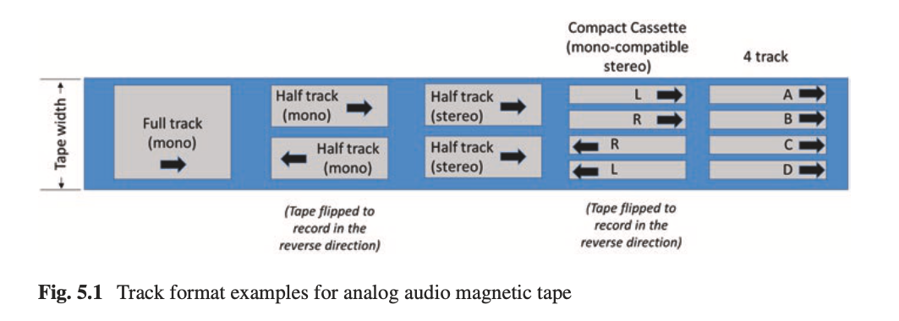

{}
This figure shows several common tape track configurations. On the left you can see the simplest: full track mono, where the entire width of the tape is used for a single audio channel. Then you have half track configurations, both mono and stereo, where the tape can be flipped over to record in the reverse direction on the other half. On the right is the compact cassette format, which is mono-compatible stereo with four tracks: left and right in one direction, then the tape flips and you get left and right in the other direction. There's also the four-track format used in some professional and consumer recorders.

Why does this matter for forensics? Because when you're examining a tape for authenticity, you need to know what track format was used. If you see recorded material on tracks that shouldn't have audio given the stated recording circumstances, that's a red flag. And when we do magnetic development, which we'll talk about in a moment, the track configuration becomes visible and can reveal important information about how and when different parts of the tape were recorded.
{}

---

## Physical Inspection of Tape

- Look for **splice edits**: physically cut tape rejoined with adhesive
- Inspect cassette housing, reels, and related material
- Check manufacturing serial numbers and batch designations
- Verify tape age matches the reported recording date
- Inspect the recorder itself if available

{}
The first step in assessing the authenticity of an analog tape recording is good old-fashioned physical inspection. Analog tape alterations made by physically cutting the tape and then reattaching it are known as splice edits, and they involve adhesive tape used to hold the ends of the cut tape together. So you're literally looking for physical evidence of cutting and splicing.

The examiner will visually inspect the cassette housing, the reels, the entire length of the tape, and any related material, looking for spliced tape, broken housing, or other indications that the tape has been physically altered. You'll also record any manufacturing serial numbers and tape batch designations. This helps determine if the age of the tape is at least as old as the date the recording was supposedly made. If someone claims a recording was made in 1995 but the tape batch wasn't manufactured until 2003, that's a problem.

If the actual recorder used to produce the recording is available, the examiner inspects and tests the device too. A qualified technician can examine the track configuration, head alignment, azimuth setting, bias level, and so forth. If the recorder was out of calibration, you may need to set up the playback head to match the tape's alignment to get accurate reproduction.
{}

---

## Magnetic Development: Bitter Patterns

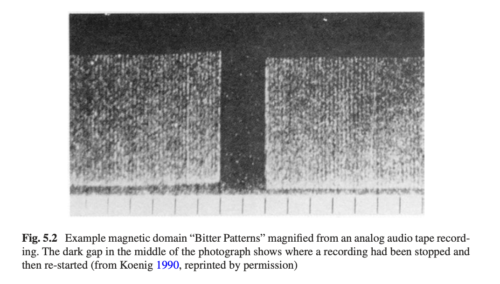

{}
Now here's where it gets really interesting. Magnetic development is a technique that lets us actually see the invisible magnetic domains recorded on the tape. The method uses a ferromagnetic fluid called ferrofluid, which contains microscopic magnetic particles suspended in a solvent. The examiner spreads this ferrofluid uniformly but sparingly on the magnetic tape, and the suspended particles align with the invisible magnetic domains recorded on the tape. After the solvent evaporates, the examiner uses a microscope to observe the pattern of magnetic particles adhering to the tape.

These patterns are called Bitter Patterns, named after Francis Bitter, a researcher at Westinghouse Electric Company and later MIT, who proposed the powder pattern method back in 1931.

Look at this image. You can see two regions of recorded material on a piece of analog cassette tape, caused by a stop/start recording sequence. The portion on the right is magnetization from the recording process up until the recorder was stopped, leaving the unmagnetized dark gap. Then the recorder was started again, which caused a slight offset of the magnetic pattern as the tape started moving again. Those vertical striations you can see are from the high-frequency AC bias I mentioned earlier. This technique is incredibly powerful for detecting edits on analog tape.
{}

---

## What Examiners Look For on Tape

- Single start-up transient at the beginning
- No unexpected start-stop sequences or erasures
- Distinctive erase and record head magnetic signatures
- Any anomalies could indicate alteration

{}
So what does the audio forensic examiner actually look for when examining these magnetic patterns? They look for the distinctive erase and record head magnetic signature patterns on the tape, as well as the magnetic tracks containing the audio information.

If the recording is authentic, the examiner expects to find a single start-up transient at the beginning of the recording, and then no other head transients until the recording was stopped at the end. Any observation of additional start-stop sequences or erasures could indicate that the tape has been altered, either deliberately or inadvertently. The investigators would need to seek an explanation for why the recording appeared to be edited or truncated.

This is exactly what happened in the Watergate tape study. The investigators identified several overlapping erasures performed with a specific model of tape recorder that differed from the device that produced the original recording. They could tell this based on the characteristic start/stop magnetic signatures present on the June 20, 1972 tape. That's the power of magnetic development as a forensic tool.
{}

---

## The Watergate Tapes

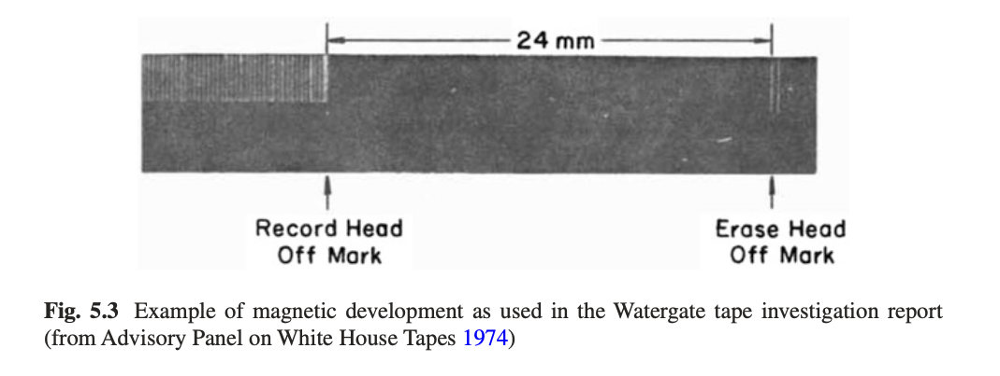

{}
This figure is from the actual Watergate tape investigation report. It shows an example of magnetic development as used by the Advisory Panel on the White House Tapes in 1974. You can see the record head off mark on the left and the erase head off mark on the right, separated by about 24 millimeters. These marks are the physical evidence left on the tape when the recording was stopped. By examining these patterns, investigators could determine not only that the tape had been stopped and started, but could identify specific characteristics of the recording equipment used.

In recent years, the use of multi-track tape recorders to read information from the original track format on the tape has also been used for authentication. Additionally, several high-resolution direct imaging methods have been developed using specialized equipment to reveal the recorded magnetic pattern without even needing the ferrofluid. So the technology keeps advancing, but the fundamental principle remains: the physics of magnetic recording leaves telltale traces that can be examined.
{}

---

## Transition to Digital: New Challenges

- Digital files are sequential lists of binary numbers
- Can be copied, transmitted, and stored with **perfect fidelity**
- Edits can be made surreptitiously with no physical trace
- If all you have is the file, you need **other means** to assess integrity

{}
Now let's shift gears to the current context, which is where most of you will be working: digital audio recordings. And here's the fundamental problem. Digital audio recordings are essentially sequential lists of binary numbers stored in a computer file. Unlike analog tape, digital files can be copied, transmitted, and stored on a variety of media with perfect fidelity. What's more, it is often difficult to exclude the possibility that a digital file was adjusted and edited surreptitiously and then stored as a seemingly intact and pristine file.

With analog tape, we could physically inspect the medium, we could look at magnetic patterns under a microscope, we could find physical evidence of cuts and splices. With digital audio, there's no physical medium to inspect in the same way. If all that's available is the digital audio file itself, the examiner must use other means to assess the integrity of the recording. So what are those other means? That's what we're going to spend the rest of this lecture on: the specific techniques for identifying edits in digital audio, starting with the most basic type of edit, the splice.
{}

---

## Types of Audio Forgery

- **Deletion**: removing time segments
- **Insertion**: adding new audio material
- **Mixing**: additively combining new material with the original
- Edit boundaries can be **butt splices** or **cross-fades**

{}
An audio forgery could consist of one or more edits made to an original recording. There are basically three things a forger can do. First, they can delete certain time segments, cutting out something they don't want in the recording. Second, they can insert audio material, adding something that wasn't originally there. Third, they can additively mix in forged material on top of the existing recording.

For deletions and insertions, the boundaries of the edit are where we focus our attention. An unsophisticated forger might make an abrupt insertion or deletion, which is called a butt splice, borrowing the term from physical tape editing. A more sophisticated forger would use a cross-fade to smooth the transition and make it harder to detect. We're going to look at examples of both, and you'll see that even cross-faded edits can sometimes be detected through careful analysis of the recording's acoustic properties. Let's start with the butt splice.
{}

---

## Example: Original Recording

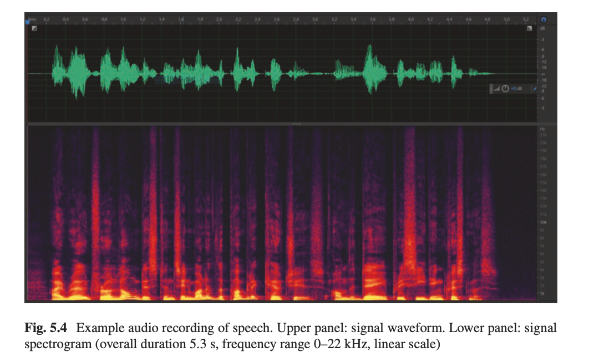

{}
Here's an example audio recording of speech. The upper panel shows the time waveform, and the lower panel shows the spectrogram. The recording includes some speech utterances and background sounds. The overall duration is about 5.3 seconds, and the spectrogram shows the frequency range from 0 to 22 kilohertz on a linear scale.

Take a moment to look at this. Notice how the waveform shows the amplitude variations of the speech, and the spectrogram below it shows the frequency content over time. You can see the formant structure of the speech, the harmonic patterns, and the background noise floor. This is our original, unedited recording. Now let's see what happens when a forger tries to remove a section of this recording using a butt splice.
{}

---

## Butt Splice Deletion

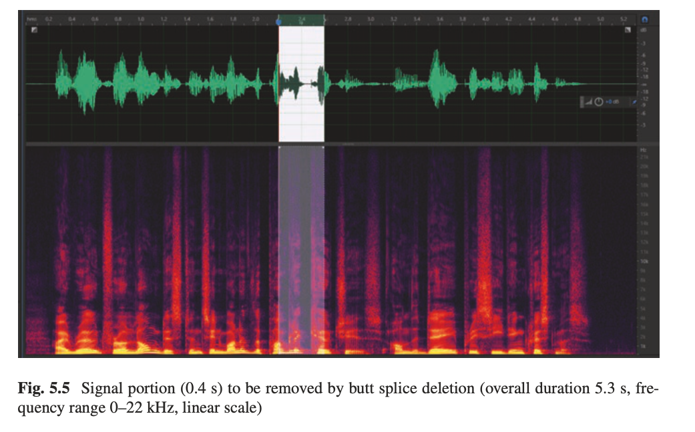

<!-- Book Fig 5.5: Signal with highlighted portion to be removed -->

The highlighted 0.4s section will be removed with a butt splice

{}
Now imagine a forger wants to remove a particular section of this recording. In this figure, you can see the same recording, but now there's a highlighted portion, about 0.4 seconds long, indicated with dashed lines. This is the section the forger wants to cut out. Maybe it contains an incriminating statement, or maybe it contradicts the narrative they're trying to construct.

With a butt splice, the forger simply deletes this section and joins the two remaining pieces directly together, with no transition, no smoothing, just an abrupt cut. Let's see what the result looks like.
{}

---

## Result of Butt Splice

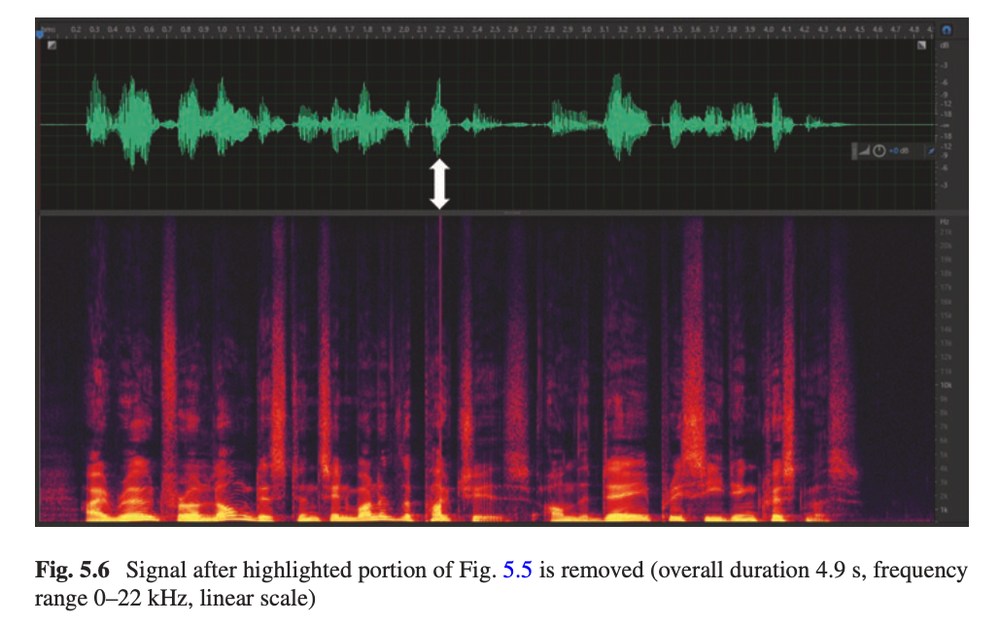

{}
Here's the result after the butt splice deletion. Look at the waveform and spectrogram carefully. The recording is now about 4.9 seconds long instead of the original 5.3 seconds. Can you see the edit point? There's an abrupt discontinuity in the waveform. The white arrow points to where the splice occurred.

Because the edit left an abrupt discontinuity in the waveform, the resulting waveform and spectrogram show evidence of a click in the signal. At this time scale, the effect is most easily seen as a vertical line in the spectrogram. Why a vertical line? Because the abrupt splice discontinuity in the waveform exposes spectral energy at all frequencies for a brief instant. Remember from our earlier lectures: an impulsive sound like a click appears as a vertical line in the spectrogram because it has energy across all frequencies but lasts only a brief moment. That's exactly what a butt splice creates: an artificial impulse at the edit point.
{}

---

## Zooming Into the Butt Splice

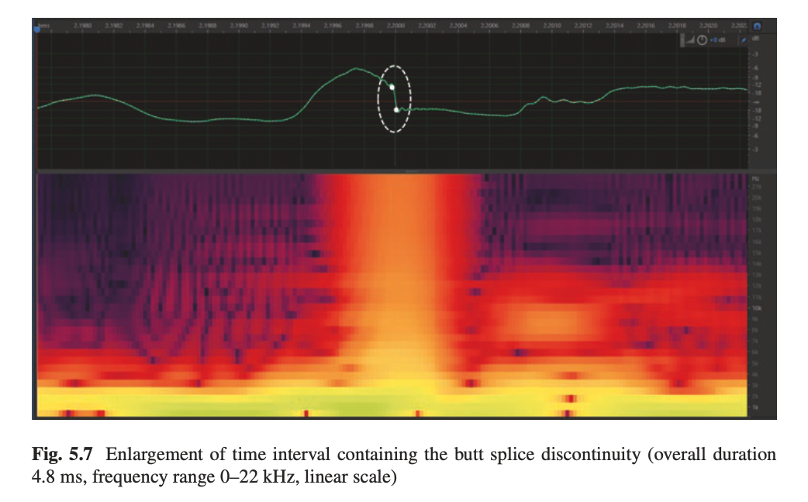

{}
Now let's zoom way in on that edit point. This enlargement shows just 4.8 milliseconds around the butt splice discontinuity. Look at the waveform in the upper panel. You can clearly see the abrupt change, the signal is going in one direction and then suddenly jumps to a completely different value. There's no smooth transition at all.

And look at the spectrogram below. That abrupt change in the time domain waveform leads to a spread of high-frequency energy at the corresponding point in the spectrogram. This is a textbook example of what a butt splice looks like when you zoom in.

Now, while this example makes it appear easy to identify a butt splice edit, a more skilled forger would do two things to conceal the edit. First, they would choose the edit point more carefully, perhaps at a moment when the signal is near silence or at a zero crossing, to minimize the signal discontinuity. Second, they would use a short cross-fade instead of a butt splice. Let's look at what that does.
{}

---

## Cross-Fade Concealment

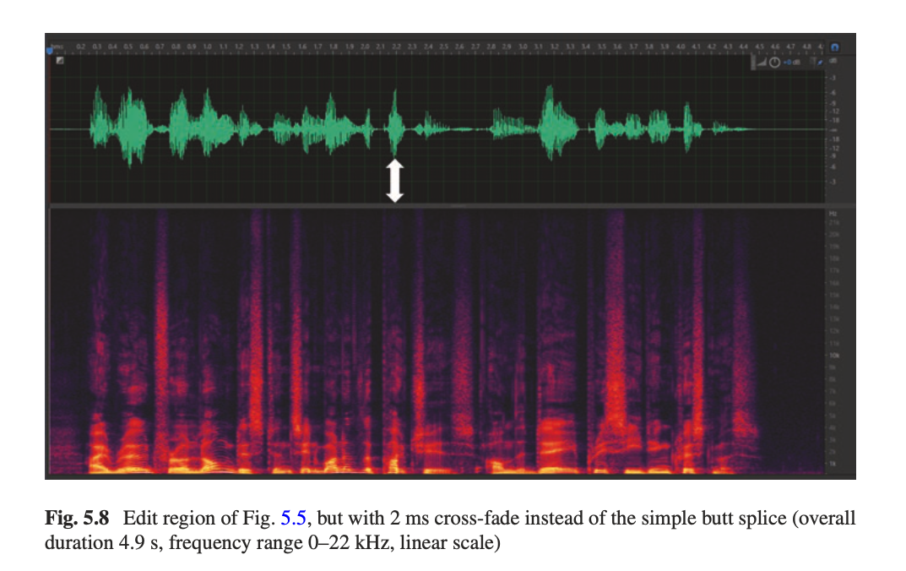

<!-- Book Fig 5.8: Same edit with 2ms cross-fade -->

Same deletion, but with a 2 ms cross-fade instead of a butt splice

{}
Here's the same deletion we just looked at, but this time the forger used a 2-millisecond cross-fade instead of the butt splice. The cross-fade means overlapping a few samples from before the edit and a few samples after the edit, and tapering the amplitude to blend the samples together, thereby reducing the likelihood of a noticeable discontinuity at the splice point.

Look at this compared to what we saw before. The obvious click artifact is gone. The waveform looks much smoother at the edit point. In the spectrogram, there's no obvious vertical line of broadband energy. At this zoom level, the edit is much harder to spot. This is what makes a skilled forger dangerous: with just a 2-millisecond cross-fade, they can dramatically reduce the visual and audible evidence of the edit.

So if a cross-fade can hide the splice point this effectively, how do we detect edits? We need to look beyond the splice point itself and examine other properties of the recording.
{}

---

## Zooming Into the Cross-Fade

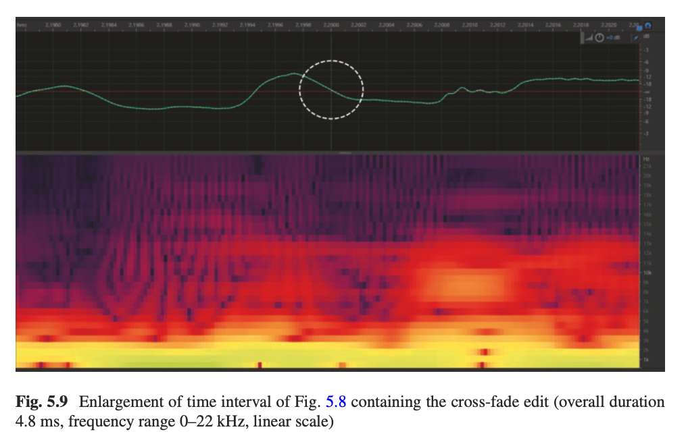

{}
Here's the zoomed-in view of the cross-fade edit, showing the same 4.8-millisecond time interval we looked at for the butt splice. Compare this to the butt splice enlargement we saw earlier. The waveform is much smoother. There's still a subtle indication that something happened here if you look very carefully at the waveform shape, but it's nowhere near as obvious as the butt splice discontinuity.

The spectrogram also looks much cleaner. The broadband energy spread that was so obvious in the butt splice version is almost entirely gone. This demonstrates why a forensic examiner cannot rely solely on looking for discontinuities in the waveform or spectrogram. A skilled forger with even basic audio editing knowledge will use cross-fades. So we need other techniques. And that brings us to one of the most powerful tools we have: analyzing the acoustic environment captured in the recording.
{}

---

## Reverberation as a Detection Tool

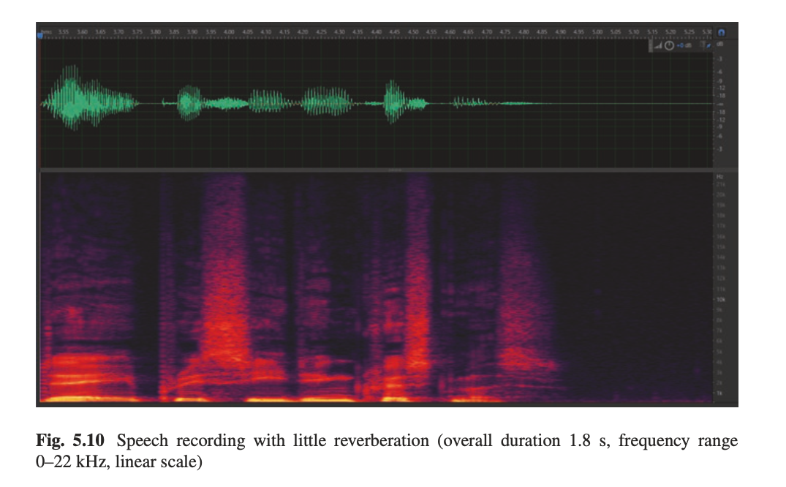

{}
Let's talk about reverberation as a clue for detecting edits. This figure shows a segment of speech recorded in a room with little reverberation, what we call a dry recording environment. Look at the spectrogram. Notice how the gaps between the uttered words are relatively clean and dark. There's not much energy hanging around between the speech segments because the room doesn't produce significant reflections.

Now remember, when a microphone records someone speaking, it picks up not only the direct sound of the voice but also the acoustic reflections from the floor, walls, ceiling, and other nearby surfaces. The microphone also picks up other sounds in the environment: wind, doors closing, mechanical sounds, alarms, whatever is going on. All of this environmental acoustic information becomes embedded in the recording, and it's very difficult for a forger to replicate convincingly. This is the key insight that makes reverberation analysis so powerful for authenticity assessment.
{}

---

## Speech With Reverberation

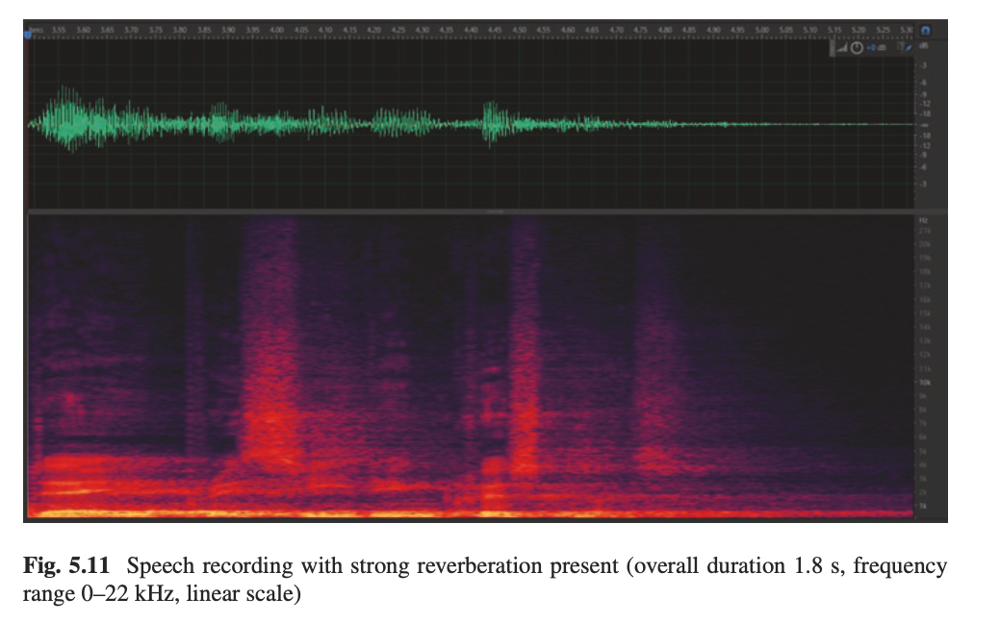

{}
Now compare that dry recording to this one. This is a speech recording made in a room with strong reverberation present. Look at the difference in the spectrogram. The gaps between words that were dark and clean in the dry recording are now filled with the lingering echoes and reverberation of the preceding sounds. You can see the reverberant energy trailing off after each speech segment.

This reverberation is like an acoustic fingerprint of the room. It's continuous, it's consistent throughout the recording if the recording was made in a single session in a single location, and it's extremely difficult to fake convincingly. If a forger wants to insert material into a recording like this, they have a serious problem. The inserted material needs to have the same reverberation characteristics as the rest of the recording. If it doesn't match, a trained examiner will notice the discrepancy. Let's look at what happens when someone tries.
{}

---

## Detecting a Dry Insertion in a Reverberant Recording

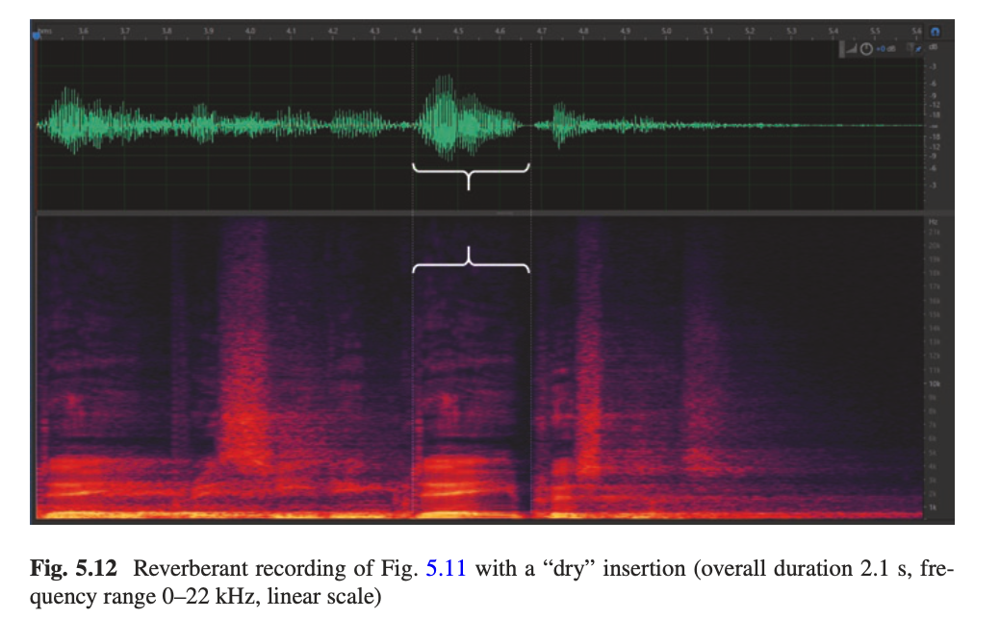

{}
Here's what happens when someone tries to insert newly created material into that reverberant recording. A short utterance of dry speech has been inserted into the reverberant recording. Look at the area marked with the brackets. Can you see the difference?

The inserted speech lacks the reverb tail that's apparent after all the other recorded words. The surrounding words have this trailing energy in the spectrogram from the room reverberation, but the inserted segment drops off cleanly because it was recorded in a different acoustic environment, one without the same reverberation. This mismatch would also be apparent during critical listening. A trained ear would notice that one segment sounds drier than the rest.

This is why I keep emphasizing the importance of critical listening alongside visual analysis. Sometimes the spectrogram reveals things the ear might miss, and sometimes the ear catches things that are hard to see in a spectrogram. The two approaches complement each other, and a thorough forensic examiner uses both.
{}

---

## Background Sound Clues

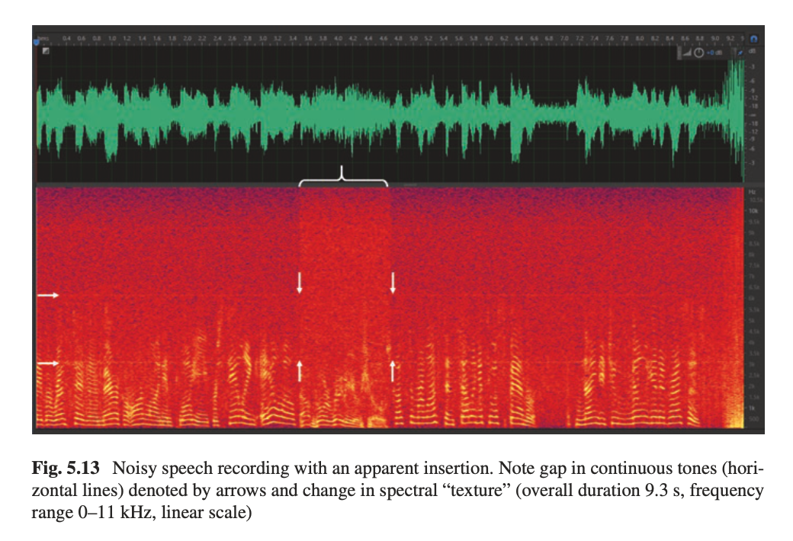

{}
Here's another example that shows a different type of clue. This is a noisy speech recording, and if you look at the spectrogram, you can see significant background noise and two continuous discrete tones, those horizontal lines indicated by the arrows on the left. These tones might be from electrical equipment, HVAC systems, or other constant sources in the recording environment.

Now look at the section in the middle marked by the vertical arrows. There's a brief section where there's a subtle difference in the noise texture, and the continuous tones that are present in the rest of the recording are absent. The noise floor looks slightly different. These observations, the gap in the continuous tones and the change in spectral texture, indicate a likely edit insertion into the recording. The material that was inserted came from a different acoustic environment that didn't have those same background tones.

This is a fantastic example of why you need to pay attention to background sounds during your analysis. Foreground content like speech can be relatively easy to fabricate convincingly, but matching all the subtle background characteristics of a recording environment is extremely difficult.
{}

---

## Summary: What Examiners Look For

- **Waveform discontinuities** (butt splices, clicks)
- **Spectral artifacts** (broadband energy at edit points)
- **Reverberation mismatches** (dry vs. wet segments)
- **Background sound inconsistencies** (noise floor, tones)
- **Acoustic environment changes** (room characteristics)
- No single technique is foolproof; use them all together

{}
So let's bring it all together. When assessing the authenticity of a digital audio recording, an examiner looks for several types of evidence. First, waveform discontinuities that indicate butt splices or rough edits, which show up as clicks or abrupt jumps in the waveform. Second, spectral artifacts like broadband energy at edit points that appear as vertical lines in the spectrogram. Third, reverberation mismatches where different segments of the recording have different reverberant characteristics, suggesting material from different acoustic environments was combined. Fourth, background sound inconsistencies like changes in the noise floor texture or the disappearance and reappearance of continuous tones. And fifth, any changes in the overall acoustic environment characteristics.

No single one of these techniques is foolproof on its own. A skilled forger can potentially defeat any individual test. But when you combine all of these approaches, examining the waveform, the spectrogram, the reverberation, the background sounds, and performing careful critical listening, you build a comprehensive picture. Next week we'll add another powerful tool to this toolkit when we discuss Electrical Network Frequency analysis.
{}
