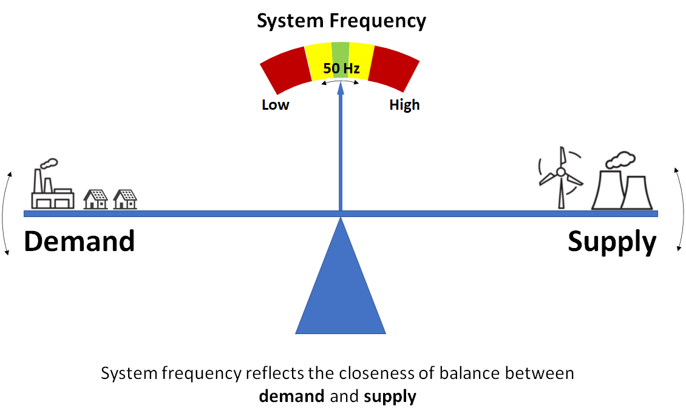
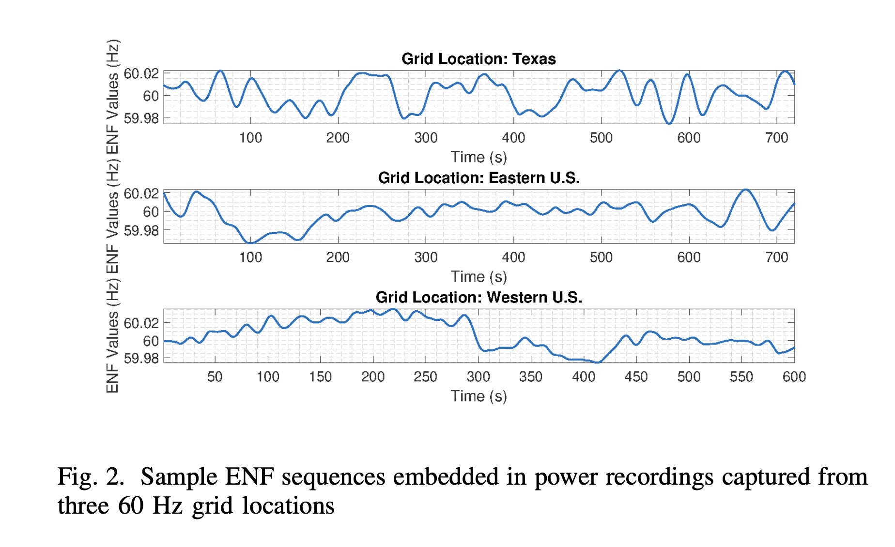
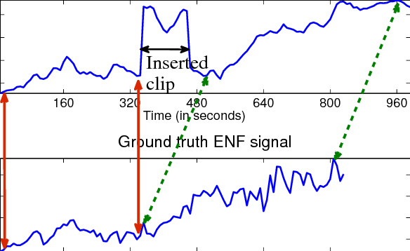
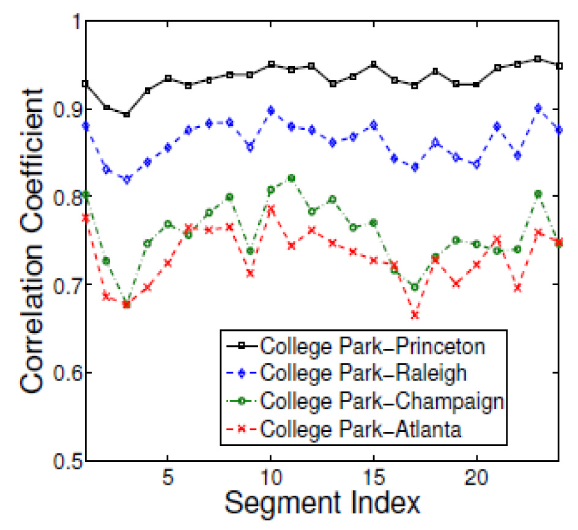
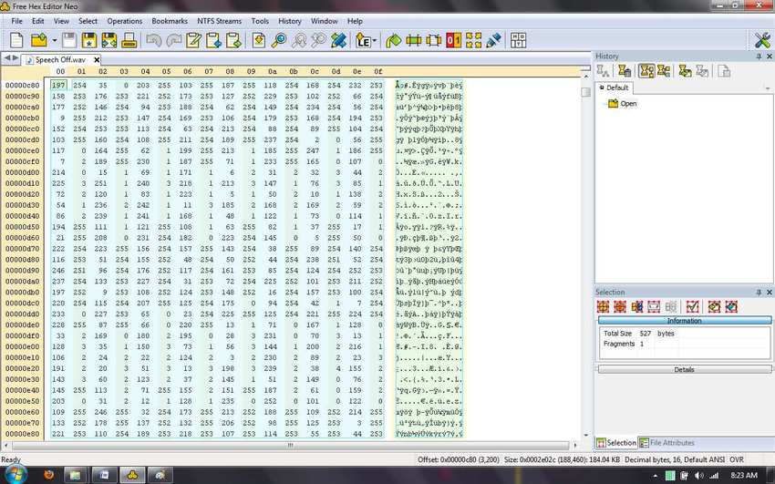
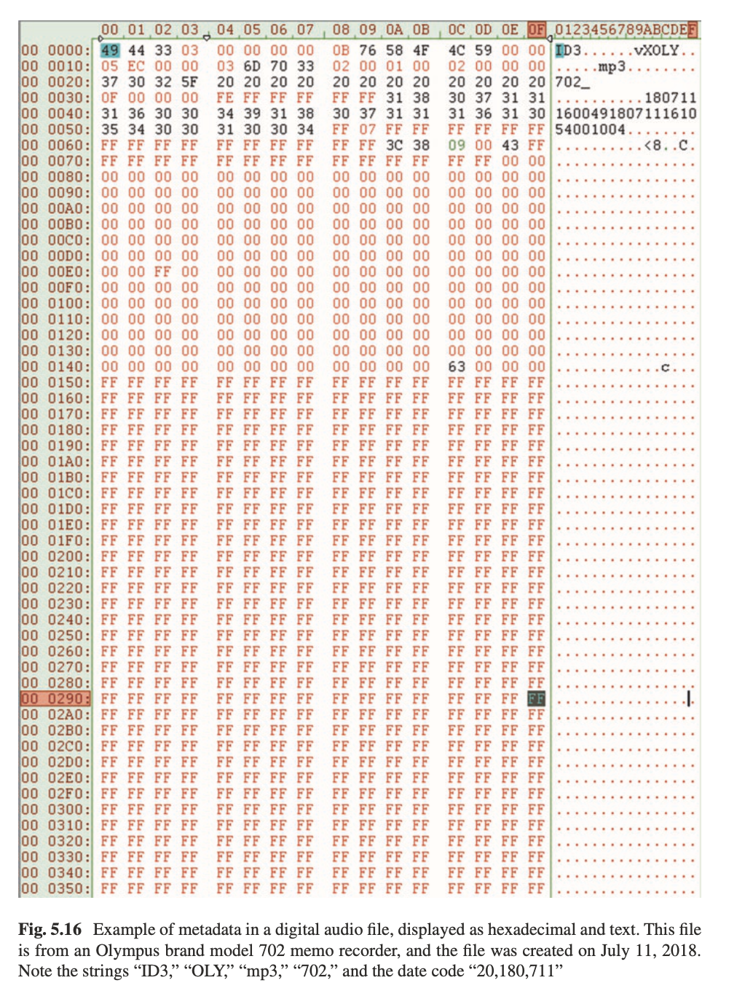

+++
title = "ENF Analysis and Metadata Consistency"
outputs = ["Reveal"]
[reveal_hugo]
theme = "solarized"
margin = 0.2
separator = "##"
+++

## ENF Analysis and Metadata Consistency

Authenticity II: Digital Methods

{}
- Last week we covered analog methods for detecting edits and splices in tape recordings
- Today we move into two powerful digital authentication techniques: Electric Network Frequency (ENF) analysis and metadata consistency checking
- ENF gives us a physical link between a recording and the real world — time, place, and integrity
- Metadata gives us a digital audit trail of how a file was created and whether it's been modified
- Together these are sometimes called the "two pillars of authentication"
- Source: Maher, Robert C. "Authenticity Assessment." In *Principles of Forensic Audio Analysis*, 51–65. Springer, 2018.
{}

---

## Two Pillars of Digital Authentication

- **ENF Analysis** = physical truth anchor
  - Links the recording to real-world time, place, and grid conditions
- **Metadata Consistency** = digital integrity check
  - Verifies the file's lifecycle from creation to present

{}
- Think of these as two independent witnesses — if they agree, you have strong evidence of authenticity
- ENF connects to the physical world: what was the power grid doing when this was recorded?
- Metadata connects to the digital world: what device made this file, what software touched it?
- Neither is sufficient alone — together they resolve ambiguities that either method can't handle
- Source: "The Interplay of ENF Analysis and Metadata Consistency in Digital Audio." Synthesis Report.
{}

---

## Part 1: ENF Analysis

---

## What is ENF?

- **Electric Network Frequency**: the supply frequency of the power grid
- Nominally 50 Hz (Europe, Asia, Australia) or 60 Hz (North America)
- Fluctuates randomly as operators balance supply and demand
- Fluctuations are unique to a specific time and consistent across an entire grid

{}
- ENF has been called one of the most significant developments in audio forensics
- The power grid frequency isn't perfectly stable — it drifts slightly as electricity demand changes throughout the day
- These tiny fluctuations create a pattern that's essentially a fingerprint for a specific moment in time
- A recording made anywhere on the same interconnected grid will capture the same frequency pattern
- This means we can match a recording against a reference database to determine exactly when it was made
- Source: Grigoras, Catalin. "Digital Audio Recording Analysis: The ENF Criterion." *International Journal of Speech Language and the Law* 12, no. 1 (2005): 63–76.
{}

---

## Why Does ENF Fluctuate?

{}
- IMAGE Source: https://wattclarity.com/articles/2025/02/about-system-frequency/
- Grid frequency is determined by the rotational speed of massive generators
- When electrical demand increases (e.g., millions of people turn on kettles at halftime), generators slow slightly and frequency drops
- When demand decreases, generators speed up and frequency rises
- Grid operators constantly adjust to keep frequency near the nominal value
- These corrections create the random, unique pattern we exploit for forensics
- Source: Hua, Guang, Guoan Bi, and Vrizlynn L. L. Thing. "On Practical Issues of ENF Based Audio Forensics." *IEEE Access* 5 (2017): 20640–20651.
{}

---

## How ENF Enters Audio Recordings

| Pathway | How it works |
|---|---|
| **Electromagnetic induction** | Mains hum induced into audio circuitry or cables |
| **Acoustic coupling** | Microphone picks up hum from transformers/motors |
| **Direct connection** | ENF enters through wall outlet power supply |

{}
- Electromagnetic induction: stray magnetic fields from power lines, transformers, or unshielded appliances induce mains hum into audio circuitry or mic cables
- Acoustic coupling: transformers and motors emit an audible hum due to magnetostriction (vibrations from magnetic fields); microphone picks this up
- Direct connection: devices plugged into wall outlets capture ENF through the power supply
- Even battery-powered devices can capture ENF if they're near mains-powered appliances or wiring
- Source: Hua, Guang, Guoan Bi, and Vrizlynn L. L. Thing. "On Practical Issues of ENF Based Audio Forensics." *IEEE Access* 5 (2017): 20640–20651.
{}

---

The ENF Extraction Pipeline

{}
- IMAGE: Flowchart showing the full ENF extraction pipeline: Raw Audio → Decimation (anti-aliasing LPF) → Bandpass Filter → STFT (windowed frames) → Peak Detection → Quadratic Interpolation → ENF Trace
- This is the standard signal processing chain used to isolate the ENF from a recording
- Each step progressively narrows the focus from broadband audio to a single frequency trace
- The output is a one-dimensional time series showing how the power frequency varied over the duration of the recording
- Source: Ojowu, Ode, et al. "ENF Extraction From Digital Recordings Using Adaptive Techniques and Frequency Tracking." *IEEE Transactions on Information Forensics and Security* 7, no. 4 (2012): 1330–1338.
{}

---

## Step 1: Decimation

- Audio recorded at high rates (e.g., 44.1 kHz) but ENF is low-frequency
- Downsample to ~300–400 Hz to focus on the band of interest
- Apply anti-aliasing FIR low-pass filter before decimation
- Reduces computational load dramatically

{}
- We don't need 44,100 samples per second to track a 50 Hz signal
- Decimation reduces the sample rate by a large factor — for example, from 44.1 kHz down to 300 or 400 Hz
- Before decimating, you must apply an anti-aliasing filter to prevent high-frequency content from folding back into the low-frequency range
- A Finite Impulse Response (FIR) low-pass filter is standard because it has linear phase response
- Source: Bykhovsky, D., and A. Cohen. "Electrical Network Frequency (ENF) Maximum-Likelihood Estimation via a Multitone Harmonic Model." *IEEE Transactions on Information Forensics and Security* 8, no. 5 (2013): 744–753.
{}

---

## Step 2: Bandpass Filter

- Isolate the nominal frequency range (e.g., 49.5–50.5 Hz for a 50 Hz grid)
- Sharp FIR bandpass filter removes everything outside this narrow band
- What remains: the ENF signal plus any noise in that frequency range

{}
- The bandpass filter is essentially a window that only lets through frequencies very close to 50 or 60 Hz
- A typical passband is just 1 Hz wide — for example, 49.5 to 50.5 Hz
- The sharper the filter, the better the isolation, but extremely sharp filters require more computation
- After filtering, the dominant content is the ENF signal, though noise in the same band remains
- Source: Grigoras, Catalin. "Digital Audio Recording Analysis: The ENF Criterion." *International Journal of Speech Language and the Law* 12, no. 1 (2005): 63–76.
{}

---

## Step 3: STFT Analysis

- Divide signal into overlapping frames (typically 8–16 seconds)
- Apply a window function (Hann or Blackman-Tukey) to each frame
- Compute FFT for each frame to find the dominant frequency
- Zero-padding (often 4×) improves frequency resolution

{}
- The Short-Time Fourier Transform breaks the signal into manageable chunks for frequency analysis
- Overlapping frames (typically 50–75% overlap) ensure we don't miss transitions between frames
- The window function tapers the edges of each frame to reduce spectral leakage — artifacts that spread energy across frequency bins
- Hann and Blackman-Tukey windows are standard choices for ENF work
- Zero-padding adds zeros to each frame before the FFT, which interpolates between frequency bins for a smoother spectrum
- Source: Karantaidis, Georgios, and Constantine Kotropoulos. "Blackman–Tukey Spectral Estimation and ENF Matching." *IET Signal Processing* 15, no. 6 (2021): 396–409.
{}

---

## Resolution vs. Frame Length Tradeoff

- Longer frames (16–32 sec): better frequency resolution, poor time resolution
- Shorter frames (1–2 sec): capture sudden changes, but frequency "blurring"
- This is the Heisenberg uncertainty principle applied to signal processing
- Typical forensic choice: 8–16 second frames as a compromise

{}
- This tradeoff is often called the "uncertainty principle" of signal processing because it's mathematically analogous to Heisenberg's uncertainty principle in quantum mechanics
- In quantum physics, you can't simultaneously know a particle's exact position and exact momentum — the more precisely you measure one, the less precisely you can know the other. The product of their uncertainties has a lower bound: Δx · Δp ≥ ℏ/2
- In signal processing, the same mathematical relationship applies to time and frequency: Δt · Δf ≥ 1. The product of your time resolution and frequency resolution can never be smaller than 1. If you want frequency bins spaced 0.1 Hz apart (Δf = 0.1), you need at least a 10-second window (Δt = 10). There's no windowing trick or algorithm that can beat this limit.
- This isn't just an analogy — both constraints arise from the same underlying mathematics of Fourier transforms. A signal that is compact in time must be spread out in frequency, and vice versa.
- Concrete example: A 16-second frame at 400 Hz sample rate gives frequency bins spaced ~0.06 Hz apart — enough to resolve subtle ENF fluctuations like 49.97 Hz vs. 50.03 Hz. But if the recording was edited at the 10-second mark, you can't pinpoint when — the edit is somewhere within that 16-second window.
- A 1-second frame gives bins spaced 1 Hz apart — far too coarse to distinguish those same frequencies, but you'd know exactly when something changed.
- Forensic analysts typically choose 8–16 second frames as a practical compromise
- The exact choice depends on the application: authentication needs fine frequency resolution; tampering detection may need better time resolution to spot edits
- Source: Hua, Guang, Guoan Bi, and Vrizlynn L. L. Thing. "On Practical Issues of ENF Based Audio Forensics." *IEEE Access* 5 (2017): 20640–20651.
{}

---

## Step 4: Peak Detection and Interpolation

- Find the highest-magnitude FFT bin in each frame — this is the ENF estimate
- True frequency usually falls between bins
- Quadratic interpolation (QIFFT) refines the peak to sub-bin precision
- Concatenate all frame estimates → the ENF trace

{}
- The FFT gives you a discrete set of frequency bins, but the actual ENF frequency is continuous
- The bin with the highest magnitude is only an approximation — the true peak is usually between two bins
- Quadratic interpolation fits a parabola to the peak bin and its two neighbors, then finds the vertex
- This gives sub-bin precision — essential because ENF variations are often only hundredths of a Hertz
- The final ENF trace is a time series: one frequency estimate per frame, spanning the entire recording duration
- Source: Ojowu, Ode, et al. "ENF Extraction From Digital Recordings Using Adaptive Techniques and Frequency Tracking." *IEEE Transactions on Information Forensics and Security* 7, no. 4 (2012): 1330–1338.
{}

---

## ENF Trace Example

{}
- IMAGE source: https://arxiv.org/pdf/1912.09428
- This is what the output of the extraction process looks like
- The trace wanders randomly around the nominal frequency — these fluctuations are the "fingerprint"
- A longer recording gives more data points and a more unique fingerprint
- Notice the variations are tiny — typically just hundredths of a Hertz — but they're consistent and measurable
- Source: Grigoras, Catalin. "Digital Audio Recording Analysis: The ENF Criterion." *International Journal of Speech Language and the Law* 12, no. 1 (2005): 63–76.
{}

---

## Beyond STFT: Parametric Methods

- **MUSIC**: eigendecomposition of autocorrelation matrix; exhaustive spectral search
- **ESPRIT**: uses rotational invariance; faster and more robust than MUSIC
- Both offer higher resolution than STFT but assume a signal model
- STFT remains the standard for most forensic work

{}
- STFT is the workhorse, but parametric methods can offer better frequency resolution
- MUSIC (Multiple Signal Classification) separates the signal into signal and noise subspaces using eigendecomposition
- It then searches across all frequencies to find where the signal subspace projects — computationally expensive
- ESPRIT (Estimation of Signal Parameters via Rotational Invariance Techniques) finds frequency directly through phase shifts — faster and more robust to model mismatches
- In practice, STFT is still preferred for most forensic work because it makes fewer assumptions and is well-understood by courts
- Source: Bykhovsky, D., and A. Cohen. "ENF Maximum-Likelihood Estimation via a Multitone Harmonic Model." *IEEE Transactions on Information Forensics and Security* 8, no. 5 (2013): 744–753.
{}

---

## ENF Harmonics

- The fundamental (50/60 Hz) may be filtered out by communication systems (>300 Hz cutoff)
- Harmonics at 100, 150, 200 Hz etc. can survive
- **Multi-Harmonic Combining (MHC):** analyze multiple harmonics for better robustness
- Some systems examine up to the 116th harmonic

{}
- Phone systems often high-pass filter below 300 Hz — this completely destroys the 50/60 Hz fundamental
- But the harmonics (integer multiples of the fundamental) may survive: 100, 150, 200 Hz and beyond
- Multi-Harmonic Combining extracts traces from several harmonics and combines them for improved signal-to-noise ratio
- Research has shown that combining harmonics significantly improves both resolution and noise robustness
- In extreme cases, analysts have used harmonics up to the 116th to detect ENF when lower bands are destroyed
- Source: Bykhovsky, D., and A. Cohen. "ENF Maximum-Likelihood Estimation via a Multitone Harmonic Model." *IEEE Transactions on Information Forensics and Security* 8, no. 5 (2013): 744–753.
{}

---

## ENF Reference Databases

| Database | Access |
|---|---|
| [FNET/GridEye](https://fnetpublic.utk.edu/) | Public |
| [ENF-WHU Dataset](https://github.com/ghua-ac/ENF-WHU-Dataset) | Open source |
| [Power IT Lab](https://powerit.utk.edu/forensic_research.html) | Academic |
| [MAST@UMD ENF](https://www.mast.umd.edu/research.php?t=enf) | Academic |

{}
- Reference databases are the "ground truth" for forensic comparisons — without them, ENF analysis can detect tampering but cannot determine time-of-recording
- **FNET/GridEye** (University of Tennessee / Oak Ridge National Lab): uses 300+ GPS-synchronized Frequency Disturbance Recorders (FDRs) that measure grid frequency at ordinary wall outlets with accuracy within ± 0.0005 Hz. Collects 4+ GB of phasor data per day. Covers the three major North American grids and 16 of the largest grids worldwide.
- **ENF-WHU Dataset**: open-source dataset of audio recordings with matched ENF ground truth, useful for testing and benchmarking ENF extraction algorithms
- Law enforcement agencies also maintain their own databases (e.g., UK Metropolitan Police has recorded mains frequency continuously since 2005)
- Typical setup for recording a reference database: step-down transformer reduces mains voltage (e.g., 240V → 18V), a voltage divider brings it within sound card input range, GPS synchronization provides precise timestamps, and the system records continuously
- Stored as time-stamped frequency logs, typically one ENF sample per second
- Source: Grigoras, Catalin. "Digital Audio Recording Analysis: The ENF Criterion." *International Journal of Speech Language and the Law* 12, no. 1 (2005): 63–76.
{}

---

## Authentication: Matching Against the Database

- Extract ENF trace from the recording
- Normalize both trace and reference to zero mean, unit variance
- Slide the trace across the reference database sample by sample
- Measure similarity with correlation coefficient or MMSE

{}
- Once we have the ENF trace, we compare it against the reference database
- Normalization removes frequency offsets caused by recorder clock drift — we care about the shape of the fluctuations, not the absolute frequency
- The sliding window comparison is like matching a puzzle piece against a very long strip
- Pearson Product-Moment Correlation Coefficient (PMCC) measures shape similarity — a value near 1.0 indicates a strong match
- Minimum Mean Squared Error (MMSE) measures the Euclidean distance between patterns — lower is better
- Source: Hua, Guang, Jonathan Goh, and Vrizlynn L. L. Thing. "A Dynamic Matching Algorithm for Audio Timestamp Identification Using the ENF Criterion." *IEEE Transactions on Information Forensics and Security* 9, no. 7 (2014): 1045–1055.
{}

---

## When is a Match Statistically Significant?

- Grids have daily cycles (morning surges repeat) creating self-similarity
- A Monday morning pattern may randomly resemble another Monday
- Recordings <10 minutes are highly susceptible to false positives
- SNR is critical: low SNR causes rapid increase in matching errors

{}
- Not every correlation peak is a true match — you need statistical significance
- Power grids have recurring patterns: weekday mornings tend to look similar because of similar demand patterns
- This "self-similarity" means short traces may match multiple points in the database equally well
- Recordings under 10 minutes are particularly vulnerable — there simply isn't enough random variation to be unique
- Signal-to-noise ratio matters enormously: once SNR drops below a threshold, matching errors increase rapidly
- This is why ENF alone isn't always enough — you need metadata as a second line of evidence
- Source: Pop, Gheorghe, Dragoş Burileanu, and Şerban Mihalache. "An Evaluative ENF-Based Framework for Forensic Authentication." *Proceedings of the Romanian Academy, Series A* 19, no. 4 (2018): 605–612.
{}

---

## Timestamping: The Cracow Case

- 2003 Poland: disputed recording of two businessmen
- Device clock was off by nearly 200 days vs. witness testimony
- ENF trace matched the time claimed by witnesses, not the device clock
- ENF provided the objective physical evidence to resolve the dispute

{}
- This is one of the landmark cases in ENF forensics
- Two businessmen had a conversation that was recorded, but the device's internal clock showed a date nearly 200 days different from what witnesses claimed
- Forensic analysts extracted the ENF signal and compared it against the Polish power grid reference database
- The ENF matched the date and time claimed by the witnesses, proving the device clock had been set incorrectly
- This case demonstrated that ENF can provide an independent, objective timestamp that doesn't depend on easily manipulated device settings
- Source: Cooper, Alan J. "The Electric Network Frequency as an Aid to Authenticating Forensic Digital Audio Recordings." *Proceedings of the AES 33rd Conference* (2008): 1–10.
{}

---

## Tampering Detection via ENF

- Splicing creates discontinuities in the ENF trace
- **Phase jumps:** sudden shifts in wave position (detectable at millisecond level)
- **Frequency jumps:** sudden changes in the ENF value between frames
- Natural grid fluctuations are slow and continuous; edits create abrupt breaks

{}
- If someone splices two recordings together, each segment has its own ENF pattern from a different time
- At the splice point, the ENF trace will show a sudden discontinuity
- Phase is especially sensitive — even if the frequency looks similar on both sides of a splice, the phase of the wave will almost certainly not match up
- Natural grid fluctuations are slow because they're governed by the physical inertia of massive generators — sudden spikes or drops are a red flag for digital editing
- Source: Maher, Robert C. "Authenticity Assessment." In *Principles of Forensic Audio Analysis*, 51–65. Springer, 2018.
{}

---

## Inserted Clip Example

{}
- IMAGE Source: https://www.researchgate.net/figure/ENF-matching-result-demonstrating-the-detection-of-video-tampering-based-on-the-ENF_fig3_221572558
- This figure shows how ENF analysis detects a tampered recording by comparing it against a ground truth ENF signal
- **Top plot**: The ENF trace extracted from a recording. The blue line shows the frequency fluctuations over ~960 seconds. Between roughly 320–480 seconds, a segment labeled "Inserted clip" has been spliced in — its ENF pattern doesn't match the surrounding audio.
- **Bottom plot**: The ground truth ENF signal from the reference database for the same time period
- **Red arrows and lines**: Show the correspondence between the inserted clip in the recording and where that clip actually came from in the ground truth. The red vertical lines connect the splice boundaries in the top plot to matching points in the bottom plot, revealing that the inserted audio originated from a different time.
- **Green dashed arrows**: Show how the authentic portions of the recording (before and after the splice) align with the ground truth signal — these sections match, confirming they are unaltered.
- The key insight: the authentic segments correlate well with the reference, but the inserted clip correlates with a *different* time period — proof of tampering
- Dynamic Matching Algorithms (DMA) can auto-correct noise-affected estimates during the sliding correlation process
- Source: Hua, Guang, Jonathan Goh, and Vrizlynn L. L. Thing. "A Dynamic Matching Algorithm for Audio Timestamp Identification Using the ENF Criterion." *IEEE Transactions on Information Forensics and Security* 9, no. 7 (2014): 1045–1055.
{}

---

## ENF in Video

- Artificial lights flicker in sync with the power grid
- Flicker occurs at 2× grid frequency (100 Hz or 120 Hz) — both AC half-cycles produce light
- Invisible to humans, but captured by camera sensors

{}
- ENF isn't limited to audio — it can also be extracted from video recordings
- Artificial light sources like fluorescent and incandescent bulbs flicker at twice the grid frequency
- This is because the bulb produces light during both the positive and negative halves of the AC cycle
- So a 50 Hz grid creates 100 Hz flicker; a 60 Hz grid creates 120 Hz flicker
- This flicker is far too fast for humans to perceive, but camera sensors capture it as subtle brightness variations
- Source: Karantaidis, Georgios, and Constantine Kotropoulos. "An Automated Approach for ENF Estimation in Static and Non-Static Digital Video Recordings." *Journal of Imaging* 7, no. 10 (2021): 202.
{}

---

## ENF for Geolocation

- **Inter-grid**: Which power grid was the recording made on?
  - US Eastern, US Western, European grids have independent frequency patterns
- **Intra-grid**: Where within a specific grid?
  - Frequency varies slightly by location due to local load conditions

{}
- ENF can potentially tell us not just when a recording was made, but where
- Inter-grid localization is the easier problem: different power grids operate independently and have completely different frequency patterns
- You can distinguish between the US Eastern Interconnection, the US Western Interconnection, and the European grid
- Intra-grid localization is much harder — it tries to pinpoint a location within a single grid based on subtle local variations
- Researchers have developed neural network frameworks like InterGridNet for automated grid classification
- Source: Korgialas, Christos, et al. "InterGridNet: An ENF Approach for Audio Source Location Classification Using Convolutional Neural Networks." arXiv preprint, March 2025.
{}

---

## Localization Within a Power Grid

{}
- Main ENF fluctuation trends are similar across a power grid, but the high-frequency details differ by location. By high-pass filtering ENF signals, you can isolate these location-specific variations.
- **The figure** shows the correlation between high-passed ENF signals measured at College Park, MD and four other cities in the East US grid. Each point is the correlation coefficient for one time segment.
- **College Park–Princeton** (black, squares): highest correlation (~0.90–0.98) — Princeton, NJ is geographically closest to College Park, MD
- **College Park–Raleigh** (blue, circles): next highest (~0.85–0.90) — Raleigh, NC is moderately close
- **College Park–Champaign** (green, circles): lower (~0.70–0.85) — Champaign, IL is farther away in the Midwest
- **College Park–Atlanta** (red, x's): lowest (~0.65–0.80) — Atlanta, GA is the farthest city shown
- The pattern is clear: correlation drops with geographic distance. Closer locations share more similar high-frequency ENF details, while distant locations diverge.
- This means that by comparing a recording's high-passed ENF signal against reference signals from known locations, analysts can estimate where within a grid the recording was made.
{}

---

## Limitations of ENF Analysis

- **Weak signal**: ENF is often 40–60 dB below primary audio content
- **Short recordings** (<10 min): self-similarity creates false positive risk
- **In-band interference**: voices and music in the 50/60 Hz range corrupt the trace
- **Clock skew**: device clocks drift, complicating alignment

{}
- ENF is powerful but not a silver bullet — understanding the limitations is critical
- The signal is typically very weak compared to speech or music content
- Background noise can completely mask it, especially in outdoor recordings far from power infrastructure
- Human voices with low fundamental frequencies and bass-heavy music occupy the same frequency range
- Recording devices have internal clocks that drift over time — the examiner must account for this desynchronization when matching against the reference database
- Source: Hua, Guang, Guoan Bi, and Vrizlynn L. L. Thing. "On Practical Issues of ENF Based Audio Forensics." *IEEE Access* 5 (2017): 20640–20651.
{}

---

## ENF Anti-Forensics: The Threat

- Attackers can use a notch filter to erase the original ENF signal
- Then re-embed a forged donor signal from a different time/location
- Forged signals can achieve correlation scores up to 0.96 — visually convincing

{}
- As ENF forensics has become more widely known, anti-forensic techniques have emerged
- A bandstop or notch filter at 50/60 Hz surgically removes the original ENF hum
- The attacker then replaces it with an ENF signal from a different time or location — a "donor" signal
- These forged signals can look very convincing and achieve high correlation scores with the false reference
- This is an arms race between forensic examiners and forgers
- Source: Ngharamike, Ericmoore T. "Multimedia Forensics and Security Using ENF Signal Analysis." PhD thesis, University of the Sunshine Coast, 2025.
{}

---

## Detecting ENF Forgery

- Forged signals leave traces in high-frequency spectral content
- Subtle phase inconsistencies where the synthetic tone blends with the audio
- Recapturing (playing and re-recording) embeds two overlapping ENF signals
- Examiners use decorrelation algorithms and deep learning CNNs to detect these

{}
- While anti-forensics is a real threat, it's not undetectable
- Re-embedded ENF signals often leave artifacts in the high-frequency spectrum that don't match a natural recording
- The blend points where the synthetic tone meets the original audio can show phase inconsistencies
- Recapturing — playing a recording through speakers and re-recording it — creates two overlapping ENF signals: the original in the content and the new one from the recording environment
- Specialized decorrelation algorithms can separate these overlapping signals
- Deep learning convolutional neural networks are also being trained to detect these forgeries automatically
- Source: Ngharamike, Ericmoore T. "Multimedia Forensics and Security Using ENF Signal Analysis." PhD thesis, University of the Sunshine Coast, 2025.
{}

---

## Part 2: Metadata Consistency

---

## What is Audio Metadata?

- **Internal metadata**: embedded in the file container (headers, encoding info, device tags)
- **External metadata**: maintained by the OS (file system timestamps)
- Together they form a digital audit trail of the file's lifecycle

{}
- Now we shift to the second pillar of digital authentication: metadata consistency
- Every audio file carries metadata — data about data — that documents how, when, and where it was created
- Internal metadata lives inside the file itself: RIFF chunks in WAV files, ID3 tags in MP3s, manufacturer-specific signatures
- External metadata is maintained by the operating system: file creation date, modification date, access date
- A forensic examiner audits this metadata to check whether the file's claimed origin matches its actual digital properties
- Source: "The Interplay of ENF Analysis and Metadata Consistency in Digital Audio." Synthesis Report.
{}

---

## Metadata Examination Workflow

1. **Acquire and hash**: secure the original, create a bit-stream copy, generate MD5/SHA256
2. **Technical assessment**: document format, codec, sample rate, bit depth, duration
3. **Global audit**: use multiple tools to extract all metadata fields
4. **Exemplar creation**: record test files on the same device model for comparison
5. **Local discontinuity check**: examine waveform and spectrogram for anomalies

{}
- Forensic examiners follow a systematic, repeatable process
- Step 1 is critical: the cryptographic hash ensures the file remains unchanged throughout the investigation — if the hash changes, the evidence may be compromised
- Multiple metadata tools are used because different tools may extract different fields — you don't want to miss anything
- Exemplar creation means making test recordings on the same device model with the same settings, so you know what "authentic" metadata from that device looks like
- The local discontinuity check looks for places where the audio content contradicts the metadata
- Source: SWGDE. "Best Practices for Digital Audio Authentication." Version 1.3, September 2018.
{}

---

## Hash Verification

- MD5 or SHA256 hash computed immediately upon acquisition
- Creates a unique digital fingerprint of the file's exact contents
- Any change — even a single bit — produces a completely different hash
- **Piecewise hashing**: verify integrity of specific file segments independently

{}
- Hashing is the foundation of digital evidence integrity
- Think of it as a tamper-evident seal: if anyone modifies the file after hashing, the hash won't match
- MD5 is faster but theoretically vulnerable to collisions; SHA256 is more secure
- Standard practice is to hash the file at acquisition, document the hash, and re-verify at every stage of the investigation
- Piecewise hashing is an advanced technique that lets investigators verify specific portions of a file even if the overall file has been legitimately modified (e.g., metadata added by the forensic tool itself)
- Source: SWGDE. "Best Practices for Digital Audio Authentication." Version 1.3, September 2018.
{}

---

## Hex Editor Analysis

{}
- IMAGE: Screenshot of a hex editor showing a WAV file's binary data — left column shows hex values, right column shows ASCII interpretation. Highlight the "RIFF" header at offset 0, "WAVE" identifier, "fmt " chunk, and "data" chunk markers
- A hex editor shows the raw binary data of a file as both hexadecimal values and ASCII text
- This is the lowest level of analysis — you're looking at exactly what's stored in the file
- WAV files begin with "RIFF" followed by "WAVE" — these are the magic bytes that identify the format
- The "fmt " chunk contains encoding parameters; the "data" chunk contains the actual audio
- Different file formats have different header patterns: MP3 often starts with "ID3", WMA with "0&²"
- Source: SWGDE. "Best Practices for Digital Audio Authentication." Version 1.3, September 2018.
{}

---

## File Headers and Container Formats

- **WAV**: RIFF chunk structure; uncompressed PCM; manufacturer data in custom chunks
- **MP3**: ID3 tags (v1 at end, v2 at beginning); frame-based structure
- **AAC**: Common on smartphones (iPhone default); M4A container
- **WMA**: Microsoft proprietary; ASF container with device-specific metadata

{}
- Each container format has a different internal structure and supports different metadata
- WAV files use the RIFF (Resource Interchange File Format) structure — organized as named "chunks" of data
- MP3 files use ID3 tags for metadata and a frame-based structure for audio data
- AAC is the default codec on iPhones and many Android devices — it uses the M4A or MP4 container
- Forensic examiners must understand these formats deeply to know where to look for evidence of modification
- A file that claims to be from an iPhone but uses a WAV container is immediately suspicious
- Source: "The Interplay of ENF Analysis and Metadata Consistency in Digital Audio." Synthesis Report.
{}

---

## Manufacturer Signatures

- Recording devices embed proprietary hex strings in file headers
- Olympus: "OLY", "mp3", "702" (model number) at specific offsets
- These signatures are like a device fingerprint
- Editing software overwrites these signatures with its own tags

{}
- Different manufacturers embed unique identifiers in their recordings
- An Olympus model 702 recorder writes "OLY," "mp3," and "702" at specific byte offsets in the file
- These aren't visible to normal users — you need a hex editor or specialized tool to see them
- Other manufacturers have their own signature patterns
- If a file is opened in editing software and re-saved, these manufacturer signatures are typically overwritten
- The absence of expected manufacturer signatures in a file that supposedly came directly from that device is a strong indicator of modification
- Source: SWGDE. "Best Practices for Digital Audio Authentication." Version 1.3, September 2018.
{}

---

## The Olympus Example

{}
- IMAGE: Side-by-side hex editor view — left shows an authentic Olympus 702 recording with "OLY", "mp3", and "702" hex strings highlighted; right shows the same file after editing in Adobe Audition with those strings replaced by an XMP metadata block
- This is one of the clearest demonstrations of metadata analysis in forensic authentication
- The authentic file contains the Olympus proprietary signatures at specific byte offsets
- After opening and saving in Adobe Audition, those strings are completely gone
- Replaced by a large block of XML-based XMP metadata identifying Adobe Audition as the last software to touch the file
- Even if no audio content was changed, the metadata tells the full story of modification
- Source: SWGDE. "Best Practices for Digital Audio Authentication." Version 1.3, September 2018.
{}

---

## Encoding Parameters as Evidence

- **Sampling rate** (44.1 kHz, 48 kHz, 8 kHz)
- **Bit depth** (16-bit, 24-bit)
- **Codec** (PCM, AAC, MP3, DSS)
- **Channels** (mono, stereo)
- Mismatches between claimed origin and encoding = evidence of re-encoding

{}
- Every recording device uses specific encoding settings
- An iPhone records AAC at 44.1 kHz; a professional recorder might use WAV at 48 kHz/24-bit
- If a file claims to be an iPhone original but uses MP3 encoding at 22.05 kHz, that's inconsistent
- Re-encoding leaves artifacts: opening a file in an editor and saving it again, even without making changes, often alters encoding parameters
- Dedicated forensic recorders like Olympus often use proprietary codecs (like DSS) that desktop software can't produce
- Examiners compare the file's encoding parameters against what the claimed device would actually produce
- Source: "The Interplay of ENF Analysis and Metadata Consistency in Digital Audio." Synthesis Report.
{}

---

## Device Fingerprints: Smartphones vs. Recorders

- **Smartphones**: GPS coordinates, AAC codec, mobile-specific metadata fields
- **Dedicated recorders**: proprietary codecs (DSS), manufacturer hex strings, serial numbers
- **Computer recordings**: lack physical environment markers, show desktop software signatures
- Double compression artifacts appear when re-encoding a lossy format

{}
- Different device categories leave very different metadata fingerprints
- Smartphones typically include GPS coordinates, use mobile codecs like AAC, and embed rich EXIF metadata
- Dedicated forensic recorders use proprietary formats and contain manufacturer-specific identifiers
- Computer recordings are made with desktop software and lack the physical environment markers that device recordings have
- When a recording is re-encoded from one lossy format to another (e.g., MP3 to AAC), "double compression" artifacts appear — these are detectable and indicate the file is not a first-generation original
- Source: "The Interplay of ENF Analysis and Metadata Consistency in Digital Audio." Synthesis Report.
{}

---

## ExifTool in Forensic Practice

- Standard tool for extracting metadata from audio/video files
- Key fields: Create Date, Modify Date, Make, GPS, Compressor Name
- Can extract EXIF, IPTC, XMP, and format-specific metadata
- Also used to test vulnerabilities — can metadata be injected or modified?

{}
- ExifTool is one of the most important tools in a forensic examiner's toolkit
- It extracts metadata from virtually any media format — audio, video, images
- The "Create Date" and "Modify Date" fields are among the first things checked
- "Make" and "Model" fields identify the recording device
- "Compressor Name" reveals the codec — if it says "HEVC" but the file claims to be from a device that doesn't support HEVC, that's a problem
- ExifTool can also be used to test whether metadata can be injected or modified, helping examiners understand the vulnerabilities
- Source: "The Interplay of ENF Analysis and Metadata Consistency in Digital Audio." Synthesis Report.
{}

---

## Timestamps and MACB

- **M**odification: last time file content changed
- **A**ccess: last time file was opened
- **C**reation: when the file was first created on this volume
- Entry modification (B): when the MFT record was updated
- Stored in the NTFS Master File Table ($MFT)

{}
- On Windows NTFS file systems, each file has four timestamp attributes known as MACB
- These are stored in the Master File Table — the central directory of the file system
- Each timestamp tells a different part of the story
- Forensic examiners compare these timestamps for internal consistency
- If the creation date is after the modification date, something is wrong
- The operating system also maintains journals ($LogFile and $UsnJrnl) that log file operations independently
- Source: Ngharamike, Ericmoore T. "Multimedia Forensics and Security Using ENF Signal Analysis." PhD thesis, University of the Sunshine Coast, 2025.
{}

---

## Detecting Timestomping

- **Timestomping**: manually changing a file's creation or modification date
- Attackers alter $MFT timestamps to match a false narrative
- System journals ($LogFile, $UsnJrnl) record file operations independently
- Comparing MFT timestamps against journal entries reveals the forgery

{}
- Timestomping is when someone deliberately changes a file's timestamps to make it appear created or modified at a different time
- It's relatively easy to change the dates in the MFT — there are tools that do it with a single command
- But most attackers forget about the system journals
- The $LogFile records transactional changes to the file system
- The $UsnJrnl (Update Sequence Number Journal) maintains a granular history of file moves, overwrites, and attribute changes
- If the MFT says a file was created January 5th but the journal shows it was moved there March 12th, the timestamps have been manipulated
- Source: Ngharamike, Ericmoore T. "Multimedia Forensics and Security Using ENF Signal Analysis." PhD thesis, University of the Sunshine Coast, 2025.
{}

---

## Software Fingerprints

- Editing software overwrites manufacturer metadata with its own tags
- Adobe Audition inserts XMP metadata identifying the software version
- Audacity, Pro Tools, and other DAWs leave similar traces
- The absence of expected manufacturer metadata is itself a red flag

{}
- When a recording is opened and re-saved in editing software, the software writes its own metadata
- This overwrites the original manufacturer signatures — the device's fingerprint gets replaced with the editor's fingerprint
- Adobe Audition inserts a large block of XML-based XMP metadata
- Even if the audio content itself isn't changed, simply opening and re-saving in an editor is detectable
- The absence of expected metadata is just as telling as the presence of unexpected metadata
- If a file supposedly came straight from an Olympus recorder but has no Olympus signatures, it's been modified
- Source: "The Interplay of ENF Analysis and Metadata Consistency in Digital Audio." Synthesis Report.
{}

---

## Chain of Custody and Metadata

- Metadata documents the file's complete lifecycle
- Hash at acquisition → hash at every handoff → hash at analysis
- Any break in the chain or hash mismatch = compromised evidence
- Embedded checksums in proprietary formats provide additional verification

{}
- Chain of custody is the legal documentation of who handled evidence and when
- Metadata supports this by providing an independent record of the file's history
- The hash chain is critical: compute the hash when you receive the file, document it, and re-verify at every stage
- If the hash changes at any point, the evidence may have been altered — whether intentionally or accidentally
- Some proprietary recording formats include embedded checksums within data blocks — if these don't match the content, the file has been tampered with
- Source: SWGDE. "Best Practices for Digital Audio Authentication." Version 1.3, September 2018.
{}

---

## Part 3: Putting It Together

---

## ENF + Metadata: Complementary Evidence

- **ENF:** links the file to the physical world (time, place, grid)
- **Metadata:** verifies the digital lifecycle (device, software, timestamps)
- When they agree → strong evidence of authenticity
- When they disagree → strong evidence of tampering

{}
- This is the key synthesis of the entire lecture
- ENF is a physical measurement — it's like a watermark that nature puts on every recording near the power grid
- Metadata is a digital record — it's like the file's passport, documenting where it came from and who handled it
- If the ENF says the recording was made Tuesday at 3 PM on the US Eastern grid, and the metadata says it came from an iPhone in New York with a creation date of Tuesday at 3 PM — that's strong corroboration
- If they disagree, something is wrong, and you need to investigate further
- Source: "The Interplay of ENF Analysis and Metadata Consistency in Digital Audio." Synthesis Report.
{}

---

## Resolving Ambiguity

- **Short recordings**: ENF alone may have multiple matches → metadata narrows the timeframe
- **Forged metadata**: timestamps easily changed → ENF provides independent physical check
- **Clock skew**: device clock drifted → use ENF as a time anchor to calculate the offset
- **Missing ENF**: outdoor/battery recording → metadata may be the only evidence available

{}
- Each method compensates for the other's weaknesses
- For recordings under 10 minutes, the ENF trace may match multiple points in the database due to self-similarity — metadata timestamps help determine which match is correct
- When metadata has been expertly forged (timestamps changed, software signatures removed), ENF provides a physical check that's much harder to fake
- Time anchors are points where the device's internal clock can be synchronized with a GPS-synced ENF reference, allowing you to calculate clock skew
- In cases where no ENF is present (outdoor recording, battery device far from power), metadata may be the only tool available
- Source: "The Interplay of ENF Analysis and Metadata Consistency in Digital Audio." Synthesis Report.
{}

---

## The DEMA System

- Decentralized ENF-based Media Authentication for social media
- Aggregates ENF data from edge nodes and cloud servers
- Uses blockchain (Proof-of-ENF consensus) to prevent database poisoning
- Cross-references EXIF GPS/timestamps against ENF databases

{}
- DEMA is a modern framework designed for authenticating media on social platforms
- It creates a hierarchical ENF map by collecting data from sensors distributed across the grid
- The blockchain component prevents attackers from corrupting the reference database — all nodes must agree on the grid's true frequency
- The system cross-references the GPS coordinates and creation date in a file's EXIF data against the ENF signal in the recording
- If the metadata says "New York, 9 AM" but the ENF matches "London, 2 PM," the file is flagged as forged
- Source: Nagothu, Deeraj, Ronghua Xu, and Yu Chen. "DEMA: Decentralized ENF Map for Social Media Authentication." *Proceedings of SPIE* 12542 (2023): 125420B.
{}

---

## Case Integration Example

- Recording claims to be from March 5, 2:15 PM, New York office
- **Metadata check:** iPhone AAC, creation date March 5, GPS coordinates match office
- **ENF check:** trace matches US Eastern grid reference at March 5, 2:12 PM
- **Clock skew:** 3-minute offset consistent with typical iPhone clock drift
- **Conclusion:** evidence supports authenticity

{}
- This is a hypothetical example showing how the two methods work together in practice
- The metadata says iPhone, March 5, New York — that's internally consistent
- The ENF matches the US Eastern grid at a time 3 minutes off from the claimed time
- A 3-minute offset is consistent with normal device clock drift — not evidence of tampering
- If instead the ENF matched a date two weeks earlier, or the European grid, that would be a serious red flag
- The examiner documents all findings and reports honestly about what the evidence supports
- Source: Maher, Robert C. "Authenticity Assessment." In *Principles of Forensic Audio Analysis*, 51–65. Springer, 2018.
{}

---

## Summary

- ENF analysis extracts power grid frequency to verify time, location, and integrity
- Metadata consistency audits file headers, encoding, and timestamps for modification
- Neither method is sufficient alone — use both as complementary pillars
- The field faces an arms race between forensic tools and anti-forensic techniques

{}
- ENF exploits the fact that power grid frequency fluctuations are captured unintentionally in audio and video
- By matching against a reference database, examiners determine when and potentially where a recording was made
- Metadata checking examines the digital properties: headers, encoding parameters, timestamps, software fingerprints
- The key takeaway: always use both methods together
- ENF anchors the file to the physical world; metadata verifies its digital integrity
- Be aware that anti-forensics is a growing threat — forgers are getting more sophisticated, but so are detection methods
- Source: Maher, Robert C. "Authenticity Assessment." In *Principles of Forensic Audio Analysis*, 51–65. Springer, 2018.
{}
