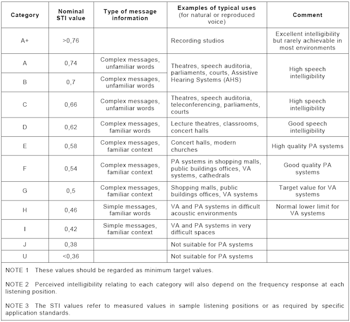
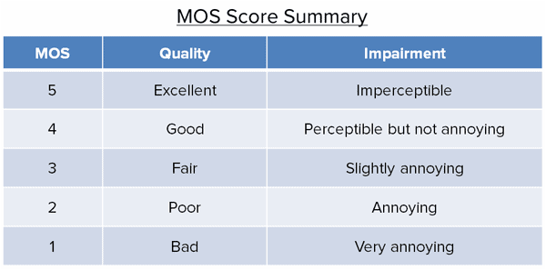

+++
title = "Audio Enhancement Techniques"
outputs = ["Reveal"]
[reveal_hugo]
theme = "solarized"
margin = 0.2
separator = "##"
+++

## Audio Enhancement Techniques

Forensic Audio Analysis — Week 8

{}
- Welcome to week 8, focused on forensic audio enhancement.
- Today we cover four interconnected topics: assessment, the quality vs. intelligibility paradox, filtering and equalization, and gain compression and expansion.
- Forensic audio enhancement is the scientific improvement of signal-to-noise ratio and speech intelligibility in recordings intended for judicial proceedings.
- A foundational rule: all enhancement work must be performed on a verified bitstream copy — never on the original evidence.
- Citation: Maher, Robert C. *Principles of Forensic Audio Analysis*. Springer, 2018.
{}

---

## Today's Topics

- Enhancement assessment and standards
- Speech: quality versus intelligibility
- Filtering and equalization methods
- Gain compression and expansion

{}
- Here is today's road map — four sections, each building on the last.
- Enhancement is not magic: every processing step involves trade-offs.
- Every decision must be defensible in a court of law.
- We move from evaluation (how do we know if we helped?) to specific techniques: filtering, then dynamics.
{}

---

## What is Forensic Enhancement?

- Improve SNR to aid transcription
- Not cosmetic — must be measurable
- Always work from a verified copy
- Document every processing step

{}
- Forensic audio enhancement is different from music production or podcast editing.
- In music, we optimize for aesthetics. In forensics, we optimize for scientifically defensible intelligibility.
- The term "clarification" is sometimes used interchangeably with enhancement in the literature.
- Chain of custody applies to digital copies: the original file must be preserved and unmodified throughout.
- Citation: SWGDE. *Best Practices for Forensic Audio*. Scientific Working Group on Digital Evidence, 2018.
{}

---

{}

## I. Enhancement Assessment

{}
- Assessment is the bookend of the enhancement process — we evaluate before, during, and after processing.
- The goal is a scientifically defensible measurement of whether enhancement helped or harmed intelligibility.
- Without objective assessment, enhancement is just guesswork — unacceptable in court.
- This section covers subjective and objective evaluation methods, protocols, and regulatory standards.
{}

---

## Why Assessment Matters

- Admissibility requires scientific validation
- Enhancement can help or harm evidence
- Courts demand repeatability and rigor
- Subjective "sounds better" is not enough

{}
- Under the Daubert standard, audio evidence must rest on testable, peer-reviewed methodology.
- An examiner who cannot prove that enhancement improved intelligibility — not just perception — risks having the evidence ruled inadmissible.
- The key question the court asks: did the processing change what a reasonable listener would understand?
- If you cannot answer that with a number, you are in a weak position.
- Citation: Maher, Robert C. "Authenticity Assessment." In *Principles of Forensic Audio Analysis*, ch. 3. Springer, 2018.
{}

---

## Subjective Evaluation

- Listeners rate audio as "clearer"
- Fast, intuitive, and easily applied
- Ratings shaped by expectation and context
- Not replicable or standardized

{}
- Subjective evaluation asks trained listeners to rate recordings before and after enhancement.
- It has a long history in audio quality research — but the forensic context creates special problems.
- Listeners are influenced by prior exposure to the recording, by written transcripts, and by the reputation of the examiner.
- Two trained listeners evaluating the same audio can reach contradictory conclusions.
- Research consistently shows that subjective quality ratings do not reliably predict actual word identification accuracy.
- Citation: *Forensic Audio Analysis — Comprehensive Guide* (NotebookLM source).
{}

---

## Limits of Subjective Measures

- "Sounds better" ≠ more intelligible
- Transcript priming distorts listener response
- Two listeners may reach different verdicts
- Courts expect scientific, not personal, opinion

{}
- Here is the critical finding: in controlled studies, listeners prefer enhanced audio in quality ratings, yet identify more words correctly from the original noisy recording.
- Their subjective impression of clarity is decoupled from their actual ability to understand the words.
- This paradox — which we examine in depth in Section 2 — is the main reason subjective assessment has been de-emphasized in forensic practice.
- Courts increasingly require quantitative, replicable evidence.
- Citation: *Forensic Audio Analysis — Comprehensive Guide* (NotebookLM source).
{}

---

## Objective Metrics

- **STI** — speech transmission fidelity
- **AI** — spectral intelligibility estimate
- **PESQ** — perceived speech quality
- **WIS** — human word identification score

{}
- There are four main objective or semi-objective metrics for evaluating speech intelligibility.
- STI and AI are fully physical measurements derived from signal properties.
- PESQ is a computational model of human perception, originally designed for the telecom industry.
- WIS uses human listeners but in a tightly controlled experimental protocol.
- Each measures something slightly different — and choosing the right metric matters enormously for forensic validity.
- Citation: *Forensic Audio Analysis — Comprehensive Guide* (NotebookLM source).
{}

---

## Speech Transmission Index (STI)

- Measures intensity modulation preservation
- Seven octave bands: 125 Hz – 8000 Hz
- 96%+ correlation with intelligibility scores
- Preferred objective standard for forensics

{}
- STI was originally developed for architectural acoustics — measuring whether a lecture hall allows clear speech.
- It measures how well the temporal modulations of speech survive the transmission channel, including noise, reverberation, and processing artifacts.
- The measurement covers seven octave bands from 125 Hz to 8000 Hz.
- A score of 0 represents total unintelligibility; 1.0 represents perfect transmission.
- Values above 0.6 are generally considered "good" for intelligibility purposes.
- Its 96% correlation with subjective intelligibility scores makes it the most trusted physical metric for forensic audio work.
- Citation: *Forensic Audio Analysis — Comprehensive Guide* (NotebookLM source).
{}

---

By <a href="//commons.wikimedia.org/w/index.php?title=User:Acousticator&amp;action=edit&amp;redlink=1" class="new" title="User:Acousticator (page does not exist)">Acousticator</a> - Own work, <a href="https://creativecommons.org/licenses/by-sa/3.0" title="Creative Commons Attribution-Share Alike 3.0">CC BY-SA 3.0</a>, <a href="https://commons.wikimedia.org/w/index.php?curid=22825480">Link</a>

{}

- This image shows the STI score bands and their typical applications.
- STI below 0.3 is considered "bad" — speech is mostly unintelligible.
- STI between 0.3 and 0.6 is "fair" — some words are understood, but many are missed.
- STI above 0.6 is "good" — most words are understood, with some minor degradation.
{}

---

## Word Identification Score (WIS)

- Human listeners transcribe audio samples
- Percentage correct = intelligibility score
- Highest validity — but slow and expensive
- Most persuasive evidence for courts

{}
- WIS involves controlled listening tests where participants hear isolated words or short phrases and write what they hear.
- The percentage of correctly identified words is the intelligibility score.
- Multiple listeners are required to get statistically reliable results — ideally ten or more.
- The process is time-consuming and expensive, but it directly answers the most important question: can a human being understand this recording?
- Because it uses actual human listeners, it is typically the most persuasive form of evidence in court settings.
- The Articulation Index (AI) is an older metric that estimates intelligibility from the spectral properties of speech — less reliable than STI or WIS.
- Citation: *Forensic Audio Analysis — Comprehensive Guide* (NotebookLM source).
{}

---

## Bruce Koenig's 11-Step Protocol

- Evidence marking and chain of custody
- Physical inspection of media
- Critical listening and waveform review
- Spectrographic and digital data analysis
- Enhancement applied iteratively, documented

{}
- Bruce Koenig is a former FBI forensic audio examiner who formalized the standard examination workflow.
- His 11-step protocol — related to the FBI's 12-step procedure from 1988 — is the reference framework for the field.
- The key discipline: no enhancement begins until the complete pre-analysis is done.
- Pre-analysis includes: evidence marking, chain-of-custody documentation, physical inspection of the media, critical listening, waveform analysis, spectrographic analysis, and digital data review.
- Only after all pre-analysis steps are complete does the examiner apply enhancement — iteratively, with measurement at each stage.
- Every processing decision and its parameters must be recorded in writing.
- Citation: *Forensic Audio Analysis — Comprehensive Guide* (NotebookLM source).
{}

---

## AES & SWGDE Standards

- **AES27-1996**: managing recorded materials
- **AES43-2000**: authenticating analog tapes
- **SWGDE**: digital enhancement best practices
- Document every step for court admissibility

{}
- AES stands for the Audio Engineering Society — the main technical professional organization for audio engineering.
- SWGDE stands for the Scientific Working Group on Digital Evidence — a law enforcement and forensic science standards body.
- AES27-1996 provides guidelines for managing and preserving recorded audio materials throughout the examination lifecycle.
- AES43-2000 focuses specifically on authenticating analog tape recordings.
- The SWGDE Best Practices document covers the digital enhancement workflow end-to-end.
- Citing these standards in your examination report gives your methodology a defensible, peer-reviewed foundation.
- Citation: *Forensic Audio Analysis — Comprehensive Guide* (NotebookLM source).
{}

---

## Discussion

- How do we define "good" enhancement?
- When might STI mislead an examiner?
- Can subjective testing ever be valid in court?

{}
- "Good enhancement" — push students to define this operationally. Is it the examiner's impression? The STI score? The client's satisfaction? The answer should be: a measurable increase in a valid intelligibility metric, with no loss to the original evidence.
- STI limitations — STI doesn't fully account for all types of reverberation effects on consonant perception. It also doesn't capture every form of nonlinear distortion introduced by modern noise reduction algorithms. An examiner who relies solely on STI might miss distortions that harm intelligibility in practice.
- Subjective testing in court — it can be valid as a supplement if performed under controlled conditions: multiple trained listeners, blind protocol, no access to transcripts beforehand, results reported with confidence intervals. Some courts have accepted this form of evidence.
{}

{}

---

{}

## II. Speech: Quality vs. Intelligibility

{}
- This section covers arguably the most important concept in forensic audio enhancement.
- It is a paradox that surprises even experienced audio engineers who come from a music or broadcast background.
- The goal of forensic enhancement is not to make audio "sound better" — it is to make speech more understandable.
- These two goals are related, but they are not the same — and in many cases they directly conflict.
{}

---

## The Core Paradox

- Better-sounding ≠ more understandable
- Enhancement may destroy speech cues
- "Comfort" and "clarity" are different goals

{}
- When implemented, the spectrogram image here should show two versions of the same speech segment side by side.
- The original shows noisy, textured high-frequency energy — that texture carries linguistic meaning.
- The filtered version looks visually "clean" but has lost high-frequency phoneme cues.
- This is a case where the spectrogram is actually more informative than your ears — the clean version sounds better but contains less linguistic information.
- Citation: *Forensic Audio Analysis — Comprehensive Guide* (NotebookLM source).
{}

---

## What Makes Speech Intelligible?

- Fricatives: /s/, /f/, /sh/ — high frequency
- Plosives: /p/, /t/, /k/ — short transients
- These cues live in the high-frequency band
- Removing "noise" can remove these cues

{}
- Intelligibility depends on subtle, easily overlooked acoustic details.
- Fricatives are noise-like bursts of turbulent energy, mostly above 4 kHz. The sounds /s/, /f/, /sh/, and /th/ are almost entirely in this band.
- Plosives are extremely brief transients — the burst of air released when a stop consonant opens. They occur in fractions of a millisecond.
- Both fricatives and plosives look like noise to an algorithm or an unsophisticated filter — short, broadband, high-frequency energy.
- If a noise reduction algorithm misclassifies these as noise and removes them, the words they distinguish become inaudible.
- The difference between "sue" and "few", or "bat" and "pat", can be lost entirely.
- Citation: *Forensic Audio Analysis — Comprehensive Guide* (NotebookLM source).
{}

---

## The Filtering Problem

- Filters reduce noise — but at a cost
- Fricatives and plosives resemble noise
- Aggressive filtering smooths them out
- Speech sounds "cleaner" but loses phonemes

{}
- This is the core mechanism behind the quality-intelligibility paradox.
- A lowpass filter or aggressive noise-reduction algorithm cannot distinguish between 5 kHz fricative energy from /s/ and 5 kHz random background hiss.
- It treats both as noise and attenuates them equally.
- The result: a recording that sounds smoother, more comfortable to listen to, with reduced noise annoyance — but with degraded phonemic contrast.
- The examiner may feel they have improved the recording. The STI score will tell the truth.
- Citation: *Forensic Audio Analysis — Comprehensive Guide* (NotebookLM source).
{}

---

## PESQ vs. STI: Different Goals

- **PESQ** — measures naturalness and comfort
- **STI** — measures actual intelligibility
- A processed file can score high on PESQ
- And simultaneously low on STI

{}
- PESQ — Perceptual Evaluation of Speech Quality — was developed for the telecommunications industry to evaluate whether phone calls sound natural.
- It is a model of human perception of speech quality, not intelligibility.
- MOS — Mean Opinion Score — is a related subjective measure of perceived quality, often used in conjunction with PESQ.
- PESQ rewards smooth, natural-sounding audio and penalizes noise, distortion, and harshness.
- But here is the problem: a heavily filtered recording will score well on PESQ even when it has lost critical phoneme-identifying fricatives and plosives.
- STI is the correct tool for forensic work because it measures whether speech information survives — not whether the audio sounds comfortable.
- An examiner who validates enhancement using PESQ alone may be misleading both themselves and the court.
- Citation: *Forensic Audio Analysis — Comprehensive Guide* (NotebookLM source).
{}

---

## The Transcript Effect

- A written transcript "primes" the listener
- Enhanced audio sounds more convincing
- Listeners "hear" words that aren't there
- Biggest risk: inaccurate courtroom transcripts

{}
- The transcript effect, also called the priming effect, is well-documented in forensic psychology and psycholinguistics.
- When listeners receive a written transcript before hearing ambiguous audio, they reliably "hear" the words in the transcript — even when those words are not actually present.
- Enhanced audio amplifies this effect. Because it sounds cleaner and more natural, listeners find it more plausible and are more easily guided by the transcript.
- The combination of enhanced audio and an inaccurate prosecution transcript is one of the most dangerous conditions for a fair trial.
- Listeners have reported hearing specific contested words in enhanced audio — words that were demonstrably absent from spectral analysis of the recording.
- Citation: *Forensic Audio Analysis — Comprehensive Guide* (NotebookLM source).
{}

---

## Courtroom Implications

- Jurors may treat enhancement as proof
- Enhanced audio amplifies priming effects
- Present unenhanced original alongside
- Expert must explain enhancement limits

{}
- Best practice in court: always present both the original, unenhanced recording and the enhanced version.
- The expert witness must explain clearly what was done and why — not just play the enhanced version and imply it "reveals" what was said.
- Never allow the impression that enhancement discovers or recovers hidden content. It does not add information; it only reduces interference with existing information.
- Some courts now require that the unenhanced original be played first, before the enhanced version, to reduce priming effects.
- The examiner should proactively explain the paradox to the jury: "This version sounds better, but that does not mean it is more accurate."
- Citation: *Forensic Audio Analysis — Comprehensive Guide* (NotebookLM source).
{}

---

## Research Evidence

- Quality ratings improve with higher SNR
- Intelligibility also improves — differently
- Rates of improvement diverge at high SNR
- "Better audio" is not a reliable proxy

{}
- Research confirms that quality and intelligibility improve together at low signal-to-noise ratios — when the audio is very noisy, both perception and understanding are poor.
- But as SNR increases to moderate levels, the two measures begin to diverge.
- Quality ratings continue to rise — listeners find the audio more comfortable and pleasant.
- Intelligibility also rises — but at a different rate, and it can actually decrease if over-processing is applied.
- The most dangerous region is when an examiner has a moderately good recording and applies aggressive "cosmetic" enhancement — improving PESQ while hurting STI.
- "Better audio" is simply not a reliable proxy for more intelligible audio in the forensic context.
- Citation: *Forensic Audio Analysis — Comprehensive Guide* (NotebookLM source).
{}

---

## Discussion

- Should enhanced audio be used in court?
- How do we protect against transcript priming?
- When does enhancement do more harm than good?

{}
- "Should enhanced audio be used in court?" — No single right answer. It depends on: whether the enhancement materially changes what is heard; whether it is properly documented and scientifically defensible; whether the original is also presented; whether the jury can be appropriately cautioned. Some scholars argue for a moratorium on enhanced exhibits; others argue for enhanced disclosure requirements.
- Protecting against transcript priming — strategies include: playing the original before the transcript is shown; using a sealed transcript that listeners complete before hearing audio; having the expert demonstrate priming effects for the jury explicitly.
  -  What is sealed transcript? — A sealed transcript is a written document that contains the examiner's best guess at the content of the recording, but it is not revealed to listeners until after they have heard the audio. This way, listeners cannot be primed by the transcript before hearing the recording.
- Enhancement doing more harm than good — The clearest case: STI decreases after processing. In that situation, the examiner should not submit the enhanced version. But it is also subtle: enhancement that improves STI but increases listener susceptibility to priming may still do net harm.
{}

{}

---

{}

## III. Filtering and Equalization

{}
- Filtering and equalization are the most commonly used forensic enhancement tools.
- They are linear operations — they adjust the relative amplitude of frequency components but do not add or synthesize new content.
- This linearity is important for court admissibility: the processing is transparent, reversible, and completely documentable.
- We will cover the main filter types — highpass, lowpass, bandpass, notch — and the role of equalization in enhancing speech intelligibility.
{}

---

## Linear Processing

- Adjusts gain at specific frequencies
- Does not introduce new signals
- No synthesis — only attenuation or boost
- Forensic advantage: verifiable and reversible

{}
- When implemented, the frequency response plot shows exactly what the filter does: which frequencies pass through unchanged, which are attenuated, and by how much.
- A trained examiner can reconstruct the entire filtering chain from a frequency response document.
- Compare this to some modern AI-based noise reduction systems, which use nonlinear synthesis to reconstruct missing speech — those processes are not easily reversible or documentable.
- Linear filtering is the gold standard of transparent, court-admissible processing.
- Citation: *Forensic Audio Analysis — Comprehensive Guide* (NotebookLM source).
{}

---

## Highpass and Lowpass Filters

- **Highpass**: removes low-frequency rumble
- **Lowpass**: removes high-frequency hiss
- Combined: define the speech pass band
- Rolloff slope: steep vs. gentle (dB/octave)
- [ReEQ](https://forum.cockos.com/showthread.php?t=213501) Demo: control over curve shape and slope

{}
- A highpass filter passes frequencies above its cutoff and attenuates frequencies below. It removes: handling noise, HVAC rumble, vehicle vibration, and low-frequency electrical interference — typically everything below 200 Hz.
- A lowpass filter passes frequencies below its cutoff and attenuates frequencies above. It removes: broadband hiss and radio frequency interference — typically above 6 to 8 kHz.
- When both are applied together, you define the speech pass band.
- The rolloff slope, expressed in dB per octave, determines how sharply the filter cuts. A 24 dB/octave slope (4th order Butterworth) is steep; a 6 dB/octave slope is gentle.
- Steeper slopes remove more noise but can introduce phase distortion and ringing artifacts near the cutoff frequency. Choose based on the specific noise problem.
- Use ReEQ in Reaper for control over curve slope and type.
- Citation: *Forensic Audio Analysis — Comprehensive Guide* (NotebookLM source).
{}

---

## Bandpass Filtering

- Combines highpass + lowpass filters
- Forensic speech band: 200 Hz – 4 kHz
- Preserves most vowel and consonant energy
- Attenuates rumble, hiss, and interference

{}
- The bandpass filter is the workhorse of forensic speech enhancement.
- The 200 Hz to 4 kHz range covers the fundamental frequency of human voice — roughly 85 to 255 Hz for males, 165 to 255 Hz for females — and the first several formants.
- Most phoneme-identifying information: vowel formants, consonant energy, lives in this band.
- The exact cutoffs should always be adjusted per recording. These are guidelines, not absolutes. A recording with significant noise at 350 Hz may require a highpass cutoff of 400 Hz.
- Always measure STI before and after bandpass filtering to confirm the chosen band actually improves intelligibility.
- Be especially cautious with the upper cutoff: cutting at 3 kHz instead of 4 kHz can remove critical fricative energy.
- Citation: *Forensic Audio Analysis — Comprehensive Guide* (NotebookLM source).
{}

---

## Notch Filtering

- Extremely narrow bandstop filter
- Targets specific interference frequencies
- Common: 60 Hz mains hum (US/Canada)
- Also: 50 Hz (Europe), fan whines, motor tones

{}
- A notch filter creates a very deep, very narrow attenuation at a specific frequency.
- It can be as narrow as 1 to 2 Hz wide while achieving 40 to 60 dB of attenuation at the target frequency.
- This surgical precision makes it ideal for removing tonal interference — sounds that appear at a single stable frequency — without disturbing the rest of the spectrum.
- In the United States and Canada, the most common target is 60 Hz electrical mains hum, introduced by poor cable shielding, proximity to power lines, or direct connection to a wall outlet.
- In Europe and most of Asia, the equivalent hum is at 50 Hz.
- Fan noise, pump noise, and mechanical motor whines are other common notch filter targets.
- Citation: *Forensic Audio Analysis — Comprehensive Guide* (NotebookLM source).
{}

---

## Mains Hum: 60 Hz and Harmonics

- Fundamental: 60 Hz
- Harmonics: 120, 180, 240 Hz, continuing...
- Each harmonic needs its own notch
- Harmonics can extend into the speech band

{}
- Electrical mains hum is not a single tone. It is a harmonic series — a set of tones at integer multiples of the fundamental frequency.
- In the US: 60, 120, 180, 240, 300, 360 Hz, and so on. Each requires its own notch filter.
- At 240 Hz, 300 Hz, and beyond, the harmonics fall squarely within the speech band — making careful notching essential.
- A notch at 240 Hz that is slightly too wide may also remove the second formant of certain vowels, degrading intelligibility.
- Always verify using a spectrogram that the notch is applied only to the interference peak and not to adjacent speech energy.
- The number of harmonics visible in the spectrogram depends on the severity of the interference source — in some recordings, harmonics extend to 1 kHz or beyond.
- Citation: *Forensic Audio Analysis — Comprehensive Guide* (NotebookLM source).
{}

---

## Consonant Boost: 1–4 kHz

- Boosts consonant spectral peaks
- Targets phoneme-distinguishing frequencies
- Helps distinguish /d/ vs /t/, /b/ vs /p/
- Apply carefully: avoids noise amplification

{}
- The 1 to 4 kHz range contains the second and third formants — the frequency ranges most critical for consonant identification and phoneme discrimination.
- A gentle boost of 3 to 6 dB in this band can improve the perceptual distinction between similar-sounding consonants.
- The pairs /d/ and /t/, /b/ and /p/, /g/ and /k/ differ primarily in very brief formant transitions in this range — the Voice Onset Time cues.
- This boost must be applied conservatively. The 1 to 4 kHz range also contains noise energy. Overboost amplifies both speech and noise together.
- Measure STI before and after the boost. If STI improves, the boost helped. If STI decreases or stays flat, the boost is adding more noise than speech information.
- Citation: *Forensic Audio Analysis — Comprehensive Guide* (NotebookLM source).
{}

---

## EQ and Filter Workflow

- Analyze spectrogram: identify interference
- Apply cuts before boosts
- Iterate: listen, measure STI, adjust
- Document each step and parameter setting

{}
- This is the standard iterative workflow for forensic EQ and filtering.
- Step 1: Full spectrogram analysis before touching anything. Identify all visible interference: tonal lines, broadband noise floors, transient interference, and the approximate frequency extent of the speech content.
- Step 2: Apply targeted cuts first — highpass, then notch filters — before attempting any boosts. Reducing interference before boosting prevents amplifying noise.
- Step 3: Measure STI after each step. If a filter step reduces STI, undo it.
- Step 4: Document every filter parameter — type, cutoff frequency, Q/bandwidth, slope, gain. These must appear in the written examination report.
- Step 5: Produce a final frequency response plot showing the cumulative effect of all filters applied.
- Citation: *Forensic Audio Analysis — Comprehensive Guide* (NotebookLM source).
{}

---

## Discussion

- What frequencies can you never remove?
- Why might notching harmonics cause problems?
- How does EQ interact with the paradox?

{}
- "Frequencies you can never remove" — Key answer: high-frequency fricatives above 4 kHz for /s/ and /sh/; plosive transient bursts; second and third formant energy from 1 to 3 kHz. A lowpass filter that cuts at 3.5 kHz may sound reasonable but will degrade discrimination of sibilant consonants.
- Harmonics causing problems — If a harmonic at 180 or 240 Hz is in the speech band, a too-wide notch filter centered on that harmonic may also remove formant energy from vowels, particularly for male speakers whose fundamental and second harmonic fall in this range. Always use narrow notch filters with high Q values.
- EQ and the paradox — Aggressive EQ can produce the same paradox as noise reduction: a boost at 2 kHz may sound dramatically clearer while subtly removing important temporal contrast in stop consonant Voice Onset Time cues. The spectrogram and STI will reveal this. Ear impressions will not.
{}

{}

---

{}

## IV. Gain Compression and Expansion

{}
- Filtering addresses what frequencies are present in the signal.
- Dynamics processing addresses how loud those frequencies are at any given moment in time.
- Forensic recordings — especially surreptitious recordings — often have extreme amplitude variation: one person whispering at barely audible levels, another person suddenly shouting.
- Dynamics processing normalizes that range, making all voices consistently audible without editing the actual content of the recording.
{}

---

## Dynamic Range in Forensic Recordings

- Surreptitious recordings vary wildly
- Distant speakers: very low amplitude
- Loud events: may clip or saturate
- Dynamics processing normalizes the range

{}
- When implemented, the waveform image here illustrates the dynamic range problem directly — the visual contrast between barely-visible quiet speech and loud events is striking.
- Recordings made in pockets, handbags, or inside vehicles are especially prone to this: the microphone may be partially occluded, varying in proximity to different speakers throughout the recording.
- Consumer recording devices with built-in AGC can introduce their own artifacts — sudden gain jumps that sound unnatural and may be mistaken for edits.
- The goal of forensic dynamics processing is to make all voices consistently audible — not to change what was said, not to edit out sections, but simply to bring everything to a usable listening level.
- Citation: *Forensic Audio Analysis — Comprehensive Guide* (NotebookLM source).
{}

---

## AGC and Compression

- **AGC**: auto-adjusts gain to normalize loudness
- Boosts quiet talkers, reduces loud ones
- **Compression**: ratio-based gain reduction
- Above threshold: input reduced by set ratio

{}
- Automatic Gain Control is a continuously time-varying gain system — it monitors the signal level and adjusts gain in near-real-time to keep output loudness approximately constant.
- Traditional compression is similar but defined by specific parameters: a threshold and a ratio.
- Once the signal exceeds the threshold, gain is reduced by the ratio. A 4:1 ratio means: for every 4 dB that the input exceeds the threshold, only 1 dB passes through. A peak 8 dB over threshold results in only a 2 dB increase in output.
- Both AGC and compression are used to bring up quiet speech and prevent louder sections from overloading the signal chain.
- Citation: *Forensic Audio Analysis — Comprehensive Guide* (NotebookLM source).
{}

---

## Key Compression Parameters

- **Threshold**: level where gain reduction starts
- **Ratio**: input:output relationship (e.g., 4:1)
- **Attack**: how fast compression engages
- **Release**: how fast compression disengages

{}
- These four parameters completely determine a compressor's behavior, and all four must be documented in the examination report.
- Threshold: typically set at a level just above the average noise floor but below the average speech level. If too high, the compressor never engages on quiet speech; if too low, it over-processes everything.
- Ratio: forensic use typically employs moderate ratios of 2:1 to 4:1. Ratios above 10:1 are limiting rather than compression and can cause significant coloration.
- Attack: too fast an attack time — under 1 ms — can clip the initial transients of plosives, destroying the burst cues that distinguish stop consonants. Too slow allows peaks to pass unconstrained.
- Release: too short a release time is the primary cause of the pumping artifact we will examine next.
- Citation: *Forensic Audio Analysis — Comprehensive Guide* (NotebookLM source).
{}

---

## The Pumping Problem

- Excessive compression causes "pumping"
- Background noise rises between words
- Short release times make it worse
- Pumping degrades intelligibility and credibility

{}
- Pumping is one of the most recognizable and problematic compression artifacts in forensic audio.
- It occurs when the compressor's release time is shorter than the inter-word gap durations in the recording.
- What happens: speech ends, the compressor's gain "pumps up" — boosting background noise — then snaps back down when the next word begins.
- The result is a rhythmic swelling of noise between words, which listeners find distracting and confusing.
- Beyond the perceptual problem, pumping creates a credibility problem in court: opposing counsel may suggest the noise surges indicate editing or tampering.
- Always check for pumping by listening carefully to silences between words, and by examining the waveform for the characteristic envelope pattern.
- Citation: *Forensic Audio Analysis — Comprehensive Guide* (NotebookLM source).
{}

---

## Expansion and Noise Gating

- **Expansion**: reduces gain below threshold
- **Noise gate**: hard mute below threshold
- Silences background noise between utterances
- Less destructive than silence-cut editing

{}
- Expansion is the dynamic complement of compression. Where a compressor reduces loud signals above a threshold, an expander reduces quiet signals below a threshold.
- A noise gate is an extreme expander with a very high ratio — it cuts the signal essentially to silence when the level falls below the threshold.
- The primary forensic use is to silence distracting background noise during the silent intervals between speech utterances: road noise, HVAC, air handling, and similar continuous interference.
- Compared to manually cutting silences in an audio editor, gating is more defensible because it does not create splices in the waveform and responds automatically based on signal level.
- However, incorrect threshold setting can produce effects that are worse than the original problem.
- Citation: *Forensic Audio Analysis — Comprehensive Guide* (NotebookLM source).
{}

---

## Threshold: A Critical Setting

- Too low: background noise passes through
- Too high: word onsets and offsets clipped
- Onset clipping destroys critical phoneme cues
- Verify gate behavior with spectrogram

{}
- Setting the gate threshold is one of the most consequential decisions in forensic dynamics processing.
- If the threshold is set too low, the gate passes background noise along with speech — defeating the purpose.
- If the threshold is set too high, the gate fires during the quiet onset of words — clipping the beginning of speech segments before they reach the threshold.
- Word onsets are acoustically critical: they contain the plosive bursts and fricative onsets that distinguish many minimal pairs in English.
- Clipping "buy" vs. "die", or "shoot" vs. "suit" at the onset destroys the distinguishing phoneme entirely.
- Best practice: use the spectrogram and waveform together to visually verify that the gate opens before speech begins and closes after speech ends. Listen at high zoom for chopped word beginnings.
- Citation: *Forensic Audio Analysis — Comprehensive Guide* (NotebookLM source).
{}

---

## Multiband Dynamics

- Separate compression per frequency sub-band
- Each band has its own threshold and ratio
- Useful for recordings with strong reverberation
- More surgical than broadband compression

{}
- A multiband dynamics processor divides the full frequency spectrum into separate bands — typically 3 to 5 — and applies independent compression or expansion to each.
- This is useful when different frequency ranges have very different dynamic range problems.
- For example, in a reverberant room, the low-frequency energy may be highly variable and boomy, while the high-frequency speech range is relatively steady.
- A multiband compressor can address the low frequencies aggressively without compressing the already-manageable high-frequency content.
- Multiband processing is more powerful than broadband compression but also more complex to document fully for court — each band's threshold, ratio, attack, and release must be recorded separately.
- Citation: *Forensic Audio Analysis — Comprehensive Guide* (NotebookLM source).
{}

---

## Discussion

- When would AGC hurt speaker recognition?
- How do you detect over-compression?
- Should noise gating be used for court evidence?

{}
- AGC hurting speaker recognition — AGC normalizes loudness, which removes prosodic cues (pitch dynamics, stress patterns, speaking rate) and level-dependent spectral characteristics that automatic speaker recognition systems depend on. If a recording has been AGC-processed, the examiner must disclose this to the speaker recognition analyst. AGC can reduce the distinctiveness of a speaker's voice dynamics, making speaker comparison more difficult.
- Detecting over-compression — Listen for pumping artifacts. Look in the waveform for "brick wall" amplitude ceilings where peaks are unnaturally flat. Look for STI degradation after compression is applied. Check the spectrogram for the signature pattern of noise surges between words. These are the objective markers.
- Gating for court evidence — Defensible with full documentation and verification. Some examiners use gating only during their own analysis phase and submit an ungated exhibit to the court. Others gate the exhibit but provide the original alongside it. The key: if gating clips any word onsets, the exhibit must not be submitted without disclosure.
{}

{}

---

{}

## Enhancement: Guiding Principles

- Always work from a verified copy
- Iterate: measure STI after each step
- Document every process and parameter
- Present original alongside enhanced version

{}
- These four principles form the procedural framework for all forensic audio enhancement work.
- Verified copy: the original evidence file must be preserved intact throughout. All processing occurs on a certified bitstream copy.
- Iterate and measure: never apply multiple processes at once. Apply one step, measure STI, verify improvement, then proceed. This creates a clear record and allows individual steps to be challenged or reversed.
- Document everything — type, frequency, Q, gain, ratio, threshold, attack, release — every parameter of every process, in order, with timestamps.
- Present both: the court and the opposing expert must have access to both the original and the enhanced version. The enhanced version is an analytical aid, not a replacement for the original evidence.
- Citation: Maher, Robert C. *Principles of Forensic Audio Analysis*. Springer, 2018; SWGDE *Best Practices for Forensic Audio*, 2018.
{}

---

## Key Takeaways

- Assessment: objective metrics, not impressions
- Paradox: quality ≠ intelligibility
- Filtering: protect speech-critical frequencies
- Dynamics: threshold setting is high-stakes

{}
- A concise summary of the four sections.
- Assessment: STI and WIS are the tools of record. Subjective impressions are unreliable and not court-defensible on their own.
- The paradox: every enhancement decision carries a risk of harming the intelligibility it is trying to improve. Measure before and after every step.
- Filtering: the speech band is not just a frequency range — it contains irreplaceable phoneme cues. Cutting too aggressively destroys the evidence of what was said.
- Dynamics: the threshold is not a detail. It is the most consequential single setting in the dynamics processing chain. Set it wrong and you may clip the very phonemes the jury needs to hear.
- Citation: Maher, Robert C. *Principles of Forensic Audio Analysis*. Springer, 2018; SWGDE *Best Practices for Forensic Audio*, 2018; *Forensic Audio Analysis — Comprehensive Guide* (NotebookLM source).
{}

---

## Summary

- Four pillars: assess, filter, compress, verify
- Court-ready: documented, measured, defensible
- Tools serve the evidence — not the other way
- Next: speaker recognition and transcription

{}
- Close by framing the role of enhancement in the broader forensic audio workflow.
- Enhancement is the preparation stage — it makes recordings ready for the main forensic analytical tasks: transcription, speaker identification, acoustic event reconstruction.
- Without rigorous enhancement assessment, downstream analysis rests on a scientifically uncertain foundation.
- The examiner's job is not to make the audio sound better for the jury. It is to make the analysis as scientifically valid and the results as defensible as possible.
- The original must always be preserved, submitted, and explained alongside any enhanced exhibit.
- Preview next lecture: speaker recognition and transcription — both depend on the enhancement work we have covered today.
{}

{}
