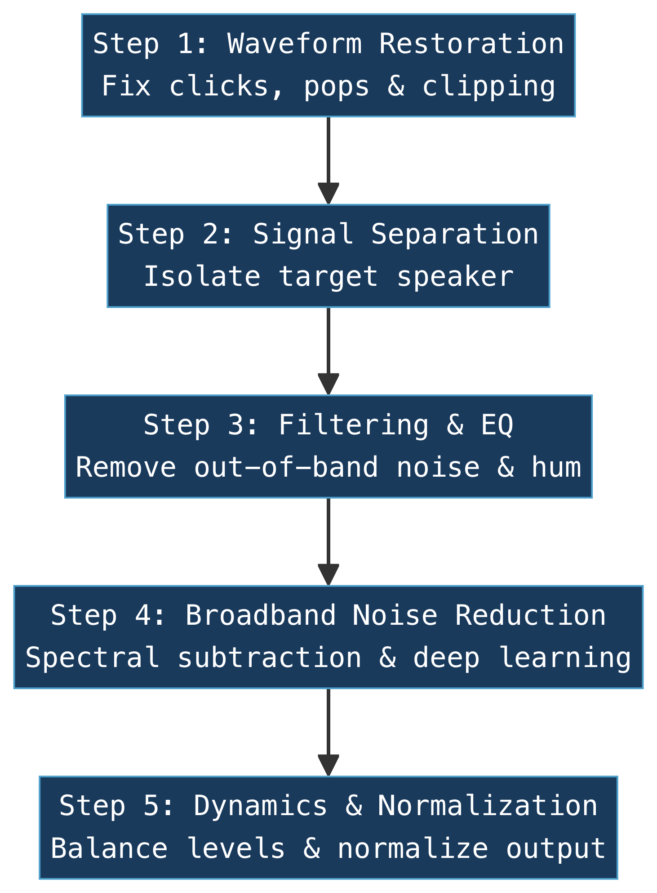
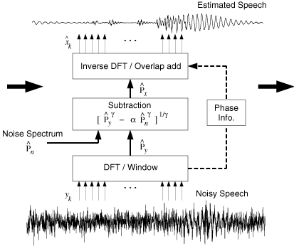
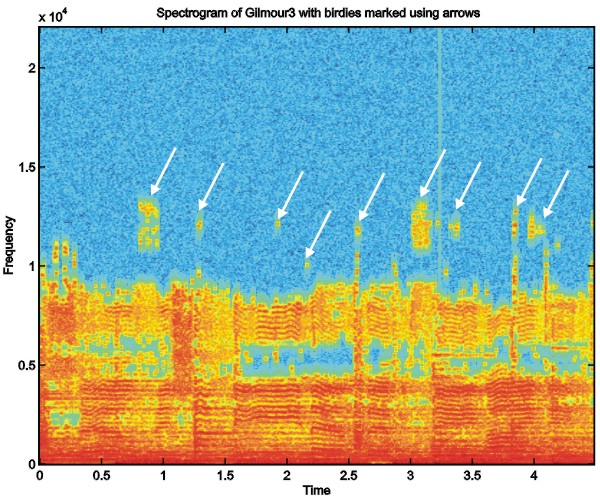
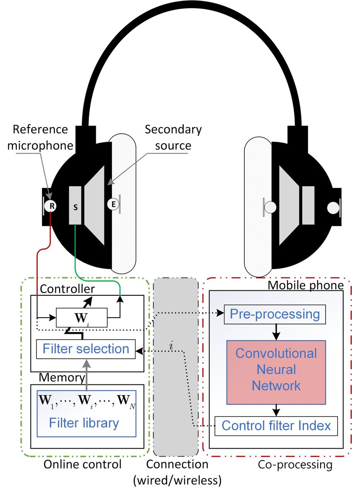
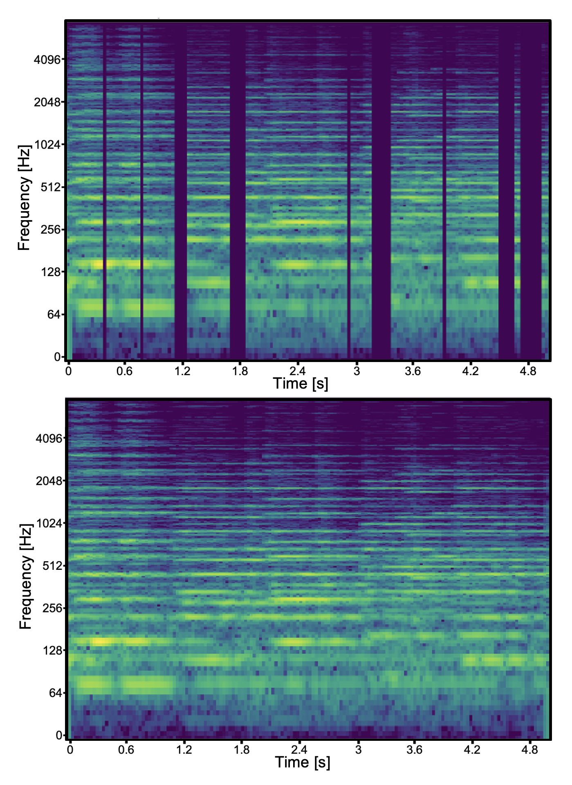

+++
title = "Other Enhancement Techniques"
outputs = ["Reveal"]
[reveal_hugo]
theme = "solarized"
margin = 0.2
separator = "##"
+++

## Other Enhancement Techniques

Forensic Audio Analysis — Week 9

{}
Welcome back. Last week we covered the foundations of forensic audio enhancement — assessment metrics like STI, the quality versus intelligibility paradox, filtering and EQ, and dynamics processing. Today we're going to build on all of that by looking at more advanced enhancement techniques.

- These are the tools that go beyond basic filtering — noise reduction algorithms, deep learning, and specialized methods for tricky real-world situations.
- Think of last week as learning to use a scalpel. This week we're learning about the full surgical toolkit.
- As always, every technique we discuss must be documented, measured, and defensible in court.
{}

---

## Today's Topics

- Enhancement order of operations
- Spectral subtraction methods
- Deep learning for audio
- Specialized enhancement techniques

{}
Here's our roadmap for today. We start with the big picture — the correct order for applying enhancement steps — then zoom into specific techniques.

- Section I gives you the framework: what order should you apply tools, and why does it matter?
- Section II covers spectral subtraction — the most widely used noise reduction algorithm in forensics.
- Section III introduces deep learning approaches — the cutting edge of the field.
- Section IV covers specialized techniques like reference cancellation and intelligent noise filtering.
- By the end, you'll understand the full toolkit available to a forensic audio examiner.
{}

---

{}

## I. The Zjalic Processing Framework

{}
Let's start with something that might seem obvious but is actually one of the most important concepts in forensic enhancement: the order in which you apply your tools matters enormously.

- In 2017, James Zjalic formalized this into a structured framework in his master's thesis at the University of Colorado Denver's National Center for Media Forensics.
- Think of it like cooking — you wouldn't frost a cake before baking it. Each step prepares the signal for the next one.
- If you apply tools in the wrong order, one algorithm can confuse or undo the work of another.
- Zjalic's testing showed that following this specific order produces statistically superior results, verified with objective metrics like PESQ and LLR.
- Citation: Zjalic, J. (2017). *A Proposed Framework for Forensic Audio Enhancement*. Master's thesis, University of Colorado Denver, Recording Arts Program (NCMF).
{}

---

## Why Order Matters

- Each step feeds the next
- Wrong order degrades results
- Later tools depend on earlier fixes
- Like following a recipe

{}
The output of one processor becomes the input for the next. That means if you skip a step or do things out of order, you can actually make the recording worse.

- Imagine trying to remove background music from a recording, but you've already applied noise reduction. The noise reduction changed the characteristics of the music, so now your music removal tool can't recognize it properly.
- Each stage is designed to clean up specific problems so the next stage can work more effectively.
- Zjalic's thesis demonstrated this empirically — he tested different orderings and showed that this specific sequence produced the best objective scores.
- The framework built on foundational work from the NCMF and earlier research by Ledesma (2015) in forensic image enhancement.
- Citation: Zjalic, J. (2017). *A Proposed Framework for Forensic Audio Enhancement*. Master's thesis, CU Denver (NCMF).
{}

---

{}
This diagram shows the five steps of the Zjalic Processing Framework in order. Each step feeds into the next — the output of one becomes the input of the next.
{}

---

## Step 1: Waveform Restoration

- Fix clicks, pops, and clipping
- Repair damaged waveform peaks
- Uses interpolation and spectral repair
- Must happen first

{}
The very first thing you do is fix any physical damage to the waveform itself — clicks, pops, and clipped peaks.

- De-clicking removes short transient noises. Think of the crackle on a vinyl record. These are distracting and can confuse later algorithms.
- De-clipping repairs waveforms that were "squared off" because the recording device couldn't handle how loud the signal was — like when someone shouts directly into a body mic.
- Why first? These glitches are unpredictable. If you leave them in, future processors might use the click to incorrectly predict what comes next, reducing their effectiveness.
- The repair methods are straightforward: linear interpolation draws a line between the good samples on either side of the damage, and spectral repair rebuilds the damaged area based on surrounding audio.
- Citation: Maher, Robert C. *Principles of Forensic Audio Analysis*. Springer, 2018.
{}

---

## Step 2: Signal Separation

- Isolate the target speaker
- Subtract known interference sources
- Requires original bit-stream integrity
- Must precede heavy filtering

{}
Once the waveform is physically repaired, the next step is to try to separate the voice you care about from everything else.

- There are two main approaches here. Blind Source Separation tries to mathematically untangle mixed signals — like pulling apart two conversations happening at once.
- Reference Cancellation is more precise: if you have an exact copy of the background interference — say the specific song playing on a TV — you can align it and subtract it out.
- Why does this come early? These algorithms rely on the recording being as close to the original as possible. If you've already applied filters and noise reduction, you've changed the mathematical relationships between the samples, and the reference track can no longer line up properly.
- We'll cover reference cancellation in detail in Section IV.
- Citation: Maher, Robert C. *Principles of Forensic Audio Analysis*. Springer, 2018.
{}

---

## Step 3: Filtering and EQ

- Remove out-of-band noise
- Notch out hum and tones
- Define the speech bandwidth
- Recap from Week 8

{}
This is where last week's material fits into the bigger picture. After waveform repair and signal separation, you apply your static filters.

- High-pass to remove low rumble, low-pass to cut high-frequency hiss, notch filters for electrical hum at 60 Hz and its harmonics.
- The goal is to manually remove all the noise you can identify by ear and by spectrogram before handing the signal off to automatic algorithms.
- Why here? By removing the obvious noise first, you let the more sophisticated algorithms in the next step focus entirely on the harder problems.
- Think of it as clearing the easy obstacles off the track before sending in the robot.
- Citation: SWGDE. *Best Practices for Forensic Audio*. 2018.
{}

---

## Step 4: Broadband Noise Reduction

- Addresses complex background noise
- Spectral subtraction or deep learning
- Automatic, adaptive techniques
- Most effective after manual filtering

{}
Now we bring in the heavy machinery. Broadband noise reduction tackles the noise that can't be removed with simple filters — things like road noise, crowd noise, or wind.

- This is where spectral subtraction and deep learning come in, which we'll cover in depth in Sections II and III.
- These are automatic techniques — the algorithm estimates what the noise looks like and tries to remove it from the entire recording.
- Why does this come after filtering? If you haven't removed the obvious stuff first, the automatic tools can get confused. A big spike of electrical hum might throw off the noise estimation, making the whole process less effective.
- Citation: Maher, Robert C. *Principles of Forensic Audio Analysis*. Springer, 2018.
{}

---

## Step 5: Dynamics and Normalization

- Balance volume across speakers
- Boost quiet speech, tame loud peaks
- Normalize to standard playback level
- Always the final step

{}
The last step is dynamics processing — compression and normalization — which we also covered last week.

- This is where you even out the volume so quiet whispers and loud voices are all at a listenable level.
- Why is this absolutely last? If you normalize or compress too early, you boost the noise floor along with the speech. That makes it much harder for the noise reduction tools in Step 4 to tell the difference between speech and noise.
- Normalization is the very final amplitude adjustment — bringing the peak level to a standard like -1 dBFS so it plays back consistently on any system.
- Always compress and normalize the clean signal, never the noisy one.
- Citation: Maher, Robert C. *Principles of Forensic Audio Analysis*. Springer, 2018.
{}

---

## Discussion

- What happens if you skip a step?
- Why must separation come before filtering?
- Could you ever justify a different order?

{}
Let's think about this practically.

- "What happens if you skip waveform restoration?" — Those clicks and pops get baked into every subsequent processing step. The noise reduction algorithm might interpret a click as a speech feature and try to preserve it, or it might create strange artifacts around it.
- "Why separation before filtering?" — Because reference cancellation needs the original signal intact. Once you filter, the mathematical fingerprint changes and the reference can't match anymore.
- "Could you justify a different order?" — In rare cases, yes. If the recording has such severe hum that it's overwhelming everything, you might notch that out before attempting separation. But you'd need to document why and accept the tradeoff.
{}

{}

---

{}

## II. Spectral Subtraction

{}
Now let's dive into the most important automatic noise reduction technique in forensic audio: spectral subtraction. This is the workhorse algorithm that most forensic examiners rely on for broadband noise reduction.

- The basic idea is beautifully simple, even though the math can get complex.
- We'll start with the concept, then look at why it sometimes creates problems, and finally explore the improved versions that fix those problems.
{}

---

## The Basic Idea

- Recording = speech + noise
- Estimate the noise alone
- Subtract noise from recording
- What remains is cleaner speech

{}
Spectral subtraction starts from a simple assumption: your noisy recording is just clean speech with noise added on top. If you can figure out what the noise sounds like by itself, you can subtract it out.

- Here's how it works in practice. The algorithm looks for moments of silence in the recording — pauses between words — where only the background noise is present.
- It takes a "snapshot" of that noise pattern using something called a Voice Activity Detector, which identifies when nobody is talking.
- Then it subtracts that noise pattern from the entire recording, frame by frame.
- The result is an estimate of the clean speech. It's not perfect, but it can dramatically improve intelligibility.
- Think of it like this: if you know what the hum of an air conditioner sounds like, you can mentally "tune it out." Spectral subtraction does this mathematically.
{}

---

{}
Let's walk through this diagram from bottom to top — it shows the full spectral subtraction pipeline.

- At the bottom you see the noisy speech waveform — that messy, spiky signal is what the microphone captured.
- It first passes through a DFT/Window block, which chops the audio into short overlapping frames and converts each one from a waveform into a frequency spectrum. This is how we go from "sound over time" to "which frequencies are present right now."
- The noise spectrum on the left — that's the noise profile estimated from the silent pauses. It represents what the background noise looks like in the frequency domain.
- The middle Subtraction block is where the magic happens: it takes the noisy spectrum, subtracts the noise estimate scaled by a factor alpha, and raises it to a power gamma. That formula controls how aggressively noise is removed.
- The Phase Info box on the right feeds in the original phase — the timing information from the noisy signal. Spectral subtraction only changes the magnitudes, not the phase.
- Finally, the Inverse DFT / Overlap-add block at the top converts everything back from frequencies into a waveform — and you can see the result: a much cleaner estimated speech signal at the top.
- The key takeaway: noisy waveform goes in the bottom, gets split into frequencies, noise is subtracted in the frequency domain, and a cleaner waveform comes out the top.
{}

---

## How It Works (Simplified)

{}Find silent moments — noise only{}

{}Build a "noise profile" from those moments{}

{}Subtract the profile from every frame{}

{}Fix any negative values (set to zero){}

{}Reconstruct the cleaned audio{}

{}
Let me walk through the steps one at a time.

- First, the algorithm identifies frames where no one is speaking. During these gaps, everything you hear is noise.
- It averages those noise frames to build a "noise profile" — a picture of what the noise looks like across all frequencies.
- Then it goes through the entire recording and subtracts that profile from each frame. Where the noise profile says there's energy at 500 Hz, it reduces the energy at 500 Hz.
- Sometimes the subtraction overshoots — you can't have negative sound energy — so any negative values get set to zero or a small minimum value. This is called "half-wave rectification" or applying a "spectral floor."
- Finally, the cleaned-up frequency data gets converted back into audio you can listen to.
{}

---

## The Musical Noise Problem

- Subtraction creates random artifacts
- Short tones that flicker on and off
- Sounds like "birdies" or digital chirping
- Can be worse than original noise

{}
Here's the catch — and it's a big one. Basic spectral subtraction has a well-known flaw: it creates artifacts called "musical noise" or "birdie noise."

- Because the noise estimate is never perfect, the subtraction leaves behind random isolated spectral peaks — little bursts of tone that flicker on and off.
- These sound like digital chirping or warbling. If you've ever heard a poorly noise-reduced phone recording, you've probably heard musical noise.
- The irony is that these artifacts can actually be more annoying and distracting to listeners than the original background noise was.
- This problem is what motivated researchers to develop all the improved variants we're about to look at.
{}

---

[Artifacts in frequency and their variation in time ("Birdies")
](https://www.audiolabs-erlangen.de/content/resources/aesCodingTutorial/birdies.html)

{}
This spectrogram shows the telltale signs of musical noise — random isolated bright spots scattered across the frequency spectrum. These are the tonal artifacts that basic spectral subtraction produces. Compare this to a clean spectrogram where energy is smoothly distributed.

- Source: [Artifacts in frequency and their variation in time ("Birdies")](https://www.audiolabs-erlangen.de/content/resources/aesCodingTutorial/birdies.html)
{}

---

## Fix 1: Over-Subtraction

- Remove more noise than estimated
- Trades some speech for less artifact
- Adjustable "aggressiveness" factor
- Adapts based on noise level

{}
The first improvement is called spectral over-subtraction. The idea is simple: subtract more noise than you think is actually there.

- By being deliberately aggressive with the subtraction, you eliminate more of those random leftover peaks that cause musical noise.
- The tradeoff is that you also remove a bit of the speech energy — so the speech gets slightly more distorted.
- The clever part is that the aggressiveness factor adapts based on how noisy each frame is. In very noisy sections, it subtracts more. In quieter sections, it backs off to preserve speech quality.
- A "spectral floor" parameter sets a minimum energy level so you never get complete silence in any frequency band — that also helps reduce the chirping effect.
{}

---

## Fix 2: Multi-Band (MBSS)

- Splits audio into frequency bands
- Each band gets its own settings
- Handles uneven noise better
- More accurate than one-size-fits-all

{}
The next improvement recognizes that real-world noise isn't the same at every frequency. Traffic rumble is mostly low-frequency. Air conditioning hiss is mostly high-frequency. A single subtraction setting can't handle both well.

- Multi-Band Spectral Subtraction divides the spectrum into several bands — typically four or five — and applies spectral subtraction independently in each one.
- Each band gets its own subtraction factor tuned to the noise characteristics in that frequency range.
- This is much more accurate for "colored" noise — noise that affects some frequencies more than others, which is basically all real-world noise.
- An improved version called I-MBSS can even update the noise estimate in real time without needing explicit silence frames, which is important for recordings where people talk continuously with few pauses.
{}

---

## Fix 3: Geometric Approach

- Uses phase information (others ignore it)
- Smoother, more natural result
- Eliminates musical noise effectively
- More mathematically sophisticated

{}
The Geometric Approach takes a fundamentally different mathematical path. Most spectral subtraction methods throw away the phase information — the timing relationship between the speech and the noise — and that's actually what causes a lot of the musical noise artifacts.

- The GA keeps that phase information and models the noisy signal as a vector sum — think of it like adding arrows on a map instead of just adding numbers.
- The result is a much smoother gain function, which means the output sounds more natural and musical noise is virtually eliminated.
- The downside is that it's more computationally expensive, but for forensic work where quality matters more than speed, that's a worthwhile tradeoff.
- In comparative studies, the Geometric Approach consistently produces cleaner results with fewer artifacts.
{}

---

## Measuring Success

- **STI**: best for rooms and linear systems
- **STOI**: best for digital enhancement
- **PESQ**: quality only, not intelligibility
- **Seg.SNR**: local signal quality per frame

{}
How do we know which variant works best? We need objective metrics — numbers, not opinions. And importantly, we need the right metric for the right job.

- Last week we focused on STI — the Speech Transmission Index. STI measures intelligibility by testing how well modulation patterns survive a transmission channel. It's excellent for linear problems: room acoustics, additive noise, filtering, reverberation. But here's the catch — STI is a poor predictor for speech that has been through non-linear processing like spectral subtraction. It can miss distortions introduced by noise reduction algorithms and give misleadingly optimistic scores.
- That's where STOI comes in — Short-Time Objective Intelligibility. STOI was specifically designed to handle non-linear processing. Instead of using test signals like STI, it works directly on actual speech. It compares the temporal envelopes of the original clean signal and the processed version in short segments, about 386 milliseconds long, and calculates how well they correlate. A score of 0 means no correlation; 1 means perfect match.
- The key difference: STI tells you how a room or phone line affects clarity. STOI tells you how a digital enhancement algorithm affects a listener's ability to understand words. For evaluating spectral subtraction and other noise reduction methods, STOI is considered the only unbiased predictor of intelligibility.
- PESQ measures perceived quality — how natural and pleasant the speech sounds — not how many words you can understand. Remember the paradox from last week: a recording can score high on PESQ and low on intelligibility.
- Segmental SNR evaluates quality in short frames of 20 to 30 milliseconds, catching local problems an overall average might miss.
- Bottom line: use STI for evaluating acoustic environments, STOI for evaluating enhancement algorithms, and never rely on PESQ alone for forensic decisions.
{}

---

## Discussion

- Why can't we perfectly estimate noise?
- When would musical noise matter in court?
- Which variant would you choose and why?

{}
Let's think about this critically.

- "Why can't we perfectly estimate noise?" — Because noise changes over time. A car drives by, a door opens, someone shifts in their chair. The noise profile from one silence gap may not match the noise in the next speech segment. The estimate is always an approximation.
- "Musical noise in court" — Imagine the jury hears chirping artifacts in the enhanced recording. Opposing counsel could argue the examiner introduced sounds that weren't originally there — potentially grounds for challenging admissibility. The examiner needs to explain that these are processing artifacts, not added content.
- "Which variant?" — There's no single right answer. MBSS is a good general-purpose choice. The Geometric Approach is best when musical noise is unacceptable. Basic spectral subtraction might be fine for mildly noisy recordings where artifacts won't be significant.
{}

{}

---

{}

## III. Deep Learning for Enhancement

{}
Now we're moving into the cutting edge of the field. Deep learning — a branch of artificial intelligence — has transformed audio enhancement in the last several years. These systems can learn to do things that traditional algorithms simply cannot.

- Don't worry if you're not a computer science major — we're going to focus on what these tools do and why they matter for forensics, not the programming details.
- Think of deep learning as teaching a computer to recognize patterns by showing it thousands of examples, rather than writing explicit rules.
{}

---

## What Is Deep Learning?

- Computer learns from examples
- Trained on thousands of audio pairs
- Input: noisy recording
- Output: cleaned version
- No explicit rules needed

{}
Traditional algorithms like spectral subtraction follow rules that humans wrote: "find the noise, subtract it." Deep learning flips this around.

- Instead of writing rules, you show the computer thousands of pairs — a noisy recording and the clean version of the same speech.
- The computer figures out its own rules for how to transform noisy audio into clean audio.
- This means it can learn patterns that are too complex for humans to describe mathematically.
- The tradeoff: you need a lot of training data, and the system is somewhat of a "black box" — it's harder to explain exactly what it did, which can be a challenge in court.
{}

---

Source: [Block diagram of the active noise cancellation headphone based on the CNN-based SFANC](https://www.researchgate.net/figure/Block-diagram-of-the-active-noise-cancellation-headphone-based-on-the-CNN-based-SFANC_fig1_371225782)

{}
This diagram shows a real-world example of deep learning applied to noise cancellation — specifically, a CNN-based active noise cancellation headphone system. Let's walk through it.

- On the left ear cup, you can see a reference microphone (R) that picks up the outside noise, a speaker (S) that plays audio, and an error microphone (E) that checks how well the noise was cancelled.
- Below the headphone on the left is the "Online Control" system — it has a filter library stored in memory with multiple pre-trained noise cancellation filters (W1 through WN). The controller selects the right filter based on what kind of noise it detects.
- On the right side, a mobile phone handles the "Co-processing." This is where the CNN lives. It pre-processes the incoming noise signal, runs it through the Convolutional Neural Network, and outputs a control filter index — essentially telling the headphone which filter from its library is the best match for the current noise environment.
- The two sides communicate over a wired or wireless connection. The phone's CNN does the heavy computational work of classifying the noise type, while the headphone applies the selected filter in real time.
- This is a great example of how deep learning works in audio: the CNN was trained on many different noise environments, and now it can quickly recognize and respond to new ones it encounters in the real world. The same principle applies to forensic audio — train on examples, then deploy to handle new recordings.
{}

---

## Three Key Architectures

{}**Convolutional Neural Network (CNN)** — finds patterns in frequency{}

{}**Recurrent Neural Network (RNN)/Long Short-Term Memory (LSTM)** — tracks patterns over time{}

{}**Convolutional Recurrent Network (CRN)** — combines both strengths{}

{}
There are three main types of neural networks used for audio enhancement. Think of them as specialists with different skills.

- CNNs — Convolutional Neural Networks — are pattern finders. They look at the audio as an image (a spectrogram) and find spatial patterns like the shape of a vowel or the signature of a gunshot. They're great at recognizing what something is.
- RNNs and LSTMs — Recurrent Neural Networks and Long Short-Term Memory networks — are sequence trackers. They remember what happened before and use that context to predict what comes next. They're great at understanding how sounds evolve over time.
- CRNs — Convolutional Recurrent Networks — are hybrids that combine both abilities. They can recognize patterns AND track how those patterns change over time. This makes them the most versatile option and the current state of the art for real-time audio enhancement.
{}

---

## Neural In-Painting

- Fills in damaged audio segments
- Like photo restoration for sound
- Rebuilds missing speech patterns
- Trained on clean/noisy audio pairs

{}
One of the most impressive deep learning applications is neural in-painting — reconstructing corrupted or missing parts of a recording.

- Think of how photo restoration software can fill in a scratch on an old photograph. Neural in-painting does the same thing for audio.
- The system is trained on pairs of clean and damaged audio. It learns what speech "should" look like in a spectrogram, and when it encounters a gap or corrupted section, it fills it in based on the surrounding context.
- A specific technique called the IDCNN — Impulse Detection Convolutional Neural Network — can identify exactly which samples are corrupted and replace only those, leaving the good audio untouched. It creates a "noise map" marking the damaged spots, then uses neural interpolation to repair them.
- This is particularly useful for recordings with intermittent interference — bursts of static, digital dropouts, or impulsive noises that obscure short sections of speech.
{}

---

## Neural In-Painting Example

{}
This spectrogram shows neural in-painting in action. The damaged region — where audio was corrupted or missing — has been reconstructed by the neural network based on the surrounding context. The filled-in section blends seamlessly with the original audio.
{}

---

## Detecting Dangerous Sounds

- Gunshots, explosions, breaking glass
- CNN-RNN hybrids detect signatures
- Over 96% accuracy reported
- Critical for security and evidence

{}
Deep learning isn't just for cleaning up speech. It's also used to detect and classify dangerous acoustic events — things like gunshots, explosions, and breaking glass.

- These hybrid CNN-RNN models analyze audio in real time, looking for the unique spectral signatures of dangerous events.
- A gunshot has a very distinctive pattern: an extremely fast transient followed by a specific decay shape. An explosion looks different from a car backfire, and the neural network can learn to tell them apart.
- Research shows these systems can achieve accuracy rates above 96%, even in noisy urban environments with lots of background sound.
- For forensics, this has applications in surveillance audio analysis, shot detection systems, and crime scene reconstruction — helping determine how many shots were fired, from what direction, and in what sequence.
{}

---

## DL vs. Traditional Methods

| | Traditional | Deep Learning |
|---|---|---|
| Noise types | Stationary | Any |
| Artifacts | Musical noise | Fewer |
| Explainability | High | Low |
| Court-ready | Established | Emerging |

{}
So should forensic examiners switch entirely to deep learning? Not necessarily. There are real tradeoffs.

- Traditional methods like spectral subtraction work best with stationary noise — noise that stays roughly constant. Deep learning handles non-stationary noise much better because it learned from diverse real-world examples.
- Traditional methods can introduce musical noise artifacts. Deep learning generally produces fewer artifacts and more natural-sounding results.
- But here's the key forensic concern: traditional methods are transparent and explainable. You can describe exactly what a spectral subtraction algorithm did. Deep learning is a "black box" — explaining to a jury what a neural network did to the evidence is much harder.
- Traditional methods have decades of acceptance in courts. Deep learning is still establishing its legal track record.
- The practical answer for most examiners today: use traditional methods as the primary tool, with deep learning as a supplement when traditional methods fall short.
{}

---

## Discussion

- Can you trust a "black box" with evidence?
- How would you explain DL to a jury?
- What's the risk of AI "hallucinating" speech?

{}
These are some of the most important questions facing the field right now.

- "Trust a black box" — Under Daubert, expert testimony must be based on testable, peer-reviewed methods. Can a neural network meet that standard if we can't fully explain what it does? Some argue yes, because the results are testable and reproducible. Others say no, because the process isn't transparent.
- "Explain DL to a jury" — An examiner might say: "I used a computer system that was trained on thousands of recordings to recognize and remove noise patterns. The specific system has been validated in published research." But opposing counsel will push back: "How do you know it didn't change the words?"
- "AI hallucination" — This is the nightmare scenario. If a neural network "fills in" speech that wasn't actually there, it could fabricate evidence. This is why in-painting and neural enhancement must always be validated against the original recording, and why the original must always be preserved and presented alongside the enhanced version.
{}

{}

---

{}

## IV. Specialized Techniques

{}
Our final section covers techniques designed for specific, common problems that forensic examiners encounter. These aren't general-purpose tools — they're specialized solutions for particular situations.

- Reference cancellation for when you can identify the interference source.
- Multiband dynamic range compression for maximizing intelligibility.
- Selective noise cancellation — a newer technology with forensic implications.
{}

---

## Reference Signal Cancellation

- Identify background interference source
- Obtain clean copy of that source
- Align and subtract it out
- Isolates the target speech

{}
Reference cancellation is one of the most powerful techniques available when the conditions are right. The idea is straightforward: if you know exactly what the background noise is, you can subtract an exact copy of it.

- Picture this scenario: a suspect is recorded in a bar, and loud music is drowning out the conversation. If you can identify the exact song that was playing and get a clean copy, you can mathematically subtract the music from the recording, leaving just the voices.
- This works for TV shows, radio broadcasts, public announcements — anything where a clean original exists somewhere.
- The challenge is alignment. The music in the evidence recording has been colored by the room — reverb, frequency response of the microphone, distance from the speaker. The examiner has to match the sample rates, align the timing precisely, and correct for these acoustic differences.
- Down-sampling is critical: you must make sure the reference track doesn't introduce frequencies that weren't in the original capture.
- Citation: Maher, Robert C. *Principles of Forensic Audio Analysis*. Springer, 2018.
{}

---

## Acoustic Fingerprinting

- Software identifies audio recordings
- Like Shazam for forensic analysis
- Matches frequency peak patterns
- Finds the exact interference source

{}
But how do you identify what song or TV show is playing in a noisy recording? That's where acoustic fingerprinting comes in.

- You've probably used Shazam on your phone — you hold it up to a speaker and it tells you what song is playing. Forensic acoustic fingerprinting works the same way.
- The algorithm analyzes patterns of frequency peaks and their timing relationships to create a unique "fingerprint" of the audio.
- It can identify a specific recording even when it's buried under conversation and room noise.
- This is particularly valuable when suspects intentionally play loud music or TV to mask their conversations. The fingerprinting identifies the exact source, the examiner obtains a clean copy, and reference cancellation removes it.
- An adaptive filter — specifically a normalized least mean square (LMS) filter — handles the actual subtraction, automatically adjusting to account for room acoustics.
{}

---

## Multiband Compression for Intelligibility

- Divides spectrum into hearing bands
- Boosts quiet consonants
- Reduces loud masking vowels
- Reallocates energy for clarity

{}
Last week we covered basic compression. Multiband dynamic range compression, or MB-DRC, takes this further by specifically targeting speech intelligibility.

- The signal is split into many frequency bands — typically 24, matching the critical bands of human hearing.
- Each band gets separate compression settings. This allows for a clever two-pronged strategy.
- Downward compression reduces the loudness of vowels. Vowels carry lots of energy but relatively little information for telling words apart. They can mask the quieter but more important consonant sounds.
- Upward compression boosts the soft consonants — the nasals, stops, and word onsets that are crucial for word recognition but easily lost in noise.
- The result is speech where the energy has been reallocated to favor the sounds that actually help you understand the words.
- This is guided by the Speech Intelligibility Index, or SII, which weights each frequency band by how much it contributes to understanding speech.
{}

---

## Quality vs. Intelligibility Revisited

- MB-DRC may sound less natural
- But word recognition improves
- Forensic goal: understanding, not comfort
- Always measure with STOI, not just ears

{}
This technique perfectly illustrates the paradox we discussed last week. MB-DRC processed speech might sound slightly unnatural — the consonants are louder than you'd expect, and the vowels are quieter.

- A casual listener might say it sounds "weird" or "processed." That's a quality judgment.
- But if you test it with STOI or a controlled word identification test, more words are correctly understood. That's an intelligibility judgment.
- In forensic work, intelligibility wins every time. No signal should be removed or modified if it decreases the number of words a listener can correctly identify — even if the overall quality improves.
- This is why objective metrics are non-negotiable. Your ears can fool you. The numbers don't lie.
{}

---

## Selective Noise Cancellation

- AI distinguishes speech from noise
- Learns individual speaker patterns
- Solves the "cocktail party problem"
- Used in smart hearing aids

{}
Selective noise cancellation represents a paradigm shift — from removing all noise to intelligently choosing what to keep and what to remove.

- Traditional noise reduction treats everything that isn't speech as interference. But what if there are multiple speakers, and you only care about one of them?
- SNC uses deep learning to learn a specific speaker's vocal characteristics — their unique "fingerprint" — and can isolate that speaker from a crowd.
- This is the "cocktail party problem" — how do you follow one conversation in a noisy room? Humans do it naturally; computers have struggled with it until recently.
- The primary application right now is smart hearing aids that can focus on the person you're talking to while suppressing background chatter.
- For forensics, the implications are significant: potentially isolating a specific suspect's voice from a crowded surveillance recording.
- These systems can also be configured to preserve critical safety sounds — fire alarms, car horns — while suppressing stationary noise like engine hum.
{}

---

<!-- IMAGE: illustration of multiple speakers at a party with one voice highlighted/isolated -->

{}
This illustration shows the "cocktail party problem." Multiple speakers are talking simultaneously, but selective noise cancellation can isolate and highlight a single target voice while suppressing the others.
{}

---

## Discussion

- How would you explain reference cancellation to a jury?
- What are the ethical limits of speaker isolation?
- Could MB-DRC change the meaning of words?

{}
Let's think about the practical and ethical dimensions.

- "Explaining reference cancellation" — You might say: "We identified the song playing in the background, obtained an exact copy, and mathematically removed it — like noise-canceling headphones, but applied after the fact to the recording." The key is making the process seem logical and transparent, not mysterious.
- "Ethical limits of speaker isolation" — If AI can isolate one voice from a crowd, what are the privacy implications? Should law enforcement be able to extract any conversation from any public recording? Where do we draw the line?
- "MB-DRC changing meaning" — By boosting consonants and reducing vowels, could you change what a word sounds like? In theory, aggressive processing could shift the perceived onset time of a consonant, potentially changing a "b" to a "p" or a "d" to a "t." This is why the original must always be preserved and presented.
{}

{}

---

{}

## Key Takeaways

- Order matters: restore, separate, filter, reduce, normalize
- Spectral subtraction: powerful but watch for artifacts
- Deep learning: better results, harder to explain
- Always measure, document, and preserve originals

{}
Let's pull it all together with the key points from today.

- The enhancement order of operations isn't optional — it's a logical framework where each step prepares the signal for the next. Skipping or reordering steps degrades results.
- Spectral subtraction is the workhorse of forensic noise reduction, but basic implementations create musical noise. Improved variants like MBSS and the Geometric Approach address this.
- Deep learning offers superior performance, especially for non-stationary noise and complex scenarios, but raises new challenges for courtroom explainability and evidence integrity.
- Across all techniques, the fundamentals never change: measure objectively with STOI, document every step, and always preserve and present the original alongside the enhanced version.
- Citation: Maher, Robert C. *Principles of Forensic Audio Analysis*. Springer, 2018; SWGDE *Best Practices for Forensic Audio*, 2018.
{}

---

## Summary

- Advanced tools extend Week 8 foundations
- Match technique to the specific problem
- Court admissibility requires transparency
- Next: forensic transcription and interpretation

{}
Today we've expanded your toolkit significantly beyond the basic filtering and dynamics processing from last week.

- The enhancement order of operations gives you a framework for applying these tools systematically.
- Spectral subtraction and its variants handle broadband noise that filters alone can't address.
- Deep learning pushes the boundaries of what's possible, but with new responsibilities around transparency and validation.
- Specialized techniques like reference cancellation and MB-DRC solve specific problems with surgical precision.
- The constant thread through everything: forensic enhancement serves the evidence. Every technique must be measured, documented, and defensible. The original recording is sacred.
- Next week we'll look at what comes after enhancement — forensic transcription and interpretation of the enhanced recordings.
{}

{}
